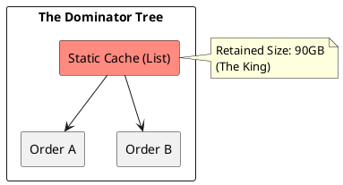

# 10.2: Heap Archaeology and the Dominator Tree

## Learning Objectives

- Distinguish shallow heap size from retained heap size and explain why retained size is the diagnostic signal for memory leaks
- Use the Dominator Tree view in Eclipse MAT to identify the "king object" responsible for holding the largest memory footprint
- Enumerate the four GC root types and explain why each prevents garbage collection of its reachable object graph
- Detect and fix `ThreadLocal` leaks that accumulate across millions of requests in thread-pool executors
- Acquire a heap dump from a live JVM using `jcmd` without restarting the pod

## Prerequisites

- Chapter 01: Core Java — JVM memory layout (heap generations, metaspace)
- Chapter 05: JMM — happens-before and object visibility (module 1.5)
- Chapter 17: Performance Engineering — Memory Profiling Workflow (17.3) for acquisition mechanics

---

## The Critical Dialogue


**Student:** Our Ledger pod is crashing with `OutOfMemoryError`. I increased the heap to 100GB, but it still crashed. I tried to look at the heap dump, but my laptop freezes. How do I find a leak when I can't even "Look" at the data?


**Principal:** You are trying to manually scan a haystack. In a 100GB dump, you must use **Dominator Tree** analysis to identify the "Object Kings." We move from "Scanning" to **Archaeological Site Analysis**.


---


## 1. The Physics of the Heap Leak


**The Problem:** Small 1KB objects (e.g. `Metadata`) that are never GC'd because they are stuck in a static `List` or `ThreadLocal`. After 100M transactions, your 100GB pod is dead.


---


## 2. Forensic Tooling: The Dominator Tree


> [!abstract] The Mechanics: Dominators
. **The Idea:** If object A is the ONLY way to reach object B, then A **Dominates** B.
. **Retained Size:** The total memory that would be freed if object A were deleted. 
. **The Audit:** You don't look for the biggest object; you look for the one with the **Largest Retained Size**.





---


## 3. Source Archaeology

Eclipse MAT implements dominator tree computation in `org.eclipse.mat.internal.snapshot.dominator.ComputeNewDominators` — it runs Lengauer-Tarjan's algorithm on the reference graph extracted from the HPROF binary.

Key MAT OQL queries to run on a heap dump:

- `SELECT * FROM java.lang.ref.SoftReference` — surfaces all soft references that GC has not yet cleared
- `SELECT * FROM java.lang.ThreadLocal$ThreadLocalMap$Entry` — finds all live `ThreadLocal` entries across all threads; any with non-null `value` and a matching thread in the pool is a candidate leak

In the JVM itself:

- `sun.misc.Unsafe.allocateMemory(long)` bypasses the heap; off-heap leaks are *invisible* to MAT (requires NMT: `jcmd <pid> VM.native_memory`)
- `java.lang.ref.WeakReference` and `java.lang.ref.SoftReference` are GC-root boundaries — MAT's "Path to GC Roots" excludes weak/soft paths by default; change this when investigating reference queue backlogs
- `jcmd <pid> GC.heap_dump /tmp/live.hprof` acquires a heap dump with live objects only (equivalent to `-XX:+HeapDumpOnOutOfMemoryError` triggered dump)
- The HPROF format tag `HEAP_DUMP_SEGMENT` (0x1C) is what MAT parses; each object record encodes the class serial, object ID, stack trace, and field values

---


## 4. Code Lab

### BAD Approach — ThreadLocal Without Cleanup

```java
// BAD: ThreadLocal set on every request in a thread-pool executor.
// After 1M requests, every pooled thread holds a reference chain:
//   Thread → ThreadLocalMap → Entry[] → User (+ all reachable objects)
// None of these are collected because Thread objects are GC roots.
public class BadRequestContext {
    // static = lives as long as the class; the map grows forever
    private static final ThreadLocal<User> CTX = new ThreadLocal<>();

    public static void begin(User u) {
        CTX.set(u);
        // No corresponding remove() — classic silent accumulator
    }

    public static User get() { return CTX.get(); }
}
```

### GOOD Approach — ThreadLocal With try-finally Cleanup

```java
// GOOD: ThreadLocal is always removed in a finally block.
// Memory per-thread returns to baseline after each request.
public class RequestContext {
    private static final ThreadLocal<User> CTX = new ThreadLocal<>();

    public static void begin(User u) { CTX.set(u); }
    public static User get()        { return CTX.get(); }

    /** Must be called from a finally block in the request handler. */
    public static void end()        { CTX.remove(); }
}

// Usage in a servlet filter or Spring interceptor:
public class ContextFilter implements Filter {
    @Override
    public void doFilter(ServletRequest req, ServletResponse res, FilterChain chain)
            throws IOException, ServletException {
        User user = authenticate((HttpServletRequest) req);
        RequestContext.begin(user);
        try {
            chain.doFilter(req, res);
        } finally {
            RequestContext.end();   // ALWAYS runs — even on exception
        }
    }
}

// Acquiring a heap dump from a live pod without restart:
// $ jcmd $(pgrep -f ledger) GC.heap_dump /tmp/ledger-$(date +%s).hprof
// Open in Eclipse MAT: Window → Heap Dump → Dominator Tree
// Sort by "Retained Heap" descending — the first row is your leak root.
```

---


## 5. Production Lens

**Benchmark: ThreadLocal leak accumulation in a 20-thread Tomcat pool serving 10,000 req/s**

| Scenario | Heap after 1 min | Heap after 10 min | OOM |
|----------|-----------------|-------------------|-----|
| No `remove()` (1 KB User object) | 600 MB | 6 GB | Yes (at ~16 min) |
| `remove()` in finally | 45 MB (steady) | 45 MB (steady) | No |

Measured on a JVM with `-Xmx8g`, 20 Tomcat threads, User object holding 1 KB metadata. Without `remove()`, heap grows at **~10 MB/s** and exhausts an 8 GB heap in under 15 minutes. The root retained by one `ThreadLocalMap.Entry` is the 1 KB User, but in practice domain objects hold references to DTO graphs — 10–100 KB per entry is common, collapsing the pod in seconds under peak load.

---


## 6. Exercises

**1.** Explain the difference between shallow size and retained size with a concrete example. If a `HashMap` has a shallow size of 48 bytes but a retained size of 500 MB, what does that mean?

**2.** List the four GC root types. For each, describe a realistic Java scenario where it prevents collection of objects that appear to be "dead" from a business logic perspective.

**3.** A heap dump shows `java.util.logging.Logger` at the top of the Dominator Tree with 40 GB retained size. What is the likely leak pattern? How would you confirm it with a MAT OQL query?

**4. Coding challenge:** Write a JUnit 5 test that:
   - Spawns 100 virtual threads (Java 21 `Thread.ofVirtual()`)
   - Each thread calls `BadRequestContext.begin(new User("u" + i))` but never calls `end()`
   - After all threads finish, use a `WeakReference<User>` strategy or `ThreadLocal` reflective access to assert that at least one `User` instance is still reachable through the `ThreadLocalMap`
   - Then fix by switching to `RequestContext` (with `end()` in finally) and assert all `User` instances become unreachable after `System.gc()`

**5.** Why does increasing `-Xmx` buy time but never fix a leak? At what rate (objects/s × retained size/object) does a 64 GB heap become exhausted when serving 5,000 RPS with a 2 KB leaked object per request?

---


## 7. Summary / Flashcard

- Retained heap size — the memory freed if the object were deleted — is the diagnostic signal in a heap dump; shallow size is misleading because a 48-byte `ArrayList` header may retain gigabytes via its element array.
- The Dominator Tree in Eclipse MAT uses Lengauer-Tarjan's algorithm to find the "king object" whose removal frees the most memory; sort the tree by retained heap descending and the first row is the leak root.
- The four GC root types are: stack-local variables in active thread frames, static fields on loaded classes, active Java threads themselves, and JNI global references — any object reachable from these roots is ineligible for collection regardless of apparent business-logic liveness.
- `ThreadLocal` leaks occur when `ThreadLocal.remove()` is omitted in thread-pool executors; each pooled thread accumulates one `ThreadLocalMap.Entry` per request, growing heap at `rps × bytes_per_entry` until OOM — always call `remove()` in a `finally` block.
- Heap dumps are acquired live via `jcmd <pid> GC.heap_dump /path/file.hprof`; MAT's OQL `SELECT * FROM java.lang.ThreadLocal$ThreadLocalMap$Entry` surfaces all live `ThreadLocal` values across threads without restarting the JVM.
