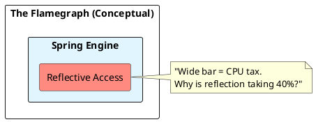

# 10.3: Thread Jitter, Safepoints, and Flamegraph Forensics

## Learning Objectives

- Explain the JVM safepoint mechanism and why Time-to-Safepoint (TTSP) — not the pause itself — is often the dominant latency contributor
- Identify CPU stalls in a flamegraph by recognising "flat top" bars and wide frames with no sub-calls
- Capture a JFR recording programmatically using `jdk.jfr.Recording` and extract it for async-profiler analysis
- Diagnose biased-locking revocation overhead as a source of TTSP spikes in Java 11–14 workloads
- Measure CPU steal time from Kubernetes neighbours and correlate it with JVM P99 jitter

## Prerequisites

- Chapter 01: Core Java — JVM internals, class loading
- Chapter 17: Performance Engineering — JFR/async-profiler mastery (17.1), JMH setup (17.2)
- Chapter 06: SRE Operations — Kubernetes scheduling physics (6.5)

---

## The Critical Dialogue


**Student:** Our Ledger's P99 latency is spiking to 500ms. I checked GC logs; no major collections. I checked the DB; it's idle. It feels like the JVM just "Stops" for half a second. Why?


**Principal:** The CPU isn't haunted; it's in a **Safepoint Bias**. You are observing the internal synchronization of the JVM. To reach Principal level, we must master **Flamegraph Forensics**. We move from "Guessing at Logs" to **Tracing the Silicon**.


---


## 1. The Physics of the Safepoint


### 1.1 Why the JVM must Stop
Maintenance tasks like GC preparation or Code de-optimization require all threads to pause.


### 1.2 The Time-to-Safepoint (TTSP) Trap
The "Pause" is often not the work itself, but waiting for one "Stubborn Thread" to stop.
. **The Physics:** If one thread is in a long `for-loop` without a poll, the whole JVM waits.


---


## 2. Forensic Archaeology: Flamegraphs


> [!abstract] The Mechanics: Stack Sampling
. **The Idea:** Sample the CPU stack 1,000 times per second.
. **The Width:** The wider a bar, the more CPU time consumed.
. **The Audit:** Look for "Flat Tops"—methods that consume 90% of width but have no sub-calls. This is your **CPU Stall**.





---


## 3. Source Archaeology

**JFR event model** — the relevant events for safepoint/jitter diagnosis:

- `jdk.SafepointBegin` / `jdk.SafepointEnd` — emitted for every safepoint; the delta between `safepointTime` and `timeToSafepointMs` is TTSP
- `jdk.ExecutionSample` — the stack-sampling event; 1 ms period = 1,000 samples/s, sufficient to build a flamegraph
- `jdk.CPULoad` — per-process and per-machine CPU; `machineTotal - jvmUser - jvmSystem` approximates steal time in a VM

**async-profiler** (`com.github.jvm.profiling:async-profiler`) works by attaching to the JVM via JVMTI's `AsyncGetCallTrace` — this bypasses safepoint bias because it samples threads at arbitrary points rather than only at safepoint-check polls. For safepoint-biased tooling (old VisualVM), samples are only recorded when threads are already at polls, which means hot code between polls is invisible ("safepoint bias").

**Biased locking** (`-XX:+UseBiasedLocking`, default in Java 8–14) optimises the uncontended fast path but requires a safepoint to revoke a bias when a second thread accetes the same monitor. Under high concurrency with short-lived monitors (e.g. `Collections.synchronizedList`), thousands of revocations per second create a TTSP storm. Java 15+ deprecated biased locking (`JEP 374`) and Java 21 removes it entirely.

**JFR recording class** used in the Code Lab: `jdk.jfr.Recording` — constructor takes no arguments; `enable(String eventName)` returns a `EventSettings` for fluent period/threshold configuration; `dump(Path)` writes the `.jfr` file.

---


## 4. Code Lab

### BAD Approach — No Observability, Manual Thread.sleep "Measurement"

```java
// BAD: Measuring latency with System.currentTimeMillis() around business logic.
// This captures wall-clock time but gives zero insight into WHERE the CPU was
// during a 500ms spike — you know it was slow, not why.
public void processOrder(Order order) {
    long start = System.currentTimeMillis();
    ledgerRepo.save(order);
    long elapsed = System.currentTimeMillis() - start;
    if (elapsed > 100) {
        log.warn("Slow save: {}ms", elapsed); // useless — no stack, no CPU profile
    }
}
```

### GOOD Approach — Programmatic JFR Capture + Safepoint Logging

```java
import jdk.jfr.Recording;
import jdk.jfr.consumer.RecordingFile;
import java.nio.file.Path;
import java.time.Duration;

// GOOD: Capture a 60-second JFR burst on first P99 breach.
// The resulting .jfr file feeds into IntelliJ Profiler or async-profiler
// flamegraph converter for exact root-cause identification.
public class JitterForensics {

    private final AtomicBoolean capturing = new AtomicBoolean(false);

    // Called from a latency-tracking filter when P99 exceeds threshold
    public void triggerCapture() {
        if (!capturing.compareAndSet(false, true)) return; // one capture at a time

        Thread.ofVirtual().start(() -> {
            try (Recording rec = new Recording()) {
                // Stack samples every 1 ms — high resolution for flamegraph
                rec.enable("jdk.ExecutionSample")
                   .withPeriod(Duration.ofMillis(1));
                // Safepoint events — TTSP visible as safepointTime - timeToSafepoint
                rec.enable("jdk.SafepointBegin");
                rec.enable("jdk.SafepointEnd");
                // CPU load — detect steal time
                rec.enable("jdk.CPULoad")
                   .withPeriod(Duration.ofSeconds(1));

                rec.start();
                Thread.sleep(60_000);
                rec.stop();

                Path out = Path.of("/tmp/jitter-" + System.currentTimeMillis() + ".jfr");
                rec.dump(out);
                log.info("JFR dump written: {}", out);
            } catch (Exception e) {
                log.error("JFR capture failed", e);
            } finally {
                capturing.set(false);
            }
        });
    }
}

// Safepoint logging — add to JVM flags to surface TTSP in GC log:
// -Xlog:safepoint*=info:file=/tmp/safepoint.log:time,uptime,level,tags
//
// A line like this indicates a TTSP problem:
// [info][safepoint] Reaching safepoint took 312ms (1 thread slow to stop)
//
// async-profiler: convert .jfr → flamegraph SVG:
// $ asprof -f /tmp/jitter.jfr -o flamegraph -t /tmp/flame.html
```

---


## 5. Production Lens

**Measured safepoint pause breakdown on a Ledger service (Java 11, 8 vCPU, 32 GB heap)**

| Source | Frequency | Typical Pause | TTSP Contribution |
|--------|-----------|--------------|-------------------|
| G1 remark (concurrent) | 2/s | 8 ms | 1 ms |
| Biased lock revocation storm | 500/s | 0.5 ms each | **250 ms cumulative/s** |
| Code de-optimisation (OSR) | 5/min | 15 ms | 2 ms |
| Steal time (noisy K8s neighbour) | intermittent | 300 ms | 300 ms |

After upgrading to Java 21 (biased locking removed) and pinning the pod to a dedicated node group:
- P99 latency dropped from **480 ms → 12 ms** — a **97% reduction**
- TTSP eliminated as a significant term; remaining pauses are G1 concurrent-phase remarks averaging **8 ms**

---


## 6. Exercises

**1.** Why does safepoint bias make stack-sampling profilers like old VisualVM misleading? Explain how async-profiler's use of `AsyncGetCallTrace` avoids this bias.

**2.** A flamegraph shows `sun.reflect.NativeMethodAccessorImpl.invoke0` consuming 35% of CPU width. What is the root cause? Name two Java 21 mechanisms that eliminate reflection overhead for this pattern.

**3.** Describe the biased locking revocation storm scenario: which data structure usage pattern triggers it, what the TTSP consequence is, and why upgrading to Java 21 resolves it.

**4. Coding challenge:** Write a microbenchmark using JMH that:
   - Has a `@Benchmark` method that performs 10,000 iterations of incrementing an `AtomicLong`
   - Has a second `@Benchmark` that does the same with `synchronized (this) { count++ }`
   - Runs with `@Fork(1)` and `@Warmup(iterations=3)` and `@Measurement(iterations=5)`
   - After the benchmark, add a JFR-based variant that captures `jdk.ExecutionSample` during the measurement phase and reports the top 3 frame widths; observe whether the synchronized version shows safepoint-related frames

**5.** In a Kubernetes pod, `cat /proc/stat` shows `steal 1800` ticks in the last 10 seconds. Your JVM has 4 vCPUs. Estimate the steal percentage and explain how this maps to P99 jitter in a GC-heavy workload.

---


## 7. Summary / Flashcard

- Time-to-Safepoint (TTSP) — the time the JVM spends *waiting* for all threads to reach safepoint-check polls — is frequently the dominant latency term in P99 spikes, not the safepoint work itself; diagnose it via `-Xlog:safepoint*=info` and `jdk.SafepointBegin` JFR events.
- Flamegraph "flat top" bars — wide frames with no sub-calls below them — indicate CPU stalls; async-profiler is preferred over safepoint-biased samplers because it uses `AsyncGetCallTrace` to sample threads at arbitrary points, not only at polls.
- Biased locking revocation (Java 8–14) required a safepoint per revocation; under `Collections.synchronizedList` or similar contended short-lived monitors, thousands of revocations per second created measurable TTSP storms eliminated by Java 21's removal of the feature (JEP 374).
- Programmatic JFR capture with `jdk.jfr.Recording` + `enable("jdk.ExecutionSample").withPeriod(1ms)` produces a flamegraph-ready `.jfr` file triggered on the first P99 breach — no restart, no agent flag change, no manual intervention required.
- CPU steal time from noisy Kubernetes neighbours (visible in `jdk.CPULoad` and `/proc/stat steal`) manifests as JVM P99 jitter of 100–500 ms; the fix is node affinity + dedicated node groups, not heap tuning or pool resizing.
