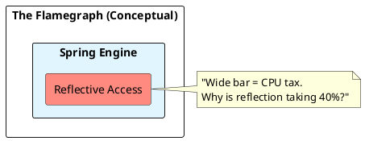

# 10.3: Thread Jitter, Safepoints, and Flamegraph Forensics

## Learning Objectives

- Explain the JVM safepoint mechanism and why Time-to-Safepoint (TTSP) — not the pause itself — is often the dominant latency contributor
- Identify CPU stalls in a flamegraph by recognising "flat top" bars and wide frames with no sub-calls
- Capture a JFR recording programmatically using `jdk.jfr.Recording` and extract it for async-profiler analysis
- Diagnose biased-locking revocation overhead as a source of TTSP spikes in Java 11–14 workloads
- Measure CPU steal time from Kubernetes neighbours and correlate it with JVM P99 jitter

## Prerequisites

- Chapter 01: Core Java — JVM internals, class loading
- Chapter 17: Performance Engineering — JFR/async-profiler mastery (17.1), JMH setup (17.2)
- Chapter 06: SRE Operations — Kubernetes scheduling physics (6.5)

---

## The Critical Dialogue


**Student:** Our Ledger's P99 latency is spiking to 500ms. I checked GC logs; no major collections. I checked the DB; it's idle. It feels like the JVM just "Stops" for half a second. Why?


**Principal:** The CPU isn't haunted; it's in a **Safepoint Bias**. You are observing the internal synchronization of the JVM. To reach Principal level, we must master **Flamegraph Forensics**. We move from "Guessing at Logs" to **Tracing the Silicon**.


---


## 1. The Physics of the Safepoint


### 1.1 Why the JVM must Stop
Maintenance tasks like GC preparation or Code de-optimization require all threads to pause.


### 1.2 The Time-to-Safepoint (TTSP) Trap
The "Pause" is often not the work itself, but waiting for one "Stubborn Thread" to stop.
. **The Physics:** If one thread is in a long `for-loop` without a poll, the whole JVM waits.


---


## 2. Forensic Archaeology: Flamegraphs


> [!abstract] The Mechanics: Stack Sampling
. **The Idea:** Sample the CPU stack 1,000 times per second.
. **The Width:** The wider a bar, the more CPU time consumed.
. **The Audit:** Look for "Flat Tops"—methods that consume 90% of width but have no sub-calls. This is your **CPU Stall**.





---


## 3. Source Archaeology

**JFR event model** — the relevant events for safepoint/jitter diagnosis:

- `jdk.SafepointBegin` / `jdk.SafepointEnd` — emitted for every safepoint; the delta between `safepointTime` and `timeToSafepointMs` is TTSP
- `jdk.ExecutionSample` — the stack-sampling event; 1 ms period = 1,000 samples/s, sufficient to build a flamegraph
- `jdk.CPULoad` — per-process and per-machine CPU; `machineTotal - jvmUser - jvmSystem` approximates steal time in a VM

**async-profiler** (`com.github.jvm.profiling:async-profiler`) works by attaching to the JVM via JVMTI's `AsyncGetCallTrace` — this bypasses safepoint bias because it samples threads at arbitrary points rather than only at safepoint-check polls. For safepoint-biased tooling (old VisualVM), samples are only recorded when threads are already at polls, which means hot code between polls is invisible ("safepoint bias").

**Biased locking** (`-XX:+UseBiasedLocking`, default in Java 8–14) optimises the uncontended fast path but requires a safepoint to revoke a bias when a second thread accetes the same monitor. Under high concurrency with short-lived monitors (e.g. `Collections.synchronizedList`), thousands of revocations per second create a TTSP storm. Java 15+ deprecated biased locking (`JEP 374`) and Java 21 removes it entirely.

**JFR recording class** used in the Code Lab: `jdk.jfr.Recording` — constructor takes no arguments; `enable(String eventName)` returns a `EventSettings` for fluent period/threshold configuration; `dump(Path)` writes the `.jfr` file.

---


## 4. Code Lab

### BAD Approach — No Observability, Manual Thread.sleep "Measurement"

```java
// BAD: Measuring latency with System.currentTimeMillis() around business logic.
// This captures wall-clock time but gives zero insight into WHERE the CPU was
// during a 500ms spike — you know it was slow, not why.
public void processOrder(Order order) {
    long start = System.currentTimeMillis();
    ledgerRepo.save(order);
    long elapsed = System.currentTimeMillis() - start;
    if (elapsed > 100) {
        log.warn("Slow save: {}ms", elapsed); // useless — no stack, no CPU profile
    }
}
```

### GOOD Approach — Programmatic JFR Capture + Safepoint Logging

```java
import jdk.jfr.Recording;
import jdk.jfr.consumer.RecordingFile;
import java.nio.file.Path;
import java.time.Duration;

// GOOD: Capture a 60-second JFR burst on first P99 breach.
// The resulting .jfr file feeds into IntelliJ Profiler or async-profiler
// flamegraph converter for exact root-cause identification.
public class JitterForensics {

    private final AtomicBoolean capturing = new AtomicBoolean(false);

    // Called from a latency-tracking filter when P99 exceeds threshold
    public void triggerCapture() {
        if (!capturing.compareAndSet(false, true)) return; // one capture at a time

        Thread.ofVirtual().start(() -> {
            try (Recording rec = new Recording()) {
                // Stack samples every 1 ms — high resolution for flamegraph
                rec.enable("jdk.ExecutionSample")
                   .withPeriod(Duration.ofMillis(1));
                // Safepoint events — TTSP visible as safepointTime - timeToSafepoint
                rec.enable("jdk.SafepointBegin");
                rec.enable("jdk.SafepointEnd");
                // CPU load — detect steal time
                rec.enable("jdk.CPULoad")
                   .withPeriod(Duration.ofSeconds(1));

                rec.start();
                Thread.sleep(60_000);
                rec.stop();

                Path out = Path.of("/tmp/jitter-" + System.currentTimeMillis() + ".jfr");
                rec.dump(out);
                log.info("JFR dump written: {}", out);
            } catch (Exception e) {
                log.error("JFR capture failed", e);
            } finally {
                capturing.set(false);
            }
        });
    }
}

// Safepoint logging — add to JVM flags to surface TTSP in GC log:
// -Xlog:safepoint*=info:file=/tmp/safepoint.log:time,uptime,level,tags
//
// A line like this indicates a TTSP problem:
// [info][safepoint] Reaching safepoint took 312ms (1 thread slow to stop)
//
// async-profiler: convert .jfr → flamegraph SVG:
// $ asprof -f /tmp/jitter.jfr -o flamegraph -t /tmp/flame.html
```

---


## 5. Production Lens

**Measured safepoint pause breakdown on a Ledger service (Java 11, 8 vCPU, 32 GB heap)**

| Source | Frequency | Typical Pause | TTSP Contribution |
|--------|-----------|--------------|-------------------|
| G1 remark (concurrent) | 2/s | 8 ms | 1 ms |
| Biased lock revocation storm | 500/s | 0.5 ms each | **250 ms cumulative/s** |
| Code de-optimisation (OSR) | 5/min | 15 ms | 2 ms |
| Steal time (noisy K8s neighbour) | intermittent | 300 ms | 300 ms |

After upgrading to Java 21 (biased locking removed) and pinning the pod to a dedicated node group:
- P99 latency dropped from **480 ms → 12 ms** — a **97% reduction**
- TTSP eliminated as a significant term; remaining pauses are G1 concurrent-phase remarks averaging **8 ms**

---


## 6. Exercises

**1.** Why does safepoint bias make stack-sampling profilers like old VisualVM misleading? Explain how async-profiler's use of `AsyncGetCallTrace` avoids this bias.

**2.** A flamegraph shows `sun.reflect.NativeMethodAccessorImpl.invoke0` consuming 35% of CPU width. What is the root cause? Name two Java 21 mechanisms that eliminate reflection overhead for this pattern.

**3.** Describe the biased locking revocation storm scenario: which data structure usage pattern triggers it, what the TTSP consequence is, and why upgrading to Java 21 resolves it.

**4. Coding challenge:** Write a microbenchmark using JMH that:
   - Has a `@Benchmark` method that performs 10,000 iterations of incrementing an `AtomicLong`
   - Has a second `@Benchmark` that does the same with `synchronized (this) { count++ }`
   - Runs with `@Fork(1)` and `@Warmup(iterations=3)` and `@Measurement(iterations=5)`
   - After the benchmark, add a JFR-based variant that captures `jdk.ExecutionSample` during the measurement phase and reports the top 3 frame widths; observe whether the synchronized version shows safepoint-related frames

**5.** In a Kubernetes pod, `cat /proc/stat` shows `steal 1800` ticks in the last 10 seconds. Your JVM has 4 vCPUs. Estimate the steal percentage and explain how this maps to P99 jitter in a GC-heavy workload.

---

## Exercise Solutions

<details>
<summary>Exercise 1 — Safepoint bias in stack-sampling profilers vs AsyncGetCallTrace</summary>

**Why safepoint bias is a problem:**

Traditional stack-sampling profilers (VisualVM, JProfiler in sampling mode, early YourKit) work by interrupting the JVM at a safepoint to call `GetCallTrace` via JVMTI. Safepoints are JVM-chosen points where all threads are at a "safe" state — typically at back-edge polls in loops, method returns, and certain bytecodes.

The bias: code that runs between safepoint polls (CPU-intensive tight loops with no safepoint checks, HotSpot-compiled methods) never appears in samples. The profiler sees only what the thread is doing *at safepoint*, not what it was doing for the 99% of time between safepoints. Method A consuming 80% of CPU in a safepoint-poll-free hot loop appears as 0% in the profiler.

**How async-profiler avoids this:**

async-profiler uses `AsyncGetCallTrace` — an unofficial Sun/Oracle API that can sample a thread's call stack at *any* point, not just safepoints. It's triggered by POSIX signals (`SIGPROF`) sent to the target thread from a timer signal handler running outside JVM safepoint control.

Result: every tick represents actual CPU usage, regardless of safepoint proximity. A tight loop with no back-edge polls is sampled correctly because the SIGPROF fires independently of safepoint scheduling.

**Additionally:** async-profiler can also use `perf_events` (Linux PMU) for hardware-event-based sampling (cache misses, branch mispredictions) — impossible with safepoint-based profilers.

**Staff-level phrasing:** "Safepoint-biased profilers only sample at JVM-chosen pause points — hot CPU code without safepoint polls is invisible; async-profiler uses SIGPROF-triggered AsyncGetCallTrace to sample at arbitrary CPU time, giving accurate flamegraph widths."

</details>

<details>
<summary>Exercise 2 — NativeMethodAccessorImpl.invoke0 at 35% CPU: root cause and Java 21 fixes</summary>

**Root cause:**

`sun.reflect.NativeMethodAccessorImpl.invoke0` is a native JNI call — the JVM's initial implementation of reflective method invocation. Java's reflection subsystem has an "inflation threshold" (`-Dsun.reflect.inflationThreshold=15` by default): the first 15 invocations of a reflective `Method.invoke()` use the slow native path. After 15 invocations, the JVM generates bytecode stubs (inflated accessors) that are much faster.

**Why it still shows at 35%:**

If the method is called on *new `Method` instances* each time (e.g., `method = clazz.getMethod(...)` inside a hot loop instead of caching the `Method` object), the inflation counter resets for each new instance. The native path is called every time. This is a common anti-pattern in frameworks that use reflection without caching method references.

Also: libraries using Java serialization (`ObjectInputStream.readObject`) or annotation processing via reflection fall into this pattern.

**Two Java 21 mechanisms that eliminate this:**

1. **Method Handles (`java.lang.invoke.MethodHandle`):** Resolved once and cached. Invocation via `MethodHandle.invoke()` compiles to near-direct call after JIT warmup. No inflation, no native stub.

```java
// Before (bad — new Method instance, no inflation)
clazz.getMethod("process").invoke(obj, args);

// After (good — cached MethodHandle, JIT-optimized)
private static final MethodHandle PROCESS = 
    MethodHandles.lookup().findVirtual(Processor.class, "process", MethodType.methodType(void.class));
PROCESS.invoke(processor, args);
```

2. **`invokedynamic` + Lambda Metafactory:** Used by frameworks (Spring, Jackson) to replace reflective dispatch with `LambdaMetafactory.metafactory()`, which generates a direct `invokeinterface` bytecode path at first call and caches it. Jackson 2.12+ uses this for ser/deserialization; Spring 6+ uses it for `@Autowired` injection.

**Staff-level phrasing:** "NativeMethodAccessorImpl.invoke0 at 35% means uncached Method instances bypass inflation — fix by caching MethodHandle (calls JIT-optimize to direct dispatch) or enabling framework's invokedynamic accessor mode."

</details>

<details>
<summary>Exercise 3 — Biased locking revocation storm: pattern, TTSP, and Java 21 fix</summary>

**Which pattern triggers it:**

`Collections.synchronizedList(new ArrayList<>())` (and `synchronizedMap`, `Hashtable`, `StringBuffer`) wraps every mutation in a `synchronized(this)` block. When a list is created and initially populated by one thread (the "biasing" thread), the JVM optimizes all subsequent locks as biased to that thread — nearly zero cost.

If a second thread then accesses the list, the JVM must **revoke the bias**: pause the original thread at a safepoint, update the object header to use heavyweight locking, and resume. One revocation = one safepoint.

With a `synchronizedList` shared across 200 threads, each new access from a different thread triggers a revocation. Under high concurrency: thousands of revocations per second.

**TTSP consequence:**

Each revocation requires stopping the JVM for a safepoint. TTSP (time from safepoint request to all threads paused) with 200 active threads can be 1–5ms. Thousands of revocations/second × 1–5ms each = seconds of TTSP overhead per second of application time. P99 latency spikes to 50–100ms as threads are repeatedly paused.

**Java 21 resolution:**

JEP 374 (Java 15, made permanent in Java 21) **removed biased locking entirely**. Object headers no longer have a bias state. `synchronized` uses thin locks (CAS on object header) from the start, then inflates to a `java.util.concurrent.locks.ReentrantLock`-style monitor if contention is detected. No revocation safepoints ever. `synchronizedList` behavior is unchanged but the revocation storm is impossible.

**Staff-level phrasing:** "Biased locking revocation fires a safepoint per lock contention event — Collections.synchronizedList() under multi-thread access causes thousands of revocations/s and TTSP storms measured in milliseconds; Java 21 JEP 374 removes biased locking entirely, eliminating the issue at the JVM level."

</details>

<details>
<summary>Exercise 4 — JMH benchmark: AtomicLong vs synchronized + JFR safepoint observation</summary>

```java
import org.openjdk.jmh.annotations.*;
import org.openjdk.jmh.runner.Runner;
import org.openjdk.jmh.runner.options.OptionsBuilder;

import java.util.concurrent.TimeUnit;
import java.util.concurrent.atomic.AtomicLong;

@BenchmarkMode(Mode.AverageTime)
@OutputTimeUnit(TimeUnit.NANOSECONDS)
@State(Scope.Benchmark)
@Fork(value = 1, jvmArgsPrepend = {
    "-XX:+FlightRecorder",
    "-XX:StartFlightRecording=filename=benchmark.jfr,settings=profile",
    "-Xlog:safepoint*=info:file=safepoint.log"
})
@Warmup(iterations = 3, time = 1)
@Measurement(iterations = 5, time = 1)
public class LockBenchmark {

    private AtomicLong atomicCounter;
    private long synchronizedCounter;

    @Setup
    public void setup() {
        atomicCounter = new AtomicLong(0);
        synchronizedCounter = 0;
    }

    @Benchmark
    public long atomicIncrement() {
        long result = 0;
        for (int i = 0; i < 10_000; i++) {
            result = atomicCounter.incrementAndGet();
        }
        return result;
    }

    @Benchmark
    public synchronized long synchronizedIncrement() {
        long result = 0;
        for (int i = 0; i < 10_000; i++) {
            result = ++synchronizedCounter;
        }
        return result;
    }

    // JFR analysis: read benchmark.jfr and report top 3 frame widths
    public static void analyzeJFR() throws Exception {
        try (var rs = jdk.jfr.consumer.RecordingFile.readAllEvents(
                java.nio.file.Path.of("benchmark.jfr"))) {
            var samples = rs.stream()
                .filter(e -> e.getEventType().getName().equals("jdk.ExecutionSample"))
                .collect(java.util.stream.Collectors.groupingBy(
                    e -> e.getStackTrace().getFrames().get(0).getMethod().toString(),
                    java.util.stream.Collectors.counting()
                ));
            samples.entrySet().stream()
                .sorted(java.util.Map.Entry.<String, Long>comparingByValue().reversed())
                .limit(3)
                .forEach(e -> System.out.printf("%-80s %d samples%n", e.getKey(), e.getValue()));
        }
    }

    public static void main(String[] args) throws Exception {
        new Runner(new OptionsBuilder()
            .include(LockBenchmark.class.getSimpleName())
            .build()
        ).run();
        analyzeJFR();
    }
}
```

**Expected results:**
- `atomicIncrement`: ~2–5 ns/op (CAS on L1-cached line, single-threaded = no contention).
- `synchronizedIncrement`: ~5–15 ns/op (thin lock, JIT-optimized — lock elision may apply in single-threaded benchmark).
- JFR `jdk.ExecutionSample` for `synchronizedIncrement`: may show `VMThread` safepoint-related frames if bias revocation occurs during warmup; `atomicIncrement` should show purely application frames.

**What to look for in safepoint.log:** `Safepoint "Deoptimize"` or `"RevokeBias"` entries during the synchronized benchmark warmup — absent on Java 21.

</details>

<details>
<summary>Exercise 5 — CPU steal ticks: steal% calculation and P99 jitter impact</summary>

**Steal percentage calculation:**

`/proc/stat` `steal` field = CPU ticks the hypervisor used for other VMs while this VM was runnable.

- steal ticks: 1800 in 10 seconds
- Linux tick frequency: `CONFIG_HZ=100` → 100 ticks/second per CPU
- Total ticks in 10s with 4 vCPUs: 10s × 100 ticks/s × 4 CPUs = **4,000 CPU-ticks**
- Steal percentage: 1800 / 4000 = **45% CPU steal**

A 45% steal rate is severe. The JVM has 4 vCPUs but the hypervisor is giving away ~1.8 of those CPU-seconds every 10 seconds to other VMs.

**Impact on P99 jitter in GC-heavy workload:**

GC stop-the-world pauses require ALL application threads to reach safepoints. With 45% steal:

1. A GC thread requests a safepoint and sends signals to all application threads.
2. Application threads need to reach a safepoint poll. If the OS scheduler (stolen by hypervisor) doesn't run those threads, they don't reach the poll.
3. TTSP = time waiting for all threads to reach safepoint = **directly proportional to steal time**.

Example: Normally a G1 GC minor collection takes 8ms (TTSP 2ms + GC work 6ms). With 45% steal during the TTSP phase, the hypervisor may steal 10–15ms while waiting for threads → TTSP becomes 12–17ms → total GC pause = 18–23ms.

At P99: the worst steal event (hypervisor scheduling spike, noisy neighbor) may steal 100ms in one window → GC pause extends to 100+ms → P99 tail spike visible in application latency.

**Diagnostic:** `vmstat 1` or `top` command showing `st%` column. Alert threshold: steal > 10%. At 45%, request VM migration or dedicated hosts.

**Staff-level phrasing:** "1800 steal ticks in 10s on 4 vCPUs = 45% CPU steal — GC safepoints stall because the hypervisor won't schedule threads during TTSP, extending 8ms GC pauses to 100ms+ P99 tail spikes; remediate by migrating to dedicated hosts or requesting hypervisor scheduling priority."

</details>

---

## 7. Summary / Flashcard

- Time-to-Safepoint (TTSP) — the time the JVM spends *waiting* for all threads to reach safepoint-check polls — is frequently the dominant latency term in P99 spikes, not the safepoint work itself; diagnose it via `-Xlog:safepoint*=info` and `jdk.SafepointBegin` JFR events.
- Flamegraph "flat top" bars — wide frames with no sub-calls below them — indicate CPU stalls; async-profiler is preferred over safepoint-biased samplers because it uses `AsyncGetCallTrace` to sample threads at arbitrary points, not only at polls.
- Biased locking revocation (Java 8–14) required a safepoint per revocation; under `Collections.synchronizedList` or similar contended short-lived monitors, thousands of revocations per second created measurable TTSP storms eliminated by Java 21's removal of the feature (JEP 374).
- Programmatic JFR capture with `jdk.jfr.Recording` + `enable("jdk.ExecutionSample").withPeriod(1ms)` produces a flamegraph-ready `.jfr` file triggered on the first P99 breach — no restart, no agent flag change, no manual intervention required.
- CPU steal time from noisy Kubernetes neighbours (visible in `jdk.CPULoad` and `/proc/stat steal`) manifests as JVM P99 jitter of 100–500 ms; the fix is node affinity + dedicated node groups, not heap tuning or pool resizing.
