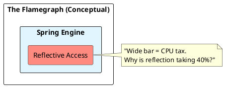

# 10.3: Thread Jitter, Safepoints, and Flamegraph Forensics


## The Critical Dialogue


**Student:** Our Ledger's P99 latency is spiking to 500ms. I checked GC logs; no major collections. I checked the DB; it's idle. It feels like the JVM just "Stops" for half a second. Why?


**Principal:** The CPU isn't haunted; it's in a **Safepoint Bias**. You are observing the internal synchronization of the JVM. To reach Principal level, we must master **Flamegraph Forensics**. We move from "Guessing at Logs" to **Tracing the Silicon**.


---


## 1. The Physics of the Safepoint


### 1.1 Why the JVM must Stop
Maintenance tasks like GC preparation or Code de-optimization require all threads to pause.


### 1.2 The Time-to-Safepoint (TTSP) Trap
The "Pause" is often not the work itself, but waiting for one "Stubborn Thread" to stop.
. **The Physics:** If one thread is in a long `for-loop` without a poll, the whole JVM waits.


---


## 2. Forensic Archaeology: Flamegraphs


> [!abstract] The Mechanics: Stack Sampling
. **The Idea:** Sample the CPU stack 1,000 times per second.
. **The Width:** The wider a bar, the more CPU time consumed.
. **The Audit:** Look for "Flat Tops"—methods that consume 90% of width but have no sub-calls. This is your **CPU Stall**.





---


## 3. Principal Implementation: Forensic Trigger


```java
// Principal Level: Automated JFR Capture
public void captureTrace() {
    try (var recording = new Recording()) {
        recording.enable("jdk.ExecutionSample").with("period", "1ms");
        recording.start();
        Thread.sleep(60_000); 
        recording.stop();
        recording.dump(Path.of("/tmp/war_room.jfr"));
    }
}
```


---


## 🧠 Principal's Inquiry


. **Biased Locking:** Why was it disabled by default in Java 15+? (Hint: The **Safepoint** cost).


. **Steal Time:** How can neighbors in Kubernetes cause jitter in your JVM?


**Principal Summary:** Thread Jitter is about **Synchronization Costs**. We use Safepoint stats and Flamegraphs to identify the "Stubborn Threads" preventing hardware-level fluency.
 Greenlanders use the type system to prove our software invariants.
