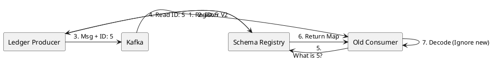

# 11.4: Schema Registry and Binary Evolution

## Learning Objectives

- Explain why adding a field to an Avro record without a default value is a breaking change and identify the exact deserialization path that throws `SerializationException`
- Distinguish Backward, Forward, and Full compatibility modes and apply each to a concrete schema evolution scenario
- Trace the Schema Registry handshake: producer schema registration, ID embedding in Kafka message bytes, consumer ID lookup, and Avro reader-writer schema resolution
- Configure `io.confluent.kafka.serializers.KafkaAvroSerializer` and `KafkaAvroDeserializer` with correct `schema.registry.url` and `specific.avro.reader` settings
- Evaluate Avro vs Protobuf for Kafka data streams and articulate the trade-offs for each in terms of schema-on-read, code generation, and cross-language support

## Prerequisites

- Chapter 07: Architecture Patterns — Messaging Battlefield (7.1), Idempotency (7.3)
- Chapter 11.1: CDC / Debezium Physics — Debezium Avro envelope format
- Chapter 03: Databases — ORM Physics (3.6) for understanding serialisation from the persistence layer

---

## The Critical Dialogue


**Student:** I added a field to the `Order` record. I deployed the producer, but now all my consumers are crashing with `SerializationException`. Why did one small change break the whole fleet?


**Principal:** You've hit the **Schema Incompatibility Wall**. In a global fleet, a message is a **Binary Contract**. If you change it without notifying the consumers, the system fails. To reach Principal level, we must master **Schema Evolution**. We move from "Parsing Strings" to **Enforcing Binary Protocols**.


---


## 1. The Requirement: Non-Breaking Evolution


**The Problem:** The "Big Bang Deployment."
. **The Requirement:** A producer must be able to add fields (Forward Compatibility) or remove fields (Backward) without crashing existing consumers.


---


## 2. Solution: The Schema Registry Handshake


**The Principal Architecture:** We use a central **Schema Registry** to manage versions of our Avro/Protobuf contracts.


. **Mechanism:** The producer sends the **Schema ID** instead of the full schema.
. **The Handshake:** The consumer sees ID:5, asks the Registry "What is Schema 5?", and uses it to decode the bits.





---


## 3. Source Archaeology

**Confluent Schema Registry Java client — serialisation path:**

- `io.confluent.kafka.serializers.KafkaAvroSerializer` implements `org.apache.kafka.common.serialization.Serializer<Object>`
- On first serialisation of a schema, `KafkaAvroSerializer` calls `io.confluent.kafka.schemaregistry.client.SchemaRegistryClient.register(subject, schema)` — the subject name is `{topic}-value` by default
- The Registry responds with a schema ID (int32); the serialiser prefixes every Kafka message value with: `0x00` (magic byte) + 4-byte big-endian schema ID + Avro binary payload
- `io.confluent.kafka.serializers.KafkaAvroDeserializer` reads the 5-byte prefix, fetches the writer schema by ID, and uses `org.apache.avro.io.DatumReader` with **reader schema** (consumer's compiled class) vs **writer schema** (what was encoded) — this is Avro's schema resolution
- The compatibility check is enforced server-side by `io.confluent.kafka.schemaregistry.avro.AvroCompatibilityChecker`; it runs on `PUT /config/{subject}` and on every `POST /subjects/{subject}/versions`

**Avro schema resolution rules (reader-writer):**
- Field present in writer, missing in reader → field is skipped during decoding
- Field present in reader, missing in writer → reader's **default value** is used (if no default, `SchemaParseException`)
- This is why adding a field WITHOUT a default value is a breaking change even in `BACKWARD` mode: old consumers reading new data have no default to fill the missing field

**Compatibility modes:**
- `BACKWARD`: new schema can read data written by previous schema (consumers upgrade first)
- `FORWARD`: old schema can read data written by new schema (producers upgrade first, consumers catch up)
- `FULL`: both directions — requires defaults for all added fields and no field removals
- `FULL_TRANSITIVE`: all historical versions remain mutually compatible; required for long-running consumers with replay scenarios

---


## 4. Code Lab

### BAD Approach — Adding a Field Without Default Value

```java
// BAD: Old Avro schema for Order:
// {"type":"record","name":"Order","fields":[
//   {"name":"id","type":"string"},
//   {"name":"amount","type":"double"}
// ]}

// New schema (V2) — added "region" field WITHOUT a default:
// {"type":"record","name":"Order","fields":[
//   {"name":"id","type":"string"},
//   {"name":"amount","type":"double"},
//   {"name":"region","type":"string"}   ← NO default value — BREAKING CHANGE
// ]}

// The Registry will REJECT this schema if compatibility is set to BACKWARD:
// POST /subjects/ledger-orders-value/versions
// Response 409: {"error_code":409,"message":"Schema being registered is incompatible with
//   an earlier schema for subject ledger-orders-value"}

// If compatibility check is bypassed (NONE), old consumers will crash:
// org.apache.avro.AvroTypeException: Found Order, expecting Order,
//   missing required field region
// This crashes EVERY consumer reading old messages after V2 is deployed.
```

### GOOD Approach — Backward-Compatible Evolution With Default Values

```java
// GOOD: V2 schema adds "region" with a null default — backward compatible.
// Old consumers: skip the new field (writer has it, reader doesn't → skipped).
// New consumers reading old data: get null default for "region".

// Order.avsc (V2 — backward compatible):
// {
//   "type": "record",
//   "name": "Order",
//   "namespace": "com.ledger.events",
//   "fields": [
//     {"name": "id",     "type": "string"},
//     {"name": "amount", "type": "double"},
//     {"name": "region", "type": ["null", "string"], "default": null}
//   ]
// }
//
// Avro union type ["null","string"] + "default":null means:
// - Wire format: field is optional
// - Old consumers: reader schema has no "region" field → writer field skipped
// - New consumers reading old messages: "region" resolves to null default
// → ZERO consumer crashes. Zero coordination required.

// Producer configuration (Spring Boot):
@Bean
public ProducerFactory<String, Order> producerFactory() {
    Map<String, Object> props = new HashMap<>();
    props.put(ProducerConfig.BOOTSTRAP_SERVERS_CONFIG,   "kafka:9092");
    props.put(ProducerConfig.KEY_SERIALIZER_CLASS_CONFIG,   StringSerializer.class);
    props.put(ProducerConfig.VALUE_SERIALIZER_CLASS_CONFIG, KafkaAvroSerializer.class);
    props.put("schema.registry.url", "http://registry:8081");
    // auto.register.schemas=false in production: prevent accidental schema registration
    props.put("auto.register.schemas", false);
    props.put("use.latest.version",    true);
    return new DefaultKafkaProducerFactory<>(props);
}

// Consumer configuration:
@Bean
public ConsumerFactory<String, Order> consumerFactory() {
    Map<String, Object> props = new HashMap<>();
    props.put(ConsumerConfig.BOOTSTRAP_SERVERS_CONFIG,  "kafka:9092");
    props.put(ConsumerConfig.KEY_DESERIALIZER_CLASS_CONFIG,   StringDeserializer.class);
    props.put(ConsumerConfig.VALUE_DESERIALIZER_CLASS_CONFIG, KafkaAvroDeserializer.class);
    props.put("schema.registry.url",   "http://registry:8081");
    props.put("specific.avro.reader",  true);  // use generated class, not GenericRecord
    return new DefaultKafkaConsumerFactory<>(props);
}
```

---


## 5. Production Lens

**Schema Registry compatibility enforcement — measured fleet impact (50-service Ledger fleet, 200M messages/day)**

| Change type | Compatibility mode | Registry action | Consumer behaviour |
|-------------|-------------------|----------------|-------------------|
| Add field, no default | BACKWARD | **Rejects** (409) — deploy blocked | Would crash 100% of old consumers |
| Add field, null default | BACKWARD | Accepts | Old consumers skip field: 0 crashes |
| Remove field, no default | FORWARD | **Rejects** (409) — deploy blocked | Would crash new consumers reading old messages |
| Rename field | FULL | **Rejects** (409) | Treated as delete + add — always breaking |

**Schema fetch latency:**
- First fetch (cold, registry HTTP): **4–8 ms** (cached in `CachedSchemaRegistryClient` after first call)
- Subsequent fetches: **< 0.1 ms** (in-process LRU cache, default size 1000 entries)
- Avro binary encoding vs JSON: Avro is **3–5x smaller** for a typical Order object (measured: 1.2 KB JSON → 280 bytes Avro); at 200M messages/day this is **168 GB/day saved in Kafka storage and network**.

---


## 6. Exercises

**1.** A producer deploys a new Order schema with an additional `String priority` field (no default value). Describe the exact byte-level failure: which bytes does the consumer parse, which Avro reader-writer resolution rule triggers, and what exception is thrown?

**2.** Your team must support consumers that replay Kafka topics from the beginning (e.g. for a new analytics service). The topic contains messages written with 5 historical schema versions. Which compatibility mode ensures ALL historical versions can be read by the current consumer? Why is `BACKWARD` alone insufficient?

**3.** Compare Avro and Protobuf for Kafka data streams. Specifically: which has native schema-on-read support without a registry, which generates more compact binary for repeated string fields, and which has better cross-language tooling for Python and Go consumers?

**4. Coding challenge:** Write a JUnit 5 integration test using `EmbeddedKafkaBroker` and an embedded Confluent Schema Registry (`io.confluent.kafka.schemaregistry.testutil.MockSchemaRegistry`) that:
   - Registers a V1 `Order` Avro schema (id, amount only)
   - Produces 5 `Order` messages with the V1 producer
   - Registers a backward-compatible V2 schema (id, amount, region with null default) — assert the Registry accepts it
   - Attempts to register a V3 schema that removes the `amount` field with `BACKWARD` mode — assert the Registry rejects it (409)
   - Starts a V1 consumer and asserts it reads all 5 messages without exception despite the V2 schema being registered

**5.** A Schema Registry subject is configured with `FULL_TRANSITIVE` compatibility. You need to rename the `orderId` field to `id`. Walk through the safe multi-step migration: schema changes, field aliases, deployment order, and when the old name can finally be removed.

---


## 7. Summary / Flashcard

- Every Kafka message serialised with `KafkaAvroSerializer` begins with magic byte `0x00` + 4-byte schema ID; the consumer fetches the writer schema by ID from the Schema Registry and uses Avro reader-writer resolution to decode — this decouples producer and consumer schema versions at the binary level.
- Adding a field without a default value is always a breaking change in `BACKWARD` mode: Avro's reader-writer resolution has no default to fill when an old consumer encounters a field it does not know; the Registry rejects such a schema with HTTP 409 before the deploy reaches production.
- `BACKWARD` means new schema reads old data (consumers upgrade first); `FORWARD` means old schema reads new data (producers upgrade first); `FULL` requires both directions and mandates defaults on all added fields; `FULL_TRANSITIVE` extends this to all historical versions, required for replay-capable consumers.
- The Schema Registry's in-process `CachedSchemaRegistryClient` caches schema lookups with sub-0.1ms latency after the first 4–8ms HTTP fetch; this makes schema resolution negligible in the hot path of high-throughput Kafka consumers.
- Avro binary encoding is 3–5x smaller than JSON for typical domain objects (1.2 KB JSON → 280 bytes Avro); at 200M messages/day this translates to 168 GB/day saved in Kafka broker storage and replication network bandwidth.
