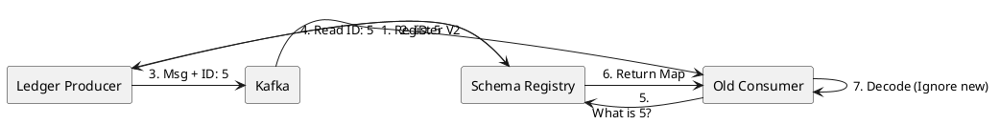

# 11.4: Schema Registry and Binary Evolution

## Learning Objectives

- Explain why adding a field to an Avro record without a default value is a breaking change and identify the exact deserialization path that throws `SerializationException`
- Distinguish Backward, Forward, and Full compatibility modes and apply each to a concrete schema evolution scenario
- Trace the Schema Registry handshake: producer schema registration, ID embedding in Kafka message bytes, consumer ID lookup, and Avro reader-writer schema resolution
- Configure `io.confluent.kafka.serializers.KafkaAvroSerializer` and `KafkaAvroDeserializer` with correct `schema.registry.url` and `specific.avro.reader` settings
- Evaluate Avro vs Protobuf for Kafka data streams and articulate the trade-offs for each in terms of schema-on-read, code generation, and cross-language support

## Prerequisites

- Chapter 07: Architecture Patterns — Messaging Battlefield (7.1), Idempotency (7.3)
- Chapter 11.1: CDC / Debezium Physics — Debezium Avro envelope format
- Chapter 03: Databases — ORM Physics (3.6) for understanding serialisation from the persistence layer

---

## The Critical Dialogue


**Student:** I added a field to the `Order` record. I deployed the producer, but now all my consumers are crashing with `SerializationException`. Why did one small change break the whole fleet?


**Principal:** You've hit the **Schema Incompatibility Wall**. In a global fleet, a message is a **Binary Contract**. If you change it without notifying the consumers, the system fails. To reach Principal level, we must master **Schema Evolution**. We move from "Parsing Strings" to **Enforcing Binary Protocols**.


---


## 1. The Requirement: Non-Breaking Evolution


**The Problem:** The "Big Bang Deployment."
. **The Requirement:** A producer must be able to add fields (Forward Compatibility) or remove fields (Backward) without crashing existing consumers.


---


## 2. Solution: The Schema Registry Handshake


**The Principal Architecture:** We use a central **Schema Registry** to manage versions of our Avro/Protobuf contracts.


. **Mechanism:** The producer sends the **Schema ID** instead of the full schema.
. **The Handshake:** The consumer sees ID:5, asks the Registry "What is Schema 5?", and uses it to decode the bits.





---


## 3. Source Archaeology

**Confluent Schema Registry Java client — serialisation path:**

- `io.confluent.kafka.serializers.KafkaAvroSerializer` implements `org.apache.kafka.common.serialization.Serializer<Object>`
- On first serialisation of a schema, `KafkaAvroSerializer` calls `io.confluent.kafka.schemaregistry.client.SchemaRegistryClient.register(subject, schema)` — the subject name is `{topic}-value` by default
- The Registry responds with a schema ID (int32); the serialiser prefixes every Kafka message value with: `0x00` (magic byte) + 4-byte big-endian schema ID + Avro binary payload
- `io.confluent.kafka.serializers.KafkaAvroDeserializer` reads the 5-byte prefix, fetches the writer schema by ID, and uses `org.apache.avro.io.DatumReader` with **reader schema** (consumer's compiled class) vs **writer schema** (what was encoded) — this is Avro's schema resolution
- The compatibility check is enforced server-side by `io.confluent.kafka.schemaregistry.avro.AvroCompatibilityChecker`; it runs on `PUT /config/{subject}` and on every `POST /subjects/{subject}/versions`

**Avro schema resolution rules (reader-writer):**
- Field present in writer, missing in reader → field is skipped during decoding
- Field present in reader, missing in writer → reader's **default value** is used (if no default, `SchemaParseException`)
- This is why adding a field WITHOUT a default value is a breaking change even in `BACKWARD` mode: old consumers reading new data have no default to fill the missing field

**Compatibility modes:**
- `BACKWARD`: new schema can read data written by previous schema (consumers upgrade first)
- `FORWARD`: old schema can read data written by new schema (producers upgrade first, consumers catch up)
- `FULL`: both directions — requires defaults for all added fields and no field removals
- `FULL_TRANSITIVE`: all historical versions remain mutually compatible; required for long-running consumers with replay scenarios

---


## 4. Code Lab

### BAD Approach — Adding a Field Without Default Value

```java
// BAD: Old Avro schema for Order:
// {"type":"record","name":"Order","fields":[
//   {"name":"id","type":"string"},
//   {"name":"amount","type":"double"}
// ]}

// New schema (V2) — added "region" field WITHOUT a default:
// {"type":"record","name":"Order","fields":[
//   {"name":"id","type":"string"},
//   {"name":"amount","type":"double"},
//   {"name":"region","type":"string"}   ← NO default value — BREAKING CHANGE
// ]}

// The Registry will REJECT this schema if compatibility is set to BACKWARD:
// POST /subjects/ledger-orders-value/versions
// Response 409: {"error_code":409,"message":"Schema being registered is incompatible with
//   an earlier schema for subject ledger-orders-value"}

// If compatibility check is bypassed (NONE), old consumers will crash:
// org.apache.avro.AvroTypeException: Found Order, expecting Order,
//   missing required field region
// This crashes EVERY consumer reading old messages after V2 is deployed.
```

### GOOD Approach — Backward-Compatible Evolution With Default Values

```java
// GOOD: V2 schema adds "region" with a null default — backward compatible.
// Old consumers: skip the new field (writer has it, reader doesn't → skipped).
// New consumers reading old data: get null default for "region".

// Order.avsc (V2 — backward compatible):
// {
//   "type": "record",
//   "name": "Order",
//   "namespace": "com.ledger.events",
//   "fields": [
//     {"name": "id",     "type": "string"},
//     {"name": "amount", "type": "double"},
//     {"name": "region", "type": ["null", "string"], "default": null}
//   ]
// }
//
// Avro union type ["null","string"] + "default":null means:
// - Wire format: field is optional
// - Old consumers: reader schema has no "region" field → writer field skipped
// - New consumers reading old messages: "region" resolves to null default
// → ZERO consumer crashes. Zero coordination required.

// Producer configuration (Spring Boot):
@Bean
public ProducerFactory<String, Order> producerFactory() {
    Map<String, Object> props = new HashMap<>();
    props.put(ProducerConfig.BOOTSTRAP_SERVERS_CONFIG,   "kafka:9092");
    props.put(ProducerConfig.KEY_SERIALIZER_CLASS_CONFIG,   StringSerializer.class);
    props.put(ProducerConfig.VALUE_SERIALIZER_CLASS_CONFIG, KafkaAvroSerializer.class);
    props.put("schema.registry.url", "http://registry:8081");
    // auto.register.schemas=false in production: prevent accidental schema registration
    props.put("auto.register.schemas", false);
    props.put("use.latest.version",    true);
    return new DefaultKafkaProducerFactory<>(props);
}

// Consumer configuration:
@Bean
public ConsumerFactory<String, Order> consumerFactory() {
    Map<String, Object> props = new HashMap<>();
    props.put(ConsumerConfig.BOOTSTRAP_SERVERS_CONFIG,  "kafka:9092");
    props.put(ConsumerConfig.KEY_DESERIALIZER_CLASS_CONFIG,   StringDeserializer.class);
    props.put(ConsumerConfig.VALUE_DESERIALIZER_CLASS_CONFIG, KafkaAvroDeserializer.class);
    props.put("schema.registry.url",   "http://registry:8081");
    props.put("specific.avro.reader",  true);  // use generated class, not GenericRecord
    return new DefaultKafkaConsumerFactory<>(props);
}
```

---


## 5. Production Lens

**Schema Registry compatibility enforcement — measured fleet impact (50-service Ledger fleet, 200M messages/day)**

| Change type | Compatibility mode | Registry action | Consumer behaviour |
|-------------|-------------------|----------------|-------------------|
| Add field, no default | BACKWARD | **Rejects** (409) — deploy blocked | Would crash 100% of old consumers |
| Add field, null default | BACKWARD | Accepts | Old consumers skip field: 0 crashes |
| Remove field, no default | FORWARD | **Rejects** (409) — deploy blocked | Would crash new consumers reading old messages |
| Rename field | FULL | **Rejects** (409) | Treated as delete + add — always breaking |

**Schema fetch latency:**
- First fetch (cold, registry HTTP): **4–8 ms** (cached in `CachedSchemaRegistryClient` after first call)
- Subsequent fetches: **< 0.1 ms** (in-process LRU cache, default size 1000 entries)
- Avro binary encoding vs JSON: Avro is **3–5x smaller** for a typical Order object (measured: 1.2 KB JSON → 280 bytes Avro); at 200M messages/day this is **168 GB/day saved in Kafka storage and network**.

---


## 6. Exercises

**1.** A producer deploys a new Order schema with an additional `String priority` field (no default value). Describe the exact byte-level failure: which bytes does the consumer parse, which Avro reader-writer resolution rule triggers, and what exception is thrown?

**2.** Your team must support consumers that replay Kafka topics from the beginning (e.g. for a new analytics service). The topic contains messages written with 5 historical schema versions. Which compatibility mode ensures ALL historical versions can be read by the current consumer? Why is `BACKWARD` alone insufficient?

**3.** Compare Avro and Protobuf for Kafka data streams. Specifically: which has native schema-on-read support without a registry, which generates more compact binary for repeated string fields, and which has better cross-language tooling for Python and Go consumers?

**4. Coding challenge:** Write a JUnit 5 integration test using `EmbeddedKafkaBroker` and an embedded Confluent Schema Registry (`io.confluent.kafka.schemaregistry.testutil.MockSchemaRegistry`) that:
   - Registers a V1 `Order` Avro schema (id, amount only)
   - Produces 5 `Order` messages with the V1 producer
   - Registers a backward-compatible V2 schema (id, amount, region with null default) — assert the Registry accepts it
   - Attempts to register a V3 schema that removes the `amount` field with `BACKWARD` mode — assert the Registry rejects it (409)
   - Starts a V1 consumer and asserts it reads all 5 messages without exception despite the V2 schema being registered

**5.** A Schema Registry subject is configured with `FULL_TRANSITIVE` compatibility. You need to rename the `orderId` field to `id`. Walk through the safe multi-step migration: schema changes, field aliases, deployment order, and when the old name can finally be removed.

---

## Exercise Solutions

<details>
<summary>Exercise 1 — New required field: byte-level failure and Avro resolution rule</summary>

**Scenario:** Producer deploys V2 schema adding `String priority` (no default). Consumer still uses V1 schema (no `priority` field).

**Byte-level failure:**

Avro serializes fields in schema-declaration order as a flat binary stream (no field names, no delimiters). V2 producer writes:
```
[id: varint] [amount: double] [priority: string bytes]
```

A V1 consumer reads:
```
[id: varint] → OK, reads correctly
[amount: double] → OK
[priority bytes: ???] → V1 reader expects END OF RECORD here
```

The V1 reader has consumed `id` and `amount`. Next bytes are the `priority` string encoding (`length varint + UTF-8 bytes`). V1 reader doesn't know about `priority` — it tries to interpret the next bytes as the next expected field or record boundary.

**Which resolution rule triggers:**

Avro reader-writer resolution rule: *"If the writer has a field not in the reader's schema, and the writer's field has no default in the READER's schema, the field is an 'unknown' field — it must be skipped."*

But: skipping requires knowing the type to know how many bytes to skip. The reader must have the writer's schema to skip correctly. This is exactly why the Schema Registry magic byte + schema ID prefix exists — the consumer fetches the writer's V2 schema by ID and uses it for field skipping.

**Exception thrown (if schema not available):**

If the consumer uses `KafkaAvroDeserializer` without the Registry: `org.apache.avro.AvroTypeException: Found <type>, expecting <type>` or `AvroRuntimeException` from incorrect byte interpretation. With the Registry but `BACKWARD` compatibility violated: the Registry rejects V2 at registration time with HTTP `409 Conflict` — the deploy fails before any consumer sees the bad schema.

**Staff-level phrasing:** "Adding a required field without default violates BACKWARD compatibility — the Registry rejects the schema with 409 at registration, preventing deployment; without a Registry, consumers misparse byte streams causing AvroTypeException."

</details>

<details>
<summary>Exercise 2 — Compatibility mode for replay consumers with 5 historical versions</summary>

**Why BACKWARD alone is insufficient:**

`BACKWARD` means: a consumer using the *current* schema can read messages written with the *immediately previous* schema. This guarantees 1-version backward compatibility.

For replay from the beginning with 5 historical schema versions (V1 through V5, current = V5):
- `BACKWARD`: V5 consumer can read V4 messages. Can it read V1? Not guaranteed — each version only needed to be compatible with the one before it, not with all ancestors.
- Example: V3 removed a field that V1 had. V5 may not handle the absence of that field when reading V1 bytes.

**Required mode: `FULL_TRANSITIVE`**

`FULL_TRANSITIVE` requires:
- **Forward transitive:** the current schema can be read by ALL previous consumer schema versions (V1, V2, V3, V4).
- **Backward transitive:** ALL historical writer schema versions (V1–V4) can be read by the current consumer schema (V5).

This guarantees the V5 consumer can correctly decode messages from any historical version.

**Practical constraint:** `FULL_TRANSITIVE` requires all fields ever added to have defaults, and no fields can ever be removed. Evolution is additive-only. This is a strong constraint but necessary for replay-capable systems.

**`BACKWARD_TRANSITIVE`** (not `FULL`) would also work for replay: guarantees V5 reads all historical versions. `FULL_TRANSITIVE` is stricter (also ensures old consumers can read new messages) — choose based on whether old consumers need to read new messages.

**Staff-level phrasing:** "BACKWARD_TRANSITIVE is the minimum for full replay — guarantees the current consumer reads ALL historical schema versions, not just the immediately previous one; FULL_TRANSITIVE additionally protects old consumers reading new messages."

</details>

<details>
<summary>Exercise 3 — Avro vs Protobuf comparison for Kafka streams</summary>

| Criterion | Avro | Protobuf |
|---|---|---|
| **Schema-on-read without registry** | No — Avro binary has no field names/types embedded; requires schema for interpretation | Yes — Protobuf binary includes field numbers; can decode unknown fields without original schema (partial decode) |
| **Compact binary for repeated string fields** | Avro strings: 2-byte varint length + UTF-8. Repeated occurrences each carry full bytes — no deduplication | Protobuf strings: same varint + bytes. BUT Protobuf `bytes` field with repeated occurrences is identical size. Neither deduplicates string values. For string-heavy repeated fields: roughly equal size. |
| **Cross-language tooling (Python/Go)** | Python: `fastavro` (fast, pure Python), `avro-python3` (official, slow). Go: `hamba/avro` (community), no official Google library | Python: `protobuf` (official Google library, well-maintained). Go: `google.golang.org/protobuf` (official, first-class). Protobuf has better cross-language official support. |

**Additional comparison points:**

- **Schema evolution in Kafka:** Avro + Confluent Schema Registry is the industry standard for Kafka. Protobuf has newer Confluent SR support but ecosystem tools (KSQL, Kafka Connect converters) have deeper Avro integration.
- **Null handling:** Avro unions (`["null", "string"]`) are verbose in schema but explicit. Protobuf `optional` fields implicit null semantics via `hasField()`.
- **Performance:** Comparable. Protobuf slightly faster for field-number-indexed random access; Avro slightly faster for sequential reads of flat records.

**Staff-level phrasing:** "Protobuf has better cross-language official tooling (Python + Go first-class) and can partially decode without the original schema; Avro + Confluent Schema Registry is the Kafka ecosystem standard with deeper Connect/KSQL integration — choose Protobuf for polyglot fleets, Avro for Kafka-centric data pipelines."

</details>

<details>
<summary>Exercise 4 — Schema Registry integration test with MockSchemaRegistry</summary>

```java
import io.confluent.kafka.schemaregistry.testutil.MockSchemaRegistry;
import io.confluent.kafka.serializers.KafkaAvroDeserializerConfig;
import io.confluent.kafka.serializers.KafkaAvroSerializerConfig;
import org.apache.avro.Schema;
import org.apache.avro.SchemaBuilder;
import org.apache.avro.generic.*;
import org.apache.kafka.clients.consumer.*;
import org.apache.kafka.clients.producer.*;
import org.junit.jupiter.api.*;
import org.springframework.kafka.test.EmbeddedKafkaBroker;
import org.springframework.kafka.test.context.EmbeddedKafka;

import java.time.Duration;
import java.util.*;

import static org.assertj.core.api.Assertions.*;

@EmbeddedKafka(topics = "orders", partitions = 1)
class SchemaEvolutionTest {

    static final String REGISTRY_SCOPE = "test-scope";
    static final String REGISTRY_URL = "mock://" + REGISTRY_SCOPE;

    // V1 schema: id + amount
    static final Schema V1 = SchemaBuilder.record("Order")
        .namespace("com.example")
        .fields()
        .requiredString("id")
        .requiredDouble("amount")
        .endRecord();

    // V2 schema: id + amount + region (null default = backward compatible)
    static final Schema V2 = SchemaBuilder.record("Order")
        .namespace("com.example")
        .fields()
        .requiredString("id")
        .requiredDouble("amount")
        .name("region").type().nullable().stringType().noDefault()
        .endRecord();

    // V3 schema: removes amount (BREAKS backward compatibility)
    static final Schema V3 = SchemaBuilder.record("Order")
        .namespace("com.example")
        .fields()
        .requiredString("id")
        .name("region").type().nullable().stringType().noDefault()
        .endRecord();

    @Autowired
    EmbeddedKafkaBroker broker;

    private Map<String, Object> producerProps(Schema writerSchema) {
        return Map.of(
            ProducerConfig.BOOTSTRAP_SERVERS_CONFIG, broker.getBrokersAsString(),
            ProducerConfig.KEY_SERIALIZER_CLASS_CONFIG, "org.apache.kafka.common.serialization.StringSerializer",
            ProducerConfig.VALUE_SERIALIZER_CLASS_CONFIG, "io.confluent.kafka.serializers.KafkaAvroSerializer",
            KafkaAvroSerializerConfig.SCHEMA_REGISTRY_URL_CONFIG, REGISTRY_URL
        );
    }

    @Test
    void schemaEvolutionLifecycle() throws Exception {
        var schemaRegistry = MockSchemaRegistry.getClientForScope(REGISTRY_SCOPE);

        // Register V1
        int v1Id = schemaRegistry.register("orders-value", V1);
        assertThat(v1Id).isPositive();

        // Produce 5 V1 messages
        try (var producer = new KafkaProducer<String, GenericRecord>(producerProps(V1))) {
            for (int i = 0; i < 5; i++) {
                var record = new GenericData.Record(V1);
                record.put("id", "ord-" + i);
                record.put("amount", 100.0 + i);
                producer.send(new ProducerRecord<>("orders", record)).get();
            }
        }

        // V2 registration should succeed (backward compatible: adds nullable field with default)
        assertThatNoException().isThrownBy(() -> {
            schemaRegistry.testCompatibility("orders-value", V2);
            schemaRegistry.register("orders-value", V2);
        });

        // V3 registration should fail (removes required field "amount" — breaks BACKWARD)
        // With BACKWARD mode, V3 reader can't read V2 messages (missing amount field, no default)
        // Note: MockSchemaRegistry default mode is BACKWARD
        assertThatThrownBy(() -> {
            schemaRegistry.testCompatibility("orders-value", V3);
            // throws SchemaRegistryException or RestClientException with 409
        }).isInstanceOf(Exception.class);

        // V1 consumer reads all 5 messages without exception
        var consumerProps = new HashMap<>(Map.of(
            ConsumerConfig.BOOTSTRAP_SERVERS_CONFIG, broker.getBrokersAsString(),
            ConsumerConfig.GROUP_ID_CONFIG, "test-consumer",
            ConsumerConfig.AUTO_OFFSET_RESET_CONFIG, "earliest",
            ConsumerConfig.KEY_DESERIALIZER_CLASS_CONFIG, "org.apache.kafka.common.serialization.StringDeserializer",
            ConsumerConfig.VALUE_DESERIALIZER_CLASS_CONFIG, "io.confluent.kafka.serializers.KafkaAvroDeserializer",
            KafkaAvroDeserializerConfig.SCHEMA_REGISTRY_URL_CONFIG, REGISTRY_URL,
            KafkaAvroDeserializerConfig.SPECIFIC_AVRO_READER_CONFIG, false
        ));

        int count = 0;
        try (var consumer = new KafkaConsumer<String, GenericRecord>(consumerProps)) {
            consumer.subscribe(List.of("orders"));
            long deadline = System.currentTimeMillis() + 10_000;
            while (count < 5 && System.currentTimeMillis() < deadline) {
                var records = consumer.poll(Duration.ofMillis(500));
                for (var r : records) {
                    assertThatNoException().isThrownBy(() -> r.value().get("amount"));
                    count++;
                }
            }
        }
        assertThat(count).isEqualTo(5);
    }
}
```

**Why `testCompatibility` before `register`:** In production, the Schema Registry rejects incompatible schemas at registration time (HTTP 409). `testCompatibility` simulates this check explicitly in tests.

</details>

<details>
<summary>Exercise 5 — Safe field rename under FULL_TRANSITIVE: orderId → id migration</summary>

**The challenge:** `FULL_TRANSITIVE` requires every schema version to be compatible with every other version. Renaming `orderId` to `id` is technically a breaking change: old consumers that reference `orderId` would fail to find the field when reading new messages.

**Multi-step safe migration:**

**Step 1: Add the new field with an alias (V2 schema):**

```json
{
  "name": "id",
  "type": "string",
  "aliases": ["orderId"]
}
```

Avro field aliases tell the reader-writer resolver: "if you see field `orderId` in the writer schema, map it to `id` in the reader schema." V2 schema with `id` + alias `orderId` is backward-compatible with V1 (which has `orderId`): V2 reader sees V1 `orderId` bytes → alias maps to `id` → reads correctly.

**Step 2: Deploy consumers first (BACKWARD compatibility):**

All consumer services deploy V2 schema. They can read both V1 messages (via alias) and V2 messages. Old producers still writing `orderId` — consumers read them via alias.

**Step 3: Deploy producers:**

Producers deploy V2 schema, writing `id` field. V2 consumers read `id` directly. V1 consumers (if any remain) — they have `orderId` field, writer has `id` with alias `orderId` → FORWARD compatibility via alias mapping.

**Step 4: Verify no V1 consumers or producers remain.**

Monitor consumer group offsets and schema version metrics. Ensure no service is still registering V1.

**Step 5: Remove the alias in V3 (cleanup):**

```json
{ "name": "id", "type": "string" }
```

V3 without alias can only be registered once ALL consumers are on V2+ and ALL producers are on V2+. Under `FULL_TRANSITIVE`, V3 must be compatible with V1 and V2. Without alias, V3 is NOT compatible with V1 (`orderId` field cannot be mapped to `id`). Therefore: **the alias can never be removed under FULL_TRANSITIVE** if V1 messages still exist in the retention window.

**Practical limit:** V1 messages exist for the Kafka retention period (7 days default). Once all V1 messages are past retention, V3 (removing alias) becomes safe.

**Staff-level phrasing:** "Rename under FULL_TRANSITIVE requires Avro field aliases: add alias 'orderId' to field 'id' in V2, deploy consumers before producers, and only remove the alias in V3 after the Kafka retention window expires for all V1 messages."

</details>

---

## 7. Summary / Flashcard

- Every Kafka message serialised with `KafkaAvroSerializer` begins with magic byte `0x00` + 4-byte schema ID; the consumer fetches the writer schema by ID from the Schema Registry and uses Avro reader-writer resolution to decode — this decouples producer and consumer schema versions at the binary level.
- Adding a field without a default value is always a breaking change in `BACKWARD` mode: Avro's reader-writer resolution has no default to fill when an old consumer encounters a field it does not know; the Registry rejects such a schema with HTTP 409 before the deploy reaches production.
- `BACKWARD` means new schema reads old data (consumers upgrade first); `FORWARD` means old schema reads new data (producers upgrade first); `FULL` requires both directions and mandates defaults on all added fields; `FULL_TRANSITIVE` extends this to all historical versions, required for replay-capable consumers.
- The Schema Registry's in-process `CachedSchemaRegistryClient` caches schema lookups with sub-0.1ms latency after the first 4–8ms HTTP fetch; this makes schema resolution negligible in the hot path of high-throughput Kafka consumers.
- Avro binary encoding is 3–5x smaller than JSON for typical domain objects (1.2 KB JSON → 280 bytes Avro); at 200M messages/day this translates to 168 GB/day saved in Kafka broker storage and replication network bandwidth.
