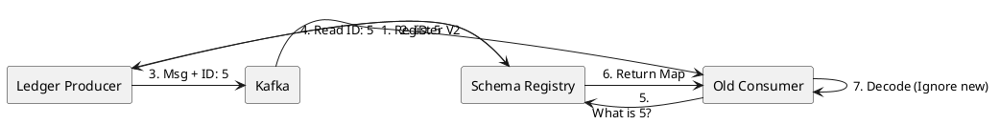

# 11.4: Schema Registry and Binary Evolution

## The Critical Dialogue

**Student:** I added a field to the `Order` record. I deployed the producer, but now all my consumers are crashing with `SerializationException`. Why did one small change break the whole fleet?

**Principal:** You've hit the **Schema Incompatibility Wall**. In a global fleet, a message is a **Binary Contract**. If you change it without notifying the consumers, the system fails. To reach Principal level, we must master **Schema Evolution**. We move from "Parsing Strings" to **Enforcing Binary Protocols**.

---

## 1. The Requirement: Non-Breaking Evolution

**The Problem:** The "Big Bang Deployment."
. **The Requirement:** A producer must be able to add fields (Forward Compatibility) or remove fields (Backward) without crashing existing consumers.

---

## 2. Solution: The Schema Registry Handshake

**The Principal Architecture:** We use a central **Schema Registry** to manage versions of our Avro/Protobuf contracts.

. **Mechanism:** The producer sends the **Schema ID** instead of the full schema.
. **The Handshake:** The consumer sees ID:5, asks the Registry "What is Schema 5?", and uses it to decode the bits.

---

## 🧠 Principal's Inquiry

. **Compatibility:** What is the difference between **Backward**, **Forward**, and **Full** compatibility?

. **Avro vs Protobuf:** Why is Avro preferred for Kafka data streams? (Hint: The **Schema-on-Read** property).

**Principal Summary:** Schema Registry is about **Decoupled Evolution**. We use binary contracts to ensure our fleet can change one pod at a time.
 Greenlanders use the type system to prove our software invariants.
