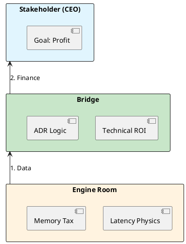

# 12.1: Technical ROI and the Unit Cost of an Order

## The Critical Dialogue

**Student:** My CTO wants to cancel our "Project Valhalla" refactor. He says "Memory is cheap." How do I convince him that tech debt is a financial leak?

**Principal:** You're speaking Java; he's speaking Finance. To reach Principal level, you must become a **Technical Accountant**. Memory isn't "Cheap" when you have 1,000 pods. It's an **Operating Expense (OPEX)**. We must master **Technical ROI**. We move from "Asking for Time" to **Proposing an Investment**.

---

## 1. The Physics of Business: Cloud Economics

### 1.1 The Unit Cost
. **The Math:** If a Ledger order takes 1MB and we have 1B orders, that is 1TB of RAM. At AWS prices, that's **$7,200/month** for idle memory.
. **The ROI:** If a refactor reduces memory by 50%, you just handed the company **$43,000/year** in pure profit.

---

## 2. Solution: The 3-Slide Principal Pitch

. **Slide 1: THE BURN.** "Our GC pauses cause a 2% bounce rate. We lose $50k/month."
. **Slide 2: THE LEVER.** "By moving Off-Heap, we eliminate pauses and 4x our capacity."
. **Slide 3: THE PROFIT.** "Investment: 1 Sprint. Result: $600k/year recovered revenue."

---

## 3. Visualizing the Strategic Bridge

---

## 🧠 Principal's Inquiry

. **Opportunity Cost:** If you spend 2 months on a refactor, what features are you NOT building?

. **Technical Debt Interest:** Why does tech debt behave like a high-interest loan?

**Principal Summary:** Strategic Leadership is about **Translating Physics into Finance**. We use ROI to prove that high-quality engineering is the most profitable path.
 Greenlanders use the type system to prove our software invariants.
