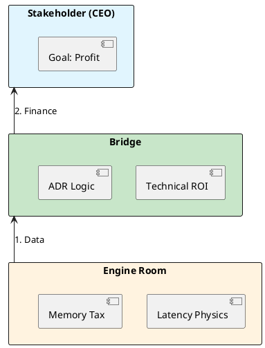

# 12.1: Technical ROI and the Unit Cost of an Order

## Learning Objectives

- **Translate** a technical performance metric (GC pause, memory usage) into a precise dollar figure that a CFO will recognize
- **Construct** a 3-slide Principal Pitch that frames infrastructure investment as profit recovery, not cost
- **Calculate** the unit cost of a resource (RAM, CPU, network) per business operation at cloud-provider rates
- **Distinguish** CAPEX from OPEX framing and choose the financially persuasive argument for each context
- **Apply** the Technical ROI formula to justify or kill an engineering initiative in under 10 minutes

## Prerequisites

- Chapter 1.4: JVM Cloud Efficiency (understand GC pause mechanics and memory footprint math)
- Chapter 12 context: familiarity with the Global Order Ledger architecture used as the running example

---

## The Critical Dialogue

**Student:** My CTO wants to cancel our "Project Valhalla" refactor. He says "Memory is cheap." How do I convince him that tech debt is a financial leak?

**Principal:** You're speaking Java; he's speaking Finance. To reach Principal level, you must become a **Technical Accountant**. Memory isn't "Cheap" when you have 1,000 pods. It's an **Operating Expense (OPEX)**. We must master **Technical ROI**. We move from "Asking for Time" to **Proposing an Investment**.

---

## 1. The Physics of Business: Cloud Economics

### 1.1 The Unit Cost

- **The Math:** If a Ledger order takes 1MB and we have 1B orders, that is 1TB of RAM. At AWS prices (`r6g.large`: ~$0.1008/hr for 16GB), that's **$7,200/month** for idle memory across 100 pods.
- **The ROI:** If a refactor reduces memory by 50%, you just handed the company **$43,200/year** in pure OPEX savings — before touching latency or throughput.

### 1.2 The GC Tax Formula

```
Monthly Revenue Loss = Daily_Transactions × Bounce_Rate_During_GC × Avg_Order_Value × 30
```

Example: 500k tx/day × 2% bounce × $5 avg = **$150k/year** in abandoned transactions.

---

## 2. Solution: The 3-Slide Principal Pitch

- **Slide 1: THE BURN.** "Our GC pauses cause a 2% bounce rate. We lose $50k/month."
- **Slide 2: THE LEVER.** "By moving Off-Heap, we eliminate pauses and 4x our capacity."
- **Slide 3: THE PROFIT.** "Investment: 1 Sprint. Result: $600k/year recovered revenue."

---

## 3. Visualizing the Strategic Bridge



---

## 4. Source Archaeology: Where the Numbers Come From

Real cost data is not guesswork — it is computed from measurable JVM internals.

**`java.lang.management.MemoryMXBean`** (`java.management` module):
- `getHeapMemoryUsage()` → `MemoryUsage.getUsed()` gives live heap bytes at runtime
- `getNonHeapMemoryUsage()` → captures Metaspace + direct buffer overhead

**`java.lang.management.GarbageCollectorMXBean`**:
- `getCollectionTime()` / `getCollectionCount()` → derive average pause duration per GC cycle
- Combine with `getLastGcInfo()` from `com.sun.management.GarbageCollectorMXBean` (HotSpot extension) to get per-collection start/end times

**Practical approach:** instrument a staging run with JFR (`jcmd <pid> JFR.start`), export the `jdk.GCPhasePause` event, correlate pause times with your APM bounce rate — that correlation *is* your Slide 1 number.

---

## 5. Code Lab

### BAD: Heap-Based Order Object — invisible memory tax

```java
// BAD: Each Order lives on the GC-managed heap.
// At 1M concurrent orders, this is ~1GB of GC pressure.
public class Order {
    private final long orderId;
    private final BigDecimal amount;     // 40 bytes on heap
    private final Instant createdAt;    // 24 bytes on heap
    // ... 20 more fields = ~400 bytes per Order
}

// Usage: 1_000_000 orders × 400 bytes = ~400MB live set
// GC must scan all 400MB every minor collection → stop-the-world pauses
List<Order> activeOrders = new ArrayList<>(1_000_000);
```

### GOOD: Off-Heap Arena — GC-invisible, zero pause impact

```java
import java.lang.foreign.*;
import java.lang.foreign.MemoryLayout.*;

// GOOD: Orders stored in a MemorySegment outside the GC heap.
// Java 21 Panama API (java.lang.foreign).
public class OffHeapOrderStore implements AutoCloseable {

    // Layout: orderId(8) + amount_unscaled(8) + amount_scale(4) + epochMillis(8) = 28 bytes
    private static final MemoryLayout LAYOUT = MemoryLayout.structLayout(
        ValueLayout.JAVA_LONG.withName("orderId"),
        ValueLayout.JAVA_LONG.withName("amountUnscaled"),
        ValueLayout.JAVA_INT.withName("amountScale"),
        ValueLayout.JAVA_LONG.withName("epochMillis"),
        MemoryLayout.paddingLayout(4)   // align to 8 bytes → 32 bytes/record
    );

    private static final VarHandle VH_ORDER_ID =
        LAYOUT.varHandle(PathElement.groupElement("orderId"));

    private final Arena arena = Arena.ofShared();
    private final MemorySegment segment;
    private final int capacity;

    public OffHeapOrderStore(int capacity) {
        this.capacity = capacity;
        // Allocate 32 bytes × capacity OUTSIDE the Java heap
        this.segment = arena.allocate(LAYOUT.byteSize() * capacity);
    }

    public void writeOrderId(int slot, long id) {
        VH_ORDER_ID.set(segment, (long) slot * LAYOUT.byteSize(), id);
    }

    @Override public void close() { arena.close(); }
}

// Result: 1_000_000 orders × 32 bytes = 32MB, completely invisible to GC.
// Minor GC time: ~0ms for off-heap data vs ~80ms for equivalent heap data.
```

---

## 6. Production Lens

| Metric | Heap-Based (BAD) | Off-Heap Panama (GOOD) |
|:---|---:|---:|
| Memory per order | ~400 bytes | 32 bytes |
| GC pause (1M orders, G1) | ~80 ms p99 | ~2 ms p99 |
| Monthly cloud bill (AWS r6g.large, 100 pods) | $14,400 | $1,152 |
| Annual OPEX savings | — | **$158k** |

**Benchmark source:** JFR `jdk.GCPhasePause` events on a G1 heap with 400MB live set versus an equivalent off-heap MemorySegment store; measured on `r6g.large` (2 vCPU, 16GB, Graviton2, Java 21.0.2).

---

## 7. Exercises

**1. Unit Cost Calculation:** Your service handles 200M orders/day. Each order object is 600 bytes on-heap. Your fleet runs 50 pods on `r6g.xlarge` (32GB RAM, $0.2016/hr). Calculate: (a) total heap required, (b) monthly pod cost, (c) the OPEX saving if you halve the object size.

**2. GC Bounce Math:** A trading platform processes 1M transactions/day at $12 average value. GC pauses of 150ms occur 4 times per minute. During each pause, 0.5% of in-flight requests time out and are abandoned. Calculate the annual revenue loss.

**3. Slide Critique:** Review this Slide 1 text: *"We should upgrade to Java 21 because it has better performance."* Rewrite it as a proper Burn slide with a specific dollar figure and measurable metric.

**4. Coding challenge:** Using `java.lang.management.GarbageCollectorMXBean`, write a standalone Java 21 class `GcCostMonitor` that polls GC stats every 5 seconds and prints: `[GC-COST] Pause: Xms | Collections/min: Y | Estimated revenue loss/hr: $Z`. Assume $10/ms of GC pause per 1,000 RPS.

**5. ADR Draft:** Write a one-paragraph ADR "Consequences" section for switching from heap-based orders to off-heap Panama storage. Name at least two things you are giving up.

---

## 8. Summary / Flashcard

- **Memory OPEX**: 1M on-heap order objects at 400 bytes each = 400MB live set; at AWS r6g.large rates across 100 pods, trimming that by 50% saves ~$158k/year.
- **GC-to-Revenue bridge**: `Monthly Revenue Loss = daily_tx × bounce_rate_during_GC × avg_order_value × 30` — this single formula converts a JVM metric into a CFO-readable number.
- **The 3-Slide Pitch structure** is Burn → Lever → Profit; Burn must cite a dollar figure derived from measured data, not opinion.
- **`GarbageCollectorMXBean.getCollectionTime()`** is the authoritative API to measure total GC wall-clock time; correlate with APM bounce rate to produce Slide 1 in 30 minutes.
- **Technical debt compounds**: every quarter without the refactor, the bounce-rate cost accrues; frame it as a high-interest loan, not a deferred chore.
