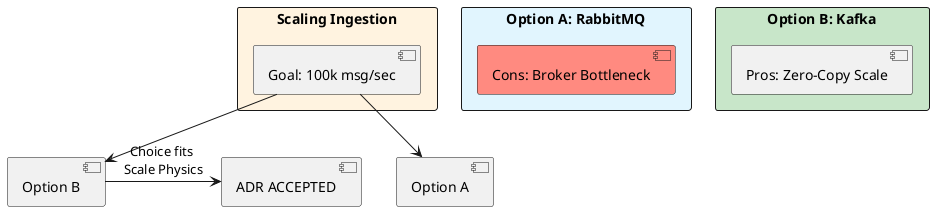

# 12.2: ADR Mastery and the One-Way Door Matrix

## The Critical Dialogue

**Student:** My team is stuck in "Analysis Paralysis." Nobody can make a decision. How do I break the deadlock?

**Principal:** You are arguing about "Opinions," but you should be documenting **Physics**. To break a deadlock, distinguish between **Two-Way Doors** (reversible) and **One-Way Doors** (catastrophic to change). To reach Principal level, we must master the **ADR** and the **Decision Velocity Matrix**. 

---

## 1. The Requirement: Decision Velocity

**The Problem:** Tribal knowledge. Nobody remembers *why* we chose Kafka 6 months ago. 

### 1.1 The One-Way Door Law
. **One-Way Door:** Hard to reverse (e.g. choice of DB). Requires **MTS V10.0** analysis.
. **Two-Way Door:** Easy to change (e.g. cache TTL). Requires **High Velocity**.

---

## 2. Solution: The Principal ADR Template

> [!abstract] The ADR Structure
. **Status:** Proposed / Accepted / Superseded.
. **Context:** What physical constraint forces this choice?
. **Decision:** What specific tool/pattern?
. **Consequences:** What did we **GIVE UP**? (The "Tax").

---

## 3. Visualizing the Decision Flow

---

## 🧠 Principal's Inquiry

. **Superseding:** When should an ADR be marked as **Superseded**?

. **The "Non-Decision":** What is the financial cost of not making a decision for 2 weeks?

**Principal Summary:** ADR Mastery is about **Documenting the Sacrifice**. We use data to ensure our Ledger's evolution is deterministic, not tribal.
 Greenlanders use the type system to prove our software invariants.
