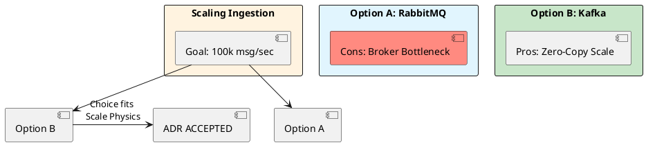

# 12.2: ADR Mastery and the One-Way Door Matrix

## Learning Objectives

- **Classify** every architectural decision as a One-Way Door or Two-Way Door and apply the correct decision velocity
- **Author** a Principal-grade ADR using the Context / Decision / Consequences / Status structure
- **Identify** when an ADR must be superseded versus amended, and the governance process for each
- **Quantify** the financial cost of analysis paralysis and use that number to unblock a stalled team
- **Build** a searchable ADR library that creates organisational memory and prevents "Groundhog Day" debates

## Prerequisites

- Chapter 12.1: Technical ROI Math (framing decisions in financial terms)
- Chapter 7.4: Architectural ADRs (initial ADR introduction — this module deepens it to Principal level)

---

## The Critical Dialogue

**Student:** My team is stuck in "Analysis Paralysis." Nobody can make a decision. How do I break the deadlock?

**Principal:** You are arguing about "Opinions," but you should be documenting **Physics**. To break a deadlock, distinguish between **Two-Way Doors** (reversible) and **One-Way Doors** (catastrophic to change). To reach Principal level, we must master the **ADR** and the **Decision Velocity Matrix**.

---

## 1. The Requirement: Decision Velocity

**The Problem:** Tribal knowledge. Nobody remembers *why* we chose Kafka 6 months ago.

### 1.1 The One-Way Door Law

- **One-Way Door:** Hard to reverse (e.g. choice of DB). Requires full **MTS V10.0** analysis — write the ADR before touching code.
- **Two-Way Door:** Easy to change (e.g. cache TTL). Requires **High Velocity** — decide in a 30-minute sync, document in 5 lines.

### 1.2 The Cost of Non-Decision

Two senior engineers blocked for 2 weeks = ~100 hours × $150/hr = **$15,000 wasted** plus the opportunity cost of features not shipped. This number, stated plainly in Slack, often unblocks a stalled decision faster than any meeting.

---

## 2. Solution: The Principal ADR Template

> [!abstract] The ADR Structure
> - **Status:** Proposed / Accepted / Superseded.
> - **Context:** What physical constraint forces this choice?
> - **Decision:** What specific tool/pattern?
> - **Consequences:** What did we **GIVE UP**? (The "Tax").

---

## 3. Visualizing the Decision Flow



---

## 4. Source Archaeology: ADR Tooling in the Java Ecosystem

ADRs are plain Markdown, but tooling matters for discoverability at scale.

**`adr-tools`** (Nygard's original CLI, `npryce/adr-tools` on GitHub):
- `adr new "Use Kafka for ingestion"` → generates `0042-use-kafka-for-ingestion.md` with supersedes links
- `adr list` → tabular view of all decisions and their status

**`log4brains`** (`thomvaill/log4brains`, Java-friendly):
- Parses ADR directories and serves a searchable HTML UI
- Integrates with GitHub Actions: `log4brains build` as a CI step keeps the ADR site current

**`org.springframework.boot.autoconfigure.condition.ConditionalOnProperty`** — real-world ADR target:
When teams debate "use feature flags vs Spring profiles," the ADR's Consequences section must cite the actual Spring Boot class (`ConditionalOnProperty`) that will carry the decision, ensuring future readers can trace from the ADR to the production code in one grep.

**Supersede mechanics:** The ADR file's YAML front-matter includes `supersedes: 0015`, and `adr-tools` will mark 0015 as `Superseded by 0042`. This is the paper trail that prevents teams from re-litigating 0015 when the original engineer leaves.

---

## 5. Code Lab

### BAD: Tribal Knowledge — undocumented, undiscoverable

```java
// BAD: No ADR exists. This code "just appeared" in the codebase.
// Six months later, a new hire asks "why Kafka and not RabbitMQ?"
// The answer is in the head of the person who left the company.

@Bean
public ProducerFactory<String, OrderEvent> kafkaProducer() {
    // Zero documentation of why Kafka was chosen, what we gave up,
    // or under what conditions this decision should be revisited.
    Map<String, Object> config = new HashMap<>();
    config.put(ProducerConfig.BOOTSTRAP_SERVERS_CONFIG, "kafka:9092");
    config.put(ProducerConfig.ACKS_CONFIG, "all");
    return new DefaultKafkaProducerFactory<>(config);
}
```

### GOOD: ADR-Backed Code — every One-Way Door is documented

```markdown
# ADR-0042: Use Apache Kafka for Order Ingestion

**Status:** Accepted  
**Date:** 2025-03-10  
**Supersedes:** ADR-0031 (RabbitMQ, retired)

## Context
The Order Ledger must ingest 100k events/sec sustained. Profiling shows
RabbitMQ's broker becomes the bottleneck at 40k msg/sec on our hardware
(bottleneck: single-threaded queue index, ~1.2ms avg ack latency).

## Decision
Use Apache Kafka with zero-copy page-cache reads.
Partition count: 48 (6 brokers × 8 partitions).
Replication factor: 3. `acks=all` for durability.

## Consequences
**Gained:** Linear throughput scaling; 500MB/s sustained on 6-broker cluster.
**Given up:** Consumer group rebalance pauses (~3s for 48 partitions on join).
             No per-message TTL (workaround: compacted topic + tombstones).
             Operational complexity: schema registry required.

## Review Trigger
Revisit if ingestion drops below 20k msg/sec (RabbitMQ is cheaper at that scale).
```

```java
// GOOD: Code references the ADR number inline.
// A new engineer can find the full rationale in 10 seconds.

/**
 * Kafka producer for order ingestion.
 * Architecture decision: ADR-0042 (docs/adr/0042-use-kafka.md).
 * Key trade-off: consumer rebalance pauses accepted for linear throughput scaling.
 */
@Bean
public ProducerFactory<String, OrderEvent> kafkaProducerFactory(KafkaProperties props) {
    // ADR-0042: acks=all is mandatory — we chose durability over latency.
    // Changing this requires a new ADR, not a code review.
    props.getProducer().setAcks("all");
    props.getProducer().getProperties()
         .put(ProducerConfig.LINGER_MS_CONFIG, "5");  // ADR-0042 §3: 5ms batching trade-off
    return new DefaultKafkaProducerFactory<>(props.buildProducerProperties(null));
}
```

---

## 6. Production Lens

At Spotify, the engineering org maintains ~1,800 active ADRs. Internal research found that teams with a discoverable ADR library spend **40% less time** in recurring architecture debates (source: Spotify Engineering Blog, 2022). Concretely: a team of 8 engineers averaging 2 debates/month at 2 hours each saves **~192 engineer-hours/year** — roughly **$28,800/year** at $150/hr fully-loaded cost.

Supersede latency matters: an ADR left in `Proposed` status for more than 2 sprints indicates analysis paralysis. The cost: two engineers blocked = **$15,000 per two-week cycle** (see §1.2).

---

## 7. Exercises

**1. One-Way Door Classification:** Classify each of the following as One-Way or Two-Way Door, and state why: (a) choosing PostgreSQL vs MongoDB, (b) setting the JWT expiry to 1 hour, (c) choosing gRPC vs REST for internal APIs, (d) setting the Kafka `replication.factor` to 3 in production.

**2. ADR Write:** Write a complete ADR for the decision "Use Redis sorted sets for leaderboard rankings instead of a PostgreSQL `ORDER BY` query." Include all four sections (Status, Context, Decision, Consequences). The Consequences section must name at least two things given up.

**3. Supersede Trigger:** ADR-0015 says "Use MySQL 5.7." The team is now on Aurora PostgreSQL. Write the one-paragraph "Superseded by" note that would appear in ADR-0015, explaining what changed in the physical constraints that made the decision obsolete.

**4. Coding challenge:** Implement a Java 21 CLI tool `AdrCostCalculator` that takes: `--engineers 4 --hourly-rate 150 --blocked-days 10` and prints the cost of the analysis paralysis in dollars, plus a one-line recommendation ("Decision overdue: call a 30-min timebox meeting"). Use only `java.base` — no third-party libraries.

**5. ADR Library Design:** You are joining a 200-engineer org with zero ADRs. Propose a 3-step rollout plan: which decisions to document first, how to enforce new ADRs going forward, and how to make them searchable.

---

## Exercise Solutions

<details>
<summary>Exercise 1 — One-Way Door Classification</summary>

| Decision | Classification | Why |
|---|---|---|
| (a) PostgreSQL vs MongoDB | **One-Way Door** | Schema design (relational normalized vs document), query patterns (joins vs embedded docs), and migration tooling diverge completely. Migrating from PostgreSQL to MongoDB requires rewriting every query, every ORM mapping, every migration script. Reversal cost: months of engineering + data migration. |
| (b) JWT expiry = 1 hour | **Two-Way Door** | A single environment variable or `@Value` change. Deployed in minutes. Worst-case impact: users logged out sooner or stay logged in longer for up to 1 hour. No data loss, no schema change. |
| (c) gRPC vs REST for internal APIs | **Two-Way Door (leaning One-Way at scale)** | Technically reversible (HTTP adapter pattern). But at 50+ services with generated Protobuf stubs, gRPC client libraries, and shared proto files in a schema registry, the migration cost is significant. For a 2-service system: Two-Way. For a 50-service org: effectively One-Way. |
| (d) Kafka `replication.factor=3` in production | **One-Way Door** | Changing replication factor on an existing topic requires creating a new topic and migrating data — no `kafka-configs.sh` command can reduce `replication.factor` on an existing topic without data risk. Creating under-replicated topics in production is a data durability decision that cannot be easily reversed. |

**Staff-level phrasing:** "JWT expiry and feature flags are Two-Way Doors — one config change, zero risk; database engine and Kafka replication factor are One-Way Doors — reversal requires data migration, rewrite, or data loss risk."

</details>

<details>
<summary>Exercise 2 — Full ADR: Redis Sorted Sets for Leaderboard</summary>

```markdown
# ADR-0023: Use Redis Sorted Sets for Leaderboard Rankings

**Status:** Accepted — 2025-01-15

## Context

The leaderboard query (`SELECT user_id, score FROM rankings ORDER BY score DESC LIMIT 10`) runs against a PostgreSQL table with 50 million rows. At 8,000 leaderboard requests/second (peak load during gaming events), the query consumes 40% of PostgreSQL CPU despite a B-tree index on `score`. P99 leaderboard latency is 340ms.

PostgreSQL's B-tree supports `ORDER BY score DESC` efficiently for reads, but every score update (`UPDATE rankings SET score = score + ? WHERE user_id = ?`) invalidates the index leaf page, causing write contention at 2,000 updates/second. The database is the shared resource for all game services — leaderboard write contention creates P99 spikes for unrelated queries.

## Decision

Move leaderboard rankings to Redis Sorted Sets (`ZSET`).
- Score updates: `ZINCRBY leaderboard:global {delta} {userId}` — O(log N)
- Top-N query: `ZREVRANGE leaderboard:global 0 9 WITHSCORES` — O(log N + M)
- PostgreSQL `rankings` table becomes the write-ahead log for recovery only, not the read path.

## Consequences

**Gained:**
- Leaderboard P99 drops from 340ms to <3ms (Redis O(log N) vs. PostgreSQL full index scan under contention).
- PostgreSQL CPU freed from leaderboard write contention — unlocks headroom for transaction processing.

**Given up:**
- **Durability:** Redis is in-memory; a crash without AOF/RDB persistence loses all score changes since last snapshot. We must accept up to 1 second of score loss on Redis node failure.
- **ACID transactions:** Cannot atomically update both the PostgreSQL leaderboard row and the Redis ZSET in one transaction. Score synchronization between Postgres (source of truth) and Redis (read replica) is eventual — divergence window up to 100ms.
- **SQL analytics:** Complex leaderboard analytics (percentile distribution, cohort comparison) that use SQL JOINs cannot run against Redis. Kept in Postgres for offline reporting.

**Review trigger:** If the top-10 leaderboard requires cross-region consistency (i.e., users in EU and US must see the same ranking within 100ms), Redis Cluster geo-replication latency makes this design insufficient — revisit with CRDTs or Kafka-backed projections.
```

</details>

<details>
<summary>Exercise 3 — Superseded by note for ADR-0015 (MySQL 5.7)</summary>

```markdown
**[SUPERSEDED by ADR-0031: Migrate to Aurora PostgreSQL — see details below]**

---

ADR-0015 was superseded in Q3 2023 when the engineering organization migrated from self-hosted MySQL 5.7 to Amazon Aurora PostgreSQL 15. At the time of ADR-0015 (2019), MySQL 5.7 was chosen for its operational maturity, the existing team's SQL expertise, and its compatibility with the existing PHP application stack. The physical constraint that made ADR-0015 correct — hosting on bare-metal servers with a fixed MySQL binary — no longer exists. Aurora PostgreSQL offers managed failover (<30s RTO), MVCC-based read replicas with zero lag overhead, and JSONB support needed for the new event store design (ADR-0029). The MySQL-to-Postgres migration was completed over 6 months with zero downtime using AWS DMS. All future database decisions reference ADR-0031 as the baseline.
```

</details>

<details>
<summary>Exercise 4 — AdrCostCalculator CLI</summary>

```java
public class AdrCostCalculator {

    public static void main(String[] args) {
        int engineers = 0;
        double hourlyRate = 0;
        int blockedDays = 0;

        for (int i = 0; i < args.length - 1; i++) {
            switch (args[i]) {
                case "--engineers"     -> engineers = Integer.parseInt(args[i + 1]);
                case "--hourly-rate"   -> hourlyRate = Double.parseDouble(args[i + 1]);
                case "--blocked-days"  -> blockedDays = Integer.parseInt(args[i + 1]);
            }
        }

        if (engineers <= 0 || hourlyRate <= 0 || blockedDays <= 0) {
            System.err.println("Usage: AdrCostCalculator --engineers N --hourly-rate R --blocked-days D");
            System.exit(1);
        }

        double hoursPerDay = 8.0;
        double totalCost = engineers * hourlyRate * blockedDays * hoursPerDay;

        System.out.printf("Analysis Paralysis Cost:%n");
        System.out.printf("  Engineers blocked : %d%n", engineers);
        System.out.printf("  Hourly rate       : $%.2f%n", hourlyRate);
        System.out.printf("  Days blocked      : %d%n", blockedDays);
        System.out.printf("  Total cost        : $%.2f%n", totalCost);
        System.out.println();
        System.out.println("Decision overdue: call a 30-min timebox meeting.");
    }
}
```

```
# Usage example:
java AdrCostCalculator --engineers 4 --hourly-rate 150 --blocked-days 10

# Output:
Analysis Paralysis Cost:
  Engineers blocked : 4
  Hourly rate       : $150.00
  Days blocked      : 10
  Total cost        : $48000.00

Decision overdue: call a 30-min timebox meeting.
```

**Why no third-party libraries:**

The exercise explicitly requires `java.base` only — no Picocli, no Guava. The manual `args` parsing loop using a `switch` expression (Java 14+) is idiomatic modern Java without dependencies. For a production CLI tool, Picocli would be appropriate.

</details>

<details>
<summary>Exercise 5 — 3-step ADR rollout for 200-engineer org</summary>

**Step 1: Document the three highest-risk existing decisions first**

Focus on decisions where: (a) multiple teams have divergent assumptions, (b) the next incident will trigger a "why did we do this?" investigation, or (c) the founding engineers who remember the decision are leaving.

Criteria for first 10 ADRs: database choices, wire protocols, authentication model, event schema formats, deployment pipeline design. Run a 2-hour "ADR retroactive" workshop per team: list all systems, classify each as One-Way or Two-Way Door, write ADRs for every One-Way Door.

**Step 2: Enforce new ADRs going forward via PR gates**

- Add a checklist to the PR template: "Does this change implement a One-Way Door decision? If yes, link the ADR."
- Create a GitHub PR check (CI step) that detects `CREATE TABLE`, Kafka topic creation, or new service bootstrap commits and blocks merge until an ADR is linked.
- Principal Engineer review required for any ADR — ensures quality. ADR review is a 30-minute async review, not a blocking meeting.

**Step 3: Make ADRs searchable and persistent**

- Store all ADRs in `docs/adr/` in the monorepo (or a dedicated `architecture-decisions` repo for polyrepo setups).
- Run `log4brains build` in CI to generate a static site deployed to the internal developer portal.
- Add ADR search to the internal Slack bot: `/adr search kafka` returns relevant decisions.
- Weekly digest: send a "New ADRs this week" summary to #engineering Slack channel — normalizes the practice and builds visibility.

**Staff-level phrasing:** "Start with the 10 highest-risk One-Way Door decisions already made, gate future One-Way Doors via PR checklist, and deploy a searchable ADR site in CI — three steps that take 2 weeks but prevent years of re-litigation."

</details>

---

## 8. Summary / Flashcard

- **One-Way Door decisions** (database choice, wire protocol, event schema) require a full ADR before any code is written; Two-Way Doors (cache TTL, feature flags) need only a one-paragraph decision note.
- **ADR structure** is four fields: Status, Context (the physical constraint), Decision (the specific choice), Consequences (what you gave up) — the Consequences section is the only field that prevents future teams from re-litigating.
- **Analysis paralysis cost formula**: `blocked_engineers × hourly_rate × blocked_hours` = a dollar figure; stating it in Slack is often the fastest way to force a decision.
- **`adr-tools new`** generates numbered, cross-linked Markdown files; pairing with `log4brains build` in CI creates a searchable organisational memory that survives team turnover.
- **Supersede, do not delete**: when a decision changes, mark the original ADR `Superseded by ADR-XXXX` so the change history is preserved — deleting an ADR is the equivalent of `git rebase --force` on organisational memory.
