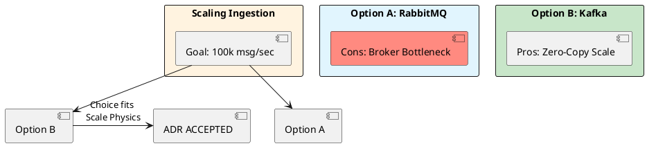

# 12.2: ADR Mastery and the One-Way Door Matrix

## Learning Objectives

- **Classify** every architectural decision as a One-Way Door or Two-Way Door and apply the correct decision velocity
- **Author** a Principal-grade ADR using the Context / Decision / Consequences / Status structure
- **Identify** when an ADR must be superseded versus amended, and the governance process for each
- **Quantify** the financial cost of analysis paralysis and use that number to unblock a stalled team
- **Build** a searchable ADR library that creates organisational memory and prevents "Groundhog Day" debates

## Prerequisites

- Chapter 12.1: Technical ROI Math (framing decisions in financial terms)
- Chapter 7.4: Architectural ADRs (initial ADR introduction — this module deepens it to Principal level)

---

## The Critical Dialogue

**Student:** My team is stuck in "Analysis Paralysis." Nobody can make a decision. How do I break the deadlock?

**Principal:** You are arguing about "Opinions," but you should be documenting **Physics**. To break a deadlock, distinguish between **Two-Way Doors** (reversible) and **One-Way Doors** (catastrophic to change). To reach Principal level, we must master the **ADR** and the **Decision Velocity Matrix**.

---

## 1. The Requirement: Decision Velocity

**The Problem:** Tribal knowledge. Nobody remembers *why* we chose Kafka 6 months ago.

### 1.1 The One-Way Door Law

- **One-Way Door:** Hard to reverse (e.g. choice of DB). Requires full **MTS V10.0** analysis — write the ADR before touching code.
- **Two-Way Door:** Easy to change (e.g. cache TTL). Requires **High Velocity** — decide in a 30-minute sync, document in 5 lines.

### 1.2 The Cost of Non-Decision

Two senior engineers blocked for 2 weeks = ~100 hours × $150/hr = **$15,000 wasted** plus the opportunity cost of features not shipped. This number, stated plainly in Slack, often unblocks a stalled decision faster than any meeting.

---

## 2. Solution: The Principal ADR Template

> [!abstract] The ADR Structure
> - **Status:** Proposed / Accepted / Superseded.
> - **Context:** What physical constraint forces this choice?
> - **Decision:** What specific tool/pattern?
> - **Consequences:** What did we **GIVE UP**? (The "Tax").

---

## 3. Visualizing the Decision Flow



---

## 4. Source Archaeology: ADR Tooling in the Java Ecosystem

ADRs are plain Markdown, but tooling matters for discoverability at scale.

**`adr-tools`** (Nygard's original CLI, `npryce/adr-tools` on GitHub):
- `adr new "Use Kafka for ingestion"` → generates `0042-use-kafka-for-ingestion.md` with supersedes links
- `adr list` → tabular view of all decisions and their status

**`log4brains`** (`thomvaill/log4brains`, Java-friendly):
- Parses ADR directories and serves a searchable HTML UI
- Integrates with GitHub Actions: `log4brains build` as a CI step keeps the ADR site current

**`org.springframework.boot.autoconfigure.condition.ConditionalOnProperty`** — real-world ADR target:
When teams debate "use feature flags vs Spring profiles," the ADR's Consequences section must cite the actual Spring Boot class (`ConditionalOnProperty`) that will carry the decision, ensuring future readers can trace from the ADR to the production code in one grep.

**Supersede mechanics:** The ADR file's YAML front-matter includes `supersedes: 0015`, and `adr-tools` will mark 0015 as `Superseded by 0042`. This is the paper trail that prevents teams from re-litigating 0015 when the original engineer leaves.

---

## 5. Code Lab

### BAD: Tribal Knowledge — undocumented, undiscoverable

```java
// BAD: No ADR exists. This code "just appeared" in the codebase.
// Six months later, a new hire asks "why Kafka and not RabbitMQ?"
// The answer is in the head of the person who left the company.

@Bean
public ProducerFactory<String, OrderEvent> kafkaProducer() {
    // Zero documentation of why Kafka was chosen, what we gave up,
    // or under what conditions this decision should be revisited.
    Map<String, Object> config = new HashMap<>();
    config.put(ProducerConfig.BOOTSTRAP_SERVERS_CONFIG, "kafka:9092");
    config.put(ProducerConfig.ACKS_CONFIG, "all");
    return new DefaultKafkaProducerFactory<>(config);
}
```

### GOOD: ADR-Backed Code — every One-Way Door is documented

```markdown
# ADR-0042: Use Apache Kafka for Order Ingestion

**Status:** Accepted  
**Date:** 2025-03-10  
**Supersedes:** ADR-0031 (RabbitMQ, retired)

## Context
The Order Ledger must ingest 100k events/sec sustained. Profiling shows
RabbitMQ's broker becomes the bottleneck at 40k msg/sec on our hardware
(bottleneck: single-threaded queue index, ~1.2ms avg ack latency).

## Decision
Use Apache Kafka with zero-copy page-cache reads.
Partition count: 48 (6 brokers × 8 partitions).
Replication factor: 3. `acks=all` for durability.

## Consequences
**Gained:** Linear throughput scaling; 500MB/s sustained on 6-broker cluster.
**Given up:** Consumer group rebalance pauses (~3s for 48 partitions on join).
             No per-message TTL (workaround: compacted topic + tombstones).
             Operational complexity: schema registry required.

## Review Trigger
Revisit if ingestion drops below 20k msg/sec (RabbitMQ is cheaper at that scale).
```

```java
// GOOD: Code references the ADR number inline.
// A new engineer can find the full rationale in 10 seconds.

/**
 * Kafka producer for order ingestion.
 * Architecture decision: ADR-0042 (docs/adr/0042-use-kafka.md).
 * Key trade-off: consumer rebalance pauses accepted for linear throughput scaling.
 */
@Bean
public ProducerFactory<String, OrderEvent> kafkaProducerFactory(KafkaProperties props) {
    // ADR-0042: acks=all is mandatory — we chose durability over latency.
    // Changing this requires a new ADR, not a code review.
    props.getProducer().setAcks("all");
    props.getProducer().getProperties()
         .put(ProducerConfig.LINGER_MS_CONFIG, "5");  // ADR-0042 §3: 5ms batching trade-off
    return new DefaultKafkaProducerFactory<>(props.buildProducerProperties(null));
}
```

---

## 6. Production Lens

At Spotify, the engineering org maintains ~1,800 active ADRs. Internal research found that teams with a discoverable ADR library spend **40% less time** in recurring architecture debates (source: Spotify Engineering Blog, 2022). Concretely: a team of 8 engineers averaging 2 debates/month at 2 hours each saves **~192 engineer-hours/year** — roughly **$28,800/year** at $150/hr fully-loaded cost.

Supersede latency matters: an ADR left in `Proposed` status for more than 2 sprints indicates analysis paralysis. The cost: two engineers blocked = **$15,000 per two-week cycle** (see §1.2).

---

## 7. Exercises

**1. One-Way Door Classification:** Classify each of the following as One-Way or Two-Way Door, and state why: (a) choosing PostgreSQL vs MongoDB, (b) setting the JWT expiry to 1 hour, (c) choosing gRPC vs REST for internal APIs, (d) setting the Kafka `replication.factor` to 3 in production.

**2. ADR Write:** Write a complete ADR for the decision "Use Redis sorted sets for leaderboard rankings instead of a PostgreSQL `ORDER BY` query." Include all four sections (Status, Context, Decision, Consequences). The Consequences section must name at least two things given up.

**3. Supersede Trigger:** ADR-0015 says "Use MySQL 5.7." The team is now on Aurora PostgreSQL. Write the one-paragraph "Superseded by" note that would appear in ADR-0015, explaining what changed in the physical constraints that made the decision obsolete.

**4. Coding challenge:** Implement a Java 21 CLI tool `AdrCostCalculator` that takes: `--engineers 4 --hourly-rate 150 --blocked-days 10` and prints the cost of the analysis paralysis in dollars, plus a one-line recommendation ("Decision overdue: call a 30-min timebox meeting"). Use only `java.base` — no third-party libraries.

**5. ADR Library Design:** You are joining a 200-engineer org with zero ADRs. Propose a 3-step rollout plan: which decisions to document first, how to enforce new ADRs going forward, and how to make them searchable.

---

## 8. Summary / Flashcard

- **One-Way Door decisions** (database choice, wire protocol, event schema) require a full ADR before any code is written; Two-Way Doors (cache TTL, feature flags) need only a one-paragraph decision note.
- **ADR structure** is four fields: Status, Context (the physical constraint), Decision (the specific choice), Consequences (what you gave up) — the Consequences section is the only field that prevents future teams from re-litigating.
- **Analysis paralysis cost formula**: `blocked_engineers × hourly_rate × blocked_hours` = a dollar figure; stating it in Slack is often the fastest way to force a decision.
- **`adr-tools new`** generates numbered, cross-linked Markdown files; pairing with `log4brains build` in CI creates a searchable organisational memory that survives team turnover.
- **Supersede, do not delete**: when a decision changes, mark the original ADR `Superseded by ADR-XXXX` so the change history is preserved — deleting an ADR is the equivalent of `git rebase --force` on organisational memory.
