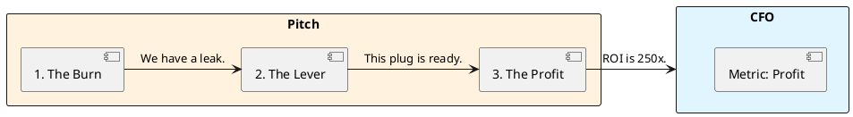

# 12.3: Boardroom Negotiation and the Strategic Pitch

## The Critical Dialogue

**Student:** I need to refactor our persistence to use the Panama API. I know it will improve throughput by 400%, but the PM says "No, we need the new UI dashboard first." How do I compete with a "Shiny Feature"?

**Principal:** You're bringing a knife to a gunfight. The PM speaks User Retention; you speak Java. To win, you must become a **Strategic Partner**. We must master the **Boardroom Negotiation**. We will analyze how to translate "Off-Heap Memory" into **Profit Margins**.

---

## 1. The Requirement: Strategic Alignment

**The Problem:** The "Engine Room Gap." Executives care about:
. **Revenue:** Money coming in.
. **COGS:** Cloud bill.
. **Risk:** Outage probability.

---

## 2. Solution: The 3-Step Pitch

. **1. The Burn:** Quantify the pain. "Our GC pauses cause a 5% drop in transaction completion ($2M/year loss)."
. **2. The Lever:** Explain the fix as a physical lever that multiplies revenue.
. **3. The Profit:** Show final ROI.

---

## 🧠 Principal's Inquiry

. **Influencing without Authority:** How do you convince a team that doesn't report to you to adopt your standards?

. **The "No" ROI:** What is the financial cost of NOT doing a refactor for 3 years? (Hint: The **Compound Complexity** tax).

**Principal Summary:** Leadership is about **Speaking the Language of Power**. We use Technical ROI to transform our role from "Cost Center" to **Revenue Multiplier**.
 Greenlanders use the type system to prove our software invariants.
