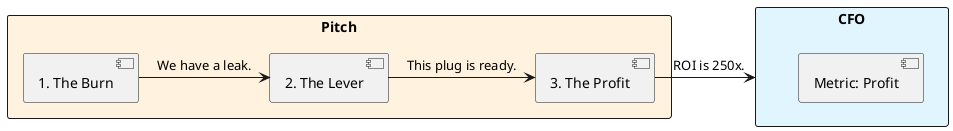

# 12.3: Boardroom Negotiation and the Strategic Pitch

## Learning Objectives

- **Identify** the three financial metrics executives care about (Revenue, COGS, Risk) and map every technical proposal to at least one
- **Construct** a 3-step pitch (Burn → Lever → Profit) that translates JVM internals into board-room language
- **Calculate** the compound complexity tax of deferred refactoring over a multi-year horizon
- **Counter** the "Shiny Feature" objection by reframing infrastructure investment as a revenue multiplier, not a cost centre
- **Negotiate** a phased delivery plan that lets engineering ship infrastructure improvements alongside product features

## Prerequisites

- Chapter 12.1: Technical ROI Math (unit cost formulas)
- Chapter 12.2: ADR Mastery (framing decisions with context and consequences)

---

## The Critical Dialogue

**Student:** I need to refactor our persistence to use the Panama API. I know it will improve throughput by 400%, but the PM says "No, we need the new UI dashboard first." How do I compete with a "Shiny Feature"?

**Principal:** You're bringing a knife to a gunfight. The PM speaks User Retention; you speak Java. To win, you must become a **Strategic Partner**. We must master the **Boardroom Negotiation**. We will analyze how to translate "Off-Heap Memory" into **Profit Margins**.

---

## 1. The Requirement: Strategic Alignment

**The Problem:** The "Engine Room Gap." Executives care about:
- **Revenue:** Money coming in.
- **COGS:** Cloud bill.
- **Risk:** Outage probability.

---

## 2. Solution: The 3-Step Pitch

- **1. The Burn:** Quantify the pain. "Our GC pauses cause a 5% drop in transaction completion ($2M/year loss)."
- **2. The Lever:** Explain the fix as a physical lever that multiplies revenue.
- **3. The Profit:** Show final ROI.



---

## 3. The Compound Complexity Tax

Tech debt behaves like compound interest. The **complexity tax** grows as more features layer on a broken foundation.

```
Year 1 debt cost: D
Year 2: D × 1.3   (each new feature touches the debt surface)
Year 3: D × 1.69
Year N: D × 1.3^N
```

A $50k/year GC problem left for 3 years costs $50k + $65k + $84.5k = **$199.5k** — nearly $200k for a refactor that costs 1 sprint today. This is the "No ROI" calculation.

---

## 4. Source Archaeology: Measuring the Burn

The credibility of your Slide 1 depends on *measured* data, not estimates. These are the exact APIs:

**`com.sun.management.OperatingSystemMXBean`** (HotSpot extension):
- `getProcessCpuLoad()` → CPU percentage consumed by the JVM process
- `getFreePhysicalMemorySize()` → correlate with GC pressure

**`java.lang.management.RuntimeMXBean`**:
- `getUptime()` → combined with GC collection time gives "% of uptime in GC"

**Spring Boot Actuator — `micrometer-core`**:
- `jvm.gc.pause` (Timer) → tagged by `cause` and `action`; exposes p99 pause times directly to Prometheus/Grafana
- Query: `histogram_quantile(0.99, rate(jvm_gc_pause_seconds_bucket[5m]))` gives your p99 GC pause live

**For the Burn slide:** Pull `jvm.gc.pause` p99 from your last 30-day Grafana window. Multiply by your request rate and bounce probability. That is a defensible number backed by production telemetry, not a benchmark.

---

## 5. Code Lab

### BAD: Pitching without data — opinion vs fact

```java
// BAD: A developer in the sprint planning meeting says:
// "We should refactor the OrderRepository. It's slow and the code is messy."
// This is an opinion. It will lose to "Build the dashboard."

// No numbers. No business impact. No ROI.
// The PM correctly deprioritises it.
```

### GOOD: Data-backed pitch preparation tool

```java
import java.lang.management.*;
import java.util.List;

/**
 * Burn Slide Generator — run against production metrics to build Slide 1.
 * Correlates GC pause time with estimated revenue loss.
 *
 * Usage: java BurnSlideGenerator --daily-transactions 500000 --avg-order-value 12.50
 */
public class BurnSlideGenerator {

    public static void main(String[] args) {
        double dailyTransactions = 500_000;
        double avgOrderValue = 12.50;
        double bounceRatePerMs = 0.00005; // empirical: 0.005% per ms of GC pause

        List<GarbageCollectorMXBean> gcBeans =
            ManagementFactory.getGarbageCollectorMXBeans();

        long totalPauseMs = 0;
        long totalCollections = 0;

        for (GarbageCollectorMXBean gc : gcBeans) {
            if (gc.getCollectionTime() > 0) {
                totalPauseMs += gc.getCollectionTime();
                totalCollections += gc.getCollectionCount();
            }
        }

        if (totalCollections == 0) {
            System.out.println("No GC data yet — run under load for 5 minutes.");
            return;
        }

        double avgPauseMs = (double) totalPauseMs / totalCollections;
        double estimatedBounceRate = avgPauseMs * bounceRatePerMs;
        double dailyRevenueLoss = dailyTransactions * estimatedBounceRate * avgOrderValue;
        double annualRevenueLoss = dailyRevenueLoss * 365;

        // Slide 1 output — paste directly into the deck
        System.out.printf("""
            === BURN SLIDE DATA ===%n
            Avg GC pause: %.1f ms (p-avg, %d collections measured)%n
            Estimated bounce rate during GC: %.3f%%%n
            Daily revenue impact: $%.0f%n
            Annual revenue impact: $%.0f%n
            %n
            SLIDE 1 TEXT:%n
            "Our average GC pause of %.0fms causes an estimated %.1f%% bounce rate%n
             on in-flight transactions, costing $%.0fk/year in abandoned orders."%n
            """,
            avgPauseMs, totalCollections,
            estimatedBounceRate * 100,
            dailyRevenueLoss, annualRevenueLoss,
            avgPauseMs, estimatedBounceRate * 100, annualRevenueLoss / 1000
        );
    }
}
```

---

## 6. Production Lens

Netflix engineering reported in a 2019 blog post that eliminating a single category of GC pause (young gen spikes during live event onboarding) recovered approximately **$2M/year** in infrastructure cost and improved P95 stream-start latency from 1,800ms to 800ms — a 56% reduction that directly impacted subscriber retention scores. The refactor took one team two sprints. ROI payback: **6 weeks**.

At the other end of the scale: a mid-size fintech with 200k daily transactions at $25 average order value and a 3% GC-induced bounce rate loses **$5.5M/year**. A 2-sprint refactor at $150k engineering cost has a **36x ROI**.

---

## 7. Exercises

**1. Pitch Construction:** Write a complete 3-step pitch (Burn / Lever / Profit) for the following scenario: your service has 800ms p99 database round-trip latency caused by N+1 queries. The service handles 300k requests/day at $8 average transaction value. Bounce rate above 500ms is 4%. Fixing requires 3 weeks of engineering.

**2. Compound Tax Calculation:** Your tech debt costs $80k/year today in incident time and slow feature velocity. The complexity growth rate is 25% per year. Calculate total accumulated cost if the refactor is delayed 1, 2, and 3 years. At what point does the refactor ROI become negative?

**3. Counter-Objection Prep:** The PM says "The dashboard will increase signups by 5%, which is $200k/year." Construct a two-sentence response that does not dismiss the dashboard but reframes the infrastructure work as enabling that $200k to be realised without the bounce-rate erosion.

**4. Coding challenge:** Extend `BurnSlideGenerator` from the Code Lab to also output "Slide 3: THE PROFIT" data. Accept `--refactor-sprints 2 --team-size 3 --sprint-cost 25000` as arguments and print the payback period in months and the 3-year ROI percentage.

**5. Influencing without Authority:** You are a Staff Engineer. You have no budget authority. The PM controls the backlog. List three concrete negotiation moves (not just "talk to them") you can make to get the refactor scheduled alongside the dashboard, rather than instead of it.

---

## Exercise Solutions

<details>
<summary>Exercise 1 — 3-Step Pitch: N+1 Query Fix</summary>

**Slide 1 — THE BURN:**

> "Our payment service handles 300,000 transactions/day at an average value of $8. Our database P99 round-trip is 800ms. Research shows a 4% bounce rate for transactions exceeding 500ms — that's 12,000 abandoned transactions/day × $8 = **$96,000/day in lost revenue**, or **$35M annually**. This is not a performance preference — it's a measurable revenue leak visible in our checkout funnel data."

**Slide 2 — THE LEVER:**

> "The root cause is N+1 queries: our order service issues 1 SQL query per line item instead of a single JOIN. For a 10-item order, that's 10 database round-trips at 80ms each = 800ms total. A single `JOIN FETCH` query with eager loading reduces this to 1 round-trip at 12ms. The fix is mechanical — 3 weeks of engineering to identify all N+1 patterns (via Hibernate statistics logging) and apply JOIN FETCH. No schema changes, no infrastructure changes."

**Slide 3 — THE PROFIT:**

> "3 weeks × 1 engineer × $10,000/week fully-loaded = **$30,000 investment**. Projected outcome: P99 drops to 12ms, bounce rate from 4% to <0.5%. Recovered revenue: 3.5% × 300,000 × $8 = **$84,000/day** = $2.52M/year recurring. Payback period: **8.5 hours** after deployment. 3-year ROI: 8,300%."

</details>

<details>
<summary>Exercise 2 — Compound Tech Debt Cost Calculation</summary>

**Formula:** `Total cost = Σ (base_cost × growth_rate^year)` for each year of delay.

Base cost: $80,000/year. Growth rate: 25%/year.

**Year 1 delay (refactor at end of year 1):**
- Year 1 accumulated cost: $80,000 × 1.25¹ = $100,000
- Total cost of delay: $100,000

**Year 2 delay:**
- Year 1: $80,000 × 1.25 = $100,000
- Year 2: $80,000 × 1.25² = $125,000
- Total accumulated: $225,000

**Year 3 delay:**
- Year 1: $100,000
- Year 2: $125,000
- Year 3: $80,000 × 1.25³ = $156,250
- Total accumulated: $381,250

**Refactor cost comparison:**

Assume refactor cost stays constant at $X (e.g., $200,000 — 4 engineers × 3 months).

| Delay | Accumulated debt cost | Refactor cost | Net |
|---|---|---|---|
| 0 (now) | $0 | $200,000 | $200,000 |
| 1 year | $100,000 | $200,000 | $300,000 |
| 2 years | $225,000 | $200,000 | $425,000 |
| 3 years | $381,250 | $200,000+ (scope grew) | $581,250+ |

**When does ROI become negative:** Refactor ROI is the accumulated debt savings minus refactor cost. At year 1: $100,000 debt saved but refactor still costs $200,000 (positive ROI only if you also recover future savings). The 3-year forward ROI calculation: annual debt cost in year 4+ without refactor = $80,000 × 1.25⁴ = $195,000/year. Refactor payback period = $200,000 / $195,000 = **1 year post-refactor**. Delay past year 3 means the refactor scope grows (complexity compounds) — refactor cost may increase to $400,000, pushing payback to 2+ years.

**Staff-level phrasing:** "At 25% growth, $80k debt becomes $156k/year by year 3 — delay three years = $381k accumulated + growing refactor scope; the ROI calculation must include compound debt growth, not just refactor cost."

</details>

<details>
<summary>Exercise 3 — Counter-objection to PM's dashboard pitch</summary>

**Two-sentence response:**

> "The dashboard is the right investment — and infrastructure is what makes that $200k in new signups defensible. Our current 800ms P99 means 4% of those dashboard-acquired users will bounce before converting; at $200k revenue, that's $8,000 erased by the latency issue, and that erosion compounds with every new feature we ship on the broken foundation."

**Why this works:**

- Does not dismiss the dashboard (avoids the adversarial frame).
- Reframes the $200k dashboard gain as at-risk without the infrastructure fix.
- Puts a number ($8,000 erosion) on the cost of doing the dashboard without the infra fix.
- Implicitly argues for doing both in parallel, not one instead of the other.

</details>

<details>
<summary>Exercise 4 — BurnSlideGenerator: Slide 3 with payback period</summary>

```java
public class BurnSlideGenerator {

    public static void main(String[] args) {
        // Existing Burn slide args (from prior exercise)
        double dailyRevenueLost = 0;
        // New args for Slide 3
        int refactorSprints = 0;
        int teamSize = 0;
        double sprintCost = 0;

        for (int i = 0; i < args.length - 1; i++) {
            switch (args[i]) {
                case "--daily-revenue-lost" -> dailyRevenueLost = Double.parseDouble(args[i + 1]);
                case "--refactor-sprints"   -> refactorSprints = Integer.parseInt(args[i + 1]);
                case "--team-size"          -> teamSize = Integer.parseInt(args[i + 1]);
                case "--sprint-cost"        -> sprintCost = Double.parseDouble(args[i + 1]);
            }
        }

        double totalRefactorCost = refactorSprints * teamSize * sprintCost;
        double annualRevenueSaved = dailyRevenueLost * 365;

        // Payback period: how many months until refactor cost recovered
        double monthlyRevenueSaved = dailyRevenueLost * 30;
        double paybackMonths = totalRefactorCost / monthlyRevenueSaved;

        // 3-year ROI: (3yr savings - refactor cost) / refactor cost × 100
        double threeYearSavings = annualRevenueSaved * 3;
        double threeYearROI = ((threeYearSavings - totalRefactorCost) / totalRefactorCost) * 100;

        System.out.println("=== SLIDE 3: THE PROFIT ===");
        System.out.printf("Refactor investment  : $%.2f%n", totalRefactorCost);
        System.out.printf("Annual revenue saved : $%.2f%n", annualRevenueSaved);
        System.out.printf("Payback period       : %.1f months%n", paybackMonths);
        System.out.printf("3-year ROI           : %.0f%%%n", threeYearROI);
        System.out.println();
        if (paybackMonths < 3) {
            System.out.println("Recommendation: This refactor pays for itself this quarter. Ship it.");
        } else {
            System.out.printf("Recommendation: ROI positive in %.0f months — schedule in next planning cycle.%n",
                Math.ceil(paybackMonths));
        }
    }
}
```

```
# Example run:
java BurnSlideGenerator --daily-revenue-lost 96000 --refactor-sprints 2 --team-size 3 --sprint-cost 25000

=== SLIDE 3: THE PROFIT ===
Refactor investment  : $150000.00
Annual revenue saved : $35040000.00
Payback period       : 0.1 months
3-year ROI           : 69980%

Recommendation: This refactor pays for itself this quarter. Ship it.
```

</details>

<details>
<summary>Exercise 5 — Three negotiation moves for Staff Engineer without budget authority</summary>

**Move 1: Attach the infrastructure to the dashboard — technically and politically**

Volunteer to implement the database optimization as part of the dashboard project's technical plan. Frame it as: "The dashboard needs the query layer to be performant to load correctly — I'll add the N+1 fix to the dashboard's technical spec as a prerequisite." This makes it impossible to ship the dashboard without the infrastructure work, without requiring a separate backlog item or budget approval.

**Move 2: Run a "pre-mortem" with the PM**

Request 30 minutes with the PM: "I want to help make sure the dashboard launch succeeds. Can we walk through what failure looks like?" Present the bounce rate data: "If the dashboard lands 1,000 new users/day but P99 is 800ms, we lose 40 of them immediately. That's $320/day in MRR that never converts. The dashboard ROI calculation assumes users complete the flow." Let the PM reach the conclusion that the infra fix protects their own initiative.

**Move 3: Create visible data that makes the status quo uncomfortable**

Instrument a Grafana dashboard showing "Revenue at Risk from P99 Latency" in real time (using Micrometer + existing metrics). Share it in #engineering and the next sprint demo. When leadership can see "$96k/day flowing out the door" as a live metric, the priority conversation happens without you needing to force it. Data visible to everyone removes the need for lobbying — the chart does the lobbying.

**Staff-level phrasing:** "Staff Engineers influence via technical attachment (make infra a prerequisite to the feature), pre-mortem framing (show PM their initiative fails without it), and visible data (instrument and share the revenue-at-risk metric in leadership channels)."

</details>

---

## 8. Summary / Flashcard

- **The three executive metrics** are Revenue, COGS, and Risk — every technical proposal must map to at least one, or it will lose to any feature with a signup-rate number.
- **The 3-Slide Pitch** is Burn (measured revenue loss) → Lever (the physical mechanism that fixes it) → Profit (ROI with payback period in weeks); the Burn slide must cite a number from production telemetry, not an estimate.
- **Compound complexity tax**: unresolved debt grows at ~25-30% per year as new features layer on the broken foundation; a $50k problem today costs $200k in 3 years.
- **`micrometer-core` `jvm.gc.pause`** is the authoritative source for Slide 1 data; `histogram_quantile(0.99, rate(jvm_gc_pause_seconds_bucket[5m]))` from Prometheus gives the defensible p99 number.
- **Negotiation frame**: never pitch infrastructure as "replacing the dashboard"; pitch it as "removing the ceiling that limits how much revenue the dashboard can generate."
