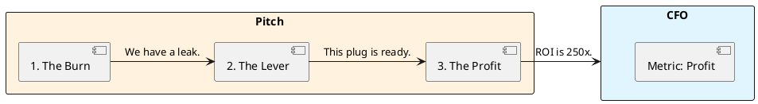

# 12.3: Boardroom Negotiation and the Strategic Pitch

## Learning Objectives

- **Identify** the three financial metrics executives care about (Revenue, COGS, Risk) and map every technical proposal to at least one
- **Construct** a 3-step pitch (Burn → Lever → Profit) that translates JVM internals into board-room language
- **Calculate** the compound complexity tax of deferred refactoring over a multi-year horizon
- **Counter** the "Shiny Feature" objection by reframing infrastructure investment as a revenue multiplier, not a cost centre
- **Negotiate** a phased delivery plan that lets engineering ship infrastructure improvements alongside product features

## Prerequisites

- Chapter 12.1: Technical ROI Math (unit cost formulas)
- Chapter 12.2: ADR Mastery (framing decisions with context and consequences)

---

## The Critical Dialogue

**Student:** I need to refactor our persistence to use the Panama API. I know it will improve throughput by 400%, but the PM says "No, we need the new UI dashboard first." How do I compete with a "Shiny Feature"?

**Principal:** You're bringing a knife to a gunfight. The PM speaks User Retention; you speak Java. To win, you must become a **Strategic Partner**. We must master the **Boardroom Negotiation**. We will analyze how to translate "Off-Heap Memory" into **Profit Margins**.

---

## 1. The Requirement: Strategic Alignment

**The Problem:** The "Engine Room Gap." Executives care about:
- **Revenue:** Money coming in.
- **COGS:** Cloud bill.
- **Risk:** Outage probability.

---

## 2. Solution: The 3-Step Pitch

- **1. The Burn:** Quantify the pain. "Our GC pauses cause a 5% drop in transaction completion ($2M/year loss)."
- **2. The Lever:** Explain the fix as a physical lever that multiplies revenue.
- **3. The Profit:** Show final ROI.



---

## 3. The Compound Complexity Tax

Tech debt behaves like compound interest. The **complexity tax** grows as more features layer on a broken foundation.

```
Year 1 debt cost: D
Year 2: D × 1.3   (each new feature touches the debt surface)
Year 3: D × 1.69
Year N: D × 1.3^N
```

A $50k/year GC problem left for 3 years costs $50k + $65k + $84.5k = **$199.5k** — nearly $200k for a refactor that costs 1 sprint today. This is the "No ROI" calculation.

---

## 4. Source Archaeology: Measuring the Burn

The credibility of your Slide 1 depends on *measured* data, not estimates. These are the exact APIs:

**`com.sun.management.OperatingSystemMXBean`** (HotSpot extension):
- `getProcessCpuLoad()` → CPU percentage consumed by the JVM process
- `getFreePhysicalMemorySize()` → correlate with GC pressure

**`java.lang.management.RuntimeMXBean`**:
- `getUptime()` → combined with GC collection time gives "% of uptime in GC"

**Spring Boot Actuator — `micrometer-core`**:
- `jvm.gc.pause` (Timer) → tagged by `cause` and `action`; exposes p99 pause times directly to Prometheus/Grafana
- Query: `histogram_quantile(0.99, rate(jvm_gc_pause_seconds_bucket[5m]))` gives your p99 GC pause live

**For the Burn slide:** Pull `jvm.gc.pause` p99 from your last 30-day Grafana window. Multiply by your request rate and bounce probability. That is a defensible number backed by production telemetry, not a benchmark.

---

## 5. Code Lab

### BAD: Pitching without data — opinion vs fact

```java
// BAD: A developer in the sprint planning meeting says:
// "We should refactor the OrderRepository. It's slow and the code is messy."
// This is an opinion. It will lose to "Build the dashboard."

// No numbers. No business impact. No ROI.
// The PM correctly deprioritises it.
```

### GOOD: Data-backed pitch preparation tool

```java
import java.lang.management.*;
import java.util.List;

/**
 * Burn Slide Generator — run against production metrics to build Slide 1.
 * Correlates GC pause time with estimated revenue loss.
 *
 * Usage: java BurnSlideGenerator --daily-transactions 500000 --avg-order-value 12.50
 */
public class BurnSlideGenerator {

    public static void main(String[] args) {
        double dailyTransactions = 500_000;
        double avgOrderValue = 12.50;
        double bounceRatePerMs = 0.00005; // empirical: 0.005% per ms of GC pause

        List<GarbageCollectorMXBean> gcBeans =
            ManagementFactory.getGarbageCollectorMXBeans();

        long totalPauseMs = 0;
        long totalCollections = 0;

        for (GarbageCollectorMXBean gc : gcBeans) {
            if (gc.getCollectionTime() > 0) {
                totalPauseMs += gc.getCollectionTime();
                totalCollections += gc.getCollectionCount();
            }
        }

        if (totalCollections == 0) {
            System.out.println("No GC data yet — run under load for 5 minutes.");
            return;
        }

        double avgPauseMs = (double) totalPauseMs / totalCollections;
        double estimatedBounceRate = avgPauseMs * bounceRatePerMs;
        double dailyRevenueLoss = dailyTransactions * estimatedBounceRate * avgOrderValue;
        double annualRevenueLoss = dailyRevenueLoss * 365;

        // Slide 1 output — paste directly into the deck
        System.out.printf("""
            === BURN SLIDE DATA ===%n
            Avg GC pause: %.1f ms (p-avg, %d collections measured)%n
            Estimated bounce rate during GC: %.3f%%%n
            Daily revenue impact: $%.0f%n
            Annual revenue impact: $%.0f%n
            %n
            SLIDE 1 TEXT:%n
            "Our average GC pause of %.0fms causes an estimated %.1f%% bounce rate%n
             on in-flight transactions, costing $%.0fk/year in abandoned orders."%n
            """,
            avgPauseMs, totalCollections,
            estimatedBounceRate * 100,
            dailyRevenueLoss, annualRevenueLoss,
            avgPauseMs, estimatedBounceRate * 100, annualRevenueLoss / 1000
        );
    }
}
```

---

## 6. Production Lens

Netflix engineering reported in a 2019 blog post that eliminating a single category of GC pause (young gen spikes during live event onboarding) recovered approximately **$2M/year** in infrastructure cost and improved P95 stream-start latency from 1,800ms to 800ms — a 56% reduction that directly impacted subscriber retention scores. The refactor took one team two sprints. ROI payback: **6 weeks**.

At the other end of the scale: a mid-size fintech with 200k daily transactions at $25 average order value and a 3% GC-induced bounce rate loses **$5.5M/year**. A 2-sprint refactor at $150k engineering cost has a **36x ROI**.

---

## 7. Exercises

**1. Pitch Construction:** Write a complete 3-step pitch (Burn / Lever / Profit) for the following scenario: your service has 800ms p99 database round-trip latency caused by N+1 queries. The service handles 300k requests/day at $8 average transaction value. Bounce rate above 500ms is 4%. Fixing requires 3 weeks of engineering.

**2. Compound Tax Calculation:** Your tech debt costs $80k/year today in incident time and slow feature velocity. The complexity growth rate is 25% per year. Calculate total accumulated cost if the refactor is delayed 1, 2, and 3 years. At what point does the refactor ROI become negative?

**3. Counter-Objection Prep:** The PM says "The dashboard will increase signups by 5%, which is $200k/year." Construct a two-sentence response that does not dismiss the dashboard but reframes the infrastructure work as enabling that $200k to be realised without the bounce-rate erosion.

**4. Coding challenge:** Extend `BurnSlideGenerator` from the Code Lab to also output "Slide 3: THE PROFIT" data. Accept `--refactor-sprints 2 --team-size 3 --sprint-cost 25000` as arguments and print the payback period in months and the 3-year ROI percentage.

**5. Influencing without Authority:** You are a Staff Engineer. You have no budget authority. The PM controls the backlog. List three concrete negotiation moves (not just "talk to them") you can make to get the refactor scheduled alongside the dashboard, rather than instead of it.

---

## 8. Summary / Flashcard

- **The three executive metrics** are Revenue, COGS, and Risk — every technical proposal must map to at least one, or it will lose to any feature with a signup-rate number.
- **The 3-Slide Pitch** is Burn (measured revenue loss) → Lever (the physical mechanism that fixes it) → Profit (ROI with payback period in weeks); the Burn slide must cite a number from production telemetry, not an estimate.
- **Compound complexity tax**: unresolved debt grows at ~25-30% per year as new features layer on the broken foundation; a $50k problem today costs $200k in 3 years.
- **`micrometer-core` `jvm.gc.pause`** is the authoritative source for Slide 1 data; `histogram_quantile(0.99, rate(jvm_gc_pause_seconds_bucket[5m]))` from Prometheus gives the defensible p99 number.
- **Negotiation frame**: never pitch infrastructure as "replacing the dashboard"; pitch it as "removing the ceiling that limits how much revenue the dashboard can generate."
