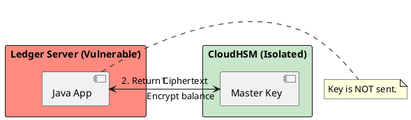

# 13.4: Hardware Security: HSM, TPM, and Field-Level Encryption


## The Critical Dialogue


**Student:** What if someone gets "Root Access" to our server? They can just read the encryption key from my process RAM. 


**Principal:** You've reached the **Boundary of Software Security**. In a purely software world, "Root" is God. If the OS is compromised, your RAM is an open book. To reach Principal level, we must move the most sensitive keys into an **HSM (Hardware Security Module)** or a **TPM**. We move from "Software Encryption" to **Silicon-Isolated Vaults**.


---


## 1. The Physics of the "Cold Boot" Attack


. **The Problem:** When you store a symmetric key in a Java `SecretKey` object, it sits in clear-text in the JVM's heap.
. **The Attack:** A malicious admin can perform a "Heap Dump" to read the bits. 
. **The Fix:** Never let the "Master Key" touch the RAM. Use hardware that performs math *inside the chip*.


---


## 2. Solution: The HSM (Hardware Security Module)


**The Principal Architecture:** A physical appliance that generates and stores keys.


. **The Rule:** The "Private Key" can NEVER exit the HSM.
. **The Flow:** Java sends the `byte[]` -> HSM encrypts -> HSM returns ciphertext.
. **The Result:** Even if the server is hacked, the attacker cannot steal the keys. 





---


## 3. Principal Implementation: Field-Level Encryption (FLE)


```java
// Principal Level: Hardware-Backed Field Encryption
public class SecureOrder {
    private String cipherText;

    public void setAmount(BigDecimal amt, HSMClient hsm) {
        // Math happens inside the silicon
        this.cipherText = hsm.encrypt(amt.toString());
    }
}
```


---


## 🧠 Principal's Inquiry


. **PKCS#11:** Why is this the standard language for talking to HSMs?


. **Latency Tax:** Physical HSMs add **~50ms** of network latency. How does this impact your trading engine? (Hint: The **Envelope Encryption** pattern).


**Principal Summary:** Hardware Security is about **Silicon-Level Isolation**. We use HSMs to ensure data is only ever "Clear" inside hardware we trust.
 Greenlanders use the type system to prove our software invariants.
