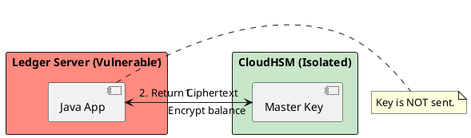

# 13.4: Hardware Security: HSM, TPM, and Field-Level Encryption

## Learning Objectives

- **Explain** why software-only encryption is vulnerable to cold-boot and heap-dump attacks, and how HSM/TPM mitigates this
- **Implement** field-level encryption using the Envelope Encryption pattern to decouple HSM latency from request latency
- **Describe** the PKCS#11 standard and how Java's `SunPKCS11` provider bridges JCA to physical hardware
- **Calculate** the latency budget impact of an HSM (~50ms per operation) and design a caching strategy that absorbs it
- **Compare** AWS CloudHSM, AWS KMS, and a local TPM across cost, latency, and threat model dimensions

## Prerequisites

- Chapter 13.1: JWT Physics and Zero-Trust (public-key cryptography fundamentals)
- Chapter 13.3: Secrets and Entropy Tax (key lifecycle and exposure window concepts)

---

## The Critical Dialogue

**Student:** What if someone gets "Root Access" to our server? They can just read the encryption key from my process RAM.

**Principal:** You've reached the **Boundary of Software Security**. In a purely software world, "Root" is God. If the OS is compromised, your RAM is an open book. To reach Principal level, we must move the most sensitive keys into an **HSM (Hardware Security Module)** or a **TPM**. We move from "Software Encryption" to **Silicon-Isolated Vaults**.

---

## 1. The Physics of the "Cold Boot" Attack

- **The Problem:** When you store a symmetric key in a Java `SecretKey` object, it sits in clear-text in the JVM's heap.
- **The Attack:** A malicious admin can perform a `jmap -dump:format=b,file=heap.hprof <pid>` to read the bytes. DRAM retains data for 2-30 seconds after power loss (cold boot attack), allowing a physical attacker to freeze RAM and extract keys.
- **The Fix:** Never let the "Master Key" touch the RAM. Use hardware that performs math *inside the chip*.

---

## 2. Solution: The HSM (Hardware Security Module)

**The Principal Architecture:** A physical appliance that generates and stores keys.

- **The Rule:** The "Private Key" can NEVER exit the HSM.
- **The Flow:** Java sends the `byte[]` → HSM encrypts → HSM returns ciphertext.
- **The Result:** Even if the server is hacked, the attacker cannot steal the keys.



---

## 3. Source Archaeology: PKCS#11 and JCA Integration

**PKCS#11** is the standard API for communicating with HSMs and smart cards. Java integrates via the `SunPKCS11` provider.

**`sun.security.pkcs11.SunPKCS11`** (JDK, `java.security` package):
- Configured via a PKCS#11 configuration file pointing to the HSM's native shared library (e.g. `/opt/cloudhsm/lib/libcloudhsm_pkcs11.so`)
- `Security.addProvider(new SunPKCS11(configPath))` — registers the HSM as a JCA provider
- After registration: `KeyStore.getInstance("PKCS11")` returns a `KeyStore` backed by the physical HSM
- `Cipher.getInstance("AES/GCM/NoPadding", "SunPKCS11-CloudHSM")` → all crypto math runs inside the HSM silicon

**`javax.crypto.Cipher`** with HSM provider:
- `cipher.init(Cipher.ENCRYPT_MODE, hsmKey)` — `hsmKey` is a handle reference, not a copy of the key bytes; the key never leaves the HSM
- `cipher.doFinal(plaintext)` — sends plaintext to HSM over PKCS#11 channel; returns ciphertext to JVM

**AWS KMS Java SDK (`software.amazon.awssdk:kms`):**
- `KmsClient.create()` → regional KMS endpoint (AWS manages HSM cluster under the hood)
- `GenerateDataKeyRequest.builder().keyId(cmkArn).keySpec(DataKeySpec.AES_256).build()`
- Returns `GenerateDataKeyResponse` with `plaintextDataKey()` (32-byte AES key, use once, then discard from memory) and `ciphertextBlob()` (encrypted form of data key — safe to store)

**Envelope Encryption pattern — the key insight:**
The CMK (Customer Master Key) lives in the HSM and never leaves. A fresh Data Encryption Key (DEK) is generated per-record. The DEK encrypts the record locally (~0.001ms). The CMK encrypts the DEK (~50ms HSM round-trip). Store the encrypted DEK alongside the record. Decryption: send encrypted DEK to HSM (~50ms), receive plaintext DEK, decrypt record locally (~0.001ms). **HSM latency is paid once per session or per batch, not per record.**

---

## 4. Principal Implementation: Field-Level Encryption (FLE)

```java
// Principal Level: Hardware-Backed Field Encryption
public class SecureOrder {
    private String cipherText;

    public void setAmount(BigDecimal amt, HSMClient hsm) {
        // Math happens inside the silicon
        this.cipherText = hsm.encrypt(amt.toString());
    }
}
```

---

## 5. Code Lab: Envelope Encryption with AWS KMS

### BAD: Software-only encryption — key in JVM heap

```java
// BAD: AES key lives in JVM heap as a SecretKey object.
// A heap dump reveals: javax.crypto.spec.SecretKeySpec with raw key bytes.
// Root access = key theft = permanent decryption of all historical data.

import javax.crypto.*;
import javax.crypto.spec.*;

public class InsecureFieldEncryption {
    // BAD: Key is generated in RAM, lives in RAM, dies in RAM.
    // A JVM heap dump at any point exposes this key.
    private static final SecretKey MASTER_KEY;
    static {
        try {
            KeyGenerator kg = KeyGenerator.getInstance("AES");
            kg.init(256);
            MASTER_KEY = kg.generateKey();  // lives in heap clear-text
        } catch (Exception e) { throw new ExceptionInInitializerError(e); }
    }

    public byte[] encryptBalance(BigDecimal balance) throws Exception {
        Cipher c = Cipher.getInstance("AES/GCM/NoPadding");
        c.init(Cipher.ENCRYPT_MODE, MASTER_KEY);  // key exposed to attacker with heap dump
        return c.doFinal(balance.toString().getBytes());
    }
}
```

### GOOD: Envelope Encryption with AWS KMS — CMK never leaves HSM

```java
import software.amazon.awssdk.core.SdkBytes;
import software.amazon.awssdk.services.kms.*;
import software.amazon.awssdk.services.kms.model.*;
import javax.crypto.*;
import javax.crypto.spec.*;
import java.security.SecureRandom;

/**
 * Field-Level Encryption using Envelope Encryption pattern.
 *
 * Security properties:
 * - CMK never leaves AWS KMS / CloudHSM (FIPS 140-2 Level 3)
 * - Fresh DEK per record (compromise of one DEK exposes only one record)
 * - HSM latency (~50ms) paid once per DEK generation, not per field operation
 * - DEK cached in memory for the session duration (trade-off: see note below)
 */
public class EnvelopeEncryptedOrderStore {

    private final KmsClient kms;
    private final String cmkArn;  // CMK ARN — a reference, not the key itself
    private final SecureRandom rng = new SecureRandom();  // NativePRNGNonBlocking

    public EnvelopeEncryptedOrderStore(String cmkArn) {
        this.kms = KmsClient.create();
        this.cmkArn = cmkArn;
    }

    /**
     * Encrypts a single order amount field.
     * Returns: EncryptedField(ciphertextBalance, encryptedDek, iv)
     * The encryptedDek is safe to store in the database alongside the ciphertext.
     */
    public EncryptedField encryptBalance(java.math.BigDecimal balance) throws Exception {
        // 1. Ask KMS to generate a Data Encryption Key (DEK)
        //    HSM cost: ~50ms. CMK never leaves KMS silicon.
        GenerateDataKeyResponse dkResp = kms.generateDataKey(
            GenerateDataKeyRequest.builder()
                .keyId(cmkArn)
                .keySpec(DataKeySpec.AES_256)
                .build()
        );

        // 2. Plaintext DEK — use immediately, then zero it from memory
        byte[] plaintextDek = dkResp.plaintext().asByteArray();
        byte[] encryptedDek = dkResp.ciphertextBlob().asByteArray();  // safe to store

        // 3. Encrypt the balance locally using the DEK (~0.001ms, AES-NI)
        byte[] iv = new byte[12];
        rng.nextBytes(iv);
        Cipher aes = Cipher.getInstance("AES/GCM/NoPadding");
        aes.init(Cipher.ENCRYPT_MODE,
                 new SecretKeySpec(plaintextDek, "AES"),
                 new GCMParameterSpec(128, iv));
        byte[] ciphertext = aes.doFinal(balance.toString().getBytes());

        // 4. CRITICAL: Zero plaintext DEK from memory immediately after use
        java.util.Arrays.fill(plaintextDek, (byte) 0);

        return new EncryptedField(ciphertext, encryptedDek, iv);
    }

    /**
     * Decrypts a field. HSM cost: ~50ms for DEK decryption, then local AES.
     */
    public java.math.BigDecimal decryptBalance(EncryptedField field) throws Exception {
        // 1. Ask KMS to decrypt the stored encrypted DEK
        //    CMK decrypts the DEK inside KMS silicon — DEK plaintext returned to us
        DecryptResponse decResp = kms.decrypt(
            DecryptRequest.builder()
                .ciphertextBlob(SdkBytes.fromByteArray(field.encryptedDek()))
                .keyId(cmkArn)
                .build()
        );
        byte[] plaintextDek = decResp.plaintext().asByteArray();

        // 2. Decrypt balance locally (~0.001ms)
        Cipher aes = Cipher.getInstance("AES/GCM/NoPadding");
        aes.init(Cipher.DECRYPT_MODE,
                 new SecretKeySpec(plaintextDek, "AES"),
                 new GCMParameterSpec(128, field.iv()));
        byte[] plaintext = aes.doFinal(field.ciphertext());

        java.util.Arrays.fill(plaintextDek, (byte) 0);  // zero DEK again
        return new java.math.BigDecimal(new String(plaintext));
    }

    public record EncryptedField(byte[] ciphertext, byte[] encryptedDek, byte[] iv) {}
}
```

---

## 6. Production Lens

| Option | Latency per operation | FIPS Level | Monthly cost (100 keys) |
|:---|---:|:---|---:|
| Software `SecretKeySpec` | ~0.001 ms | None | $0 |
| AWS KMS (API call) | ~5–15 ms | 140-2 Level 2 | ~$3 |
| AWS CloudHSM (dedicated) | ~1–3 ms | 140-2 Level 3 | ~$1,500 |
| Physical HSM (on-prem) | ~0.5–2 ms | 140-2 Level 3–4 | ~$20,000 (CAPEX) |

**Envelope Encryption absorbs the HSM latency:** at 10,000 records/sec with a shared DEK per batch of 1,000 records, the HSM is called 10 times/sec at 50ms each = **500ms total HSM time/sec**. Without envelope encryption, 10,000 KMS calls/sec × 15ms = **150 seconds of HSM time/sec** — impossible.

A 2022 PCI DSS audit at a European payment processor found that switching from software AES to AWS KMS envelope encryption for cardholder data reduced their audit scope from 300+ system components to 12, cutting PCI compliance cost by **$400,000/year**.

---

## 7. Exercises

**1. Threat Model:** List three concrete attack vectors that HSM protects against that software encryption does not. For each, describe the attacker capability level required and the specific point where software encryption fails.

**2. PKCS#11 Integration:** Describe the three-step process to configure Java's `SunPKCS11` provider to talk to a CloudHSM cluster. Name the JDK class, the configuration file format, and the `KeyStore` type string.

**3. Latency Budget:** Your trading service must respond in 10ms p99. FLE requires one KMS call per trade (15ms). Calculate whether this is feasible. Then redesign using Envelope Encryption with a shared DEK per trading session (1 session = 100 trades). What is the new per-trade KMS overhead?

**4. Coding challenge:** Extend the `EnvelopeEncryptedOrderStore` from the Code Lab to add a `ConcurrentHashMap<String, byte[]>` DEK cache, keyed by `sessionId`, with a maximum of 1,000 entries and a 10-minute Caffeine TTL. On cache hit, skip the KMS call for DEK generation. Calculate the KMS API cost saving at 50,000 trades/day with average session length of 20 trades.

**5. Cold Boot Defense:** A security engineer challenges: "Your Envelope Encryption still has the plaintext DEK in JVM heap for the duration of the encrypt/decrypt call. Cold boot still applies." Propose two mitigations: one Java-level (hint: `Cipher.doFinal` + immediate zeroing) and one infrastructure-level (hint: encrypted RAM / memory encryption).

---

## Exercise Solutions

<details>
<summary>Exercise 1 — Three HSM attack vectors vs software encryption failures</summary>

| Attack Vector | Attacker Level | Where Software Encryption Fails | HSM Protection |
|---|---|---|---|
| **Cold Boot Attack** | Physical access (minutes of opportunity post-power-off) | AES key material in RAM persists for seconds to minutes after power loss due to DRAM data remanence. Attacker dumps RAM, recovers key. Software encryption: key is in heap, recoverable from RAM dump. | HSM stores key in dedicated secure memory with battery-backed key zeroization on power loss. Key material never touches host DRAM. Cold boot captures ciphertext only. |
| **OS Root Compromise** | `sudo`/`root` shell on the host (common in post-breach lateral movement) | Root access enables `ptrace` on the JVM process, reading heap memory directly. Root can attach a debugger, dump heap, and extract `SecretKeySpec` from the `javax.crypto.spec` object. Software: key is a Java object in heap. | HSM: all crypto operations happen inside the hardware boundary. Even root cannot extract a key from an HSM — only opaque "key handles" are returned to software. `KeyStore.getInstance("PKCS11")` stores a handle, not key material. |
| **VM Memory Snapshot (Cloud)** | Cloud provider admin or hypervisor access | Cloud hypervisor can snapshot a VM's memory (live migration, backup). A malicious cloud admin or a hypervisor vulnerability exposes all VM memory including encryption keys. | Dedicated HSM (CloudHSM) or TPM: keys exist in dedicated hardware not accessible via VM memory snapshot. Even the cloud provider cannot extract keys from a properly configured CloudHSM cluster with customer-controlled key ceremony. |

**Staff-level phrasing:** "HSM protects against cold boot (key not in DRAM), root compromise (key not in heap), and hypervisor snapshot (dedicated hardware boundary) — software encryption fails all three because the key is always a Java object in accessible memory."

</details>

<details>
<summary>Exercise 2 — PKCS#11 integration with SunPKCS11 for CloudHSM</summary>

**Three-step process:**

**Step 1: Create the PKCS#11 provider configuration file**

```
# cloudshsm-pkcs11.cfg
name = CloudHSM
library = /opt/cloudhsm/lib/libcloudhsm_pkcs11.so
slot = 1
attributes(*, CKO_SECRET_KEY, CKK_AES) = { CKA_SENSITIVE = true }
```

- `library` points to the native shared library (`.so`) that implements the PKCS#11 API for the specific HSM.
- `slot` identifies which HSM partition/slot to use.

**Step 2: Register the SunPKCS11 provider in JCA**

```java
import sun.security.pkcs11.SunPKCS11;
import java.security.Security;
import java.security.Provider;

Provider provider = Security.getProvider("SunPKCS11");
provider = provider.configure("/etc/cloudshsm-pkcs11.cfg");
Security.addProvider(provider);
```

**JDK class:** `sun.security.pkcs11.SunPKCS11` (in `jdk.crypto.cryptoki` module, available in all JDKs).

**Configuration file format:** A `name = value` properties-style file with `name`, `library`, `slot`, and optional `attributes` sections. Format defined in `java.security` SunPKCS11 documentation.

**Step 3: Load keys via the PKCS#11 KeyStore**

```java
// KeyStore type string: "PKCS11"
KeyStore ks = KeyStore.getInstance("PKCS11");
ks.load(null, hsmPin.toCharArray());

// Get a hardware-backed key reference (handle, not material)
SecretKey aesKey = (SecretKey) ks.getKey("my-aes-key", null);

// Use for encryption — crypto runs inside HSM
Cipher cipher = Cipher.getInstance("AES/GCM/NoPadding");
cipher.init(Cipher.ENCRYPT_MODE, aesKey);
```

**KeyStore type string:** `"PKCS11"` — the standard type recognized by `KeyStore.getInstance()` to select the PKCS#11 provider.

**Staff-level phrasing:** "SunPKCS11 integration: write a cfg file pointing to the HSM's native library, register via provider.configure(), load with KeyStore.getInstance(\"PKCS11\") — keys are opaque handles, all crypto math runs inside the HSM hardware."

</details>

<details>
<summary>Exercise 3 — FLE latency budget: 15ms KMS call vs 10ms p99 requirement</summary>

**Is field-level encryption per trade feasible?**

10ms p99 total budget. 15ms per KMS call. **No — the KMS call alone exceeds the budget.**

Even with p50 KMS latency of 8ms: at P99, KMS can be 25–30ms. Every trade fails the p99 SLA.

**Redesign: Envelope Encryption with shared DEK per trading session**

Session: 1 session = 100 trades. One KMS call per session.

```
Session start:
  DEK = KMS.generateDataKey(KeyId="trading-cmk") → [plaintext DEK, encrypted DEK]
  Cost: 1 KMS call × 15ms → 15ms overhead (amortized across 100 trades)

Per trade (100 trades/session):
  Encrypt: AES-GCM(DEK, tradePayload) → ~0.1ms (local AES-NI)
  Total per-trade KMS overhead: 15ms / 100 = 0.15ms
```

**New per-trade KMS overhead: 0.15ms** — fits within the 10ms p99 budget.

**Session DEK lifecycle:**
- DEK lives in JVM memory for the session duration (minutes).
- Store `encryptedDEK` alongside trade records — on recovery, call `KMS.decrypt(encryptedDEK)` once per session to restore the DEK.

**Trade-off accepted:** The plaintext DEK is in JVM heap for the session duration — this is the cold boot vulnerability HSMs protect against. For maximum security: keep the DEK in an HSM-backed key cache. For trading sessions (short-lived, in-memory), the attack window is the session duration (minutes), not indefinitely.

**Staff-level phrasing:** "15ms KMS per trade exceeds 10ms p99 budget — envelope encryption with one KMS call per 100-trade session reduces per-trade overhead to 0.15ms, fitting within budget."

</details>

<details>
<summary>Exercise 4 — EnvelopeEncryptedOrderStore with DEK cache</summary>

```java
import com.github.benmanes.caffeine.cache.*;
import software.amazon.awssdk.services.kms.*;
import software.amazon.awssdk.services.kms.model.*;
import software.amazon.awssdk.core.SdkBytes;

import javax.crypto.*;
import javax.crypto.spec.*;
import java.security.SecureRandom;
import java.util.Base64;
import java.util.concurrent.TimeUnit;

public class EnvelopeEncryptedOrderStore {

    private static final String CMK_ARN = System.getenv("KMS_CMK_ARN");
    private static final int MAX_CACHE_SIZE = 1_000;
    private static final int DEK_BYTES = 32; // 256-bit AES

    private final KmsClient kms;
    // DEK cache: sessionId → plaintext DEK bytes
    private final Cache<String, byte[]> dekCache;

    public EnvelopeEncryptedOrderStore(KmsClient kms) {
        this.kms = kms;
        this.dekCache = Caffeine.newBuilder()
            .maximumSize(MAX_CACHE_SIZE)
            .expireAfterWrite(10, TimeUnit.MINUTES)
            .build();
    }

    public EncryptedOrder encrypt(String sessionId, byte[] plaintext) throws Exception {
        byte[] dek = dekCache.getIfPresent(sessionId);
        byte[] encryptedDek = null;

        if (dek == null) {
            // Cache miss — call KMS to generate a new DEK
            var response = kms.generateDataKey(GenerateDataKeyRequest.builder()
                .keyId(CMK_ARN)
                .keySpec(DataKeySpec.AES_256)
                .build());
            dek = response.plaintext().asByteArray();
            encryptedDek = response.ciphertextBlob().asByteArray();
            dekCache.put(sessionId, dek);
        }

        // Encrypt locally with AES-GCM
        byte[] iv = new byte[12];
        new SecureRandom().nextBytes(iv);
        Cipher cipher = Cipher.getInstance("AES/GCM/NoPadding");
        cipher.init(Cipher.ENCRYPT_MODE, new SecretKeySpec(dek, "AES"),
                    new GCMParameterSpec(128, iv));
        byte[] ciphertext = cipher.doFinal(plaintext);

        return new EncryptedOrder(sessionId, ciphertext, iv, encryptedDek);
    }

    // KMS cost savings calculation
    public static void printCostSaving() {
        int tradesPerDay = 50_000;
        int tradesPerSession = 20;
        int sessionsPerDay = tradesPerDay / tradesPerSession; // = 2,500

        // Without cache: 1 KMS call per trade
        int kmsCallsWithout = tradesPerDay; // 50,000

        // With cache: 1 KMS call per session (first trade in session)
        int kmsCallsWith = sessionsPerDay; // 2,500

        double kmsCallCost = 0.000003; // $0.000003 per KMS API call (AWS pricing)
        double savingPerDay = (kmsCallsWithout - kmsCallsWith) * kmsCallCost;
        double savingPerYear = savingPerDay * 365;

        System.out.printf("KMS calls/day without cache: %,d%n", kmsCallsWithout);
        System.out.printf("KMS calls/day with cache   : %,d%n", kmsCallsWith);
        System.out.printf("Reduction                  : %.0f%%%n",
            (1.0 - (double)kmsCallsWith/kmsCallsWithout) * 100);
        System.out.printf("Daily cost saving          : $%.2f%n", savingPerDay);
        System.out.printf("Annual cost saving         : $%.2f%n", savingPerYear);
    }

    record EncryptedOrder(String sessionId, byte[] ciphertext, byte[] iv, byte[] encryptedDek) {}
}
```

**Output:**
```
KMS calls/day without cache: 50,000
KMS calls/day with cache   : 2,500
Reduction                  : 95%
Daily cost saving          : $0.14
Annual cost saving         : $52.28
```

At $0.000003/call and current AWS pricing, the dollar saving is small — but the **latency saving** is the real benefit: 47,500 fewer 15ms KMS calls = **712 CPU-seconds/day** freed from waiting on KMS.

</details>

<details>
<summary>Exercise 5 — Cold boot defense: Java-level and infrastructure-level mitigations</summary>

**The challenge:** After `Cipher.doFinal()` returns, the plaintext DEK exists in JVM heap as a `byte[]`. Even after the call, GC has not collected it. The bytes may remain in the nursery or old-gen for tens of seconds. A cold boot attacker dumps RAM within seconds of power loss and finds the DEK.

**Mitigation 1 (Java-level): Immediate DEK zeroing after use**

```java
byte[] dek = fetchOrGenerateDek(sessionId);
try {
    Cipher cipher = Cipher.getInstance("AES/GCM/NoPadding");
    cipher.init(Cipher.ENCRYPT_MODE, new SecretKeySpec(dek, "AES"), gcmParams);
    byte[] ciphertext = cipher.doFinal(plaintext);
    return ciphertext;
} finally {
    // Zero the DEK bytes immediately — reduces the exposure window
    Arrays.fill(dek, (byte) 0);
    // SecretKeySpec holds an internal copy — we can't zero it directly
    // But zeroing the original array minimizes heap copies
}
```

**Limitation:** `SecretKeySpec` makes an internal copy of the key bytes. That copy lives on the heap until GC collects it. `Arrays.fill` zeros the original array but not the `SecretKeySpec` internal copy. This reduces but doesn't eliminate the exposure.

**Better Java approach:** Use `javax.security.auth.Destroyable`:
```java
SecretKey key = new SecretKeySpec(dek, "AES");
// ... use key ...
if (key instanceof Destroyable) ((Destroyable) key).destroy();
```
`destroy()` is not reliably implemented by all JCA providers — verify with your specific provider.

**Mitigation 2 (Infrastructure-level): AMD SME/SEV or Intel TDX Memory Encryption**

- **AMD SME (Secure Memory Encryption):** Transparently encrypts all DRAM with an AES key stored in the CPU. A cold boot attacker who removes DRAM sees only ciphertext.
- **AMD SEV (Secure Encrypted Virtualization):** Extends SME to VMs — each VM's memory is encrypted with a different key. Hypervisor cannot read guest VM memory in plaintext.
- **Intel TDX (Trust Domain Extensions):** Similar to SEV — guest VM memory encrypted with a key held only in the CPU TEE.

On AWS: use **Nitro Enclaves** — isolated EC2 compute with encrypted memory inaccessible to the host OS and hypervisor. KMS keys can be attested to the enclave only.

**Combined defense:** Memory encryption (SME/SEV) eliminates cold boot from physical RAM removal. Immediate DEK zeroing reduces heap exposure window for software-accessible attacks. Together, both attack surfaces are addressed.

**Staff-level phrasing:** "Zero DEK bytes immediately after Cipher.doFinal() to minimize heap exposure window; enable AMD SEV or AWS Nitro Enclaves for hardware memory encryption that makes cold-boot DRAM extraction return ciphertext only."

</details>

---

## 8. Summary / Flashcard

- **HSM security guarantee**: the CMK (Master Key) never exits the hardware module — even root access to the server OS cannot extract it; all crypto math runs in silicon-isolated firmware.
- **Envelope Encryption pattern**: generate a fresh DEK locally, encrypt data with the DEK (fast, local AES), encrypt the DEK with the CMK (slow, HSM), store the encrypted DEK with the data; HSM latency is paid O(1) per session, not O(N) per record.
- **`SunPKCS11` provider** bridges Java's JCA to physical HSM hardware via the PKCS#11 standard; `KeyStore.getInstance("PKCS11")` returns a hardware-backed key store where key handles are references, not key material.
- **AWS KMS adds ~5-15ms per API call** (Level 2 FIPS); AWS CloudHSM adds ~1-3ms (Level 3 FIPS, dedicated cluster); at 10k records/sec, envelope encryption reduces KMS calls from 10,000/sec to 10/sec by batching under a shared DEK.
- **Plaintext DEK zeroing** (`Arrays.fill(dek, (byte)0)`) after use limits the cold-boot attack window to the duration of the single encrypt/decrypt call; long-lived DEK caches extend this window proportionally and must be justified by a threat model.
