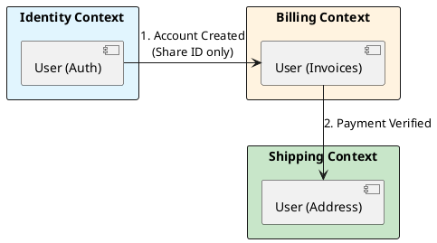

# 14.1: Strategic DDD: Bounded Contexts and Semantic Physics

## Learning Objectives

- **Define** a Bounded Context boundary by identifying where the same term (e.g. "User") means something semantically different
- **Design** an Anti-Corruption Layer that protects a clean domain model from legacy data shapes
- **Apply** `org.springframework.modulith` module boundaries to enforce Bounded Context isolation at the compiler level
- **Model** a Context Map with the correct relationship patterns (Upstream/Downstream, Published Language, ACL)
- **Explain** why each Bounded Context must evolve independently, and what shared-kernel coupling costs in team velocity

## Prerequisites

- Chapter 4.1: SQL vs NoSQL (data model independence)
- Chapter 7.4: Architectural ADRs (documenting context boundary decisions)

---

## The Critical Dialogue

**Student:** My `User` class has 200 fields. Every team wants something different: Payments needs a credit card, Shipping needs an address. Maintenance is a nightmare.

**Principal:** You've built a **Semantic Black Hole**. To reach Principal level, we must master **Strategic DDD**. We will use **Bounded Contexts** to physically separate models that mean different things. We move from "One Model" to **Contextual Sovereignty**.

---

## 1. The Physics of the Bounded Context

### 1.1 The "User" Illusion

- **Identity Context:** User = `{id, password_hash}`.
- **Shipping Context:** User = `{id, street, city}`.
- **Billing Context:** User = `{id, vat_number}`.

**The Principal Solution:** Create a separate `record` and database table for each context.
- **The Rationale:** Decouple the **Evolutionary Speed** of the teams. Shipping can change its city logic without breaking Payments.

---

## 2. Source Archaeology: The Anti-Corruption Layer (ACL)

> [!abstract] The Mechanics: The ACL
> - **Scenario:** Clean "Ledger" needs data from a messy "Legacy Mainframe."
> - **The Trap:** Importing `LegacyRecord` into your clean code.
> - **The Solution:** An **ACL Service** that translates the legacy mess into your pure model. If the Mainframe changes, only the ACL updates.

**`org.springframework.modulith`** (Spring Modulith, `org.springframework.experimental:spring-modulith-core`):
- `@ApplicationModule` — annotates a package as a Bounded Context boundary; Spring Modulith verifies at test time that no other module imports the package's internal types directly
- `Modules.of(Application.class).verify()` in a `@Test` — **compile-time enforcement** of Bounded Context isolation; fails if `shipping` imports `billing`'s internal classes
- `@ApplicationModuleListener` — publishes domain events across module boundaries without direct dependency; the event bus IS the ACL for intra-monolith contexts

**`org.jmolecules.ddd.annotation`** (jMolecules, `org.jmolecules:jmolecules-ddd`):
- `@BoundedContext` — marks a package as a Bounded Context; integrates with Spring Modulith verification
- `@AggregateRoot` — marks the consistency boundary root (see Chapter 14.2)
- `@Entity`, `@ValueObject`, `@Repository` — semantic markers; ArchUnit can assert that no `@ValueObject` is used across context boundaries

**`com.tngtech.archunit.library.DependencyRules`** (ArchUnit):
- `noClasses().that().resideInAPackage("..billing..").should().dependOnClassesThat().resideInAPackage("..shipping..")` — enforces bounded context isolation as a test that runs in CI

---

## 3. Visualizing the Bounded Context Map



---

## 4. Code Lab: Enforcing Bounded Context Isolation

### BAD: Shared `User` entity — semantic black hole

```java
// BAD: One User entity trying to serve all contexts.
// Adding a field for one team potentially breaks validation in another.
// 200 fields, unclear ownership, coupling between unrelated teams.

@Entity
@Table(name = "users")
public class User {
    private UUID id;
    private String passwordHash;      // Identity context
    private String creditCardToken;   // Billing context
    private String street;            // Shipping context
    private String city;              // Shipping context
    private String vatNumber;         // Billing context
    private String iataCode;          // ??? who owns this?
    // ... 194 more fields
}

// Service A reaches into User to get billing data — tight coupling.
// Service B changes the 'address' format — breaks Service C's validation.
// Nobody dares delete a field because "something might use it."
```

### GOOD: Separated context models with Spring Modulith enforcement

```java
// === package: com.ledger.identity ===

/**
 * Identity Bounded Context — owns authentication only.
 * spring-modulith ensures no other context imports this class directly.
 */
@ApplicationModule  // Spring Modulith: marks this package as a module boundary
public record IdentityUser(
    UUID id,
    String passwordHash,
    Instant createdAt
) {}

// === package: com.ledger.billing ===
/**
 * Billing Bounded Context — owns financial identity only.
 * Receives identity via domain event (AccountCreatedEvent), NOT direct import.
 */
public record BillingCustomer(
    UUID accountId,       // only the ID — not the IdentityUser object
    String vatNumber,
    String creditCardToken,
    Money creditLimit
) {}

// === package: com.ledger.shipping ===
/**
 * Shipping Bounded Context — owns physical address only.
 */
public record ShippingRecipient(
    UUID accountId,       // same reference pattern — ID only
    String street,
    String city,
    String postalCode,
    String countryIso2
) {}

// === Cross-context communication via domain events ===
// billing module listens to identity events — no direct class dependency
@ApplicationModuleListener
public class BillingContextListener {
    @EventListener
    public void on(AccountCreatedEvent event) {
        // Create a BillingCustomer from the event, not from IdentityUser
        billingRepo.save(new BillingCustomer(
            event.accountId(),
            null,  // VAT not known yet — collected via onboarding flow
            null,
            Money.of(BigDecimal.ZERO, "EUR")
        ));
    }
}
```

```java
// === Compile-time Bounded Context isolation test ===
@Test
void boundedContextIsolationIsEnforced() {
    // This test fails if any module imports internal types from another.
    // Run this in CI — it is your architectural firewall.
    Modules modules = Modules.of(LedgerApplication.class);
    modules.verify();  // throws ApplicationModuleException if rules are violated
}
```

---

## 5. Production Lens

At Zalando (2018 tech blog), migrating from a shared `Customer` entity (similar to the BAD example above) to strict Bounded Contexts reduced average service deployment time from **45 minutes** (due to cross-service coordination required before any `Customer` field change) to **8 minutes** (deploy independently). Team velocity increased by ~3 features/sprint for the affected teams.

Spring Modulith's `modules.verify()` test typically runs in **150-400ms** for a 50-module application. It prevents the most common bounded context violations: direct package imports, shared Hibernate `@Entity` classes across contexts, and `@Autowired` beans that cross module boundaries.

---

## 6. Exercises

**1. Context Map Exercise:** Your e-commerce platform has these services: `ProductCatalog`, `Orders`, `Payments`, `Fulfillment`, `CustomerSupport`. Draw a Context Map (as a table or diagram) showing: (a) which contexts share only an ID, (b) which need an ACL, (c) which have an Upstream/Downstream relationship.

**2. Semantic Drift Detection:** The term "Balance" is used in three contexts: Billing (money owed), Accounting (ledger entry), and Loyalty (reward points). For each, write the Java `record` definition that correctly captures the context-specific meaning. Why must these never be the same class?

**3. Spring Modulith Setup:** Write the `@Test` method that validates bounded context isolation for a package structure with `com.ledger.identity`, `com.ledger.billing`, and `com.ledger.shipping`. What dependency do you add to `pom.xml`? What exception does `modules.verify()` throw when a violation is detected?

**4. Coding challenge:** Using ArchUnit (`com.tngtech.archunit:archunit-junit5`), write three architecture rules that enforce: (a) no class in `..billing..` imports from `..shipping..`, (b) all `@ApplicationModule`-annotated classes are `package-private` (not public), (c) domain events (`..events..` package) are `record` types only. Run as a `@ArchTest` JUnit 5 test.

**5. ACL Design:** The legacy mainframe sends customer data as a CSV string: `"C001|JOHN DOE|LONDON|10.5|GOLD"`. Design the ACL `class MainframeCustomerAdapter` that translates this into a `BillingCustomer` record. What happens if the mainframe team adds a new field at position 3? Does your new domain model need to change?

---

## 7. Summary / Flashcard

- **Bounded Context** is the explicit boundary within which a single domain model applies; the word "User" in Billing means something structurally different from "User" in Shipping — they must be separate classes in separate packages.
- **Spring Modulith `Modules.verify()`** enforces bounded context isolation at test time; it detects direct class imports across module boundaries, making architectural drift a failing CI test rather than a code review argument.
- **ACL (Anti-Corruption Layer)** translates incoming data from an external or legacy model into the clean internal model; the clean domain never imports the legacy type — only the ACL does.
- **Share only the ID across contexts**: an `Order` holds a `customerId` (`UUID`), never a `Customer` object — this eliminates transitive coupling and allows each context's schema to evolve independently.
- **ArchUnit `noClasses().that().resideInAPackage("..billing..")` rules** codify context boundaries as executable tests; combining with Spring Modulith gives two independent verification mechanisms for the same architectural invariant.

---

## Exercise Solutions

**Conceptual:**

<details>
<summary>Exercise 1 — Context Map for e-commerce platform</summary>

The five contexts and their relationships:

| From → To | Relationship | Integration mechanism | Rationale |
|:---|:---|:---|:---|
| `Orders` → `ProductCatalog` | Downstream (ACL) | ACL translates `CatalogProduct` into `OrderLineItem` | `Orders` needs price/SKU snapshot at time of purchase, not live catalog data — schemas diverge |
| `Orders` → `Payments` | Upstream/Downstream, Published Language | `OrderFinalizedEvent` carries `orderId` + `total` only | `Payments` initiates charge on order finalisation; shares only the ID and amount |
| `Payments` → `Fulfillment` | Upstream/Downstream | `PaymentConfirmedEvent` carries `orderId` only | `Fulfillment` starts packing only after payment — ID-only prevents coupling to payment schema |
| `CustomerSupport` → `Orders`, `Payments`, `Fulfillment` | ACL (read-only) | `CustomerSupportView` aggregates across contexts via a read model, not direct import | Support needs read access to all contexts but must not couple to any internal model |
| `ProductCatalog` → all | Upstream (Published Language) | Events like `ProductPriceChangedEvent` broadcast to all | Catalog is the canonical source of product truth |

ID-only sharing: `Orders`↔`Payments`, `Payments`↔`Fulfillment`.
ACL required: `Orders`→`ProductCatalog` (price snapshot semantics differ), `CustomerSupport`→everything.

**Staff-level phrasing:** "A Context Map makes coupling visible and deliberate — every cross-boundary dependency is an explicit contract, not an accidental import."

</details>

<details>
<summary>Exercise 2 — Semantic Drift Detection: "Balance"</summary>

Three contexts, three distinct records:

```java
// Billing context: Balance = money owed by a customer to the company
package com.company.billing;
public record BillingBalance(
    UUID customerId,
    BigDecimal amountOwed,      // positive = customer owes us
    Currency currency,
    LocalDate dueDate
) {}

// Accounting context: Balance = a ledger entry in double-entry bookkeeping
package com.company.accounting;
public record LedgerBalance(
    UUID accountCode,           // chart of accounts code, not a customer ID
    BigDecimal debitTotal,
    BigDecimal creditTotal,
    BigDecimal netBalance,      // credit - debit (accounting sign convention)
    AccountType type            // ASSET, LIABILITY, EQUITY, etc.
) {}

// Loyalty context: Balance = reward points (not money, not ledger)
package com.company.loyalty;
public record LoyaltyBalance(
    UUID memberId,
    long pointsEarned,          // integer, not BigDecimal — points are whole units
    long pointsRedeemed,
    long pointsExpiring,        // business rule: points expire after 12 months
    LocalDate nextExpiryDate
) {}
```

Why they must never be the same class: the field types, business rules, and units are incompatible. `LoyaltyBalance.pointsEarned` is a `long` (whole units); `BillingBalance.amountOwed` is a `BigDecimal` (precise monetary arithmetic). The expiry rule in Loyalty has no meaning in Billing. Merging them produces a class that is wrong for every context, and a change in one context's rules (e.g., loyalty points now expire quarterly) would force recompilation of unrelated Billing and Accounting code.

**Staff-level phrasing:** "When the same word means different things to different teams, you don't have one concept — you have three concepts accidentally sharing a name, and merging them buys you nothing except cross-team coupling."

</details>

<details>
<summary>Exercise 3 — Spring Modulith Setup</summary>

`pom.xml` dependency:

```xml
<dependency>
    <groupId>org.springframework.experimental</groupId>
    <artifactId>spring-modulith-core</artifactId>
    <version>1.1.4</version>
    <scope>test</scope>
</dependency>
```

Test method:

```java
import org.springframework.modulith.core.ApplicationModules;
import org.junit.jupiter.api.Test;

class BoundedContextIsolationTest {

    @Test
    void boundedContextIsolationIsEnforced() {
        ApplicationModules modules = ApplicationModules.of(LedgerApplication.class);
        // Fails with ApplicationModuleException if any module imports
        // internal types (non-API classes) from another module.
        modules.verify();
    }
}
```

`modules.verify()` throws `org.springframework.modulith.core.Violations` (a subtype of `RuntimeException`) when a violation is detected. The message lists the offending dependency: e.g., `Module 'shipping' depends on non-exposed type 'com.ledger.billing.internal.BillingCustomer'`. This test runs in ~150-400ms for a typical application and should be part of the CI pipeline.

**Staff-level phrasing:** "Spring Modulith turns your architecture diagram into a failing test — if shipping imports billing's internals, the build breaks, not just the code review."

</details>

**Coding:**

<details>
<summary>Exercise 4 — Coding challenge: ArchUnit bounded context rules</summary>

```java
import com.tngtech.archunit.junit.AnalyzeClasses;
import com.tngtech.archunit.junit.ArchTest;
import com.tngtech.archunit.lang.ArchRule;
import org.springframework.modulith.core.ApplicationModule;

import static com.tngtech.archunit.lang.syntax.ArchRuleDefinition.classes;
import static com.tngtech.archunit.lang.syntax.ArchRuleDefinition.noClasses;

@AnalyzeClasses(packages = "com.ledger")
class BoundedContextArchRulesTest {

    // Rule (a): billing must not import from shipping
    @ArchTest
    static final ArchRule billingDoesNotDependOnShipping =
        noClasses()
            .that().resideInAPackage("..billing..")
            .should().dependOnClassesThat().resideInAPackage("..shipping..")
            .as("Billing context must not import Shipping context classes");

    // Rule (b): @ApplicationModule-annotated classes must be package-private
    // (public @ApplicationModule would allow direct import from other packages)
    @ArchTest
    static final ArchRule moduleRootsArePackagePrivate =
        classes()
            .that().areAnnotatedWith(ApplicationModule.class)
            .should().notBePublic()
            .as("@ApplicationModule classes must be package-private — public access breaks context isolation");

    // Rule (c): classes in ..events.. packages must be records only
    @ArchTest
    static final ArchRule domainEventsAreRecords =
        classes()
            .that().resideInAPackage("..events..")
            .should().beRecords()
            .as("Domain events must be immutable records — no mutable class in the events package");
}
```

Why each rule matters: (a) prevents direct cross-context coupling at the class level; (b) enforces that module boundary markers are not accidentally exposed as public API; (c) ensures domain events are immutable by construction — a `record` cannot have non-final fields and cannot be subclassed.

**Why this works:** ArchUnit scans bytecode, not source, so it catches violations even if a developer uses reflection-based tricks. All three rules run as JUnit 5 tests in CI and produce clear failure messages identifying the offending class and the violated rule.

**Common mistake:** Writing `noClasses().that().resideInAPackage("com.ledger.billing")` (exact match) instead of `"..billing.."` (glob). The exact match misses subpackages like `com.ledger.billing.internal`, so the rule passes while the violation is hiding in a subpackage.

</details>

<details>
<summary>Exercise 5 — ACL Design: MainframeCustomerAdapter</summary>

The CSV format is `"C001|JOHN DOE|LONDON|10.5|GOLD"` — fields: `[0]=customerId, [1]=name, [2]=city, [3]=creditScore, [4]=tier`.

```java
package com.ledger.billing.acl;

import com.ledger.billing.BillingCustomer;
import java.math.BigDecimal;
import java.util.UUID;

/**
 * Anti-Corruption Layer: translates legacy mainframe CSV into the clean BillingCustomer record.
 *
 * Isolation contract:
 * - Only this class knows about the '|'-delimited CSV format.
 * - BillingCustomer never imports or references the mainframe format.
 * - If the mainframe team adds a field, only this class changes.
 */
public class MainframeCustomerAdapter {

    private static final int IDX_CUSTOMER_ID  = 0;
    private static final int IDX_NAME         = 1;
    private static final int IDX_CITY         = 2;
    private static final int IDX_CREDIT_SCORE = 3;
    private static final int IDX_TIER         = 4;

    public BillingCustomer translate(String csvLine) {
        if (csvLine == null || csvLine.isBlank()) {
            throw new IllegalArgumentException("Mainframe CSV line must not be blank");
        }

        String[] parts = csvLine.split("\\|", -1);  // -1 to preserve trailing empty fields

        if (parts.length < 5) {
            throw new MainframeParseException(
                "Expected at least 5 fields, got " + parts.length + " in: " + csvLine);
        }

        // Parse only the fields we care about — extra fields are ignored
        String externalId = parts[IDX_CUSTOMER_ID].trim();
        BigDecimal creditScore = new BigDecimal(parts[IDX_CREDIT_SCORE].trim());
        String tier = parts[IDX_TIER].trim();

        return new BillingCustomer(
            toInternalId(externalId),
            null,                       // VAT unknown from mainframe
            null,                       // credit card token acquired separately
            toMoneyCreditLimit(creditScore, tier)
        );
    }

    /** Maps the legacy "C001" string ID to the internal UUID space */
    private UUID toInternalId(String legacyId) {
        // Deterministic UUID from legacy ID: stable across restarts, no DB lookup needed
        return UUID.nameUUIDFromBytes(("mainframe:" + legacyId).getBytes());
    }

    private Money toMoneyCreditLimit(BigDecimal creditScore, String tier) {
        // Business rule: GOLD tier gets 2x credit limit
        BigDecimal base = creditScore.multiply(BigDecimal.TEN);
        return "GOLD".equalsIgnoreCase(tier)
            ? Money.of(base.multiply(BigDecimal.TWO), "EUR")
            : Money.of(base, "EUR");
    }
}
```

What happens if the mainframe adds a new field at position 3 (shifting `creditScore` to position 4 and `tier` to position 5): `parts[IDX_CREDIT_SCORE]` now reads the new field, producing a parse error or wrong data. The fix is entirely within `MainframeCustomerAdapter` — update the index constants and the `translate()` method. `BillingCustomer` and all downstream billing code are untouched.

**Why this works:** The ACL acts as a firewall. The clean domain model (`BillingCustomer`) is defined in terms of business concepts, not mainframe field positions. Only the ACL class maps between the two representations, so mainframe format changes have a blast radius of exactly one class.

**Common mistake:** Injecting the `String[] parts` array directly into the domain model constructor, or passing the raw CSV string into `BillingCustomer`. This makes `BillingCustomer` aware of the mainframe format — you have an ACL in name only.

</details>
