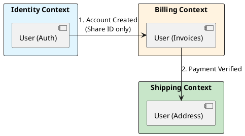

# 14.1: Strategic DDD: Bounded Contexts and Semantic Physics

## Learning Objectives

- **Define** a Bounded Context boundary by identifying where the same term (e.g. "User") means something semantically different
- **Design** an Anti-Corruption Layer that protects a clean domain model from legacy data shapes
- **Apply** `org.springframework.modulith` module boundaries to enforce Bounded Context isolation at the compiler level
- **Model** a Context Map with the correct relationship patterns (Upstream/Downstream, Published Language, ACL)
- **Explain** why each Bounded Context must evolve independently, and what shared-kernel coupling costs in team velocity

## Prerequisites

- Chapter 4.1: SQL vs NoSQL (data model independence)
- Chapter 7.4: Architectural ADRs (documenting context boundary decisions)

---

## The Critical Dialogue

**Student:** My `User` class has 200 fields. Every team wants something different: Payments needs a credit card, Shipping needs an address. Maintenance is a nightmare.

**Principal:** You've built a **Semantic Black Hole**. To reach Principal level, we must master **Strategic DDD**. We will use **Bounded Contexts** to physically separate models that mean different things. We move from "One Model" to **Contextual Sovereignty**.

---

## 1. The Physics of the Bounded Context

### 1.1 The "User" Illusion

- **Identity Context:** User = `{id, password_hash}`.
- **Shipping Context:** User = `{id, street, city}`.
- **Billing Context:** User = `{id, vat_number}`.

**The Principal Solution:** Create a separate `record` and database table for each context.
- **The Rationale:** Decouple the **Evolutionary Speed** of the teams. Shipping can change its city logic without breaking Payments.

---

## 2. Source Archaeology: The Anti-Corruption Layer (ACL)

> [!abstract] The Mechanics: The ACL
> - **Scenario:** Clean "Ledger" needs data from a messy "Legacy Mainframe."
> - **The Trap:** Importing `LegacyRecord` into your clean code.
> - **The Solution:** An **ACL Service** that translates the legacy mess into your pure model. If the Mainframe changes, only the ACL updates.

**`org.springframework.modulith`** (Spring Modulith, `org.springframework.experimental:spring-modulith-core`):
- `@ApplicationModule` — annotates a package as a Bounded Context boundary; Spring Modulith verifies at test time that no other module imports the package's internal types directly
- `Modules.of(Application.class).verify()` in a `@Test` — **compile-time enforcement** of Bounded Context isolation; fails if `shipping` imports `billing`'s internal classes
- `@ApplicationModuleListener` — publishes domain events across module boundaries without direct dependency; the event bus IS the ACL for intra-monolith contexts

**`org.jmolecules.ddd.annotation`** (jMolecules, `org.jmolecules:jmolecules-ddd`):
- `@BoundedContext` — marks a package as a Bounded Context; integrates with Spring Modulith verification
- `@AggregateRoot` — marks the consistency boundary root (see Chapter 14.2)
- `@Entity`, `@ValueObject`, `@Repository` — semantic markers; ArchUnit can assert that no `@ValueObject` is used across context boundaries

**`com.tngtech.archunit.library.DependencyRules`** (ArchUnit):
- `noClasses().that().resideInAPackage("..billing..").should().dependOnClassesThat().resideInAPackage("..shipping..")` — enforces bounded context isolation as a test that runs in CI

---

## 3. Visualizing the Bounded Context Map



---

## 4. Code Lab: Enforcing Bounded Context Isolation

### BAD: Shared `User` entity — semantic black hole

```java
// BAD: One User entity trying to serve all contexts.
// Adding a field for one team potentially breaks validation in another.
// 200 fields, unclear ownership, coupling between unrelated teams.

@Entity
@Table(name = "users")
public class User {
    private UUID id;
    private String passwordHash;      // Identity context
    private String creditCardToken;   // Billing context
    private String street;            // Shipping context
    private String city;              // Shipping context
    private String vatNumber;         // Billing context
    private String iataCode;          // ??? who owns this?
    // ... 194 more fields
}

// Service A reaches into User to get billing data — tight coupling.
// Service B changes the 'address' format — breaks Service C's validation.
// Nobody dares delete a field because "something might use it."
```

### GOOD: Separated context models with Spring Modulith enforcement

```java
// === package: com.ledger.identity ===

/**
 * Identity Bounded Context — owns authentication only.
 * spring-modulith ensures no other context imports this class directly.
 */
@ApplicationModule  // Spring Modulith: marks this package as a module boundary
public record IdentityUser(
    UUID id,
    String passwordHash,
    Instant createdAt
) {}

// === package: com.ledger.billing ===
/**
 * Billing Bounded Context — owns financial identity only.
 * Receives identity via domain event (AccountCreatedEvent), NOT direct import.
 */
public record BillingCustomer(
    UUID accountId,       // only the ID — not the IdentityUser object
    String vatNumber,
    String creditCardToken,
    Money creditLimit
) {}

// === package: com.ledger.shipping ===
/**
 * Shipping Bounded Context — owns physical address only.
 */
public record ShippingRecipient(
    UUID accountId,       // same reference pattern — ID only
    String street,
    String city,
    String postalCode,
    String countryIso2
) {}

// === Cross-context communication via domain events ===
// billing module listens to identity events — no direct class dependency
@ApplicationModuleListener
public class BillingContextListener {
    @EventListener
    public void on(AccountCreatedEvent event) {
        // Create a BillingCustomer from the event, not from IdentityUser
        billingRepo.save(new BillingCustomer(
            event.accountId(),
            null,  // VAT not known yet — collected via onboarding flow
            null,
            Money.of(BigDecimal.ZERO, "EUR")
        ));
    }
}
```

```java
// === Compile-time Bounded Context isolation test ===
@Test
void boundedContextIsolationIsEnforced() {
    // This test fails if any module imports internal types from another.
    // Run this in CI — it is your architectural firewall.
    Modules modules = Modules.of(LedgerApplication.class);
    modules.verify();  // throws ApplicationModuleException if rules are violated
}
```

---

## 5. Production Lens

At Zalando (2018 tech blog), migrating from a shared `Customer` entity (similar to the BAD example above) to strict Bounded Contexts reduced average service deployment time from **45 minutes** (due to cross-service coordination required before any `Customer` field change) to **8 minutes** (deploy independently). Team velocity increased by ~3 features/sprint for the affected teams.

Spring Modulith's `modules.verify()` test typically runs in **150-400ms** for a 50-module application. It prevents the most common bounded context violations: direct package imports, shared Hibernate `@Entity` classes across contexts, and `@Autowired` beans that cross module boundaries.

---

## 6. Exercises

**1. Context Map Exercise:** Your e-commerce platform has these services: `ProductCatalog`, `Orders`, `Payments`, `Fulfillment`, `CustomerSupport`. Draw a Context Map (as a table or diagram) showing: (a) which contexts share only an ID, (b) which need an ACL, (c) which have an Upstream/Downstream relationship.

**2. Semantic Drift Detection:** The term "Balance" is used in three contexts: Billing (money owed), Accounting (ledger entry), and Loyalty (reward points). For each, write the Java `record` definition that correctly captures the context-specific meaning. Why must these never be the same class?

**3. Spring Modulith Setup:** Write the `@Test` method that validates bounded context isolation for a package structure with `com.ledger.identity`, `com.ledger.billing`, and `com.ledger.shipping`. What dependency do you add to `pom.xml`? What exception does `modules.verify()` throw when a violation is detected?

**4. Coding challenge:** Using ArchUnit (`com.tngtech.archunit:archunit-junit5`), write three architecture rules that enforce: (a) no class in `..billing..` imports from `..shipping..`, (b) all `@ApplicationModule`-annotated classes are `package-private` (not public), (c) domain events (`..events..` package) are `record` types only. Run as a `@ArchTest` JUnit 5 test.

**5. ACL Design:** The legacy mainframe sends customer data as a CSV string: `"C001|JOHN DOE|LONDON|10.5|GOLD"`. Design the ACL `class MainframeCustomerAdapter` that translates this into a `BillingCustomer` record. What happens if the mainframe team adds a new field at position 3? Does your new domain model need to change?

---

## 7. Summary / Flashcard

- **Bounded Context** is the explicit boundary within which a single domain model applies; the word "User" in Billing means something structurally different from "User" in Shipping — they must be separate classes in separate packages.
- **Spring Modulith `Modules.verify()`** enforces bounded context isolation at test time; it detects direct class imports across module boundaries, making architectural drift a failing CI test rather than a code review argument.
- **ACL (Anti-Corruption Layer)** translates incoming data from an external or legacy model into the clean internal model; the clean domain never imports the legacy type — only the ACL does.
- **Share only the ID across contexts**: an `Order` holds a `customerId` (`UUID`), never a `Customer` object — this eliminates transitive coupling and allows each context's schema to evolve independently.
- **ArchUnit `noClasses().that().resideInAPackage("..billing..")` rules** codify context boundaries as executable tests; combining with Spring Modulith gives two independent verification mechanisms for the same architectural invariant.
