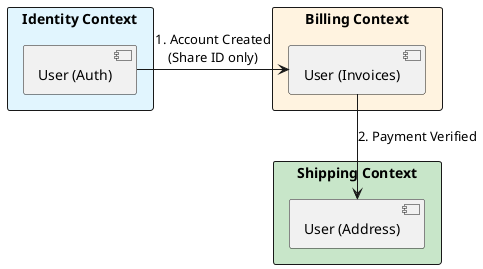

# 14.1: Strategic DDD: Bounded Contexts and Semantic Physics

## The Critical Dialogue

**Student:** My `User` class has 200 fields. Every team wants something different: Payments needs a credit card, Shipping needs an address. Maintenance is a nightmare. 

**Principal:** You've built a **Semantic Black Hole**. To reach Principal level, we must master **Strategic DDD**. We will use **Bounded Contexts** to physically separate models that mean different things. We move from "One Model" to **Contextual Sovereignty**.

---

## 1. The Physics of the Bounded Context

### 1.1 The "User" Illusion
. **Identity Context:** User = `{id, password_hash}`.
. **Shipping Context:** User = `{id, street, city}`.
. **Billing Context:** User = `{id, vat_number}`.

**The Principal Solution:** Create a separate `record` and database table for each context.
. **The Rationale:** Decouple the **Evolutionary Speed** of the teams. Shipping can change its city logic without breaking Payments.

---

## 2. Source Archaeology: The Anti-Corruption Layer (ACL)

> [!abstract] The Mechanics: The ACL
. **Scenario:** Clean "Ledger" needs data from a messy "Legacy Mainframe."
. **The Trap:** Importing `LegacyRecord` into your clean code.
. **The Solution:** An **ACL Service** that translates the legacy mess into your pure model. If the Mainframe changes, only the ACL updates.

---

## 3. Visualizing the Bounded Context Map

---

## 🧠 Principal's Inquiry

. **Context Drift:** What happens when two teams use the same term (e.g. "Balance") to mean different things?

. **Physical Split:** Should each context have its own **Physical Database**? Why or why not?

**Principal Summary:** Strategic DDD is about **Protecting the Brain**. We use Bounded Contexts and ACLs to ensure the Global Ledger remains agile as it grows into a 1,000-service fleet.
 Greenlanders use the type system to prove our software invariants.
