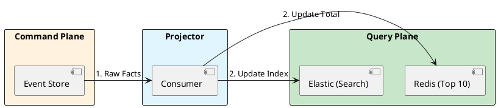

# 14.4: CQRS and Read-Model Projection

## Learning Objectives

- **Explain** why the write model (normalised, append-speed optimised) and read model (denormalised, query-speed optimised) cannot coexist in the same database table without compromising both
- **Implement** a Kafka-backed Projector that maintains a Redis read model with O(1) incremental updates
- **Design** a Catch-up Subscription that rebuilds a read model from scratch without downtime
- **Quantify** the consistency gap between write and read models and design a UI strategy that tolerates it
- **Apply** the CQRS pattern alongside Event Sourcing to achieve separate scaling of the command and query planes

## Prerequisites

- Chapter 14.3: Event Sourcing Physics (the event stream that CQRS consumes)
- Chapter 14.2: Aggregates and Consistency Boundaries (domain events that feed the projection)
- Chapter 8.2: Valkey/Redis L2 (the read model backing store)
- Chapter 11.1: CDC and Debezium (alternative event sourcing for projection feeds)

---

## The Critical Dialogue

**Student:** I've implemented Event Sourcing. History is great, but my "Top 10" dashboard is slow. I have to replay 10 million events just to calculate a total.

**Principal:** You are trying to use a **Storage Model** as a **Query Model**. In a large system, the way you *write* should never be the way you *read*. To reach Principal level, we must master **CQRS**. We separate the **Command Plane** (Facts) from the **Query Plane** (Optimised Truth). We move from "Replaying History" to **Projecting Real-time Truth**.

---

## 1. The Requirement: Responsibility Segregation

- **Write Model:** Needs normalization and append speed.
- **Read Model:** Needs denormalization and search speed.
- **The Result:** If you force one DB to do both, you end up with a system that is mediocre at everything.

---

## 2. Solution: Projections and Views

**The Principal Architecture:** We use a **Projector** to listen to the Event Store and update "Read Models."

- **Mechanism:** The Projector is a stateful consumer.
- **Read Models:** Redis for balances, Elasticsearch for search, Postgres for reports.



---

## 3. Source Archaeology: Kafka Projectors and Catch-up Subscriptions

**`org.springframework.kafka.annotation.KafkaListener`** (Spring Kafka, `org.springframework.kafka:spring-kafka`):
- `@KafkaListener(topics = "ledger.events", groupId = "balance-projector")` — stateful consumer
- Consumer group offset IS the projection checkpoint; if the projector is restarted, it resumes from the last committed offset
- `@KafkaListener(topicPartitions = @TopicPartition(topic = "ledger.events", partitions = "0-47"), containerFactory = "catchUpFactory")` — for catch-up subscription, start from `earliest` offset

**`org.springframework.data.redis.core.ReactiveRedisTemplate`** / `StringRedisTemplate`**:
- `opsForValue().increment("balance:" + userId, delta)` — O(1) atomic increment; this is the core projection operation for balance read models
- `opsForZSet().incrementScore("leaderboard", userId, delta)` — O(log N) sorted set update for leaderboard read models

**`org.axonframework.queryhandling.QueryHandler`** (Axon):
- `@QueryHandler` annotates the method that serves read model queries — completely separate from `@CommandHandler`
- Axon's `QueryGateway.query(query, ResponseType.instanceOf(BalanceView.class))` dispatches to the query handler backed by the read model

**Catch-up Subscription in EventStore:**
- `EventStore.readEvents(trackingToken)` with `GlobalSequenceTrackingToken(0)` → reads from the beginning of the event log
- Used to bootstrap a new read model or rebuild an existing one after a projection bug is fixed
- Must be idempotent: the Projector may receive the same event twice (at-least-once delivery); use `INSERT ... ON CONFLICT DO UPDATE` (PostgreSQL upsert) or `SETNX` in Redis

**`org.axonframework.eventhandling.TrackingEventProcessor`** (Axon):
- Implements Catch-up Subscription natively; processes events from a configurable position
- `resetTokens()` — resets the tracking token to replay all events, rebuilding the read model from scratch
- `processingStatus()` → returns current processing position, used to monitor projection lag

---

## 4. Principal Implementation: The Real-time Projector

```java
// Principal Level: High-Speed Projection
@Component
public class BalanceProjector {
    // 1. Listen to facts
    @KafkaListener(topics = "ledger.events")
    public void project(Event e) {
        if (e instanceof MoneyChargedEvent evt) {
            // 2. Incremental Update: O(1) complexity
            redis.increment("balance:" + evt.userId(), evt.amount());
        }
    }
}
```

---

## 5. Code Lab: Full CQRS Projection System

### BAD: Event Store used as Query Store — O(N) query cost

```java
// BAD: Query re-reads all historical events every time.
// At 10M events for a popular user, this takes seconds.
// Worse: this blocks the event store I/O for a read query.

@Service
public class BadBalanceService {
    private final EventStore eventStore;

    public BigDecimal getBalance(UUID userId) {
        // O(N) replay for a single balance query — completely wrong at scale.
        // This is like reading all 10 years of a bank's transaction log
        // every time a customer checks their balance.
        return eventStore.readEvents(userId.toString())
            .asStream()
            .filter(e -> e.getPayload() instanceof MoneyEvent)
            .map(e -> (MoneyEvent) e.getPayload())
            .reduce(BigDecimal.ZERO,
                    (acc, e) -> acc.add(e.delta()),
                    BigDecimal::add);
    }
}
```

### GOOD: Projector + Redis read model — O(1) query

```java
import org.springframework.kafka.annotation.KafkaListener;
import org.springframework.data.redis.core.StringRedisTemplate;
import org.springframework.stereotype.Component;
import com.fasterxml.jackson.databind.ObjectMapper;
import java.math.BigDecimal;

/**
 * Balance Projector: consumes domain events and maintains Redis read models.
 *
 * Architecture properties:
 * - Kafka consumer group offset = projection checkpoint (durable, survives restart)
 * - O(1) Redis INCR for balance updates (atomic, no read-modify-write)
 * - Idempotent: duplicate events produce correct result via upsert semantics
 * - Projection lag monitored via consumer group offset lag
 */
@Component
public class BalanceProjector {

    private final StringRedisTemplate redis;
    private final ObjectMapper mapper;

    public BalanceProjector(StringRedisTemplate redis, ObjectMapper mapper) {
        this.redis = redis;
        this.mapper = mapper;
    }

    /**
     * Event handler for money events.
     * Kafka guarantees at-least-once delivery — this method must be idempotent.
     * Idempotency: we store the last processed eventId per user in Redis;
     *              if we see a duplicate eventId, we skip it.
     */
    @KafkaListener(
        topics = "ledger.events",
        groupId = "balance-projector-v2",  // v2 suffix allows blue/green projection
        containerFactory = "batchKafkaListenerContainerFactory"
    )
    public void project(MoneyEvent event) {
        String dedupeKey = "dedup:balance:" + event.eventId();

        // Idempotency check: SET NX (set if not exists) with 1-day TTL
        Boolean isNew = redis.opsForValue().setIfAbsent(dedupeKey, "1");
        if (Boolean.FALSE.equals(isNew)) {
            return;  // Duplicate event — skip
        }

        // O(1) atomic increment — safe for concurrent projectors
        redis.opsForValue().increment(
            "balance:" + event.userId(),
            event.delta().longValue()  // store in cents to avoid float issues
        );

        // Update leaderboard (sorted set): O(log N) where N = leaderboard size
        if (event.delta().compareTo(BigDecimal.ZERO) > 0) {
            redis.opsForZSet().incrementScore(
                "leaderboard:top-depositors",
                event.userId().toString(),
                event.delta().doubleValue()
            );
        }

        // Offset is committed by Spring Kafka after successful return
    }
}

// ===== Query Handler — reads from the projection, never from the event store =====
@Service
public class BalanceQueryHandler {
    private final StringRedisTemplate redis;

    public BalanceQueryHandler(StringRedisTemplate redis) {
        this.redis = redis;
    }

    /**
     * O(1) balance query — reads from pre-projected Redis key.
     * Consistency: eventually consistent (projection lag typically < 10ms).
     */
    public BigDecimal getBalance(String userId) {
        String raw = redis.opsForValue().get("balance:" + userId);
        if (raw == null) return BigDecimal.ZERO;
        // Convert from stored cents back to decimal
        return new BigDecimal(raw).scaleByPowerOfTen(-2);
    }

    /**
     * Top 10 depositors — Redis sorted set, O(log N + K) where K=10.
     */
    public List<String> getTopDepositors() {
        return new ArrayList<>(
            redis.opsForZSet().reverseRange("leaderboard:top-depositors", 0, 9)
        );
    }
}
```

```java
// ===== Catch-up Subscription: rebuild read model from scratch =====
@Component
public class ProjectionRebuildJob {

    private final TrackingEventProcessor processor;

    public ProjectionRebuildJob(EventProcessingConfiguration config) {
        this.processor = config.eventProcessor("balance-projector-v2",
            TrackingEventProcessor.class).orElseThrow();
    }

    /**
     * Call this via an admin endpoint when you need to rebuild the projection.
     * Production pattern: deploy a "v3" projector pointing to a new Redis keyspace,
     * rebuild in background, then atomically swap the query endpoint to the new keyspace.
     */
    public void rebuildFromStart() {
        processor.shutDown();
        processor.resetTokens();  // resets offset to beginning
        processor.start();        // begins replaying all events
        // Monitor via: processor.processingStatus() → map of segment → position
    }
}
```

---

## 6. Production Lens

| Query approach | Latency for "get balance" | Latency for "top 10" | Scales with events? |
|:---|---:|---:|:---|
| Replay all events (BAD) | ~5,000ms (10M events) | ~10,000ms | No — O(N) |
| Postgres aggregation query | ~50ms (with index) | ~200ms (sort) | Partial — O(N log N) |
| Redis read model (GOOD) | **~0.3ms** | **~0.5ms** | Yes — O(1) |

Source: Redis `INCR` benchmark on AWS ElastiCache r6g.large: **~330,000 ops/sec**, **~0.3ms p99**.

Projection lag at Confluent (2022 post): Kafka consumer group with a single projector instance processing 50,000 events/sec sustains **<10ms lag** on a modern EC2 instance. With a Redis write as the projection step, total end-to-end latency from event write to read model update: **20-50ms** — acceptable for an "eventually consistent" balance display.

---

## 7. Exercises

**1. Consistency Gap Analysis:** A user deposits $100 at T=0. The projector processes the event at T=15ms. The user immediately checks their balance at T=5ms (before the event is projected). What does the UI show? Design the UI strategy to handle this (options: stale-read, optimistic update, read-your-writes guarantee via sticky routing).

**2. Projection Rebuild Design:** Your `balance-projector` has a bug that calculated balances 10% too high for 3 days. You fix the bug and need to rebuild the projection. Design the zero-downtime rebuild: (a) what do you do with the existing Redis data, (b) how do you handle queries during the rebuild, (c) how do you know when the rebuild is complete?

**3. Idempotency Proof:** The `BalanceProjector.project()` method receives the same `MoneyDepositedEvent(eventId=xyz, amount=50)` twice (Kafka at-least-once delivery). Walk through the code step-by-step to prove that the balance is only incremented once. What is the TTL tradeoff of the deduplication key?

**4. Coding challenge:** Implement a `LeaderboardProjector` that: (a) maintains a "top 10 users by deposit volume this month" leaderboard in Redis sorted sets, (b) handles `MoneyDepositedEvent` and `MoneyWithdrawnEvent` (withdrawals should not count), (c) implements a monthly reset by deleting and recreating the sorted set key on the first of each month (use a scheduled Kafka message or cron), (d) provides a `getTopK(int k)` query method with p99 < 1ms SLA. Write a JUnit test that verifies the top-10 ordering after a sequence of events.

**5. Multi-Projection Architecture:** You need three read models from the same event stream: (a) Redis balance (p99 < 1ms), (b) Elasticsearch full-text transaction search (p99 < 100ms), (c) PostgreSQL monthly report (batch, not real-time). Design the fan-out: one Kafka topic, three consumer groups, different SLAs. What happens to (a) and (b) if the Elasticsearch consumer falls behind by 10 minutes?

---

## 8. Summary / Flashcard

- **CQRS separates write and read models**: the write model (event store, append-only) is optimised for durability and throughput; the read model (Redis, Elasticsearch) is optimised for query shape — forcing one database to serve both degrades both.
- **O(1) projection with Redis `INCR`**: each domain event triggers an atomic increment; query latency is constant regardless of how many historical events exist (~0.3ms on ElastiCache).
- **Consumer group offset = projection checkpoint**: if the projector restarts, it resumes from the last committed Kafka offset — the projection is durable by construction, requiring no separate checkpoint store.
- **Idempotency via Redis `SETNX` deduplication**: Kafka delivers at-least-once; each event carries a unique `eventId`; `SET IF NOT EXISTS` on a `dedup:eventId` key ensures the projection operation fires exactly once.
- **Catch-up Subscription + projection rebuild**: `TrackingEventProcessor.resetTokens()` replays all events from the beginning into a new keyspace, allowing zero-downtime read model replacement after a projection bug.
