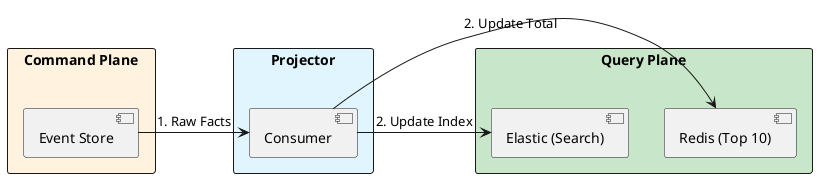

# 14.4: CQRS and Read-Model Projection


## The Critical Dialogue


**Student:** I've implemented Event Sourcing. History is great, but my "Top 10" dashboard is slow. I have to replay 10 million events just to calculate a total.


**Principal:** You are trying to use a **Storage Model** as a **Query Model**. In a large system, the way you *write* should never be the way you *read*. To reach Principal level, we must master **CQRS**. We separate the **Command Plane** (Facts) from the **Query Plane** (Optimized Truth). We move from "Replaying History" to **Projecting Real-time Truth**.


---


## 1. The Requirement: Responsibility Segregation


. **Write Model:** Needs normalization and append speed.
. **Read Model:** Needs denormalization and search speed.
. **The Result:** If you force one DB to do both, you end up with a system that is mediocre at everything.


---


## 2. Solution: Projections and Views


**The Principal Architecture:** We use a **Projector** (Module 11.1) to listen to the Event Store and update "Read Models."


. **Mechanism:** The Projector is a stateful consumer.
. **Read Models:** Redis for balances, Elasticsearch for search, Postgres for reports.





---


## 3. Principal Implementation: The Real-time Projector


```java
// Principal Level: High-Speed Projection
@Component
public class BalanceProjector {
    // 1. Listen to facts
    @KafkaListener(topics = "ledger.events")
    public void project(Event e) {
        if (e instanceof MoneyChargedEvent evt) {
            // 2. Incremental Update: O(1) complexity
            redis.increment("balance:" + evt.userId(), evt.amount());
        }
    }
}
```


---


## 🧠 Principal's Inquiry


. **The Rebuild:** If you add a new requirement, how do you "Rebuild" the Read Model from 10 years of history? (Hint: The **Catch-up Subscription**).


. **Consistency Gap:** Why is CQRS considered an **Eventually Consistent** pattern?


**Principal Summary:** CQRS is about **Optimization of Intent**. We use Event Stores to capture truth and Projections to serve the user, ensuring the Global Ledger is always responsive.
 Greenlanders use the type system to prove our software invariants.
