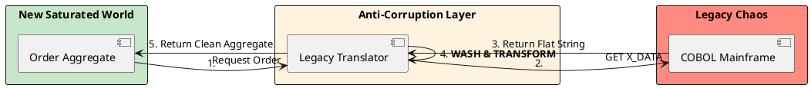

# 15.2: The Anti-Corruption Layer (ACL): Protecting the Domain


## The Critical Dialogue


**Student:** My new "High-Performance Ledger" needs to talk to the legacy "Mainframe." I've imported the legacy `Flat_Order_Record` class into my new service. But now my new clean code is full of legacy field names like `X_ORDER_TYPE_CODE_V2`. How do I keep the old mess out of my new world?


**Principal:** You've just allowed the past to **Infect your Future**. By using legacy classes in your new Bounded Context, you've created a "Leaky Abstraction." The legacy system's bad design will now spread like a virus through your new fleet. To reach Principal level, we must master the **Anti-Corruption Layer (ACL)**. We will build a "Sovereign Border" that translates the legacy mess into our pure domain model. We move from "Integration" to **Architectural Isolation**.


---


## 1. The Physics of the ACL


### 1.1 The Domain Infection
. **The Problem:** The legacy system has 50 fields, most of which are useless for the new Ledger. If you use their model, your logic becomes cluttered and unreadable.
. **The Solution:** The **ACL** is a dedicated service or component that sits between your new world and the old one.


---


## 2. Solution: The Sovereign Mapper


**The Principal Architecture:** We build a strict translation layer that acts as the "Customs Officer" at the border.


. **Inbound:** Legacy Data -> ACL -> Clean Domain.
. **Outbound:** Clean Domain -> ACL -> Legacy Data.
. **The Audit:** The "Clean Domain" NEVER knows the legacy system exists. It only knows about the ACL interface.





---


## 3. Principal Implementation: The Saturated Adapter


We will implement an ACL that cleanses a legacy "Flat String" format into our high-fidelity `Order` model.


```java
// Principal Level: Anti-Corruption Service
@Service
public class MainframeAdapter {
    private final COBOLClient client;

    public Order getCleanOrder(String legacyId) {
        // 1. Fetch raw, corrupted data
        String rawData = client.fetchRaw(legacyId); 

        // 2. The Translation Logic (ACL)
        // We parse the legacy ID:001;TYPE:X;AMT:50.0 format
        Map(String, String) parts = parseLegacyFormat(rawData);

        // 3. Wash: Map 'TYPE:X' to our clean 'OrderType.TRADING' enum
        OrderType type = switch(parts.get("TYPE")) {
            case "X" -> OrderType.TRADING;
            case "Y" -> OrderType.AUDIT;
            default -> throw new IllegalStateException("Unknown legacy type");
        };

        // 4. Return the Clean Model
        return new Order(
            UUID.fromString(parts.get("ID")),
            type,
            new Money(parts.get("AMT"))
        );
    }
}
```


---


## 🧵 The GOL Challenge: Phase 17.1 (The Border Audit)


**Context:** The legacy system is sending order amounts as "Cents" (integers), but our new Ledger uses `BigDecimal` for precision.


**The Task:**


. **ACL Implementation:** Implement the `MainframeAdapter` above. Write a unit test that feeds it a "Messy" legacy string and verify it returns a clean `Order` object.


. **Type Cleansing:** In your ACL, implement a "Sanity Filter." If the legacy amount is $> 1,000,000$ (indicating a potential mainframe bug), the ACL must throw a `LegacyCorruptDataException` instead of letting the data enter the new system.


. **Source Archaeology:** Use **MapStruct** or **ModelMapper** to automate the ACL mapping. Propose an ADR (Module 7.4) on why manual mapping is often safer for a Principal-level ACL than using a library.


---


## 🧠 Principal's Inquiry


. **Dual-Writing:** If the ACL needs to update *both* systems, how does it handle a failure in the Legacy system? (Hint: The **Saga Pattern** from Chapter 5.3).


. **Performance:** Does adding an ACL add latency? How do we mitigate this "Translation Tax"? (Hint: **Batching and Caffeine Caching**).


. **Versioning:** What happens when the Mainframe team adds a new field? Does your "New World" have to change? (Hint: The **Zero-Knowledge** property).


**Principal Summary:** The ACL is about **Semantic Defense**. We use it to ensure our new architectural masterpieces are never corrupted by the ghosts of legacy past, allowing us to build for 2026 without being held back by 1996.
