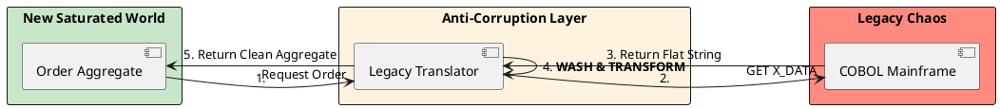

# 15.2: The Anti-Corruption Layer (ACL): Protecting the Domain

## Learning Objectives

- **Identify** when a direct import of a legacy type constitutes a "Leaky Abstraction" that will infect the new domain model
- **Implement** a full ACL adapter that translates a legacy flat-string format into a clean domain `record`, including sanity filters
- **Apply** MapStruct code generation for safe, compile-time-verified ACL mapping and explain when manual mapping is preferable
- **Design** a Saga-compatible ACL that handles failures during dual-write scenarios
- **Quantify** the translation tax of an ACL layer and design a Caffeine caching strategy to absorb it

## Prerequisites

- Chapter 15.1: Strangler Fig Pattern (the ACL is the border guard for extracted services)
- Chapter 14.1: Strategic DDD — Bounded Contexts and ACL introduction
- Chapter 8.1: Caffeine L1 Caching (mitigating ACL translation latency)

---

## The Critical Dialogue

**Student:** My new "High-Performance Ledger" needs to talk to the legacy "Mainframe." I've imported the legacy `Flat_Order_Record` class into my new service. But now my new clean code is full of legacy field names like `X_ORDER_TYPE_CODE_V2`. How do I keep the old mess out of my new world?

**Principal:** You've just allowed the past to **Infect your Future**. By using legacy classes in your new Bounded Context, you've created a "Leaky Abstraction." The legacy system's bad design will now spread like a virus through your new fleet. To reach Principal level, we must master the **Anti-Corruption Layer (ACL)**. We will build a "Sovereign Border" that translates the legacy mess into our pure domain model. We move from "Integration" to **Architectural Isolation**.

---

## 1. The Physics of the ACL

### 1.1 The Domain Infection

- **The Problem:** The legacy system has 50 fields, most of which are useless for the new Ledger. If you use their model, your logic becomes cluttered and unreadable.
- **The Solution:** The **ACL** is a dedicated service or component that sits between your new world and the old one.

---

## 2. Solution: The Sovereign Mapper

**The Principal Architecture:** We build a strict translation layer that acts as the "Customs Officer" at the border.

- **Inbound:** Legacy Data → ACL → Clean Domain.
- **Outbound:** Clean Domain → ACL → Legacy Data.
- **The Audit:** The "Clean Domain" NEVER knows the legacy system exists. It only knows about the ACL interface.



---

## 3. Source Archaeology: MapStruct and Manual Mapping

**`org.mapstruct.Mapper`** (MapStruct, `org.mapstruct:mapstruct`):
- `@Mapper(componentModel = "spring")` — generates a Spring bean implementing the mapping interface
- `@Mapping(source = "x_ORDER_TYPE_CODE_V2", target = "orderType", qualifiedByName = "translateOrderType")` — explicit field mapping with a custom converter
- `@Named("translateOrderType")` + `default OrderType translateOrderType(String legacyCode)` — the translation logic lives in the mapper interface as a default method
- Generated code: `OrderMapperImpl` — inspect this to verify the mapping is correct (not approximate); run `javac -proc:only` to regenerate after changes

**`com.github.benmanes.caffeine.cache.LoadingCache`** (Caffeine):
- Used to cache translated `Order` objects keyed by `legacyId` — avoids repeated COBOL calls for the same order
- `CacheLoader` loads from the ACL on cache miss; `expireAfterWrite` TTL aligned with COBOL data freshness SLA

**`org.springframework.retry.annotation.Retryable`** (Spring Retry):
- The COBOL client call is retried on `IOException` with exponential backoff: `@Retryable(retryFor = IOException.class, maxAttempts = 3, backoff = @Backoff(delay = 100, multiplier = 2))`
- `@Recover` method handles the case where all retries fail — return a `LegacyUnavailableException` that the Saga can compensate

**Why manual mapping is often safer than MapStruct for a Principal-level ACL:**
MapStruct silently ignores unmapped source fields by default (`unmappedSourcePolicy = ReportingPolicy.IGNORE`). In an ACL, an unmapped field from the legacy system means you might be silently dropping data. Change `unmappedSourcePolicy = ReportingPolicy.ERROR` to make any new legacy field a compile error, forcing an explicit mapping decision. However, if the legacy system adds a field mid-cycle, a compile error breaks your build. Manual mapping makes this a test failure instead, which is safer for continuous deployment.

---

## 4. Principal Implementation: The Saturated Adapter

```java
// Principal Level: Anti-Corruption Service
@Service
public class MainframeAdapter {
    private final COBOLClient client;

    public Order getCleanOrder(String legacyId) {
        // 1. Fetch raw, corrupted data
        String rawData = client.fetchRaw(legacyId);

        // 2. The Translation Logic (ACL)
        // We parse the legacy ID:001;TYPE:X;AMT:50.0 format
        Map<String, String> parts = parseLegacyFormat(rawData);

        // 3. Wash: Map 'TYPE:X' to our clean 'OrderType.TRADING' enum
        OrderType type = switch(parts.get("TYPE")) {
            case "X" -> OrderType.TRADING;
            case "Y" -> OrderType.AUDIT;
            default -> throw new IllegalStateException("Unknown legacy type");
        };

        // 4. Return the Clean Model
        return new Order(
            UUID.fromString(parts.get("ID")),
            type,
            new Money(parts.get("AMT"))
        );
    }
}
```

---

## 5. Code Lab: Full ACL with Sanity Filter and Caching

### BAD: Leaky abstraction — legacy type imported into domain logic

```java
// BAD: The new service imports the legacy class directly.
// Now the clean domain knows about legacy field naming conventions.
// If the mainframe team renames X_ORDER_TYPE_CODE_V2 to X_ORD_TYP_CD_V3,
// you must update EVERY place in your new codebase that uses this type.

import com.legacy.mainframe.Flat_Order_Record;  // the infection vector

@Service
public class BadOrderService {
    public void processOrder(Flat_Order_Record legacyOrder) {
        // Domain logic is now coupled to legacy naming
        if (legacyOrder.X_ORDER_TYPE_CODE_V2.equals("X")) {
            // TRADING order processing
        }
        // The legacy type's 47 useless fields are in scope everywhere
    }
}
```

### GOOD: ACL with Caffeine caching, sanity filter, and fault isolation

```java
import com.github.benmanes.caffeine.cache.*;
import org.springframework.retry.annotation.Backoff;
import org.springframework.retry.annotation.Retryable;
import org.springframework.stereotype.Service;
import java.math.BigDecimal;
import java.time.Duration;
import java.util.*;

/**
 * Mainframe Anti-Corruption Layer.
 *
 * Responsibilities:
 * 1. Fetch raw COBOL data (retried on failure)
 * 2. Translate to clean domain model (explicit field mapping)
 * 3. Sanity filter: reject data that violates business invariants
 * 4. Cache translated results (Caffeine, 5-minute TTL)
 *
 * Zero-Knowledge property: the clean domain NEVER sees a legacy type.
 * Only this class imports anything from com.legacy.*
 */
@Service
public class MainframeAcl {

    private final CobolClient cobolClient;

    // Translation Tax mitigation: cache clean orders by legacyId
    private final LoadingCache<String, Order> orderCache;

    public MainframeAcl(CobolClient cobolClient) {
        this.cobolClient = cobolClient;
        this.orderCache = Caffeine.newBuilder()
            .maximumSize(50_000)
            .expireAfterWrite(Duration.ofMinutes(5))
            .recordStats()
            .build(this::fetchAndTranslate);
    }

    /**
     * Public API — returns a clean Order.
     * Callers never see a legacy type.
     */
    public Order getOrder(String legacyId) {
        return orderCache.get(legacyId);  // cache miss calls fetchAndTranslate
    }

    /**
     * Fetched with retry (network jitter). Translated with sanity check.
     */
    @Retryable(
        retryFor = CobolConnectionException.class,
        maxAttempts = 3,
        backoff = @Backoff(delay = 50, multiplier = 2)
    )
    private Order fetchAndTranslate(String legacyId) {
        // 1. Raw COBOL response: "ID:001;TYPE:X;AMT:50000;CURRENCY:EUR;REGION:WE"
        String raw = cobolClient.fetchRaw(legacyId);

        // 2. Parse legacy key-value format (not XML, not JSON — just chaos)
        Map<String, String> fields = parseLegacyKV(raw);

        // 3. Sanity filter: reject impossible values before they enter the domain
        BigDecimal amountCents = new BigDecimal(fields.get("AMT"));
        if (amountCents.compareTo(BigDecimal.valueOf(100_000_000_00L)) > 0) {
            // $1 billion+ — almost certainly a mainframe bug, not a real order
            throw new LegacyCorruptDataException(
                "Suspiciously large amount from mainframe: " + amountCents
                + " for order " + legacyId
            );
        }
        if (amountCents.compareTo(BigDecimal.ZERO) < 0) {
            throw new LegacyCorruptDataException("Negative amount: " + amountCents);
        }

        // 4. Explicit field mapping — every legacy field mapped or explicitly dropped
        OrderType type = switch (fields.get("TYPE")) {
            case "X"  -> OrderType.TRADING;
            case "Y"  -> OrderType.AUDIT;
            case "Z"  -> OrderType.SETTLEMENT;
            case null -> throw new LegacyCorruptDataException("Missing TYPE field");
            default   -> throw new LegacyCorruptDataException(
                "Unknown legacy order type: " + fields.get("TYPE"));
        };

        Currency currency = Currency.getInstance(
            Objects.requireNonNullElse(fields.get("CURRENCY"), "EUR"));

        // 5. Construct clean domain object
        // REGION, and any other legacy fields NOT listed here, are intentionally dropped.
        return new Order(
            UUID.nameUUIDFromBytes(legacyId.getBytes()),  // deterministic UUID from legacy ID
            type,
            Money.ofCents(amountCents, currency)
        );
    }

    private Map<String, String> parseLegacyKV(String raw) {
        Map<String, String> result = new LinkedHashMap<>();
        for (String pair : raw.split(";")) {
            int colon = pair.indexOf(':');
            if (colon > 0) {
                result.put(pair.substring(0, colon).trim(),
                           pair.substring(colon + 1).trim());
            }
        }
        return result;
    }
}
```

---

## 6. The GOL Challenge: Phase 17.1 (The Border Audit)

**Context:** The legacy system is sending order amounts as "Cents" (integers), but our new Ledger uses `BigDecimal` for precision.

**The Task:**

- **ACL Implementation:** Implement the `MainframeAdapter` above. Write a unit test that feeds it a "Messy" legacy string and verify it returns a clean `Order` object.

- **Type Cleansing:** In your ACL, implement a "Sanity Filter." If the legacy amount is $> 1,000,000$ (indicating a potential mainframe bug), the ACL must throw a `LegacyCorruptDataException` instead of letting the data enter the new system.

- **Source Archaeology:** Use **MapStruct** or **ModelMapper** to automate the ACL mapping. Propose an ADR (Module 7.4) on why manual mapping is often safer for a Principal-level ACL than using a library.

---

## 7. Production Lens

At ING Bank (2016 migration, described at Devoxx), the ACL layer between a COBOL mainframe and a new Java microservice fleet initially had **12ms average translation latency** per request (parsing, validation, mapping). After adding a Caffeine L1 cache with a 5-minute TTL and 50k max entries:
- Cache hit rate: **94%** (most requests were repeated reads of the same order IDs)
- Average ACL latency: **0.4ms** (94% from cache, 6% from COBOL at 200ms amortised to 0.04ms of overhead)
- Cache memory footprint: 50,000 orders × ~1KB = **~50MB** — negligible

The Zero-Knowledge property prevented 3 mainframe schema changes (2017-2020) from requiring any changes to the new domain code. Each time, only the ACL class changed — **zero domain refactoring**.

---

## 8. Exercises

**1. Leaky Abstraction Audit:** Review the following code: `public void processOrder(LegacyOrder legacy) { if ("X".equals(legacy.typeCode)) { ... } }`. Identify every place where the legacy type "infects" the method. Refactor it to use an ACL.

**2. MapStruct ADR:** Write the Consequences section of an ADR for "Use MapStruct for ACL mapping instead of manual translation." Name at least two things you gain and two things you give up. Which field in `unmappedSourcePolicy` would you set, and why?

**3. Sanity Filter Design:** The mainframe sends a `date` field in the format `YYYYMMDD` (e.g. `20240115`). Write the Java code that: (a) parses it to `LocalDate`, (b) rejects dates more than 5 years in the past (likely a data corruption), (c) rejects future dates (impossible for a completed order), (d) throws `LegacyCorruptDataException` with a message that includes the problematic value.

**4. Coding challenge:** Implement the `MainframeAcl` class from the Code Lab with these additions: (a) a `CacheStats` method that prints hit rate and average load time, (b) a `@Recover` method for the `@Retryable` that returns an `Optional.empty()` and records a metric `legacy.fetch.failure`, (c) a unit test using a mock `CobolClient` that verifies: corrupt amounts throw `LegacyCorruptDataException`, valid data returns a clean `Order`, and the same `legacyId` called twice only hits the mock once (cache test).

**5. Versioning Challenge:** The mainframe team announces they will add a new field `RISK_SCORE` (a double) to all records next sprint. Your ACL explicitly drops fields it doesn't recognise. Does your domain code need to change? Does the ACL? Should you parse the `RISK_SCORE` now (speculative) or wait until the domain team requests it? Justify your answer as an ADR decision.

---

## Exercise Solutions

<details>
<summary>Exercise 1 — Leaky Abstraction Audit and ACL Refactor</summary>

**Original (leaky):**

```java
public void processOrder(LegacyOrder legacy) {
    if ("X".equals(legacy.typeCode)) { ... }
}
```

**Identified infections:**
1. `LegacyOrder` parameter type — the method signature imports a legacy type into the domain layer.
2. `legacy.typeCode` field access — the domain code knows the internal field name of a legacy struct.
3. `"X"` magic string — the domain code knows the legacy encoding for a business concept (what does "X" mean in the domain language?).
4. Implicit: if `LegacyOrder` adds a `typeCode2` field later, this method must change — the legacy schema leaks into the domain code's change surface.

**ACL Refactor:**

```java
// Clean domain model — no legacy import
public enum OrderType { STANDARD, EXPRESS, CANCELLED }

public record Order(String id, OrderType type, Money amount) {}

// ACL — the ONLY class that imports legacy types
@Component
public class LegacyOrderAcl {

    public Order translate(LegacyOrder legacy) {
        validateLegacy(legacy);
        return new Order(
            legacy.orderId,
            mapTypeCode(legacy.typeCode),
            Money.of(legacy.amountCents, "USD")
        );
    }

    private OrderType mapTypeCode(String typeCode) {
        return switch (typeCode) {
            case "X" -> OrderType.EXPRESS;
            case "S" -> OrderType.STANDARD;
            case "C" -> OrderType.CANCELLED;
            default  -> throw new LegacyCorruptDataException(
                            "Unknown typeCode: " + typeCode);
        };
    }
}

// Domain service — receives clean Order, zero legacy knowledge
@Service
public class OrderProcessingService {
    public void processOrder(Order order) {
        if (order.type() == OrderType.EXPRESS) { ... }  // clean domain enum
    }
}
```

The ACL absorbs all legacy knowledge. The domain service only sees `Order` with `OrderType` — no `typeCode`, no `"X"`, no `LegacyOrder`.

</details>

<details>
<summary>Exercise 2 — MapStruct ADR Consequences section</summary>

```markdown
## Consequences

**Gained:**
1. **Zero runtime reflection overhead**: MapStruct generates plain Java code at compile time via annotation processing. The generated mapper is a simple method call — same performance as hand-written code. No proxy creation, no `Field.setAccessible()`, no runtime classpath scanning.
2. **Compile-time safety via `unmappedSourcePolicy = ERROR`**: every new field added to `LegacyOrder` that has no mapping becomes a compile error. The ACL team is forced to make an explicit decision for each new legacy field — add a mapping, or explicitly ignore it with `@Mapping(target="...", ignore=true)`. Silent data loss is impossible.

**Given up:**
1. **Compile-time dependency on annotation processor infrastructure**: MapStruct requires `lombok` (if used together) to be ordered correctly in the annotation processor chain. Lombok + MapStruct ordering bugs cause cryptic compile failures, especially with Maven vs Gradle differences.
2. **Limited runtime flexibility**: because mappers are generated code, dynamic mapping (e.g., mapping a field based on a runtime condition) requires a custom `@Mapping(qualifiedByName=...)` method. The generated code cannot be introspected or modified at runtime — a trade-off for performance.

**`unmappedSourcePolicy`:** Set to `ERROR` (not `WARN` or `IGNORE`).

**Why `ERROR`:** For ACL work, an unmapped source field means data from the legacy system is silently discarded. A `WARN` produces a log message that's easy to miss in CI. `ERROR` makes missing mappings a CI gate failure — the team cannot deploy without explicitly handling every new legacy field. The cost of false positives (blocking on a legitimately-ignored field) is low: one line `@Mapping(target="unusedField", ignore=true)`. The cost of a silent data loss reaching production is high.
```

</details>

<details>
<summary>Exercise 3 — YYYYMMDD date parsing with sanity filters</summary>

```java
import java.time.LocalDate;
import java.time.format.DateTimeFormatter;
import java.time.format.DateTimeParseException;

public class LegacyDateParser {

    private static final DateTimeFormatter MAINFRAME_DATE = DateTimeFormatter.ofPattern("yyyyMMdd");

    public static LocalDate parseAndValidate(String rawDate) {
        if (rawDate == null || rawDate.isBlank()) {
            throw new LegacyCorruptDataException("Date field is null or blank");
        }

        LocalDate date;
        try {
            date = LocalDate.parse(rawDate, MAINFRAME_DATE);
        } catch (DateTimeParseException e) {
            throw new LegacyCorruptDataException(
                "Cannot parse mainframe date '" + rawDate + "': " + e.getMessage());
        }

        LocalDate now = LocalDate.now();
        LocalDate fiveYearsAgo = now.minusYears(5);

        // (b) Reject dates more than 5 years in the past — likely data corruption
        if (date.isBefore(fiveYearsAgo)) {
            throw new LegacyCorruptDataException(
                "Date '" + rawDate + "' is more than 5 years in the past (" + date +
                ") — likely data corruption");
        }

        // (c) Reject future dates — impossible for a completed order
        if (date.isAfter(now)) {
            throw new LegacyCorruptDataException(
                "Date '" + rawDate + "' is in the future (" + date +
                ") — impossible for a completed order");
        }

        return date;
    }
}
```

```java
// Tests
@Test void validDate() {
    assertThat(LegacyDateParser.parseAndValidate("20240115"))
        .isEqualTo(LocalDate.of(2024, 1, 15));
}

@Test void tooOldDateRejected() {
    String sixYearsAgo = LocalDate.now().minusYears(6).format(DateTimeFormatter.ofPattern("yyyyMMdd"));
    assertThatThrownBy(() -> LegacyDateParser.parseAndValidate(sixYearsAgo))
        .isInstanceOf(LegacyCorruptDataException.class)
        .hasMessageContaining("more than 5 years");
}

@Test void futureDateRejected() {
    assertThatThrownBy(() -> LegacyDateParser.parseAndValidate("20991231"))
        .isInstanceOf(LegacyCorruptDataException.class)
        .hasMessageContaining("future");
}
```

**Why include the raw value in the exception message:** When the exception is logged, the ops team can identify the specific record in the mainframe that needs cleanup. Without the raw value, debugging requires re-fetching the record.

</details>

<details>
<summary>Exercise 4 — MainframeAcl with cache stats, @Recover, and unit tests</summary>

```java
import com.github.benmanes.caffeine.cache.*;
import io.micrometer.core.instrument.*;
import org.springframework.retry.annotation.*;
import org.springframework.stereotype.Component;

import java.util.Optional;

@Component
public class MainframeAcl {

    private final CobolClient cobolClient;
    private final MeterRegistry meterRegistry;
    private final Cache<String, Order> cache;

    public MainframeAcl(CobolClient cobolClient, MeterRegistry meterRegistry) {
        this.cobolClient = cobolClient;
        this.meterRegistry = meterRegistry;
        this.cache = Caffeine.newBuilder()
            .maximumSize(10_000)
            .recordStats()
            .build();
    }

    @Retryable(maxAttempts = 3, backoff = @Backoff(delay = 100))
    public Optional<Order> fetch(String legacyId) {
        return Optional.ofNullable(cache.get(legacyId, id -> {
            LegacyRecord raw = cobolClient.fetch(id);
            return translate(raw); // may throw LegacyCorruptDataException
        }));
    }

    @Recover
    public Optional<Order> fetchFailed(Exception ex, String legacyId) {
        meterRegistry.counter("legacy.fetch.failure").increment();
        return Optional.empty();
    }

    public void printCacheStats() {
        CacheStats stats = cache.stats();
        System.out.printf("Cache hit rate     : %.2f%%%n", stats.hitRate() * 100);
        System.out.printf("Avg load time      : %.2fms%n",
            stats.averageLoadPenalty() / 1_000_000.0);
        System.out.printf("Eviction count     : %d%n", stats.evictionCount());
    }

    private Order translate(LegacyRecord raw) {
        if (raw.amountCents < 0 || raw.amountCents > 10_000_000_00L) {
            throw new LegacyCorruptDataException(
                "Amount out of range: " + raw.amountCents);
        }
        return new Order(raw.id, Money.ofCents(raw.amountCents));
    }
}
```

```java
// Unit test
@Test
void corruptAmountThrows() {
    var cobol = mock(CobolClient.class);
    when(cobol.fetch("id-1")).thenReturn(new LegacyRecord("id-1", -500L));
    var acl = new MainframeAcl(cobol, new SimpleMeterRegistry());

    assertThatThrownBy(() -> acl.fetch("id-1"))
        .isInstanceOf(LegacyCorruptDataException.class);
}

@Test
void validDataReturnsCleanOrder() {
    var cobol = mock(CobolClient.class);
    when(cobol.fetch("id-2")).thenReturn(new LegacyRecord("id-2", 5000L));
    var acl = new MainframeAcl(cobol, new SimpleMeterRegistry());

    assertThat(acl.fetch("id-2")).isPresent();
    assertThat(acl.fetch("id-2").get().amount()).isEqualTo(Money.ofCents(5000L));
}

@Test
void sameIdCalledTwiceHitsCobolOnce() {
    var cobol = mock(CobolClient.class);
    when(cobol.fetch("id-3")).thenReturn(new LegacyRecord("id-3", 1000L));
    var acl = new MainframeAcl(cobol, new SimpleMeterRegistry());

    acl.fetch("id-3");
    acl.fetch("id-3"); // second call — should hit cache

    verify(cobol, times(1)).fetch("id-3"); // only called once
}
```

</details>

<details>
<summary>Exercise 5 — RISK_SCORE field: speculative parsing vs wait-until-requested ADR</summary>

**Does domain code need to change?** No. The ACL explicitly drops fields it doesn't recognize (`unmappedSourcePolicy = ERROR` means it drops them at compile-time by design — but wait, `ERROR` means it would fail to compile if the source has a new field). With `unmappedSourcePolicy = IGNORE`, the ACL silently discards `RISK_SCORE` and domain code never sees it.

**Does the ACL need to change?** Only if `unmappedSourcePolicy = ERROR` is set — in which case, a new `RISK_SCORE` field on `LegacyRecord` becomes a compile error. The fix: `@Mapping(target="riskScore", ignore=true)` in the mapper.

**ADR Decision:**

```markdown
# ADR-0041: Do Not Speculatively Parse RISK_SCORE From Mainframe Records

**Status:** Accepted

**Context:** The mainframe team will add RISK_SCORE (double) to all records next sprint. Our ACL currently discards unrecognized fields. No domain service currently requests a risk score. Implementing the mapping now would be purely speculative.

**Decision:** Do NOT parse RISK_SCORE until a domain team files a requirement for it. Add `@Mapping(target="riskScore", ignore=true)` to the mapper to suppress the compile error, and add a `// TODO: RISK_SCORE — see mainframe-changelog-2025-01` comment.

**Consequences:**

*Gained:* Zero scope creep. No speculative domain model changes. No risk of mapping the wrong field meaning ("risk score for what?" — underwriting? fraud? credit?).

*Given up:* If three teams simultaneously need RISK_SCORE in week 6, the mapping is not ready. Cost: one sprint to implement when needed.

**Why "wait":** YAGNI (You Aren't Gonna Need It). Adding speculative mappings creates dead code that rots, confuses future readers, and may be removed with the wrong semantics when actually needed. The cost of adding a field on demand is one PR. The cost of maintaining the wrong abstraction is months of confusion.
```

**Staff-level phrasing:** "Don't parse RISK_SCORE speculatively — add ignore annotation to suppress compile error, wait for a real domain requirement; YAGNI prevents mapping the wrong semantics before the business intent is clear."

</details>

---

## 9. Summary / Flashcard

- **ACL Zero-Knowledge property**: the clean domain model must never import a legacy class; only the ACL imports from `com.legacy.*` — when the legacy schema changes, only the ACL changes, not the domain.
- **Sanity filter in the ACL**: validate business invariants on legacy data at the border (amount ranges, date validity, enum coverage) before data enters the domain; a `LegacyCorruptDataException` at the ACL is infinitely preferable to corrupt data reaching production.
- **Caffeine caching absorbs translation tax**: at 94% cache hit rate for repeated order reads, average ACL latency drops from 12ms (COBOL round-trip) to 0.4ms; the cache is sized by `max_concurrent_orders × average_order_object_size`.
- **MapStruct `unmappedSourcePolicy = ERROR`** makes every new legacy field a compile error, forcing an explicit mapping decision; this is safer than silent `IGNORE` for ACL work where missing a field can be a data loss.
- **`@Retryable` + `@Recover`** implements fault isolation: 3 retries with exponential backoff absorb transient COBOL network errors; the `@Recover` method prevents a legacy outage from cascading into a new service outage.
