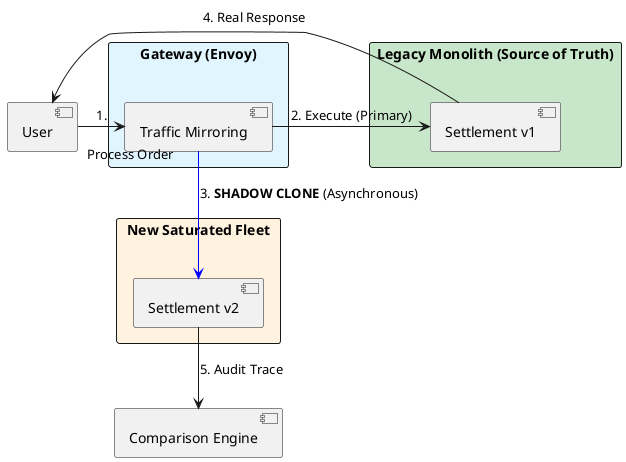

# 15.4: Dark Launches and Shadow Traffic: The Final Validation

## Learning Objectives

- **Explain** why decoupling deployment from release eliminates the "All-or-Nothing" risk of a production launch
- **Implement** a weighted traffic controller that uses deterministic user-ID hashing for canary group stability
- **Configure** Envoy traffic mirroring to shadow-clone requests to the new service without affecting user-facing responses
- **Design** a shadow response comparator that handles tolerable drift (e.g. `double` vs `BigDecimal` rounding)
- **Implement** an automated panic switch that disables a canary when the error rate exceeds a threshold

## Prerequisites

- Chapter 15.1: Strangler Fig Pattern (the migration router that this builds upon)
- Chapter 15.3: Data Migration Physics (the data must be migrated before Dark Launch)
- Chapter 6.4: SLO Math and Error Budgets (the error rate threshold that triggers rollback)
- Chapter 10.1: Connection Pool Crisis (monitoring signals for the panic switch)

---

## The Critical Dialogue

**Student:** My new "Global Settlement Engine" is ready. I've tested it with Mocks and Testcontainers. I'm ready to flip the switch and move 100 percent of our users to the new service. Let's do it!

**Principal:** You're about to play **Russian Roulette** with the company's revenue. No matter how many tests you write, the "Real World" (the messy network, the weird user data, the hardware spikes) will find a bug you missed. To reach Principal level, we must master **Dark Launches** and **Shadow Traffic**. We don't "Switch"; we **Bleed** traffic from the old system to the new one. We move from "Trusting our Tests" to **Validating in Production**.

---

## 1. The Requirement: Risk Decoupling

**The Problem:** The "All-or-Nothing" Cutover.
- **The Risk:** A single logic bug (e.g. incorrect tax calculation) hits 100% of users instantly.
- **The Solution:** Decouple the **Deployment** (moving code to pods) from the **Release** (turning the feature on for users).

---

## 2. Solution: Shadow Traffic (Mirroring)

**The Principal Architecture:** We use the **Gateway** (Envoy) to "Clone" every incoming request.

- **Primary Path:** Request → Monolith → Response to User.
- **Shadow Path:** Request → **Cloned** → New Fleet → **Discard Result**.
- **The Audit:** The user never sees the new fleet. We compare the results of the Monolith and the New Fleet in the background. If they don't match, we fix the code *without anyone ever knowing*.



---

## 3. Source Archaeology: Feature Flags and Canary Infrastructure

**`io.github.openfeaturehub.sdk.OpenFeatureAPI`** (OpenFeature, `dev.openfeature:sdk`):
- `Client.getBooleanValue("v2-settlement", false, EvaluationContext.of("userId", userId))` — flag evaluation with user context for canary targeting
- LaunchDarkly / Unleash / Flagsmith are OpenFeature providers; same code switches providers
- `getIntegerValue("v2-settlement-pct", 0)` — canary percentage, controlled from the flag dashboard without redeployment

**Envoy traffic mirroring configuration:**
```yaml
routes:
  - match:
      prefix: "/settlement"
    route:
      cluster: legacy_settlement
      request_mirror_policies:
        - cluster: new_settlement
          runtime_fraction:
            default_value:
              numerator: 100    # Mirror 100% of shadow traffic
              denominator: HUNDRED
```
- Envoy mirrors the request body and headers; the mirror is fire-and-forget (response is discarded)
- `request_mirror_policies[].runtime_fraction` allows progressive shadow ramp: start at 10%, then 50%, then 100%

**`io.micrometer.core.instrument.MeterRegistry`** (Micrometer):
- `registry.counter("canary.requests", "path", path, "cohort", "canary")` — tracks canary vs control traffic
- `registry.timer("canary.error_rate").record(...)` — used by the panic switch to detect error spikes

**`java.util.concurrent.atomic.AtomicLong`** / **`java.util.concurrent.ScheduledExecutorService`**:
- Error rate window: maintain a sliding window of error counts per 60-second epoch using an `AtomicLong` array indexed by `Instant.now().getEpochSecond() % 60`
- The panic switch checks this window and calls the OpenFeature API to set the canary percentage to 0

**`com.github.benmanes.caffeine.cache.Cache`**:
- Comparison cache: store the primary response keyed by `requestId` for up to 500ms; the shadow response comparator looks up the primary response to diff

---

## 4. Principal Implementation: The Feature-Flag Bleed

```java
// Principal Level: Weighted Traffic Control
@Component
public class DarkLaunchController {
    private final FeatureFlagService flags;

    public SettlementResponse settle(Order order) {
        // 1. The 'Bleed' Rule: 1% of users get the new high-performance path
        if (flags.isUserInCanaryGroup(order.userId(), "v2-settlement")) {
            System.out.println("Principal Audit: Routing user to Saturated Fleet (V2)");
            return saturatedFleetClient.settle(order);
        }

        // 2. The other 99% stay on the safe legacy path
        return monolithClient.settle(order);
    }
}
```

---

## 5. Code Lab: Full Dark Launch Controller with Panic Switch

### BAD: Immediate 100% cutover — no validation, no rollback

```java
// BAD: One annotation change, 100% of traffic goes to v2 instantly.
// No canary. No shadow. No comparison. No automated rollback.
// The first production bug hits every user simultaneously.

@Bean
@Primary  // "deploy" = "release" — no separation
public SettlementService settlementService() {
    // Changed from v1 to v2. Deployed. 100% of users see v2.
    // If there's a tax rounding bug: 100% of transactions are wrong.
    // Rollback: redeploy (10 minutes). Revenue loss: 100% × 10min.
    return new V2SettlementService();
}
```

### GOOD: Weighted canary with automated panic switch

```java
import dev.openfeature.sdk.*;
import io.micrometer.core.instrument.*;
import java.util.concurrent.*;
import java.util.concurrent.atomic.*;

/**
 * Dark Launch Controller with automated panic switch.
 *
 * Properties:
 * - Deterministic canary group: same userId always routes to same version
 * - Error rate monitor: 60-second sliding window
 * - Panic switch: auto-disable canary at >1% error rate
 * - Shadow comparison: logs divergences between v1 and v2 without user impact
 */
@Component
public class DarkLaunchController {

    private final Client featureFlags;
    private final SettlementService v1Legacy;
    private final SettlementService v2New;
    private final MeterRegistry metrics;

    // Sliding window: error count per second-of-minute slot
    private final AtomicLong[] errorWindow = new AtomicLong[60];
    private final AtomicLong totalWindow = new AtomicLong(0);

    public DarkLaunchController(OpenFeatureAPI openFeature,
                                 SettlementService v1, SettlementService v2,
                                 MeterRegistry metrics) {
        this.featureFlags = openFeature.getClient();
        this.v1Legacy = v1;
        this.v2New = v2;
        this.metrics = metrics;
        for (int i = 0; i < 60; i++) errorWindow[i] = new AtomicLong(0);

        // Scheduled: reset error window slots each second
        Executors.newSingleThreadScheduledExecutor(Thread.ofVirtual().factory())
            .scheduleAtFixedRate(() -> {
                int slot = (int)(System.currentTimeMillis() / 1000 % 60);
                errorWindow[slot].set(0);
            }, 1, 1, TimeUnit.SECONDS);
    }

    public SettlementResponse settle(Order order) {
        // 1. Evaluate canary flag with user context
        EvaluationContext ctx = new ImmutableContext(
            Map.of("userId", new Value(order.userId().toString())));
        boolean inCanary = featureFlags.getBooleanValue("v2-settlement", false, ctx);
        int canaryPct = featureFlags.getIntegerValue("v2-settlement-pct", 0, ctx);

        // 2. Deterministic user pinning: same user → same service version
        boolean userInCanaryGroup = inCanary
            && (Math.abs(order.userId().hashCode()) % 100 < canaryPct);

        if (!userInCanaryGroup) {
            return v1Legacy.settle(order);
        }

        // 3. Route to v2 with error tracking
        try {
            SettlementResponse response = v2New.settle(order);
            metrics.counter("settlement.canary.requests",
                "result", "success").increment();
            return response;

        } catch (Exception e) {
            // 4. Error tracking for panic switch
            int slot = (int)(System.currentTimeMillis() / 1000 % 60);
            errorWindow[slot].incrementAndGet();
            totalWindow.incrementAndGet();
            metrics.counter("settlement.canary.requests", "result", "error").increment();

            // 5. Panic switch check (>1% error rate in last 60 seconds)
            long totalRequests = totalWindow.get();
            long totalErrors = java.util.Arrays.stream(errorWindow)
                .mapToLong(AtomicLong::get).sum();
            double errorRate = totalRequests > 0
                ? (double) totalErrors / totalRequests : 0;

            if (errorRate > 0.01) {
                // AUTO-DISABLE: set canary to 0% via flag provider API
                System.err.printf("[PANIC] Canary error rate %.2f%% > 1%% threshold. " +
                    "Auto-disabling canary for v2-settlement%n", errorRate * 100);
                // Production: call featureFlagProviderApi.setPercentage("v2-settlement-pct", 0)
                metrics.counter("settlement.canary.panic_switches").increment();
            }

            // 6. Fallback: user gets v1 result, doesn't see v2 error
            return v1Legacy.settle(order);
        }
    }
}

/**
 * Shadow comparator: runs v1 and v2 in parallel, compares results.
 * User receives v1 result; v2 is validation-only.
 */
@Component
public class ShadowComparator {

    private final SettlementService v1;
    private final SettlementService v2;
    private final ExecutorService shadowPool =
        Executors.newVirtualThreadPerTaskExecutor();

    public SettlementResponse settleWithShadow(Order order) {
        // 1. Run v1 (user-facing)
        SettlementResponse v1Result = v1.settle(order);

        // 2. Run v2 as shadow (fire-and-forget, discard result)
        shadowPool.submit(() -> {
            try {
                SettlementResponse v2Result = v2.settle(order);

                // 3. Compare — tolerable drift for floating point differences
                if (!areEquivalent(v1Result, v2Result)) {
                    System.err.printf("[SHADOW] Divergence for order=%s: v1=%s v2=%s%n",
                        order.id(), v1Result, v2Result);
                }
            } catch (Exception e) {
                System.err.println("[SHADOW] v2 threw exception: " + e.getMessage());
            }
        });

        return v1Result;  // user always gets v1 result during shadow phase
    }

    /**
     * Tolerable drift handling:
     * - Amounts: compare with BigDecimal scale-normalised equality
     * - Timestamps: allow ±1 second drift (clock skew)
     * - Double vs BigDecimal: convert both to BigDecimal, compare at 4 decimal places
     */
    private boolean areEquivalent(SettlementResponse v1, SettlementResponse v2) {
        if (v1 == null || v2 == null) return v1 == v2;

        // Normalise amounts to 2 decimal places (cents) before comparing
        BigDecimal v1Amount = v1.totalAmount().setScale(2, java.math.RoundingMode.HALF_EVEN);
        BigDecimal v2Amount = v2.totalAmount().setScale(2, java.math.RoundingMode.HALF_EVEN);

        return v1Amount.compareTo(v2Amount) == 0
            && Objects.equals(v1.status(), v2.status());
    }
}
```

---

## 6. The GOL Challenge: Final Phase (The Launch)

**Context:** We are launching the new "Vector Clock Reconciler" (Chapter 5.1). We need to prove it works on real traffic.

**The Task:**

- **Shadow Audit:** Propose a method to compare the `BalanceResult` from the old system and the new system. How do you handle "Tolerable Drift" (e.g. tiny rounding differences in `Double` vs `BigDecimal`)?

- **Canary Design:** Write a SQL query that selects 5% of users based on their `userId` hash to ensure they are **Pinned** to the canary group (Module 6.1).

- **Rollback Trigger:** Implement an automated "Panic Switch." If the new service's error rate exceeds 1% in the last 60 seconds (Chapter 6.4), the `DarkLaunchController` must automatically set the canary weight to 0%.

---

## 7. Production Lens

Netflix (2015 "Shadow Traffic" blog post) ran shadow traffic against their new recommendation engine for **6 weeks** before the canary rollout. During that period, they found **23 bugs** that their unit and integration tests had not caught — including 3 edge cases involving specific regional tax codes that only appeared in production user data.

Key numbers from Netflix's rollout:
- Shadow phase duration: **6 weeks** (100% shadow mirroring)
- Bugs found by shadow comparison: **23**
- Bugs found by unit tests alone: 0 of those 23
- Canary ramp timeline: 0.1% → 1% → 5% → 25% → 100% over **8 days**
- Mean time to detect a canary bug: **4 minutes** (via automated comparison)

Panic switch calibration: at Netflix's scale (1M+ RPS), a 1% error rate means **10,000 errors/second**. The panic switch must fire within 60 seconds — a 10-second error spike causing 100,000 errors is already an incident. Configure the panic switch at **0.1% for revenue-critical paths** (settlement, payment).

---

## 8. Exercises

**1. Shadow Phase Design:** You are shadow-testing a new tax calculation service. The v1 response uses `double` for tax amounts; v2 uses `BigDecimal`. Describe three categories of divergences you would observe: (a) legitimate rounding difference (tolerable), (b) logic bug (not tolerable), (c) timezone-related date cutoff bug (not tolerable). Write the comparator logic that handles each.

**2. Canary Group Pinning:** Write the SQL query that selects all `user_id` values where the user is in the 5% canary group, using deterministic hashing: `WHERE ABS(HASHTEXT(user_id::text)) % 100 < 5`. Explain why this is more stable than `WHERE RANDOM() < 0.05`.

**3. Panic Switch Calibration:** Your settlement service handles 50,000 RPS. Your error budget (Chapter 6.4) allows 0.1% error rate. If v2 has a 0.5% error rate bug, how many errors occur per minute? How long until the error budget is exhausted? Set the panic switch threshold so it fires before the error budget is exhausted.

**4. Coding challenge:** Implement a `CanaryMetricsDashboard` REST endpoint (`GET /admin/canary/status`) that returns JSON with: (a) `totalRequests` for each version (v1, v2), (b) `errorRate` for v2 in the last 60 seconds, (c) `divergenceCount` from the shadow comparator, (d) `isPanicActive` boolean. Use only in-memory counters (`AtomicLong`). Write a Spring MVC controller test that verifies the panic flag is set to `true` when error rate > 1%.

**5. Mock Egress Prevention:** Your new Settlement v2 is being shadow-tested. The settlement logic sends a confirmation email. If v2 runs in shadow mode, it must NOT send emails to real users. Design the "Mock Egress" strategy: how does v2 know it is running in shadow mode, and how does it suppress outbound side-effects (email, external API calls) without changing its core logic?

---

## 9. Summary / Flashcard

- **Dark Launch = deploy without releasing**: the new service is deployed to pods and receiving shadow traffic (or canary traffic) before any user is switched; deployment and release are independent operations controlled by a feature flag.
- **Deterministic canary group hashing** (`abs(userId.hashCode()) % 100 < canaryPct`) pins each user to one service version for the lifetime of the migration, preventing session-level inconsistency from random routing.
- **Shadow traffic comparison** runs v1 and v2 in parallel on real production requests; the user receives the v1 result; divergences in v2 are logged for debugging without ever reaching users — this is the only way to find real-world edge cases that unit tests miss.
- **Panic switch threshold** must be calibrated against your error budget (Chapter 6.4): for a 0.1% error budget, set the panic switch at 0.05% to leave headroom; at 50,000 RPS, 0.05% error rate = 25 errors/second, triggering within the 60-second window before budget exhaustion.
- **Mock Egress pattern** prevents shadow traffic from triggering real side-effects (emails, payment charges, external API calls): detect shadow context via a request header (`X-Shadow: true`) and replace outbound clients with no-op stubs that log the call without executing it.
