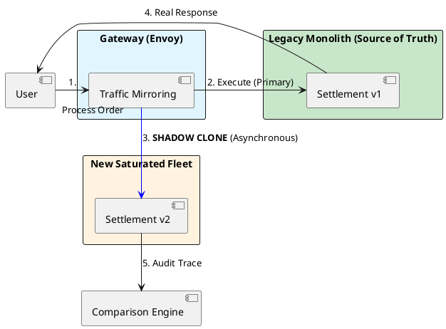

# 15.4: Dark Launches and Shadow Traffic: The Final Validation


## The Critical Dialogue


**Student:** My new "Global Settlement Engine" is ready. I've tested it with Mocks and Testcontainers. I'm ready to flip the switch and move 100 percent of our users to the new service. Let's do it!


**Principal:** You're about to play **Russian Roulette** with the company's revenue. No matter how many tests you write, the "Real World" (the messy network, the weird user data, the hardware spikes) will find a bug you missed. To reach Principal level, we must master **Dark Launches** and **Shadow Traffic**. We don't "Switch"; we **Bleed** traffic from the old system to the new one. We move from "Trusting our Tests" to **Validating in Production**.


---


## 1. The Requirement: Risk Decoupling


**The Problem:** The "All-or-Nothing" Cutover.
. **The Risk:** A single logic bug (e.g. incorrect tax calculation) hits 100% of users instantly.
. **The Solution:** Decouple the **Deployment** (moving code to pods) from the **Release** (turning the feature on for users).


---


## 2. Solution: Shadow Traffic (Mirroring)


**The Principal Architecture:** We use the **Gateway** (Envoy) to "Clone" every incoming request.


. **Primary Path:** Request -> Monolith -> Response to User.
. **Shadow Path:** Request -> **Cloned** -> New Fleet -> **Discard Result**.
. **The Audit:** The user never sees the new fleet. We compare the results of the Monolith and the New Fleet in the background. If they don't match, we fix the code *without anyone ever knowing*.





---


## 3. Principal Implementation: The Feature-Flag Bleed


Once Shadow Traffic is 100% accurate, we perform a **Dark Launch** (Canary Release).


```java
// Principal Level: Weighted Traffic Control
@Component
public class DarkLaunchController {
    private final FeatureFlagService flags;

    public SettlementResponse settle(Order order) {
        // 1. The 'Bleed' Rule: 1% of users get the new high-performance path
        if (flags.isUserInCanaryGroup(order.userId(), "v2-settlement")) {
            System.out.println("Principal Audit: Routing user to Saturated Fleet (V2)");
            return saturatedFleetClient.settle(order);
        }

        // 2. The other 99% stay on the safe legacy path
        return monolithClient.settle(order);
    }
}
```


---


## 🧵 The GOL Challenge: Final Phase (The Launch)


**Context:** We are launching the new "Vector Clock Reconciler" (Chapter 5.1). We need to prove it works on real traffic.


**The Task:**


. **Shadow Audit:** Propose a method to compare the `BalanceResult` from the old system and the new system. How do you handle "Tolerable Drift" (e.g. tiny rounding differences in `Double` vs `BigDecimal`)?


. **Canary Design:** Write a SQL query that selects 5% of users based on their `userId` hash to ensure they are **Pinned** to the canary group (Module 6.1).


. **Rollback Trigger:** Implement an automated "Panic Switch." If the new service's error rate exceeds 1% in the last 60 seconds (Chapter 6.4), the `DarkLaunchController` must automatically set the canary weight to 0%.


---


## 🧠 Principal's Inquiry


. **Shadow Write Side-Effects:** If the new service is "Shadowed," how do you prevent it from sending **Duplicate Emails** or **Double Charges** to the real world? (Hint: The **Mock Egress** strategy).


. **Performance vs Accuracy:** Why do we shadow traffic *asynchronously*? (Hint: The **User Latency Budget**).


. **The Psychological Principal:** How do you convince a team that a "Successful" shadow test that found 0 bugs was NOT a waste of time?


**Principal Summary:** The Final Validation is about **Architectural Humility**. We master Shadow Traffic and Dark Launches to prove our saturated systems are correct in the only lab that matters: the chaotic physical reality of the global fleet.
