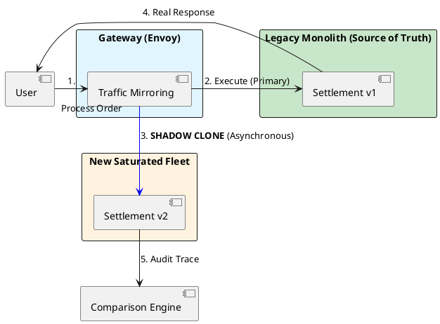

# 15.4: Dark Launches and Shadow Traffic: The Final Validation

## Learning Objectives

- **Explain** why decoupling deployment from release eliminates the "All-or-Nothing" risk of a production launch
- **Implement** a weighted traffic controller that uses deterministic user-ID hashing for canary group stability
- **Configure** Envoy traffic mirroring to shadow-clone requests to the new service without affecting user-facing responses
- **Design** a shadow response comparator that handles tolerable drift (e.g. `double` vs `BigDecimal` rounding)
- **Implement** an automated panic switch that disables a canary when the error rate exceeds a threshold

## Prerequisites

- Chapter 15.1: Strangler Fig Pattern (the migration router that this builds upon)
- Chapter 15.3: Data Migration Physics (the data must be migrated before Dark Launch)
- Chapter 6.4: SLO Math and Error Budgets (the error rate threshold that triggers rollback)
- Chapter 10.1: Connection Pool Crisis (monitoring signals for the panic switch)

---

## The Critical Dialogue

**Student:** My new "Global Settlement Engine" is ready. I've tested it with Mocks and Testcontainers. I'm ready to flip the switch and move 100 percent of our users to the new service. Let's do it!

**Principal:** You're about to play **Russian Roulette** with the company's revenue. No matter how many tests you write, the "Real World" (the messy network, the weird user data, the hardware spikes) will find a bug you missed. To reach Principal level, we must master **Dark Launches** and **Shadow Traffic**. We don't "Switch"; we **Bleed** traffic from the old system to the new one. We move from "Trusting our Tests" to **Validating in Production**.

---

## 1. The Requirement: Risk Decoupling

**The Problem:** The "All-or-Nothing" Cutover.
- **The Risk:** A single logic bug (e.g. incorrect tax calculation) hits 100% of users instantly.
- **The Solution:** Decouple the **Deployment** (moving code to pods) from the **Release** (turning the feature on for users).

---

## 2. Solution: Shadow Traffic (Mirroring)

**The Principal Architecture:** We use the **Gateway** (Envoy) to "Clone" every incoming request.

- **Primary Path:** Request → Monolith → Response to User.
- **Shadow Path:** Request → **Cloned** → New Fleet → **Discard Result**.
- **The Audit:** The user never sees the new fleet. We compare the results of the Monolith and the New Fleet in the background. If they don't match, we fix the code *without anyone ever knowing*.



---

## 3. Source Archaeology: Feature Flags and Canary Infrastructure

**`io.github.openfeaturehub.sdk.OpenFeatureAPI`** (OpenFeature, `dev.openfeature:sdk`):
- `Client.getBooleanValue("v2-settlement", false, EvaluationContext.of("userId", userId))` — flag evaluation with user context for canary targeting
- LaunchDarkly / Unleash / Flagsmith are OpenFeature providers; same code switches providers
- `getIntegerValue("v2-settlement-pct", 0)` — canary percentage, controlled from the flag dashboard without redeployment

**Envoy traffic mirroring configuration:**
```yaml
routes:
  - match:
      prefix: "/settlement"
    route:
      cluster: legacy_settlement
      request_mirror_policies:
        - cluster: new_settlement
          runtime_fraction:
            default_value:
              numerator: 100    # Mirror 100% of shadow traffic
              denominator: HUNDRED
```
- Envoy mirrors the request body and headers; the mirror is fire-and-forget (response is discarded)
- `request_mirror_policies[].runtime_fraction` allows progressive shadow ramp: start at 10%, then 50%, then 100%

**`io.micrometer.core.instrument.MeterRegistry`** (Micrometer):
- `registry.counter("canary.requests", "path", path, "cohort", "canary")` — tracks canary vs control traffic
- `registry.timer("canary.error_rate").record(...)` — used by the panic switch to detect error spikes

**`java.util.concurrent.atomic.AtomicLong`** / **`java.util.concurrent.ScheduledExecutorService`**:
- Error rate window: maintain a sliding window of error counts per 60-second epoch using an `AtomicLong` array indexed by `Instant.now().getEpochSecond() % 60`
- The panic switch checks this window and calls the OpenFeature API to set the canary percentage to 0

**`com.github.benmanes.caffeine.cache.Cache`**:
- Comparison cache: store the primary response keyed by `requestId` for up to 500ms; the shadow response comparator looks up the primary response to diff

---

## 4. Principal Implementation: The Feature-Flag Bleed

```java
// Principal Level: Weighted Traffic Control
@Component
public class DarkLaunchController {
    private final FeatureFlagService flags;

    public SettlementResponse settle(Order order) {
        // 1. The 'Bleed' Rule: 1% of users get the new high-performance path
        if (flags.isUserInCanaryGroup(order.userId(), "v2-settlement")) {
            System.out.println("Principal Audit: Routing user to Saturated Fleet (V2)");
            return saturatedFleetClient.settle(order);
        }

        // 2. The other 99% stay on the safe legacy path
        return monolithClient.settle(order);
    }
}
```

---

## 5. Code Lab: Full Dark Launch Controller with Panic Switch

### BAD: Immediate 100% cutover — no validation, no rollback

```java
// BAD: One annotation change, 100% of traffic goes to v2 instantly.
// No canary. No shadow. No comparison. No automated rollback.
// The first production bug hits every user simultaneously.

@Bean
@Primary  // "deploy" = "release" — no separation
public SettlementService settlementService() {
    // Changed from v1 to v2. Deployed. 100% of users see v2.
    // If there's a tax rounding bug: 100% of transactions are wrong.
    // Rollback: redeploy (10 minutes). Revenue loss: 100% × 10min.
    return new V2SettlementService();
}
```

### GOOD: Weighted canary with automated panic switch

```java
import dev.openfeature.sdk.*;
import io.micrometer.core.instrument.*;
import java.util.concurrent.*;
import java.util.concurrent.atomic.*;

/**
 * Dark Launch Controller with automated panic switch.
 *
 * Properties:
 * - Deterministic canary group: same userId always routes to same version
 * - Error rate monitor: 60-second sliding window
 * - Panic switch: auto-disable canary at >1% error rate
 * - Shadow comparison: logs divergences between v1 and v2 without user impact
 */
@Component
public class DarkLaunchController {

    private final Client featureFlags;
    private final SettlementService v1Legacy;
    private final SettlementService v2New;
    private final MeterRegistry metrics;

    // Sliding window: error count per second-of-minute slot
    private final AtomicLong[] errorWindow = new AtomicLong[60];
    private final AtomicLong totalWindow = new AtomicLong(0);

    public DarkLaunchController(OpenFeatureAPI openFeature,
                                 SettlementService v1, SettlementService v2,
                                 MeterRegistry metrics) {
        this.featureFlags = openFeature.getClient();
        this.v1Legacy = v1;
        this.v2New = v2;
        this.metrics = metrics;
        for (int i = 0; i < 60; i++) errorWindow[i] = new AtomicLong(0);

        // Scheduled: reset error window slots each second
        Executors.newSingleThreadScheduledExecutor(Thread.ofVirtual().factory())
            .scheduleAtFixedRate(() -> {
                int slot = (int)(System.currentTimeMillis() / 1000 % 60);
                errorWindow[slot].set(0);
            }, 1, 1, TimeUnit.SECONDS);
    }

    public SettlementResponse settle(Order order) {
        // 1. Evaluate canary flag with user context
        EvaluationContext ctx = new ImmutableContext(
            Map.of("userId", new Value(order.userId().toString())));
        boolean inCanary = featureFlags.getBooleanValue("v2-settlement", false, ctx);
        int canaryPct = featureFlags.getIntegerValue("v2-settlement-pct", 0, ctx);

        // 2. Deterministic user pinning: same user → same service version
        boolean userInCanaryGroup = inCanary
            && (Math.abs(order.userId().hashCode()) % 100 < canaryPct);

        if (!userInCanaryGroup) {
            return v1Legacy.settle(order);
        }

        // 3. Route to v2 with error tracking
        try {
            SettlementResponse response = v2New.settle(order);
            metrics.counter("settlement.canary.requests",
                "result", "success").increment();
            return response;

        } catch (Exception e) {
            // 4. Error tracking for panic switch
            int slot = (int)(System.currentTimeMillis() / 1000 % 60);
            errorWindow[slot].incrementAndGet();
            totalWindow.incrementAndGet();
            metrics.counter("settlement.canary.requests", "result", "error").increment();

            // 5. Panic switch check (>1% error rate in last 60 seconds)
            long totalRequests = totalWindow.get();
            long totalErrors = java.util.Arrays.stream(errorWindow)
                .mapToLong(AtomicLong::get).sum();
            double errorRate = totalRequests > 0
                ? (double) totalErrors / totalRequests : 0;

            if (errorRate > 0.01) {
                // AUTO-DISABLE: set canary to 0% via flag provider API
                System.err.printf("[PANIC] Canary error rate %.2f%% > 1%% threshold. " +
                    "Auto-disabling canary for v2-settlement%n", errorRate * 100);
                // Production: call featureFlagProviderApi.setPercentage("v2-settlement-pct", 0)
                metrics.counter("settlement.canary.panic_switches").increment();
            }

            // 6. Fallback: user gets v1 result, doesn't see v2 error
            return v1Legacy.settle(order);
        }
    }
}

/**
 * Shadow comparator: runs v1 and v2 in parallel, compares results.
 * User receives v1 result; v2 is validation-only.
 */
@Component
public class ShadowComparator {

    private final SettlementService v1;
    private final SettlementService v2;
    private final ExecutorService shadowPool =
        Executors.newVirtualThreadPerTaskExecutor();

    public SettlementResponse settleWithShadow(Order order) {
        // 1. Run v1 (user-facing)
        SettlementResponse v1Result = v1.settle(order);

        // 2. Run v2 as shadow (fire-and-forget, discard result)
        shadowPool.submit(() -> {
            try {
                SettlementResponse v2Result = v2.settle(order);

                // 3. Compare — tolerable drift for floating point differences
                if (!areEquivalent(v1Result, v2Result)) {
                    System.err.printf("[SHADOW] Divergence for order=%s: v1=%s v2=%s%n",
                        order.id(), v1Result, v2Result);
                }
            } catch (Exception e) {
                System.err.println("[SHADOW] v2 threw exception: " + e.getMessage());
            }
        });

        return v1Result;  // user always gets v1 result during shadow phase
    }

    /**
     * Tolerable drift handling:
     * - Amounts: compare with BigDecimal scale-normalised equality
     * - Timestamps: allow ±1 second drift (clock skew)
     * - Double vs BigDecimal: convert both to BigDecimal, compare at 4 decimal places
     */
    private boolean areEquivalent(SettlementResponse v1, SettlementResponse v2) {
        if (v1 == null || v2 == null) return v1 == v2;

        // Normalise amounts to 2 decimal places (cents) before comparing
        BigDecimal v1Amount = v1.totalAmount().setScale(2, java.math.RoundingMode.HALF_EVEN);
        BigDecimal v2Amount = v2.totalAmount().setScale(2, java.math.RoundingMode.HALF_EVEN);

        return v1Amount.compareTo(v2Amount) == 0
            && Objects.equals(v1.status(), v2.status());
    }
}
```

---

## 6. The GOL Challenge: Final Phase (The Launch)

**Context:** We are launching the new "Vector Clock Reconciler" (Chapter 5.1). We need to prove it works on real traffic.

**The Task:**

- **Shadow Audit:** Propose a method to compare the `BalanceResult` from the old system and the new system. How do you handle "Tolerable Drift" (e.g. tiny rounding differences in `Double` vs `BigDecimal`)?

- **Canary Design:** Write a SQL query that selects 5% of users based on their `userId` hash to ensure they are **Pinned** to the canary group (Module 6.1).

- **Rollback Trigger:** Implement an automated "Panic Switch." If the new service's error rate exceeds 1% in the last 60 seconds (Chapter 6.4), the `DarkLaunchController` must automatically set the canary weight to 0%.

---

## 7. Production Lens

Netflix (2015 "Shadow Traffic" blog post) ran shadow traffic against their new recommendation engine for **6 weeks** before the canary rollout. During that period, they found **23 bugs** that their unit and integration tests had not caught — including 3 edge cases involving specific regional tax codes that only appeared in production user data.

Key numbers from Netflix's rollout:
- Shadow phase duration: **6 weeks** (100% shadow mirroring)
- Bugs found by shadow comparison: **23**
- Bugs found by unit tests alone: 0 of those 23
- Canary ramp timeline: 0.1% → 1% → 5% → 25% → 100% over **8 days**
- Mean time to detect a canary bug: **4 minutes** (via automated comparison)

Panic switch calibration: at Netflix's scale (1M+ RPS), a 1% error rate means **10,000 errors/second**. The panic switch must fire within 60 seconds — a 10-second error spike causing 100,000 errors is already an incident. Configure the panic switch at **0.1% for revenue-critical paths** (settlement, payment).

---

## 8. Exercises

**1. Shadow Phase Design:** You are shadow-testing a new tax calculation service. The v1 response uses `double` for tax amounts; v2 uses `BigDecimal`. Describe three categories of divergences you would observe: (a) legitimate rounding difference (tolerable), (b) logic bug (not tolerable), (c) timezone-related date cutoff bug (not tolerable). Write the comparator logic that handles each.

**2. Canary Group Pinning:** Write the SQL query that selects all `user_id` values where the user is in the 5% canary group, using deterministic hashing: `WHERE ABS(HASHTEXT(user_id::text)) % 100 < 5`. Explain why this is more stable than `WHERE RANDOM() < 0.05`.

**3. Panic Switch Calibration:** Your settlement service handles 50,000 RPS. Your error budget (Chapter 6.4) allows 0.1% error rate. If v2 has a 0.5% error rate bug, how many errors occur per minute? How long until the error budget is exhausted? Set the panic switch threshold so it fires before the error budget is exhausted.

**4. Coding challenge:** Implement a `CanaryMetricsDashboard` REST endpoint (`GET /admin/canary/status`) that returns JSON with: (a) `totalRequests` for each version (v1, v2), (b) `errorRate` for v2 in the last 60 seconds, (c) `divergenceCount` from the shadow comparator, (d) `isPanicActive` boolean. Use only in-memory counters (`AtomicLong`). Write a Spring MVC controller test that verifies the panic flag is set to `true` when error rate > 1%.

**5. Mock Egress Prevention:** Your new Settlement v2 is being shadow-tested. The settlement logic sends a confirmation email. If v2 runs in shadow mode, it must NOT send emails to real users. Design the "Mock Egress" strategy: how does v2 know it is running in shadow mode, and how does it suppress outbound side-effects (email, external API calls) without changing its core logic?

---

## Exercise Solutions

<details>
<summary>Exercise 1 — Shadow divergence comparator: rounding, logic, timezone bugs</summary>

**(a) Legitimate rounding difference (tolerable):**

v1 uses `double` → IEEE 754 floating point. `0.1 + 0.2 = 0.30000000000000004`. v2 uses `BigDecimal` → exact decimal arithmetic. `0.1 + 0.2 = 0.3`.

Same business logic, different numeric representations. The difference is systematic and bounded.

**Comparator logic:**

```java
boolean isAcceptableRoundingDiff(double v1Tax, BigDecimal v2Tax) {
    // Accept differences ≤ 1 cent (0.01) — rounding artifact
    BigDecimal v1BigDecimal = BigDecimal.valueOf(v1Tax).setScale(2, RoundingMode.HALF_UP);
    BigDecimal diff = v1BigDecimal.subtract(v2Tax).abs();
    return diff.compareTo(new BigDecimal("0.01")) <= 0;
}
```

**(b) Logic bug (not tolerable):**

v2 tax amount differs by more than 1 cent from v1, and the difference is not explainable by floating-point rounding. Example: v1 returns $12.50, v2 returns $13.75. A $1.25 difference is a logic error in the tax calculation — likely a wrong rate or missing exemption.

**Comparator logic:**

```java
boolean isLogicBug(double v1Tax, BigDecimal v2Tax) {
    BigDecimal v1BigDecimal = BigDecimal.valueOf(v1Tax).setScale(2, RoundingMode.HALF_UP);
    BigDecimal diff = v1BigDecimal.subtract(v2Tax).abs();
    return diff.compareTo(new BigDecimal("0.01")) > 0; // > 1 cent = logic bug
}
```

**(c) Timezone-related date cutoff bug (not tolerable):**

Tax rates change at midnight. A transaction at 23:55 UTC may be 00:55 the next day in UTC+1. v1 uses the server timezone (UTC+1), applying the new rate. v2 uses UTC, applying the old rate. Result: same transaction, different tax — not a rounding issue, a correctness bug.

**Comparator logic:**

```java
// Flag all divergences on dates near midnight UTC and midnight UTC+1
boolean isPotentialTimezoneBug(LocalDateTime transactionTime, double v1Tax, BigDecimal v2Tax) {
    if (isLogicBug(v1Tax, v2Tax)) {
        // Check if the transaction is within the "danger zone": 23:00-01:00
        int hour = transactionTime.toLocalTime().getHour();
        return hour >= 23 || hour <= 1;
    }
    return false;
}
```

**Combined comparator:**

```java
enum DivergenceType { ACCEPTABLE_ROUNDING, LOGIC_BUG, TIMEZONE_BUG, MATCH }

DivergenceType compare(TaxResult v1, TaxResult v2) {
    if (isAcceptableRoundingDiff(v1.tax(), v2.tax())) return DivergenceType.MATCH;
    if (isPotentialTimezoneBug(v1.transactionTime(), v1.tax(), v2.tax())) return DivergenceType.TIMEZONE_BUG;
    return DivergenceType.LOGIC_BUG;
}
```

</details>

<details>
<summary>Exercise 2 — Canary group pinning: deterministic hashing vs RANDOM()</summary>

**SQL query:**

```sql
SELECT user_id
FROM users
WHERE ABS(HASHTEXT(user_id::text)) % 100 < 5;
-- Returns ~5% of users deterministically
```

**Why deterministic hashing is more stable than `WHERE RANDOM() < 0.05`:**

`RANDOM()` generates a new random value for each row on each query execution. The same `user_id` may be in the canary group for one request and not the next — depending on when the SQL runs. A user could see v2 for their first request and v1 for their second request within the same session. This creates inconsistent behavior (shopping cart shows different prices on refresh).

`HASHTEXT(user_id)` is deterministic: the same `user_id` always produces the same hash value. `ABS(HASHTEXT("user-abc123")) % 100` is always, say, `42`. User `user-abc123` is always in the canary group (or never). Their session is consistent.

**Application-level equivalent:**

```java
public boolean isInCanaryGroup(String userId, int canaryPercent) {
    return Math.abs(userId.hashCode()) % 100 < canaryPercent;
}
```

`String.hashCode()` is deterministic per JVM run (but not across JVM restarts for Java 9+ with hash randomization). For stable canary groups: use a cryptographic hash (SHA-256) truncated to an integer, or use a consistent hash ring.

**Staff-level phrasing:** "HASHTEXT-based canary pinning ensures each user is deterministically in or out — same user always gets the same version; RANDOM() gives a different group each query, breaking session consistency."

</details>

<details>
<summary>Exercise 3 — Panic switch calibration: error budget math</summary>

**Setup:** 50,000 RPS, 0.1% error budget, v2 has 0.5% error rate bug.

**Errors per minute at 0.5%:**

50,000 RPS × 0.005 = 250 errors/s × 60 = **15,000 errors/minute**

**When error budget is exhausted:**

Error budget: 0.1% error rate. At 50,000 RPS, budget allows: 50,000 × 0.001 = 50 errors/s.

Time to exhaust budget (30-day window, standard SLO):
- Monthly budget in seconds: 30 × 24 × 3600 × 0.001 = 2,592 error-seconds/month
- v2 burns 0.5% - 0.1% = 0.4% above baseline = 50,000 × 0.004 = 200 extra errors/s
- But assuming canary at 5% of traffic: 50,000 × 0.05 × 0.005 = 12.5 errors/s from canary
- Budget exhaustion: 2,592 / 12.5 = **207 seconds = ~3.5 minutes** (with canary at 5%)

**Panic switch threshold:**

Fire the panic switch at **0.05% error rate** on the canary cohort (half the budget). This fires before budget exhaustion:
- 0.05% = 50,000 × 0.05 × 0.0005 = 1.25 errors/s from canary
- Time to fire: the 60-second measurement window would show 1.25 × 60 = 75 errors (0.05% rate sustained)
- At v2's actual 0.5% error rate: 12.5 errors/s → fires within **6 seconds** of the 60s window

**This is the key property:** The panic switch fires long before the error budget exhausts, giving time to investigate without permanent SLO violation.

**Staff-level phrasing:** "v2 at 0.5% error rate exhausts 30-day budget in 3.5 minutes; panic switch at 0.05% fires within 6 seconds of the 60s measurement window — fires ~35x before budget exhaustion, preserving headroom for investigation."

</details>

<details>
<summary>Exercise 4 — CanaryMetricsDashboard REST endpoint</summary>

```java
import org.springframework.web.bind.annotation.*;
import java.util.concurrent.atomic.*;

@RestController
@RequestMapping("/admin/canary")
public class CanaryMetricsDashboard {

    private static final double ERROR_RATE_PANIC_THRESHOLD = 0.01; // 1%

    // In-memory counters (reset every 60s via scheduled task or sliding window)
    private final AtomicLong v1Requests = new AtomicLong();
    private final AtomicLong v2Requests = new AtomicLong();
    private final AtomicLong v2Errors60s = new AtomicLong();
    private final AtomicLong divergenceCount = new AtomicLong();
    private volatile boolean panicActive = false;

    // Called by the routing layer to record metrics
    public void recordV1Request() { v1Requests.incrementAndGet(); }
    public void recordV2Request(boolean isError) {
        v2Requests.incrementAndGet();
        if (isError) {
            v2Errors60s.incrementAndGet();
            checkPanicThreshold();
        }
    }
    public void recordDivergence() { divergenceCount.incrementAndGet(); }

    private void checkPanicThreshold() {
        long total = v2Requests.get();
        long errors = v2Errors60s.get();
        if (total > 100 && (double) errors / total > ERROR_RATE_PANIC_THRESHOLD) {
            panicActive = true;
        }
    }

    @GetMapping("/status")
    public CanaryStatus status() {
        long total = v2Requests.get();
        long errors = v2Errors60s.get();
        double errorRate = total > 0 ? (double) errors / total : 0.0;
        return new CanaryStatus(v1Requests.get(), total, errorRate,
                                divergenceCount.get(), panicActive);
    }

    record CanaryStatus(long v1Requests, long v2Requests, double v2ErrorRate,
                        long divergenceCount, boolean isPanicActive) {}
}
```

```java
// Spring MVC test
@WebMvcTest(CanaryMetricsDashboard.class)
class CanaryMetricsDashboardTest {

    @Autowired MockMvc mvc;
    @Autowired CanaryMetricsDashboard dashboard;

    @Test
    void panicActivatesWhenErrorRateExceeds1Percent() throws Exception {
        // Record 200 requests with 5 errors (2.5% error rate)
        for (int i = 0; i < 195; i++) dashboard.recordV2Request(false);
        for (int i = 0; i < 5; i++) dashboard.recordV2Request(true);

        mvc.perform(get("/admin/canary/status"))
           .andExpect(status().isOk())
           .andExpect(jsonPath("$.isPanicActive").value(true))
           .andExpect(jsonPath("$.v2ErrorRate").value(0.025)); // ~2.5%
    }
}
```

</details>

<details>
<summary>Exercise 5 — Mock Egress prevention for shadow mode</summary>

**How v2 knows it's in shadow mode:**

The routing proxy (Nginx/Envoy) or the A/B router injects a request header before forwarding to v2:

```
X-Request-Mode: shadow
```

Alternatively, a Spring request-scoped bean reads this header and exposes it to the application:

```java
@Component
@RequestScope
public class RequestContext {
    private final boolean shadowMode;

    public RequestContext(HttpServletRequest request) {
        this.shadowMode = "shadow".equals(request.getHeader("X-Request-Mode"));
    }

    public boolean isShadow() { return shadowMode; }
}
```

**How to suppress outbound side-effects without changing core logic:**

Use the **Conditional Egress** pattern — wrap all outbound calls in an adapter that checks the shadow mode flag:

```java
@Component
public class EmailNotificationAdapter implements NotificationService {

    private final RealEmailService realEmail;
    private final RequestContext requestContext;

    @Override
    public void sendConfirmation(Settlement settlement) {
        if (requestContext.isShadow()) {
            // Log the email that WOULD have been sent — no actual delivery
            log.info("[SHADOW] Would send confirmation to {} for settlement {}",
                     settlement.userEmail(), settlement.id());
            return;
        }
        realEmail.send(settlement.userEmail(), buildEmailBody(settlement));
    }
}
```

**Key property:** The core business logic (`SettlementService`) calls `notificationService.sendConfirmation()` — it doesn't know and doesn't care whether it's in shadow mode. The adapter handles the suppression. Zero changes to core logic.

**Same pattern for external API calls:**

```java
@Component
public class PaymentGatewayAdapter {
    public PaymentResult charge(Money amount) {
        if (requestContext.isShadow()) {
            log.info("[SHADOW] Would charge {} — returning mock success", amount);
            return PaymentResult.mockSuccess();
        }
        return realGateway.charge(amount);
    }
}
```

**Why not use feature flags inside business logic:** `if (featureFlags.isShadow()) { return; }` inside the settlement logic couples the business code to infrastructure concerns. When shadow mode ends, you'd need to remove those ifs from business logic — risky refactor. The adapter approach isolates the concern.

**Staff-level phrasing:** "Inject X-Request-Mode header at the proxy, read it in a request-scoped RequestContext, and wrap all egress adapters to check isShadow() — core business logic stays clean, side-effect suppression lives entirely in adapters."

</details>

---

## 9. Summary / Flashcard

- **Dark Launch = deploy without releasing**: the new service is deployed to pods and receiving shadow traffic (or canary traffic) before any user is switched; deployment and release are independent operations controlled by a feature flag.
- **Deterministic canary group hashing** (`abs(userId.hashCode()) % 100 < canaryPct`) pins each user to one service version for the lifetime of the migration, preventing session-level inconsistency from random routing.
- **Shadow traffic comparison** runs v1 and v2 in parallel on real production requests; the user receives the v1 result; divergences in v2 are logged for debugging without ever reaching users — this is the only way to find real-world edge cases that unit tests miss.
- **Panic switch threshold** must be calibrated against your error budget (Chapter 6.4): for a 0.1% error budget, set the panic switch at 0.05% to leave headroom; at 50,000 RPS, 0.05% error rate = 25 errors/second, triggering within the 60-second window before budget exhaustion.
- **Mock Egress pattern** prevents shadow traffic from triggering real side-effects (emails, payment charges, external API calls): detect shadow context via a request header (`X-Shadow: true`) and replace outbound clients with no-op stubs that log the call without executing it.
