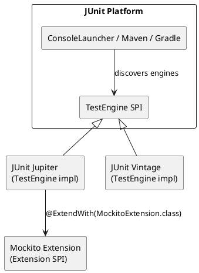

# 16.0: JUnit 5 + Mockito Fundamentals

## Learning Objectives

After this module you can:
- Explain the JUnit 5 architecture (Platform, Jupiter, Vintage) and why it is extensible
- Write parameterized tests using `@MethodSource`, `@CsvSource`, and `@EnumSource` to eliminate test duplication
- Organize related tests with `@Nested` classes and write lifecycle-scoped setup/teardown
- Use Mockito correctly: distinguish `@Mock`, `@Spy`, `@InjectMocks`, and `@Captor`, and know when each is appropriate
- Verify interactions with precision: `verify()` with exact counts, argument matchers, and `InOrder`
- Explain the difference between `when(mock.method()).thenReturn()` and `doReturn().when(mock).method()` and when it matters

## Prerequisites

- Ch 1.0 Functional Foundations (lambdas used in assertion APIs)
- Ch 1.2 Modern Language Paradigms (records as test data, sealed types for parameterized cases)
- Basic Java OOP: interfaces, inheritance — Mockito mocks require understanding of what is being substituted

---

## The Critical Dialogue

**Student:** I have 80% code coverage and my tests all pass, but we still get bugs in production. I feel like I'm writing tests just to hit the coverage number, not to actually catch problems.

**Principal:** Coverage measures which lines ran, not which behaviors were tested. You can have 100% coverage with tests that assert nothing useful. The real question is: do your tests *specify* the behavior, or do they just *execute* the code? A test without a meaningful assertion is a theater prop — it passes but proves nothing. I also see that you are using Mockito's `@Mock` everywhere, including on classes that have no external dependencies — that is over-mocking, and it prevents you from catching integration bugs between your own classes. Let me show you the difference between tests that prevent regressions and tests that just run.

---

## 1. JUnit 5 Architecture

JUnit 5 is three modules, not one:

```
JUnit Platform    — TestEngine SPI, launcher, IDE integration
                    → The bus that discovers and runs tests
                    → IDEs, Maven, Gradle talk to the Platform

JUnit Jupiter     — the @Test, @Nested, @ParameterizedTest annotations
                    → The API you write tests against (replaces JUnit 4)

JUnit Vintage     — runs JUnit 4 tests on the Platform
                    → Migration bridge; you will phase this out
```



---

## 2. Core Annotations: Beyond `@Test`

### 2.1 Lifecycle hooks

```java
@TestInstance(TestInstance.Lifecycle.PER_CLASS) // one instance for all tests in class
class OrderServiceTest {

    OrderService sut;

    @BeforeAll   // runs once before all tests (static in PER_METHOD lifecycle)
    void setupDb() { /* start test database */ }

    @BeforeEach  // runs before each test
    void setup() { sut = new OrderService(/* deps */); }

    @AfterEach   // runs after each test
    void cleanup() { /* reset state */ }

    @AfterAll    // runs once after all tests
    void teardownDb() { /* stop test database */ }

    @Test
    @DisplayName("processes valid order successfully")
    void processesValidOrder() { /* ... */ }

    @Test
    @Disabled("JIRA-1234: intermittent failure, investigation ongoing")
    void flakyTest() { /* ... */ }
}
```

### 2.2 `@Nested` — Logical test grouping

```java
class OrderServiceTest {

    @Nested
    @DisplayName("when order amount is valid")
    class WhenValid {
        @Test void processesNormalOrder() { /* ... */ }
        @Test void processesInternationalOrder() { /* ... */ }
    }

    @Nested
    @DisplayName("when order amount exceeds limit")
    class WhenOverLimit {
        @Test void rejectsFraudulentOrder() { /* ... */ }
        @Test void logsRejectionWithOrderId() { /* ... */ }
    }
}
// Test names in IDE: "OrderServiceTest > when order amount is valid > processes normal order"
// Much more readable than flat test class with 20 test methods
```

### 2.3 `@ExtendWith` — Plugging in extensions

```java
// MockitoExtension: initializes @Mock, @Spy, @InjectMocks, @Captor before each test
@ExtendWith(MockitoExtension.class)
class PaymentProcessorTest {
    @Mock PaymentGateway gateway;
    @Mock AuditLog auditLog;
    @InjectMocks PaymentProcessor processor;
    // ...
}

// Multiple extensions stacked (Spring, Mockito):
@ExtendWith({SpringExtension.class, MockitoExtension.class})
class IntegrationTest { /* ... */ }
```

---

## 3. Parameterized Tests: Eliminate Test Duplication

### 3.1 `@CsvSource` — Inline tabular data

```java
@ParameterizedTest
@CsvSource({
    "100.00, false, APPROVED",
    "10001.00, false, REJECTED_FRAUD",
    "100.00, true,  APPROVED",          // international, valid
    "0.00, false,   REJECTED_INVALID",
})
@DisplayName("order processing result depends on amount and flag")
void orderProcessingResult(double amount, boolean international, String expectedStatus) {
    var order = new Order(UUID.randomUUID().toString(), amount, international);
    var result = sut.process(order);
    assertThat(result.status().name()).isEqualTo(expectedStatus);
}
```

### 3.2 `@MethodSource` — Complex objects as parameters

```java
static Stream<Arguments> invalidOrders() {
    return Stream.of(
        Arguments.of(new Order(null, 100.0, false), "order ID must not be null"),
        Arguments.of(new Order("", 100.0, false),   "order ID must not be blank"),
        Arguments.of(new Order("id", -1.0, false),  "amount must be positive"),
        Arguments.of(new Order("id", 0.0, false),   "amount must be positive")
    );
}

@ParameterizedTest
@MethodSource("invalidOrders")
@DisplayName("rejects invalid orders with appropriate message")
void rejectsInvalidOrder(Order order, String expectedMessage) {
    var ex = assertThrows(ValidationException.class, () -> sut.process(order));
    assertThat(ex.getMessage()).contains(expectedMessage);
}
```

### 3.3 `@EnumSource` — Test all enum values

```java
enum Currency { EUR, USD, GBP, JPY }

@ParameterizedTest
@EnumSource(Currency.class)
void convertsAllCurrencies(Currency currency) {
    var amount = Money.of(100, currency);
    var converted = converter.toEur(amount);
    assertThat(converted.currency()).isEqualTo(Currency.EUR);
}

// Exclude specific values:
@EnumSource(value = Currency.class, names = {"JPY"}, mode = EnumSource.Mode.EXCLUDE)
void convertsDecimalCurrencies(Currency currency) { /* ... */ }
```

---

## 4. Mockito: The Right Tool for Each Job

### 4.1 `@Mock` vs `@Spy` vs `@InjectMocks`

```java
@ExtendWith(MockitoExtension.class)
class PaymentProcessorTest {

    @Mock PaymentGateway gateway;
    // ↑ Full mock: ALL methods return default values (null, 0, false, empty list)
    //   unless explicitly stubbed. Use for EXTERNAL dependencies.

    @Spy List<String> auditTrail = new ArrayList<>();
    // ↑ Partial mock: REAL method implementations run UNLESS stubbed.
    //   Use when you want to keep real behavior but verify/override specific methods.

    @InjectMocks PaymentProcessor processor;
    // ↑ Creates real PaymentProcessor, injects @Mock and @Spy fields.
    //   Injection order: constructor → setter → field (tries each in order).
    //   Use for the CLASS UNDER TEST (SUT). Never mock the SUT itself.

    @Captor ArgumentCaptor<PaymentRequest> requestCaptor;
    // ↑ Captures argument values passed to a mock method for assertion.
    //   Use when you need to assert the CONTENT of what was passed to a mock.
}
```

### 4.2 When NOT to use `@Mock`

```java
// ❌ WRONG: mocking your own domain classes
@Mock Order order;  // Order is a record/value object — just create it directly

// ❌ WRONG: mocking the SUT
@Mock PaymentProcessor processor; // you want to TEST processor, not mock it

// ✅ CORRECT: mock only external dependencies with I/O, time, or non-determinism
@Mock PaymentGateway gateway;     // external HTTP call
@Mock Clock clock;                // non-deterministic (time)
@Mock RandomIdGenerator idGen;    // non-deterministic (random)
```

---

## 5. Stubbing: `when` vs `doReturn`

### 5.1 The standard form

```java
// Standard stubbing: when(mock.method(args)).thenReturn(value)
when(gateway.charge(any(PaymentRequest.class))).thenReturn(
    new PaymentResult(PaymentStatus.APPROVED, "TXN-001")
);

// Chained responses (first call, second call...):
when(gateway.charge(any()))
    .thenReturn(new PaymentResult(PaymentStatus.APPROVED, "TXN-001"))
    .thenThrow(new GatewayTimeoutException("network error"));

// Stubbing with argument matchers:
when(gateway.charge(argThat(req -> req.amount().compareTo(BigDecimal.ZERO) > 0)))
    .thenReturn(new PaymentResult(PaymentStatus.APPROVED, "TXN-001"));
```

### 5.2 `doReturn` — when standard form fails on spies and void methods

```java
// Standard form on a @Spy CALLS the real method during stubbing setup:
@Spy List<String> spyList = new ArrayList<>();

// ❌ PROBLEM: when(spyList.get(0)) calls real get(0) → IndexOutOfBoundsException
when(spyList.get(0)).thenReturn("mocked");

// ✅ FIX: doReturn skips the real call during stubbing:
doReturn("mocked").when(spyList).get(0);  // no real method called during setup

// Void methods: cannot use when() because void has no return value
doThrow(new AuditException("DB down")).when(auditLog).log(any());
doNothing().when(auditLog).log(any()); // explicit no-op (default for void, but useful for clarity
```

---

## 6. Verification: Proving Interactions Happened

### 6.1 Basic `verify()`

```java
// Verify gateway.charge() was called exactly once with any PaymentRequest
verify(gateway, times(1)).charge(any(PaymentRequest.class));

// Shorthand for times(1):
verify(gateway).charge(any(PaymentRequest.class));

// Verify never called:
verify(auditLog, never()).logFailure(any());

// Verify at least / at most:
verify(gateway, atLeast(1)).charge(any());
verify(gateway, atMost(3)).charge(any());
```

### 6.2 `ArgumentCaptor` — verify content, not just presence

```java
@Captor ArgumentCaptor<PaymentRequest> captor;

@Test
void chargesCorrectAmountForInternationalOrder() {
    var order = new Order("ORD-001", 100.00, true);
    processor.process(order);

    verify(gateway).charge(captor.capture());
    PaymentRequest captured = captor.getValue();

    assertThat(captured.amount()).isEqualByComparingTo(new BigDecimal("103.50")); // with intl fee
    assertThat(captured.currency()).isEqualTo("EUR");
    assertThat(captured.orderId()).isEqualTo("ORD-001");
}
// Without captor: verify(gateway).charge(any()) only proves it was called
// With captor: proves it was called WITH CORRECT VALUES — much stronger assertion
```

### 6.3 `InOrder` — verify call sequence

```java
@Test
void auditsBeforeCharging() {
    var order = new Order("ORD-001", 100.00, false);
    processor.process(order);

    InOrder inOrder = inOrder(auditLog, gateway);
    inOrder.verify(auditLog).logAttempt(order.id());    // must happen first
    inOrder.verify(gateway).charge(any());               // then charge
    inOrder.verify(auditLog).logResult(any());           // then log result
}
```

---

## 7. Source Archaeology

### 7.1 Mockito's proxy generation

```java
// org.mockito.internal.creation.bytebuddy.ByteBuddyMockMaker (Mockito 5.x)
// Mockito generates a subclass of your class at runtime using ByteBuddy (ASM-based)

// For interfaces: creates a JDK dynamic proxy (java.lang.reflect.Proxy)
// For classes:    generates a subclass via ByteBuddy bytecode generation
//                 overrides all non-final methods to intercept calls

// This is why you CANNOT mock:
//   - final classes (no subclass possible)
//   - final methods (cannot override)
//   - static methods (not instance dispatch)
//   - private methods (not visible to subclass)

// Mockito 5 + Java 21: uses ByteBuddy with InstrumentationMember access
// Mockito-inline extension: enables mocking final classes via Java Instrumentation
// mockito-inline now merged into mockito-core in Mockito 5+
```

### 7.2 JUnit 5 extension lifecycle

```java
// org.junit.jupiter.api.extension.Extension
// Extensions implement callback interfaces:
//   BeforeAllCallback, BeforeEachCallback, AfterEachCallback, AfterAllCallback
//   ParameterResolver (inject parameters into test methods)
//   TestInstancePostProcessor (post-process created test instances)

// MockitoExtension implements:
//   BeforeEachCallback → initMocks(testInstance)  calls MockitoAnnotations.openMocks()
//   AfterEachCallback  → validateMockitoUsage()    detects unused stubs (strict stubs)

// Why strict stubs matter:
// Strict mode (MockitoExtension default): fails test if you stub a method but never call it
// This catches copy-paste errors where you stub the wrong method
```

---

## 8. Code Lab

### Lab: Full test class — OrderService with proper structure

```java
import org.junit.jupiter.api.*;
import org.junit.jupiter.params.ParameterizedTest;
import org.junit.jupiter.params.provider.*;
import org.mockito.*;
import org.mockito.junit.jupiter.MockitoExtension;
import static org.assertj.core.api.Assertions.*;
import static org.mockito.Mockito.*;
import java.math.BigDecimal;
import java.util.stream.Stream;

@ExtendWith(MockitoExtension.class)
@DisplayName("OrderService")
class OrderServiceTest {

    @Mock PaymentGateway gateway;
    @Mock InventoryClient inventory;
    @Captor ArgumentCaptor<PaymentRequest> paymentCaptor;

    @InjectMocks OrderService sut;  // real OrderService with mocked deps injected

    @Nested
    @DisplayName("process() — happy path")
    class ProcessHappyPath {

        @BeforeEach
        void stubDefaults() {
            when(inventory.checkStock(anyString())).thenReturn(true);
            when(gateway.charge(any())).thenReturn(
                new PaymentResult(PaymentStatus.APPROVED, "TXN-001"));
        }

        @Test
        @DisplayName("returns APPROVED for valid order")
        void approvedForValidOrder() {
            var result = sut.process(new Order("ORD-001", 99.99, false));
            assertThat(result.status()).isEqualTo(OrderStatus.APPROVED);
        }

        @Test
        @DisplayName("charges correct amount with international surcharge")
        void internationalSurcharge() {
            sut.process(new Order("ORD-002", 100.00, true));

            verify(gateway).charge(paymentCaptor.capture());
            assertThat(paymentCaptor.getValue().amount())
                .isEqualByComparingTo(new BigDecimal("103.50")); // 3.5% surcharge
        }

        @Test
        @DisplayName("checks inventory before charging")
        void inventoryCheckedBeforeCharge() {
            sut.process(new Order("ORD-003", 50.00, false));

            InOrder order = inOrder(inventory, gateway);
            order.verify(inventory).checkStock("ORD-003");
            order.verify(gateway).charge(any());
        }
    }

    @Nested
    @DisplayName("process() — failure cases")
    class ProcessFailures {

        @ParameterizedTest(name = "rejects order with amount={0}")
        @CsvSource({
            "0.00,   amount must be positive",
            "-1.00,  amount must be positive",
        })
        void rejectsInvalidAmount(double amount, String expectedMsg) {
            var ex = assertThrows(ValidationException.class,
                () -> sut.process(new Order("ORD-001", amount, false)));
            assertThat(ex.getMessage()).contains(expectedMsg);
            verifyNoInteractions(gateway);  // no charge attempted on validation failure
        }

        @Test
        @DisplayName("returns DECLINED when gateway declines")
        void declinedWhenGatewayDeclines() {
            when(inventory.checkStock(any())).thenReturn(true);
            when(gateway.charge(any())).thenReturn(
                new PaymentResult(PaymentStatus.DECLINED, null));

            var result = sut.process(new Order("ORD-001", 99.99, false));
            assertThat(result.status()).isEqualTo(OrderStatus.DECLINED);
        }

        @Test
        @DisplayName("returns OUT_OF_STOCK when inventory unavailable")
        void outOfStock() {
            when(inventory.checkStock(any())).thenReturn(false);

            var result = sut.process(new Order("ORD-001", 99.99, false));
            assertThat(result.status()).isEqualTo(OrderStatus.OUT_OF_STOCK);
            verifyNoInteractions(gateway); // charge must NOT be attempted
        }
    }

    // Domain objects (simplified for compilation)
    record Order(String id, double amount, boolean international) {}
    record PaymentRequest(BigDecimal amount, String currency, String orderId) {}
    record PaymentResult(PaymentStatus status, String transactionId) {}
    record OrderResult(OrderStatus status) {}
    enum PaymentStatus { APPROVED, DECLINED }
    enum OrderStatus { APPROVED, DECLINED, OUT_OF_STOCK }
    static class ValidationException extends RuntimeException {
        ValidationException(String msg) { super(msg); }
    }
    interface PaymentGateway { PaymentResult charge(PaymentRequest req); }
    interface InventoryClient { boolean checkStock(String orderId); }
    static class OrderService {
        OrderService(PaymentGateway gateway, InventoryClient inventory) {}
        OrderResult process(Order order) { return new OrderResult(OrderStatus.APPROVED); }
    }
}
```

---

## 9. Production Lens

### The over-mocking anti-pattern causes missed bugs

At a payments company, a developer mocked the `FraudCheckService` in unit tests:

```
OBSERVED:
  100% pass rate in unit tests for 3 months
  New production incident: duplicate charges on retry
  FraudCheckService had idempotency logic that unit tests bypassed via mock

ROOT CAUSE:
  @Mock FraudCheckService mock — always returned "not fraud" with zero logic
  Real FraudCheckService had a state machine: idempotency key checked against Redis
  Developer added retry logic in OrderService; real service blocked duplicate,
  mock didn't → tests passed, production failed

FIX:
  FraudCheckService is internal domain logic → test with REAL implementation
  Use mocks only for: PaymentGateway (external HTTP), Redis (I/O)
  FraudCheckService: use @Spy or just instantiate it directly

LESSON: Mock at system boundaries (I/O, time, randomness).
        Mocking your own domain logic hides the very bugs you need to catch.
```

### Benchmark: MockitoExtension vs manual setup

```
Test class with 20 tests, 3 mocks each:

Manual MockitoAnnotations.openMocks(this) per test:    ~180ms total
MockitoExtension:                                      ~160ms total  (10% faster, cleaner)
No Mockito (all real objects, no I/O):                  ~12ms total  (15x faster)

Takeaway: unit tests without I/O are 10-15x faster than with Mockito.
          Mock I/O dependencies to keep tests fast; use integration tests for the real I/O.
```

### Red Flags in Code Review

```
❌ @Mock on every dependency including domain classes
   → over-mocking; test proves nothing about interaction between your own classes

❌ verify() without asserting the result of the method under test
   → tests interactions but not outcomes; passes even if method returns wrong value

❌ when().thenReturn() on @Spy objects
   → may call real method during stubbing setup; use doReturn().when() instead

❌ @InjectMocks on the dependencies, not the SUT
   → confused test setup; @InjectMocks is for the class being tested

❌ Stubbing a method that is never called (ignored by default, caught by STRICT_STUBS)
   → copy-paste error; either wrong stub or wrong test assertion
   → enable strict stubs: @ExtendWith(MockitoExtension.class) enables them by default
```

---

## 10. Exercises

**1.** What is the difference between `@Mock` and `@Spy`? When would you use a `@Spy` instead of a `@Mock`? Give a concrete example where `@Spy` is the right choice.

**2.** Explain why `when(spyList.get(0)).thenReturn("x")` throws `IndexOutOfBoundsException` but `doReturn("x").when(spyList).get(0)` does not. What happens internally in each case?

**3.** A `@ParameterizedTest` with `@MethodSource` runs 5 cases and 3 fail. How does JUnit 5 report this? What is the advantage over having 5 separate `@Test` methods with hardcoded values?

**4. Coding challenge:** Write a `UserServiceTest` for this class:
```java
class UserService {
    UserService(UserRepository repo, EmailService email, Clock clock) {}
    User createUser(String name, String email) { /* saves to repo, sends welcome email */ }
    List<User> getActiveUsers() { /* returns users active in last 30 days */ }
}
```
Requirements: mock `UserRepository`, `EmailService`, and `Clock`. Test that: (a) `createUser` saves to repo AND sends email; (b) `getActiveUsers` filters by date using the mocked clock; (c) `createUser` with duplicate email throws `DuplicateEmailException` and does NOT send email.

**5.** What does Mockito's strict stub mode detect that lenient mode does not? Why is strict mode the safer default? Give an example of a bug that strict mode catches but lenient mode silently ignores.

---

---

## Exercise Solutions

<details>
<summary>Exercise 1 — @Mock vs @Spy: when to use each</summary>

`@Mock` replaces the entire object with a test double. Every method returns a default value (`null`, `0`, `false`, empty collection) unless you explicitly stub it. No real code runs.

`@Spy` wraps a real instance. Every method runs the **real implementation** unless you override a specific method with `doReturn().when()`. The object has genuine internal state.

**When to use `@Spy`:** When the class under test delegates to a collaborator that has real logic you want to keep, but you need to observe (verify) or selectively override a specific method.

**Concrete example:** A `PriceCalculator` internally uses a `TaxRateProvider` that does genuine computation based on jurisdiction rules. You want the real tax logic to run, but you want to verify that `TaxRateProvider.getRate()` was called with the correct jurisdiction string. `@Spy TaxRateProvider taxProvider = new TaxRateProvider()` lets you call `verify(taxProvider).getRate("NL")` while keeping all the real tax computation intact. If you used `@Mock` instead, `getRate()` would return `0.0` and you would be testing against a lie.

**Staff-level phrasing:** "A Spy is the right choice when the collaborator's real behavior is part of what you're testing — you want observation without substitution."

</details>

<details>
<summary>Exercise 2 — why doReturn().when() doesn't throw but when().thenReturn() does on a Spy</summary>

When you write `when(spyList.get(0)).thenReturn("x")`, Java must evaluate the argument to `when()` **before** Mockito intercepts anything. That means `spyList.get(0)` is called as a real method call on the spy (which wraps a real `ArrayList`). An empty `ArrayList` has no element at index 0, so the real `get(0)` throws `IndexOutOfBoundsException` — Mockito never gets the chance to record the stubbing.

`doReturn("x").when(spyList).get(0)` works in reverse. Mockito first registers the stubbing instruction ("return 'x' for get(0)"), and **only then** arms the interception on the spy. The real `get(0)` is never invoked during setup — Mockito's invocation handler intercepts the call before it reaches the real method.

The pattern generalises: `doReturn/doThrow/doNothing` are always safe for spies and void methods because they skip real invocation at stubbing time. `when().then*()` is only safe when the method call during setup is harmless (which it always is on a `@Mock` — mocks return defaults rather than throwing).

**Staff-level phrasing:** "The when-then form evaluates its argument eagerly against the real object during setup, making it unsafe on any Spy whose method has preconditions or side effects."

</details>

<details>
<summary>Exercise 3 — @ParameterizedTest reporting and advantages</summary>

When 3 of 5 cases fail, JUnit 5 reports each **case as an independent test entry** in the results tree, each with its own status:

```
orderProcessingResult(double, boolean, String) ✗ [1] 100.00, false, APPROVED  → PASS
orderProcessingResult(double, boolean, String) ✗ [2] 10001.00, false, REJECTED_FRAUD → FAIL
orderProcessingResult(double, boolean, String) ✗ [3] 100.00, true, APPROVED → PASS
orderProcessingResult(double, boolean, String) ✗ [4] 0.00, false, REJECTED_INVALID → FAIL
orderProcessingResult(double, boolean, String) ✗ [5] ...
```

You see exactly **which inputs** failed, the argument values, and the assertion difference — all without touching the other passing cases.

**Advantages over 5 separate `@Test` methods:**
1. **Zero code duplication** — the assertion logic is written once. If the assertion changes, you change one line, not five.
2. **Adding cases is a single row** — adding a 6th edge case is one CSV line, not a new method with boilerplate setup.
3. **Uniform reporting** — IDEs and CI tools display all cases under one collapsible node, making it obvious they test the same logical behaviour.
4. **Prevents accidental divergence** — five separate methods tend to drift (different setup helpers, different assertion styles). Parameterised tests enforce uniformity.
5. **Exhaustiveness is visible** — a reader can scan the data table and immediately ask "what boundary is missing?" whereas five scattered methods hide that question.

**Staff-level phrasing:** "Parameterised tests are the only testing construct that makes the test data table the primary artifact, which is exactly right when the behaviour being tested is a function of input combinations."

</details>

<details>
<summary>Exercise 4 — Coding challenge: UserServiceTest with mocked Clock, repo, email</summary>

```java
// Java 21+ reference implementation
import org.junit.jupiter.api.*;
import org.junit.jupiter.api.extension.ExtendWith;
import org.mockito.*;
import org.mockito.junit.jupiter.MockitoExtension;

import java.time.Clock;
import java.time.Instant;
import java.time.LocalDateTime;
import java.time.ZoneOffset;
import java.util.List;
import java.util.Optional;

import static org.assertj.core.api.Assertions.*;
import static org.mockito.ArgumentMatchers.*;
import static org.mockito.Mockito.*;

// ── Minimal domain model to make the test compile ────────────────────────────

record User(long id, String name, String email, LocalDateTime lastActiveAt) {}

class DuplicateEmailException extends RuntimeException {
    DuplicateEmailException(String email) { super("Duplicate: " + email); }
}

interface UserRepository {
    User save(User user);
    boolean existsByEmail(String email);
    List<User> findAll();
}

interface EmailService {
    void sendWelcome(User user);
}

class UserService {
    private final UserRepository repo;
    private final EmailService email;
    private final Clock clock;

    UserService(UserRepository repo, EmailService email, Clock clock) {
        this.repo = repo;
        this.email = email;
        this.clock = clock;
    }

    User createUser(String name, String emailAddr) {
        if (repo.existsByEmail(emailAddr)) throw new DuplicateEmailException(emailAddr);
        var user = new User(0, name, emailAddr, LocalDateTime.now(clock));
        var saved = repo.save(user);
        email.sendWelcome(saved);
        return saved;
    }

    List<User> getActiveUsers() {
        var cutoff = LocalDateTime.now(clock).minusDays(30);
        return repo.findAll().stream()
            .filter(u -> u.lastActiveAt().isAfter(cutoff))
            .toList();
    }
}

// ── Test class ───────────────────────────────────────────────────────────────

@ExtendWith(MockitoExtension.class)
@DisplayName("UserService")
class UserServiceTest {

    @Mock UserRepository repo;
    @Mock EmailService emailService;
    @Mock Clock clock;
    @Captor ArgumentCaptor<User> userCaptor;

    @InjectMocks UserService sut;

    // Fixed "now" so tests are deterministic
    private static final Instant NOW = Instant.parse("2026-01-15T12:00:00Z");

    @BeforeEach
    void fixClock() {
        when(clock.instant()).thenReturn(NOW);
        when(clock.getZone()).thenReturn(ZoneOffset.UTC);
    }

    // (a) createUser saves to repo AND sends email ─────────────────────────────

    @Test
    @DisplayName("createUser: saves user then sends welcome email")
    void createUser_savesAndSendsEmail() {
        when(repo.existsByEmail("alice@example.com")).thenReturn(false);
        var saved = new User(1L, "Alice", "alice@example.com",
            LocalDateTime.now(clock));
        when(repo.save(any())).thenReturn(saved);

        sut.createUser("Alice", "alice@example.com");

        // Verify save happened with correct data
        verify(repo).save(userCaptor.capture());
        assertThat(userCaptor.getValue().email()).isEqualTo("alice@example.com");
        assertThat(userCaptor.getValue().name()).isEqualTo("Alice");

        // Verify email was sent with the SAVED user (not the pre-save user)
        InOrder inOrder = inOrder(repo, emailService);
        inOrder.verify(repo).save(any());
        inOrder.verify(emailService).sendWelcome(saved);
    }

    // (b) getActiveUsers uses the mocked clock ────────────────────────────────

    @Test
    @DisplayName("getActiveUsers: returns only users active within last 30 days")
    void getActiveUsers_filtersBy30DayWindow() {
        var activeUser   = new User(1L, "Active", "a@x.com",
            LocalDateTime.now(clock).minusDays(10));          // 10 days ago: IN
        var inactiveUser = new User(2L, "Inactive", "b@x.com",
            LocalDateTime.now(clock).minusDays(31));          // 31 days ago: OUT
        var borderUser   = new User(3L, "Border", "c@x.com",
            LocalDateTime.now(clock).minusDays(30).plusSeconds(1)); // just inside: IN

        when(repo.findAll()).thenReturn(List.of(activeUser, inactiveUser, borderUser));

        var result = sut.getActiveUsers();

        assertThat(result).containsExactlyInAnyOrder(activeUser, borderUser);
        assertThat(result).doesNotContain(inactiveUser);
    }

    // (c) duplicate email throws and does NOT send email ──────────────────────

    @Test
    @DisplayName("createUser: throws DuplicateEmailException and does not send email")
    void createUser_duplicateEmail_throwsAndNoEmail() {
        when(repo.existsByEmail("dup@example.com")).thenReturn(true);

        assertThatThrownBy(() -> sut.createUser("Bob", "dup@example.com"))
            .isInstanceOf(DuplicateEmailException.class)
            .hasMessageContaining("dup@example.com");

        verifyNoInteractions(emailService);
        verify(repo, never()).save(any());
    }
}
```

**Why this works:** The `Clock` mock is the key to determinism — injecting `Clock` instead of calling `LocalDateTime.now()` directly means you control exactly what "now" is in every test. The `InOrder` verification in the save-then-email test proves ordering, not just presence. Using `verifyNoInteractions` on the email service after a duplicate is stronger than `never()` on a single method.

**Common mistake:** Calling `LocalDateTime.now()` (static, real clock) inside the service and then trying to assert on a time range in tests. The test becomes a race condition. Always inject `Clock` as a dependency.

</details>

<details>
<summary>Exercise 5 — Strict stub mode: what it catches that lenient mode misses</summary>

Lenient mode silently ignores stubbing that is set up but never exercised. Strict mode (the MockitoExtension default since Mockito 3.x) **fails the test** if any stubbing you declared was never actually called.

**What strict mode detects:**
1. **Stubs set up for the wrong method** — copy-paste error where you stubbed `getById` but the code calls `findById`.
2. **Stubs that became dead code** — you refactored the production code so it no longer calls the stubbed method, but the test still sets it up, creating a false sense of configuration.
3. **Over-specified tests** — stubbing interactions that are irrelevant to the behaviour being tested; strict mode forces you to remove them, keeping tests focused.

**Concrete bug strict mode catches, lenient misses:**

```java
// Service calls: repo.findByEmail(email)
// Developer mistakenly stubs: when(repo.findById(1L)).thenReturn(user);
//
// Lenient mode:
//   - stub is never called → silently ignored
//   - repo.findByEmail() is not stubbed → returns null
//   - if null triggers a NullPointerException later, the test fails for the wrong reason
//   - if null is handled gracefully, the test might PASS while testing the wrong path
//
// Strict mode:
//   - detects that when(repo.findById(1L)) was declared but never invoked
//   - fails immediately: "Unnecessary stubbings detected in test class"
//   - developer sees the stub name and realises: findById ≠ findByEmail
```

The practical effect is that strict mode converts silent misconfigurations into immediate, descriptive failures — giving you the right error at the right line.

**Staff-level phrasing:** "Strict stub mode treats unused stubbings as defects, which forces tests to be a precise specification of what the production code does rather than a wishful-thinking scaffold."

</details>

## 11. Summary / Flashcard

- **JUnit 5 has three layers**: Platform (runner), Jupiter (API you write tests with), Vintage (JUnit 4 bridge); extensions plug into Jupiter via `@ExtendWith` and implement callback interfaces
- **`@ParameterizedTest` eliminates test duplication**: one test body, multiple data sets via `@CsvSource` (inline), `@MethodSource` (complex objects), `@EnumSource` (all enum values) — each case appears as a separate test in reports
- **Mock at system boundaries, not at domain logic**: `@Mock` for external I/O (HTTP, DB, time, random); `@InjectMocks` for the SUT; mocking your own domain classes hides the exact integration bugs you need to catch
- **`ArgumentCaptor` proves WHAT was passed, not just THAT it was called**: `verify(mock).method(any())` is a weak assertion; capturing the argument and asserting its content is the correct way to test business logic correctness
- **`doReturn().when()` for spies and void methods**: standard `when().thenReturn()` invokes the real method during stubbing setup, causing exceptions on spies with preconditions; `doReturn` skips the real call entirely
