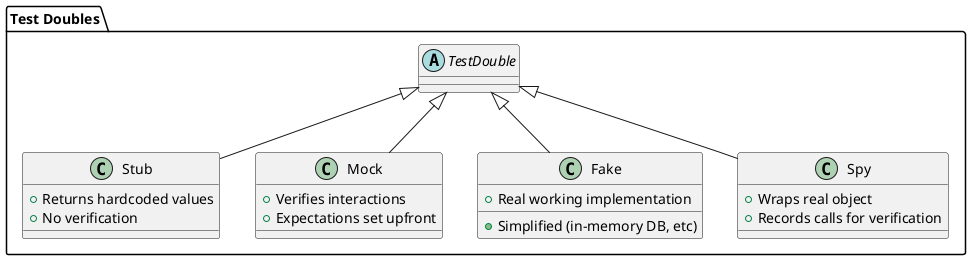

# 16.1 Test Pyramid Physics

---

## 1. LEARNING OBJECTIVES

- Classify tests by pyramid level and articulate the **cost/confidence trade-off** at each tier
- Identify the **ice cream cone anti-pattern** and calculate its concrete CI impact
- Select the correct **test double** (Stub, Mock, Fake, Spy) for a given scenario using a decision rule
- Explain why **line coverage is not a proxy for confidence** and what metric is more meaningful
- Describe **contract testing** as the structural gap between unit and integration tests

---

## 2. PREREQUISITES

- Chapter 01: Java fundamentals (interfaces, generics, lambdas)
- Basic JUnit 5 usage (you can write `@Test`, `@BeforeEach`, assertions)
- Familiarity with dependency injection (Spring or manual constructor injection)
- No prior Mockito knowledge required — it is introduced here

---

## 3. THE CRITICAL DIALOGUE

**Student:** We just hit 90% line coverage across the codebase. Our CI gate enforces it. But we still get bugs in production every sprint. What are we doing wrong?

**Principal:** First, congratulations on the discipline to enforce a coverage gate. Now let me show you why that number is almost meaningless as a quality signal.

**Student:** How? 90% means 90% of the code is executed by tests.

**Principal:** Executed, yes. Verified, no. Write this class:

```java
public int divide(int a, int b) {
    return a / b;
}
```

One test: `assert divide(10, 2) == 5`. Coverage: 100%. Does it test `b = 0`? Does it test `Integer.MIN_VALUE / -1`? Coverage says nothing about *what you assert*, only *which lines ran*.

**Student:** OK, but we have hundreds of e2e tests that cover real user flows.

**Principal:** Walk me through your test count breakdown. How many unit, integration, and e2e?

**Student:** Probably... 50 unit tests, 30 integration, 200 e2e through Selenium.

**Principal:** You have an ice cream cone. Flip it upside down and you have a pyramid. Your 200 e2e tests at 2 minutes each — that's 400 minutes, 6.7 hours, **per CI run**. How often do developers actually wait for that to pass before merging?

**Student:** They... don't. They merge and check later.

**Principal:** Which means your fast feedback is gone. Bugs discovered 2 hours after merge cost 10x more to fix than bugs caught in the 200ms unit test that runs on every file save. The pyramid is not an aesthetic preference — it is a **cost model**.

**Student:** So what's missing beyond moving tests down the pyramid?

**Principal:** The **contract gap**. Your unit tests mock the HTTP client. Your e2e tests hit the real API. But nobody verifies that the mock *matches* what the API actually returns. When the provider team changes a field name, your unit tests still pass, your integration tests still pass, and the bug lands in production. Contract testing seals that gap.

---

## 4. THEORY + DIAGRAMS

### The Test Pyramid

```
        /\
       /  \   E2E
      /    \  Slow | Expensive | High Confidence
     /------\
    /        \ Integration
   /          \ Medium speed | Medium cost | Medium confidence
  /------------\
 /              \ Unit Tests
/________________\ Fast | Cheap | Low confidence per test, high in aggregate
```

**Cost model per test type (2024 hardware baselines):**

| Level       | Execution Time | Setup Cost  | Flakiness Risk | CI Resource |
|-------------|---------------|-------------|----------------|-------------|
| Unit        | ~10ms         | None        | Near zero      | ~0          |
| Integration | ~5s           | DB/container| Low-medium     | Docker CPU  |
| E2E         | ~2min         | Full env    | High (UI/net)  | Significant |

### The Ice Cream Cone Anti-Pattern

```
 _______________
|               |  <- Manual testing (heaviest, slowest)
|_______________|
|               |  <- E2E (many, slow)
|_________|_____|
|         |        <- Integration (some)
|___|_____|
|   |               <- Unit (few)
|___|

vs correct pyramid:

|___|               <- E2E (few, critical paths only)
|_______|
|___________|       <- Integration (moderate)
|_______________|   <- Unit (many, fast, focused)
```

### CI Cost Calculation — Ice Cream Cone Reality

```
200 e2e tests × 2 min = 400 min = 6.7 hours per CI run

If your team merges 10 PRs/day:
  Serialized CI: 10 × 6.7h = 67 hours (impossible without massive parallelism)
  With 4 parallel runners: 6.7h / 4 = 100 min wait per PR

Same coverage via unit tests:
  2000 unit tests × 10ms = 20 seconds per CI run
  Feedback loop: developer sees result before switching context
```

The compounding effect: slow CI creates **merge pressure**. Developers batch changes, merge without waiting, and the signal arrives too late to be actionable.

### Test Double Taxonomy

A test double is any object that stands in for a real collaborator in a test. There are four distinct types, and using the wrong one is one of the most common sources of test fragility.



**Decision rule:**

| You want to...                              | Use    |
|---------------------------------------------|--------|
| Control what a dependency returns           | Stub   |
| Verify a dependency was called correctly    | Mock   |
| Replace infrastructure with a fast version | Fake   |
| Partially observe a real object's behavior | Spy    |

---

## 5. SOURCE ARCHAEOLOGY

**Mockito's proxy generation — how Mocks are created at runtime:**

Mockito does not use `java.lang.reflect.Proxy` for class mocking (only interfaces can use JDK proxies). For concrete classes, Mockito delegates to **ByteBuddy** via `org.mockito.internal.creation.bytebuddy.ByteBuddyMockMaker`.

Key class: `org.mockito.internal.creation.bytebuddy.SubclassByteBuddyMockMaker`

The relevant call chain:
```
Mockito.mock(Foo.class)
  → MockUtil.createMock(MockCreationSettings)
  → ByteBuddyMockMaker.createMock(settings, handler)
  → SubclassByteBuddyMockMaker.createMock(...)
    → ByteBuddy().subclass(typeToMock)   // generates subclass at runtime
    → .method(isVirtual()).intercept(MethodDelegation.to(DispatcherDefaultingToRealMethod))
```

This means Mockito **creates a subclass** of your class at runtime with all methods intercepted. This is why `final` classes and `final` methods **cannot be mocked** by default — ByteBuddy cannot subclass them. The `mockito-inline` agent (or MockMaker inline mode) works around this by using Java instrumentation to redefine the class bytecode rather than subclassing.

**Practical implication:** If you see `CannotMockFinalClassException`, you either need `@ExtendWith(MockitoExtension.class)` with inline mode, or — more importantly — ask yourself *why* you're mocking a final class. It usually means you're mocking a value object or utility that shouldn't be mocked at all.

Source: `mockito/src/main/java/org/mockito/internal/creation/bytebuddy/SubclassByteBuddyMockMaker.java`

---

## 6. CODE LAB

### Bad Approach — Over-mocking, testing implementation not behavior

```java
// BAD: This test is testing Mockito, not your code.
// It will break if you rename a private method or change ordering.
@Test
void badTest_overMocked() {
    UserRepository repo = mock(UserRepository.class);
    EmailService email = mock(EmailService.class);
    AuditLog audit = mock(AuditLog.class);
    
    UserService sut = new UserService(repo, email, audit);
    
    when(repo.findById(1L)).thenReturn(Optional.of(new User(1L, "alice")));
    
    sut.deactivateUser(1L);
    
    // Verifying every internal step — brittle
    verify(repo).findById(1L);
    verify(repo).save(any());
    verify(email).sendDeactivationEmail(any());
    verify(audit).log(eq("DEACTIVATE"), eq(1L)); // breaks if log signature changes
}
```

### Good Approach — Four doubles, each used correctly

```java
import org.junit.jupiter.api.*;
import org.mockito.*;
import org.mockito.junit.jupiter.MockitoExtension;

import java.util.*;
import java.util.concurrent.ConcurrentHashMap;

import static org.assertj.core.api.Assertions.*;
import static org.mockito.Mockito.*;

// ─── Domain objects ──────────────────────────────────────────────────────────

record User(Long id, String name, boolean active) {
    User deactivate() { return new User(id, name, false); }
}

// ─── Interfaces ──────────────────────────────────────────────────────────────

interface UserRepository {
    Optional<User> findById(Long id);
    User save(User user);
}

interface EmailService {
    void sendDeactivationEmail(User user);
}

interface AuditLog {
    void log(String event, Long userId);
}

// ─── System Under Test ───────────────────────────────────────────────────────

class UserService {
    private final UserRepository repo;
    private final EmailService emailService;
    private final AuditLog auditLog;

    UserService(UserRepository repo, EmailService emailService, AuditLog auditLog) {
        this.repo = repo;
        this.emailService = emailService;
        this.auditLog = auditLog;
    }

    public User deactivateUser(Long userId) {
        User user = repo.findById(userId)
            .orElseThrow(() -> new IllegalArgumentException("User not found: " + userId));
        User deactivated = repo.save(user.deactivate());
        emailService.sendDeactivationEmail(deactivated);
        auditLog.log("DEACTIVATE", userId);
        return deactivated;
    }
}

// ─── Test Doubles Showcase ───────────────────────────────────────────────────

/**
 * STUB: Returns hardcoded data. No interaction verification.
 * Use when: you need to control what a dependency returns,
 *           and you don't care how many times it's called.
 */
class StubUserRepository implements UserRepository {
    @Override
    public Optional<User> findById(Long id) {
        // Hardcoded — does not care about the input value
        return Optional.of(new User(id, "stub-user", true));
    }

    @Override
    public User save(User user) {
        return user; // pass-through
    }
}

/**
 * FAKE: Real working implementation, simplified for speed.
 * Use when: you need realistic behavior (e.g., transactions, queries)
 *           but cannot afford a real DB in unit tests.
 */
class FakeUserRepository implements UserRepository {
    private final Map<Long, User> store = new ConcurrentHashMap<>();

    public void seed(User user) { store.put(user.id(), user); }

    @Override
    public Optional<User> findById(Long id) { return Optional.ofNullable(store.get(id)); }

    @Override
    public User save(User user) {
        store.put(user.id(), user);
        return user;
    }
}

// ─── Test Class ──────────────────────────────────────────────────────────────

@ExtendWith(MockitoExtension.class)
class UserServiceTest {

    // ── TEST 1: Stub — verify output, not interaction ─────────────────────

    @Test
    @DisplayName("STUB: deactivateUser returns inactive user")
    void stub_deactivateUser_returnsInactiveUser() {
        // Stub controls the return value — we don't care it was called once vs twice
        UserRepository stubRepo = new StubUserRepository();
        EmailService noopEmail = user -> {}; // lambda = simplest stub
        AuditLog noopAudit = (e, id) -> {};

        UserService sut = new UserService(stubRepo, noopEmail, noopAudit);
        User result = sut.deactivateUser(42L);

        assertThat(result.active()).isFalse();
    }

    // ── TEST 2: Mock — verify interactions, not return values ─────────────

    @Test
    @DisplayName("MOCK: deactivateUser sends exactly one deactivation email")
    void mock_deactivateUser_sendsOneEmail(@Mock EmailService mockEmail, @Mock AuditLog mockAudit) {
        // Use Mock when the SIDE EFFECT is the contract (email sent, audit written)
        UserRepository stubRepo = new StubUserRepository();
        UserService sut = new UserService(stubRepo, mockEmail, mockAudit);

        sut.deactivateUser(1L);

        // Verify behavior: was the email sent exactly once?
        verify(mockEmail, times(1)).sendDeactivationEmail(argThat(u -> !u.active()));
        // Do NOT verify every collaborator — only the one whose interaction IS the feature
    }

    // ── TEST 3: Fake — test multi-step stateful behavior ──────────────────

    @Test
    @DisplayName("FAKE: deactivateUser persists inactive state")
    void fake_deactivateUser_persistsInactiveState() {
        // Fake lets us test that save() actually persisted and findById sees the new state
        FakeUserRepository fakeRepo = new FakeUserRepository();
        fakeRepo.seed(new User(7L, "alice", true));

        UserService sut = new UserService(fakeRepo, user -> {}, (e, id) -> {});
        sut.deactivateUser(7L);

        Optional<User> persisted = fakeRepo.findById(7L);
        assertThat(persisted).isPresent();
        assertThat(persisted.get().active()).isFalse();
    }

    // ── TEST 4: Spy — observe real object, override specific methods ───────

    @Test
    @DisplayName("SPY: AuditLog base call is preserved, specific call verified")
    void spy_auditLog_verifyLogEventType() {
        // Spy wraps a real (or partial) implementation
        // Use sparingly — often signals the SUT design needs improvement
        AuditLog realAudit = (event, userId) -> {
            // Real impl would write to DB — here it just runs
            System.out.printf("AUDIT: %s for user %d%n", event, userId);
        };
        AuditLog spyAudit = spy(realAudit);

        UserRepository stubRepo = new StubUserRepository();
        UserService sut = new UserService(stubRepo, user -> {}, spyAudit);
        sut.deactivateUser(5L);

        // Verify the spy received the right arguments while still executing real logic
        verify(spyAudit).log("DEACTIVATE", 5L);
    }

    // ── TEST 5: Missing user throws ────────────────────────────────────────

    @Test
    @DisplayName("throws when user does not exist")
    void deactivateUser_missingUser_throws() {
        FakeUserRepository emptyRepo = new FakeUserRepository();
        UserService sut = new UserService(emptyRepo, user -> {}, (e, id) -> {});

        assertThatThrownBy(() -> sut.deactivateUser(999L))
            .isInstanceOf(IllegalArgumentException.class)
            .hasMessageContaining("999");
    }
}
```

### Contract Testing — The Missing Layer

A contract test sits between unit and integration. It verifies that the *shape* of the interface (request/response) matches between producer and consumer — without deploying both.

```java
// Conceptual sketch — full Pact example in module 16.2
// Consumer side: "I expect /users/{id} to return { id, name, active }"
// Provider side: run against real controller, assert response matches consumer's expectation

// Without contract testing: mock matches what you *think* the API returns
// With contract testing:    mock is auto-generated from what the API *actually* returns
```

---

## 7. PRODUCTION LENS

### Real CI Cost Calculation

**Scenario:** E-commerce platform, 8 engineers, CI runs triggered by every PR.

```
Test suite composition (ice cream cone):
  50  unit tests    × 10ms   =    0.5s
  30  integration  × 5s     =  150s  (2.5 min)
  200 e2e tests    × 2min   =  400min (6.7h)

CI hardware: 4 parallel runners
Wall-clock time per run: 6.7h / 4 = ~1.7h per PR

Team merges ~12 PRs/day:
  12 × 1.7h = 20.4h of CI wall time needed/day
  → Engineers wait average 1.7h for green signal
  → Most skip waiting; bugs discovered in staging hours later
  → Average debugging session after delayed feedback: 45 min
  → 12 PRs × 45min = 9h/day of delayed bug fixing
```

**Inverted (correct) pyramid — same coverage:**

```
2000 unit tests   × 10ms  = 20s
 150 integration  × 5s    = 750s (12.5 min)
  20 e2e tests    × 2min  = 40min / 4 runners = 10min

Wall-clock per PR: ~13 min
Developer waits, sees result, fixes immediately (avg 5 min)
12 PRs × 5min = 1h/day of bug fixing
→ Savings: 8h/day of engineering time
```

### Why Teams Build Ice Cream Cones

1. **E2e tests are written by QA** with no unit test background — they test the only way they know
2. **Early project**: writing e2e first feels like "real" testing, unit tests seem redundant
3. **Coverage theater**: line coverage counts e2e execution, so the metric looks good
4. **No one refactors the test suite** — it accretes over years
5. **Management sees green CI** and doesn't ask what's behind it

### Coverage ≠ Confidence: The Achilles Heel

```java
// 100% branch coverage, zero confidence:
public boolean isEligible(int age, boolean hasLicense) {
    return age >= 18 && hasLicense;
}

// Test that hits both branches:
@Test void test1() { assertThat(isEligible(20, true)).isTrue(); }
@Test void test2() { assertThat(isEligible(15, true)).isFalse(); }

// Mutation: change >= to > (age > 18 instead of age >= 18)
// Both tests still pass. The 18-year-old is silently rejected.
// Coverage: 100%. Bug: present. (Covered in depth in module 16.4)
```

---

## 8. EXERCISES

**Exercise 1 — Conceptual: Classify the test suite**

Your team has: 400 Selenium tests, 20 JUnit tests, 5 Postman collections run nightly.
- Calculate the CI wall time assuming 4 runners and standard timings from this module.
- Identify which category of anti-pattern this is.
- Propose a concrete migration plan (what to convert first, and why).

**Exercise 2 — Coding: Build a Fake**

Implement `FakePaymentGateway` that satisfies this interface:
```java
interface PaymentGateway {
    PaymentResult charge(String cardToken, Money amount);
    void refund(String transactionId);
    List<Transaction> getHistory(String cardToken);
}
```
Rules: thread-safe, deterministic (same token always succeeds/fails based on prefix), supports `refund` by reversing a charge in history.

**Exercise 3 — Conceptual: Mock vs Stub decision**

For each scenario, decide Stub or Mock and explain why:
- a) A `CurrencyConverter` used to translate prices for display
- b) A `NotificationService` that sends SMS when order ships
- c) A `FeatureFlag` service that returns true/false per feature name
- d) A `RateLimiter` that should be called before processing each request

**Exercise 4 — Coding: Coverage does not equal confidence**

Write a class `Discount` with method `double apply(double price, int quantity)` that has a bug (your choice). Write a test suite that achieves 100% line coverage but misses the bug. Then write a second test that exposes it. Document what property the first suite failed to verify.

**Exercise 5 — Design: Contract gap analysis**

You have a `UserService` (Java) calling a `ProfileService` (Python) via REST. Draw the test coverage gap: what does the Java mock verify vs what the Python service actually returns? Describe in 3 bullet points what a contract test would add that neither unit nor e2e tests provide.

---

## 9. SUMMARY / FLASHCARD

- **Test pyramid** orders tests by speed and cost: unit (10ms, cheap) → integration (5s, moderate) → e2e (2min, expensive); confidence does not increase linearly with cost
- **Ice cream cone** is the anti-pattern where e2e tests dominate; 200 e2e tests = 6.7h CI time, destroying fast-feedback loops and forcing teams to merge blindly
- **Test doubles** serve distinct roles: Stub controls return values, Mock verifies interactions, Fake provides a working lightweight implementation, Spy wraps a real object to observe calls — mixing these roles causes brittle tests
- **Line coverage is a vanity metric**: 100% coverage means every line ran, not that every behavior was asserted; a mutant changing `>=` to `>` survives 100% coverage and represents a real bug
- **Contract testing** seals the gap between unit tests (which mock the API) and e2e tests (which hit real APIs): it auto-generates the mock from the actual provider contract, so a schema change on the provider side immediately breaks the consumer's unit tests

---
*Module 16.1 | Chapter 16: Testing Mastery | Target: 4-6yr Java engineer → Staff/Principal*
