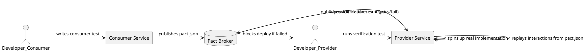

# 16.2 Contract Testing with Pact

---

## 1. LEARNING OBJECTIVES

- Explain **consumer-driven contract testing** and why the consumer — not the provider — owns the contract definition
- Implement a **complete Pact consumer test** that generates a `.json` pact file
- Implement a **provider verification test** that reads a pact file and asserts against a real implementation
- Demonstrate how Pact **catches a breaking change** (removed or renamed field) that unit and e2e tests miss
- Describe the **Pact Broker** workflow and when it becomes necessary in a multi-team environment

---

## 2. PREREQUISITES

- Module 16.1: Test Pyramid Physics (especially the "contract gap" concept)
- JUnit 5 basics
- Familiarity with REST APIs (HTTP verbs, JSON bodies, status codes)
- Basic Spring Boot knowledge (controllers, RestTemplate or WebClient) — you will read but not deeply analyze Spring code

---

## 3. THE CRITICAL DIALOGUE

**Student:** Our microservices integration tests take 20 minutes. We spin up the whole stack with Docker Compose — three services, a database, a message broker. It's the only way to be sure the services talk to each other correctly.

**Principal:** What percentage of those 20 minutes is actually testing that the *API contract* is correct versus testing that your own business logic works?

**Student:** I guess... most of it is just waiting for containers to start.

**Principal:** Right. The containers start in 3-4 minutes, and the actual assertions run in 30 seconds. You are paying 4 minutes of overhead per test run to verify something that, conceptually, has nothing to do with container orchestration. The real question is: does the JSON shape coming back from Service B match what Service A expects?

**Student:** But you can't know that without running them both together.

**Principal:** That is the assumption contract testing breaks. Here is the insight: the consumer already knows exactly what fields it reads from the provider's response. It knows because it *deserializes* the response into a Java object. Write that expectation down as a formal contract. Give it to the provider. The provider verifies their real implementation against it — alone, no consumer running. Now both sides verify the same contract independently, in their own fast unit tests.

**Student:** What if the provider changes the response without updating the contract?

**Principal:** Their verification test breaks immediately. Before the code is even merged. That's the point. Compare that to your current flow: provider merges the change, your Docker Compose test is green because it was written against old data, the bug reaches staging, someone notices the UI is broken, you spend an afternoon debugging a JSON field rename.

**Student:** This sounds like it only works if both teams agree to maintain the contract.

**Principal:** You are identifying the organizational prerequisite correctly. The Pact Broker is the tooling that enforces this. Contracts are published to a central broker. Providers cannot deploy unless their verification passes against every consumer contract in the broker. It is a *deployment gate*, not just a test.

---

## 4. THEORY + DIAGRAMS

### Consumer-Driven Contract Testing: Core Concept

In traditional integration testing, the *provider* defines the API and consumers adapt. Consumer-driven contracts reverse this: **the consumer defines what it needs**, and the provider verifies that it delivers that minimum.

This is a key distinction: the contract does not describe the full provider API. It describes only what *this specific consumer uses*. A provider can add fields freely. It cannot remove or rename fields that any consumer contract depends on.



### Pact Workflow Step by Step

```
1. Consumer writes a test that:
   - Defines expected request (method, path, headers, body)
   - Defines expected response (status, headers, body shape)
   - Runs against a Pact mock server (not the real provider)
   - On success, writes interaction to a pact.json file

2. Consumer publishes pact.json to Pact Broker
   (or shares the file directly in simpler setups)

3. Provider reads the pact file and for each interaction:
   - Starts the real provider application (Spring Boot, etc.)
   - Replays the request from the pact file
   - Compares the actual response to the expected response
   - Reports pass/fail per interaction

4. If provider changes the response schema:
   - Verification test fails
   - Provider cannot deploy (if Pact Broker is a gate)
   - Provider team must coordinate with consumer team
```

### What "Breaking Change" Means in Pact Terms

```
Consumer pact expects:
{
  "id": 1,
  "username": "alice",
  "email": "alice@example.com"
}

Provider v2 returns:
{
  "id": 1,
  "userName": "alice",       ← renamed field (camelCase)
  "emailAddress": "alice@example.com"  ← renamed field
}

Pact verification: FAIL
  - Expected field "username" not present
  - Expected field "email" not present

Without Pact: consumer deserialization silently returns null for both fields.
With Pact: provider CI breaks before the change ships.
```

---

## 5. SOURCE ARCHAEOLOGY

**Pact-JVM internals — how the mock server works:**

When you call `PactConsumerTestExt` (the JUnit 5 extension), it starts an in-process HTTP server backed by `au.com.dius.pact.consumer.MockServer`. The relevant class hierarchy:

```
au.com.dius.pact.consumer.junit5.PactConsumerTestExt
  → implements BeforeTestExecutionCallback, AfterTestExecutionCallback
  → resolves @Pact-annotated methods to build RequestResponsePact objects
  → calls MockProviderConfig.httpConfig() to allocate a random port
  → delegates to BaseMockServer (Netty-based implementation: NettyCoreServer)

au.com.dius.pact.consumer.model.MockProviderConfig
  → holds host, port, TLS settings
  → default: localhost, random port

au.com.dius.pact.core.model.RequestResponseInteraction
  → holds Request + Response pair
  → compared against actual HTTP calls via matchingRules (wildcards, regex, type)
```

The matching is not string equality — it is **structural matching** by default. `PactDslJsonBody` builds a matching rule tree so `"alice"` matches rule `"type: string"`, not the literal value `"alice"`. This is important: your consumer test should use `stringType("username", "alice")` (match any string) not `stringValue("username", "alice")` (match literal "alice"), or your test will fail on any user with a different username.

**Pact provider verification internals:**

`au.com.dius.pact.provider.junit5.PactVerificationExtension` reads the pact source (file, broker URL), then for each interaction calls `ProviderClient.makeRequest()` against the real running application. The actual comparison happens in `au.com.dius.pact.core.matchers.Matching.requestMatches()`.

Source references:
- `pact-jvm/consumer/src/main/kotlin/au/com/dius/pact/consumer/MockServer.kt`
- `pact-jvm/provider/junit5/src/main/kotlin/au/com/dius/pact/provider/junit5/PactVerificationExtension.kt`
- `pact-jvm/core/matchers/src/main/kotlin/au/com/dius/pact/core/matchers/Matching.kt`

---

## 6. CODE LAB

### Project Setup

**Maven dependencies** (add to your test scope):

```xml
<!-- Consumer and provider testing -->
<dependency>
    <groupId>au.com.dius.pact.consumer</groupId>
    <artifactId>junit5</artifactId>
    <version>4.6.10</version>
    <scope>test</scope>
</dependency>
<dependency>
    <groupId>au.com.dius.pact.provider</groupId>
    <artifactId>junit5</artifactId>
    <version>4.6.10</version>
    <scope>test</scope>
</dependency>
<dependency>
    <groupId>au.com.dius.pact.provider</groupId>
    <artifactId>junit5spring</artifactId>
    <version>4.6.10</version>
    <scope>test</scope>
</dependency>
```

**Gradle (Kotlin DSL):**
```kotlin
testImplementation("au.com.dius.pact.consumer:junit5:4.6.10")
testImplementation("au.com.dius.pact.provider:junit5:4.6.10")
testImplementation("au.com.dius.pact.provider:junit5spring:4.6.10")
```

---

### Domain Model (shared concept — in real life, separate repos)

```java
package com.example.contracts.model;

// What the consumer expects to receive
public record UserResponse(Long id, String username, String email) {}

// What the consumer sends
public record CreateUserRequest(String username, String email) {}
```

---

### Consumer Side: Generating the Pact File

```java
package com.example.contracts.consumer;

import au.com.dius.pact.consumer.MockServer;
import au.com.dius.pact.consumer.dsl.PactDslJsonBody;
import au.com.dius.pact.consumer.dsl.PactDslWithProvider;
import au.com.dius.pact.consumer.junit5.PactConsumerTestExt;
import au.com.dius.pact.consumer.junit5.PactTestFor;
import au.com.dius.pact.core.model.RequestResponsePact;
import au.com.dius.pact.core.model.annotations.Pact;
import org.junit.jupiter.api.Test;
import org.junit.jupiter.api.extension.ExtendWith;
import org.springframework.web.client.RestTemplate;

import java.util.Map;

import static org.assertj.core.api.Assertions.assertThat;

/**
 * CONSUMER TEST — runs against Pact's mock server, not the real provider.
 *
 * This test:
 *   1. Defines what the consumer NEEDS from the provider
 *   2. Verifies our own client code can parse the response correctly
 *   3. Generates target/pacts/UserConsumer-UserProvider.json
 *
 * The pact file is the artifact that matters — it is published to the Pact Broker
 * and used by the provider to verify their implementation.
 */
@ExtendWith(PactConsumerTestExt.class)
@PactTestFor(providerName = "UserProvider")
class UserConsumerPactTest {

    // ── Interaction 1: Fetch existing user ───────────────────────────────────

    @Pact(consumer = "UserConsumer")
    public RequestResponsePact getUserById(PactDslWithProvider builder) {
        return builder
            .given("user with id 1 exists")           // provider state — provider sets this up
            .uponReceiving("a request to get user 1")
                .path("/users/1")
                .method("GET")
            .willRespondWith()
                .status(200)
                .headers(Map.of("Content-Type", "application/json"))
                .body(new PactDslJsonBody()
                    // Use type matchers, NOT value matchers — values are provider's concern
                    .numberType("id", 1L)
                    .stringType("username", "alice")     // any string, "alice" is the example
                    .stringType("email", "alice@example.com"))
            .toPact();
    }

    @Test
    @PactTestFor(pactMethod = "getUserById")
    void getUserById_parsesResponseCorrectly(MockServer mockServer) {
        // This test runs against Pact's mock server on a random port
        String baseUrl = mockServer.getUrl();
        RestTemplate restTemplate = new RestTemplate();

        UserResponse response = restTemplate.getForObject(
            baseUrl + "/users/1", UserResponse.class);

        // We verify OUR client code — does it parse the fields we depend on?
        assertThat(response).isNotNull();
        assertThat(response.id()).isEqualTo(1L);
        assertThat(response.username()).isNotBlank();
        assertThat(response.email()).contains("@");
        // After this test passes, Pact writes target/pacts/UserConsumer-UserProvider.json
    }

    // ── Interaction 2: User not found ─────────────────────────────────────────

    @Pact(consumer = "UserConsumer")
    public RequestResponsePact getUserNotFound(PactDslWithProvider builder) {
        return builder
            .given("user with id 999 does not exist")
            .uponReceiving("a request for a missing user")
                .path("/users/999")
                .method("GET")
            .willRespondWith()
                .status(404)
                .body(new PactDslJsonBody()
                    .stringType("error", "User not found"))
            .toPact();
    }

    @Test
    @PactTestFor(pactMethod = "getUserNotFound")
    void getUserNotFound_throws404(MockServer mockServer) {
        String baseUrl = mockServer.getUrl();
        RestTemplate restTemplate = new RestTemplate();

        // Verify our client handles 404 — the pact captures that we EXPECT 404, not 200
        try {
            restTemplate.getForObject(baseUrl + "/users/999", UserResponse.class);
        } catch (org.springframework.web.client.HttpClientErrorException e) {
            assertThat(e.getStatusCode().value()).isEqualTo(404);
        }
    }

    // ── Interaction 3: Create user ────────────────────────────────────────────

    @Pact(consumer = "UserConsumer")
    public RequestResponsePact createUser(PactDslWithProvider builder) {
        return builder
            .given("no user exists with username bob")
            .uponReceiving("a request to create a new user")
                .path("/users")
                .method("POST")
                .headers(Map.of("Content-Type", "application/json"))
                .body(new PactDslJsonBody()
                    .stringType("username", "bob")
                    .stringType("email", "bob@example.com"))
            .willRespondWith()
                .status(201)
                .body(new PactDslJsonBody()
                    .numberType("id", 2L)              // we care that id is a number
                    .stringType("username", "bob")
                    .stringType("email", "bob@example.com"))
            .toPact();
    }

    @Test
    @PactTestFor(pactMethod = "createUser")
    void createUser_returnsCreatedUser(MockServer mockServer) {
        String baseUrl = mockServer.getUrl();
        RestTemplate restTemplate = new RestTemplate();

        CreateUserRequest request = new CreateUserRequest("bob", "bob@example.com");
        UserResponse response = restTemplate.postForObject(
            baseUrl + "/users", request, UserResponse.class);

        assertThat(response).isNotNull();
        assertThat(response.id()).isPositive();
        assertThat(response.username()).isEqualTo("bob");
    }
}
```

**Generated pact file** (`target/pacts/UserConsumer-UserProvider.json`):
```json
{
  "consumer": { "name": "UserConsumer" },
  "provider": { "name": "UserProvider" },
  "interactions": [
    {
      "description": "a request to get user 1",
      "providerStates": [{ "name": "user with id 1 exists" }],
      "request": { "method": "GET", "path": "/users/1" },
      "response": {
        "status": 200,
        "headers": { "Content-Type": "application/json" },
        "body": { "id": 1, "username": "alice", "email": "alice@example.com" },
        "matchingRules": {
          "body": {
            "$.id":       { "matchers": [{ "match": "number" }] },
            "$.username": { "matchers": [{ "match": "type" }] },
            "$.email":    { "matchers": [{ "match": "type" }] }
          }
        }
      }
    }
  ]
}
```

---

### Provider Side: Verifying the Pact

```java
package com.example.contracts.provider;

import au.com.dius.pact.provider.junit5.PactVerificationContext;
import au.com.dius.pact.provider.junit5.PactVerificationExtension;
import au.com.dius.pact.provider.junitsupport.Provider;
import au.com.dius.pact.provider.junitsupport.State;
import au.com.dius.pact.provider.junitsupport.loader.PactFolder;
import au.com.dius.pact.provider.spring.junit5.MockMvcTestTarget;
import org.junit.jupiter.api.BeforeEach;
import org.junit.jupiter.api.TestTemplate;
import org.junit.jupiter.api.extension.ExtendWith;
import org.springframework.beans.factory.annotation.Autowired;
import org.springframework.boot.test.autoconfigure.web.servlet.WebMvcTest;
import org.springframework.test.web.servlet.MockMvc;

/**
 * PROVIDER VERIFICATION TEST — reads the consumer's pact file and
 * verifies the real Spring controller satisfies every interaction.
 *
 * This test does NOT need the consumer to be running.
 * It reads the pact file (from a folder or Pact Broker URL).
 *
 * Run this on the PROVIDER'S CI pipeline.
 */
@WebMvcTest(UserController.class)
@ExtendWith(PactVerificationExtension.class)
@Provider("UserProvider")
@PactFolder("src/test/resources/pacts")   // or use @PactBroker("https://broker.example.com")
class UserProviderPactVerificationTest {

    @Autowired
    private MockMvc mockMvc;

    @Autowired
    private UserRepository userRepository;   // injected for state setup

    /**
     * Wire Pact's verification engine to Spring's MockMvc.
     * Pact will replay each interaction through MockMvc.
     */
    @BeforeEach
    void setupTestTarget(PactVerificationContext context) {
        context.setTarget(new MockMvcTestTarget(mockMvc));
    }

    /**
     * This method is called for each interaction in the pact file.
     * Do NOT add logic here — Pact drives the verification.
     */
    @TestTemplate
    @ExtendWith(PactVerificationExtension.class)
    void pactVerificationTestTemplate(PactVerificationContext context) {
        context.verifyInteraction();
    }

    // ── Provider States ───────────────────────────────────────────────────────
    // Each @State matches a "given" clause in the consumer's pact definition.
    // The provider test sets up the required data before Pact replays the request.

    @State("user with id 1 exists")
    void setupUserWithId1() {
        userRepository.save(new User(1L, "alice", "alice@example.com"));
    }

    @State("user with id 999 does not exist")
    void setupMissingUser() {
        userRepository.deleteById(999L);   // ensure it's gone
    }

    @State("no user exists with username bob")
    void setupNoBob() {
        userRepository.deleteByUsername("bob");
    }
}
```

---

### Demonstrating a Breaking Change

```java
/**
 * Provider v1 controller (passes verification):
 */
@RestController
@RequestMapping("/users")
class UserController {
    @GetMapping("/{id}")
    public ResponseEntity<UserResponseV1> getUser(@PathVariable Long id) {
        // Returns: { "id": 1, "username": "alice", "email": "alice@example.com" }
        return ResponseEntity.ok(new UserResponseV1(1L, "alice", "alice@example.com"));
    }
}

record UserResponseV1(Long id, String username, String email) {}

// ── Breaking change: provider team renames fields ─────────────────────────────

/**
 * Provider v2 controller — provider team "improved" the API naming:
 *   username  → userName      (camelCase "consistency")
 *   email     → emailAddress  (more explicit)
 *
 * Without Pact: this passes all provider unit tests. Reaches production.
 *               Consumer's UserResponse.username() returns null silently.
 *
 * With Pact: @State setup runs, Pact replays GET /users/1, compares response:
 *   FAIL: Expected field "username" but got "userName"
 *   FAIL: Expected field "email" but got "emailAddress"
 *   → Provider CI fails. Change cannot be deployed without consumer coordination.
 */
@RestController
@RequestMapping("/users")
class UserControllerV2_BREAKING {
    @GetMapping("/{id}")
    public ResponseEntity<UserResponseV2> getUser(@PathVariable Long id) {
        return ResponseEntity.ok(new UserResponseV2(1L, "alice", "alice@example.com"));
    }
}

record UserResponseV2(Long id, String userName, String emailAddress) {}
//                                    ^^^^^^^^         ^^^^^^^^^^^^^ — renamed!
```

---

### Pact Broker: Team-Scale Workflow

```java
// Replace @PactFolder with @PactBroker to use a central broker
// (run locally with: docker run -p 9292:9292 pactfoundation/pact-broker)

// Consumer: publish pacts to broker
// In CI: mvn pact:publish -Dpact.broker.url=http://broker:9292

// Provider: read pacts from broker
@PactBroker(
    url = "${PACT_BROKER_URL:http://localhost:9292}",
    authentication = @PactBrokerAuth(token = "${PACT_BROKER_TOKEN}")
)
// Can-I-Deploy gate (run in CI before deploy):
// pact-broker can-i-deploy --pacticipant UserConsumer --latest --broker-base-url http://broker:9292
```

---

## 7. PRODUCTION LENS

### Real Incident: Schema Change Without Coordination

**Service landscape:** Payment platform, 4 microservices. `OrderService` (Java) consumed `PaymentService` (Python/FastAPI).

**What happened:**
- PaymentService team renamed `transaction_id` to `transactionId` (Python snake_case → Java camelCase "for consistency with the Java consumers")
- They updated their own unit tests, all green
- OrderService mocked the HTTP response with the old field name — mock still returned `transaction_id`, tests still passed
- Change deployed on a Friday afternoon
- Saturday morning: orders appeared to process but no transaction IDs were logged, reconciliation job failed, operations team alerted at 2 AM

**Root cause:** OrderService deserialized `transactionId` (new) into a field expecting `transaction_id` (old) — got `null`. No null check because the field had never been null in 2 years.

**Timeline:**
```
Friday 4 PM:  Provider deploys breaking change
Friday 4 PM:  All CI green (consumer mock matches old API)
Friday 11 PM: First real transaction, transactionId = null
Saturday 2 AM: Ops paged, reconciliation failure alert
Saturday 4 AM: Root cause found (field rename)
Saturday 6 AM: Consumer hotfix deployed
Saturday 8 AM: Manual reconciliation of 7 hours of transactions
Total engineering cost: ~20h engineering time + 7h manual reconciliation
```

**With Pact:**
```
Provider writes code to rename field
Provider runs pact verification → FAIL on "transaction_id" not present
Provider is blocked from merging
Provider coordinates with OrderService team
Field added with backward compatibility (both names) during transition
Zero production impact
```

**Benchmark: Pact vs Docker Compose integration test speed**

```
Docker Compose suite (current):
  Container startup:        3.5 min
  Test execution:           45 sec
  Container teardown:       30 sec
  Total per run:            ~5 min
  Runs per hour (1 runner): 12

Pact consumer test (replacement):
  JVM startup:              8 sec (warm cache)
  Pact mock server startup: ~100ms
  Test execution:           2-3 sec
  Total per run:            ~12 sec
  Runs per hour (1 runner): 300

Pact provider verification:
  Spring MockMvc startup:   4 sec
  Verification per pact:    ~500ms per interaction
  3 interactions:           ~6 sec total
  Total per run:            ~12 sec

Combined consumer + provider: ~25 sec vs ~5 min
Speed improvement: 12× faster feedback, 25× more runs/hour possible
```

---

## 8. EXERCISES

**Exercise 1 — Conceptual: Consumer vs Provider ownership**

Your team argues: "Why should we (the consumer) define the contract? The provider knows their own API best."

Write a 5-sentence response explaining why consumer-driven contracts produce better outcomes than provider-driven contracts. Consider: what happens when a provider has 5 consumers and changes a field used by only 2 of them?

**Exercise 2 — Coding: Add a new consumer interaction**

Extend the consumer test to add an interaction for `DELETE /users/{id}`:
- Provider state: "user with id 5 exists"
- Expected response: 204 No Content
- Consumer test: verify that the client receives 204
- Provider state setup: seed a user with id 5

**Exercise 3 — Coding: Simulate and detect a breaking change**

Take the provider controller from the Code Lab. Introduce a breaking change of your own choice (rename a field, change a type, remove a field). Run the provider verification test. Document the exact Pact error message that appears. Then fix the provider to restore backward compatibility using a Jackson annotation (`@JsonProperty`) without changing the field name in the Java record.

**Exercise 4 — Design: Pact Broker deployment gate**

Draw the CI/CD pipeline for both consumer and provider that includes Pact Broker. Answer these questions:
- At what point in the pipeline does the consumer publish its pact?
- At what point does the provider run verification?
- What is the `can-i-deploy` command and where does it run?
- What happens if the provider fails verification — does the consumer's pipeline fail, the provider's, or both?

**Exercise 5 — Conceptual: Pact limitations**

Pact is not the right tool for every contract. Describe two scenarios where you would NOT use Pact and explain what you would use instead:
- a) When the interaction is event-based (Kafka topic, not HTTP)
- b) When the consumer performs complex server-side filtering via query parameters

---

## 9. SUMMARY / FLASHCARD

- **Consumer-driven contracts** flip the ownership model: the consumer defines what fields it needs from the provider, not the other way around — this ensures providers can only make additive (non-breaking) changes freely
- **Pact workflow** has two independent phases: consumer test (runs against mock, writes `.json` pact file) and provider verification test (reads pact file, replays against real implementation) — neither side needs the other running
- **Breaking change detection** works because field renames and removals fail the structural matcher in the provider verification test before the change reaches any shared environment — the `transaction_id` → `transactionId` incident is the canonical example
- **Type matchers over value matchers**: use `stringType("field", "example")` not `stringValue("field", "alice")` — values are the provider's domain; the consumer only cares about the type and presence of a field
- **Pact Broker** scales contracts to multi-team environments by acting as a contract registry and deployment gate: `can-i-deploy` blocks a provider release if any consumer's pact verification fails against the version being deployed

---
*Module 16.2 | Chapter 16: Testing Mastery | Target: 4-6yr Java engineer → Staff/Principal*
