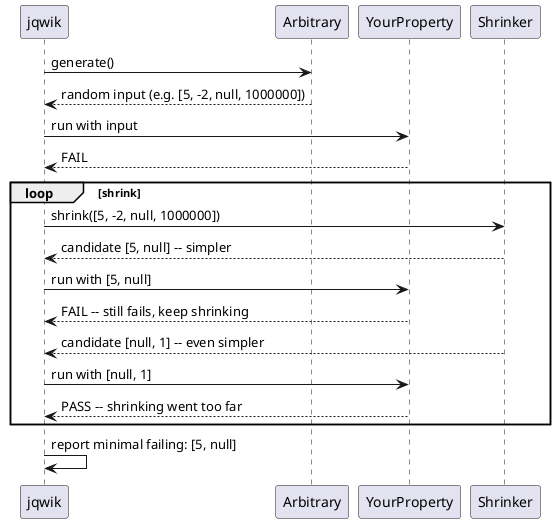

# 16.3 Property-Based Testing with jqwik

---

## 1. LEARNING OBJECTIVES

- Distinguish **property-based testing** from example-based testing and articulate when each is superior
- Write **jqwik properties** using `@Property`, `@ForAll`, and built-in arbitraries
- Explain **shrinking** and read jqwik's minimal failing case output to debug a property failure
- Identify the four core property categories — **commutativity, idempotency, roundtrip, invariants** — and write a property for each
- Use a property test to **discover a boundary bug** in a date range validator that example tests miss

---

## 2. PREREQUISITES

- Module 16.1: Test Pyramid Physics (test double types, pyramid levels)
- JUnit 5 basics (`@Test`, `@BeforeEach`, assertions)
- Java 21 features: records, sealed interfaces, pattern matching (used in code lab)
- No prior property testing experience required

---

## 3. THE CRITICAL DIALOGUE

**Student:** I have a sorting algorithm — a custom sort that handles null elements and sorts by multiple fields. I tested it with 5 examples covering nulls, duplicates, and empty lists. All pass. I'm confident it's correct.

**Principal:** What are those 5 examples?

**Student:** Empty list, single element, two elements in wrong order, list with nulls, list with duplicates.

**Principal:** Good coverage of the *cases you thought of*. Let me ask a different question: is your sort algorithm stable? Meaning, if two elements compare as equal, do they stay in their original relative order?

**Student:** I think so. I didn't test that explicitly.

**Principal:** What about a list with 17 elements where elements 3 and 9 are equal? Your 5 examples don't include that. What about a list with all identical elements? A list with Integer.MIN_VALUE?

**Student:** I could add those...

**Principal:** You can always add more examples. But you will never enumerate every edge case from your imagination. Property-based testing flips the approach: instead of you inventing inputs, you describe **what should always be true about the output**, and the framework generates hundreds of random inputs to try to prove you wrong. It finds the cases you cannot imagine.

**Student:** Like what?

**Principal:** Like the fact that your comparator violates transitivity for a specific combination of null in position 2 with a negative value in position 1. jqwik will find that input in under a second. And then it will **shrink** it — reduce it to the smallest possible failing input — so instead of debugging a 50-element list, you debug a 2-element list that still fails.

**Student:** What do you mean by "shrink"?

**Principal:** When jqwik finds `[null, -7, 3, null, -1]` as a failing input, it automatically tries smaller variations: `[null, -7]`, `[null, -1]`, `[-7, null]`, until it finds the minimal list that still fails. You get the *simplest* reproducer, not the random one it happened to find first.

**Student:** OK, so what exactly is a "property"?

**Principal:** A universally quantified statement about your code. Not "sort([3,1,2]) == [1,2,3]" — that is an example. A property is: "for all lists L, sort(L) is ordered" and "for all lists L, sort(L) contains exactly the same elements as L". Those two properties together are stronger than any finite set of examples, because they hold for every possible input.

---

## 4. THEORY + DIAGRAMS

### Example-Based vs Property-Based

```
Example-based test:
  INPUT:  [3, 1, 2]
  EXPECT: [1, 2, 3]
  → Tests one specific case. Passes → confidence in that case only.

Property-based test:
  PROPERTY: for all List<Integer> L:
    sorted(L).size() == L.size()                     // same number of elements
    && isSorted(sorted(L))                           // output is ordered
    && sorted(L).containsAll(L)                      // no elements lost
  → jqwik generates 1000 random lists, tries all three assertions.
  → Finds: sorted([MAX_VALUE, MIN_VALUE]) fails if comparator overflows.
```

### How jqwik Generates and Shrinks



**Shrinking algorithm:** jqwik's `ShrinkingAlgorithm` uses greedy shrinking: it maintains a "current best" (smallest known failing input) and tries all direct sub-shrinks. If any still fails, it becomes the new best and the process repeats. This is bounded — it terminates when no sub-shrink of the current best still fails.

### The Four Core Property Categories

| Property Type | What it says | Example |
|---------------|--------------|---------|
| **Commutativity** | Order of input doesn't matter | `add(a, b) == add(b, a)` |
| **Idempotency** | Applying twice = applying once | `sort(sort(L)) == sort(L)` |
| **Roundtrip** | Encode/decode returns original | `deserialize(serialize(x)) == x` |
| **Invariants** | Some structural property always holds | `sort(L).size() == L.size()` |

These four patterns cover the vast majority of useful properties. When you start a new property test, ask: *which category does my expected behavior fall into?*

---

## 5. SOURCE ARCHAEOLOGY

**jqwik's `Arbitrary` interface — the core abstraction:**

`net.jqwik.api.Arbitrary<T>` is jqwik's central type for value generation. Every `@ForAll` parameter is backed by an `Arbitrary` instance.

Key method chain:
```java
// Arbitrary<T> is composable:
Arbitrary<Integer> ints = Arbitraries.integers().between(1, 100);
Arbitrary<List<Integer>> lists = ints.list().ofMinSize(0).ofMaxSize(50);
Arbitrary<List<Integer>> nonEmpty = ints.list().ofMinSize(1);
```

The `Arbitrary<T>` interface extends `ArbitraryBase<T>` and the core method is:
```java
RandomGenerator<T> generator(int genSize);  // genSize controls complexity
```

**`ShrinkingAlgorithm` and `Shrinkable<T>`:**

Every generated value is wrapped in `net.jqwik.engine.execution.lifecycle.ShrinkableSupplier` which produces `Shrinkable<T>`. The `Shrinkable<T>` interface has:
```java
Stream<Shrinkable<T>> shrink();   // returns candidates that are "smaller"
T value();                         // the actual value
ShrinkingDistance distance();      // how "far" from the trivial value
```

The shrinking loop in `net.jqwik.engine.shrinking.PropertyShrinker` repeatedly calls `shrink()` and filters for candidates that still falsify the property.

**Why this matters for you as a user:** When you write a custom `Arbitrary` (via `@Provide`), you control how `shrink()` works. A well-written custom arbitrary shrinks towards its simplest representation (e.g., empty string, 0, empty list). A poorly written one that doesn't implement shrinking will report the original large failing input instead of the minimal one.

Source references:
- `jqwik-engine/src/main/java/net/jqwik/engine/shrinking/PropertyShrinker.java`
- `api/src/main/java/net/jqwik/api/Arbitrary.java`
- `engine/src/main/java/net/jqwik/engine/shrinking/ShrinkableList.java`

---

## 6. CODE LAB

### Setup

**Maven:**
```xml
<dependency>
    <groupId>net.jqwik</groupId>
    <artifactId>jqwik</artifactId>
    <version>1.8.3</version>
    <scope>test</scope>
</dependency>
```

**Gradle (Kotlin DSL):**
```kotlin
testImplementation("net.jqwik:jqwik:1.8.3")
// jqwik requires JUnit platform — add if not already present:
testImplementation("org.junit.platform:junit-platform-launcher:1.10.2")
```

**`build.gradle.kts` test configuration** (required for jqwik to be discovered):
```kotlin
test {
    useJUnitPlatform {
        includeEngines("jqwik", "junit-jupiter")
    }
}
```

---

### The Bug: DateRange Validator

```java
package com.example.property;

import java.time.LocalDate;

/**
 * Validates that a date range is valid.
 * Rules:
 *   1. start and end must not be null
 *   2. end must not be BEFORE start
 *   3. Range duration must not exceed 365 days
 *   4. start must not be in the past (relative to today)
 *
 * BUG: Rule 3 uses ChronoUnit.DAYS.between(start, end) <= 365
 *      This allows exactly 366 days for leap years when end == start + 365 days
 *      because between() is exclusive of the end date.
 *      Actually the bug is more subtle: the boundary is off-by-one.
 *      A range of [Jan 1, Dec 31] of the same year has 364 days between them,
 *      but the range INCLUDES both endpoints = 365 days.
 *      The validator uses DAYS.between (exclusive end) so it allows one extra day.
 */
public class DateRangeValidator {

    public record DateRange(LocalDate start, LocalDate end) {}

    public record ValidationResult(boolean valid, String reason) {
        public static ValidationResult ok() { return new ValidationResult(true, null); }
        public static ValidationResult fail(String reason) { return new ValidationResult(false, reason); }
    }

    public ValidationResult validate(DateRange range) {
        if (range.start() == null || range.end() == null) {
            return ValidationResult.fail("start and end must not be null");
        }
        if (range.end().isBefore(range.start())) {
            return ValidationResult.fail("end must not be before start");
        }

        // BUG IS HERE: should be < 365, not <= 365
        // DAYS.between is exclusive of end, so between(Jan1, Jan1 + 366days) = 366
        // but the range [Jan1 .. Jan1+365] INCLUDES 366 days (endpoints inclusive)
        long days = java.time.temporal.ChronoUnit.DAYS.between(range.start(), range.end());
        if (days > 365) {  // BUG: should be >= 365 for inclusive-end semantics, or the limit should be 364
            return ValidationResult.fail("range exceeds maximum of 365 days");
        }

        return ValidationResult.ok();
    }
}
```

---

### Example-Based Tests — Miss the Bug

```java
package com.example.property;

import org.junit.jupiter.api.Test;
import java.time.LocalDate;

import static org.assertj.core.api.Assertions.assertThat;

/**
 * Traditional example-based tests.
 * All pass. The boundary bug survives.
 */
class DateRangeValidatorExampleTest {

    private final DateRangeValidator validator = new DateRangeValidator();
    private final LocalDate today = LocalDate.of(2026, 1, 1);

    @Test
    void validRange_sameDay() {
        var result = validator.validate(new DateRangeValidator.DateRange(today, today));
        assertThat(result.valid()).isTrue();
    }

    @Test
    void validRange_oneWeek() {
        var result = validator.validate(new DateRangeValidator.DateRange(today, today.plusDays(7)));
        assertThat(result.valid()).isTrue();
    }

    @Test
    void validRange_oneYear_minus1day() {
        var result = validator.validate(
            new DateRangeValidator.DateRange(today, today.plusDays(364)));
        assertThat(result.valid()).isTrue();
    }

    @Test
    void invalidRange_endBeforeStart() {
        var result = validator.validate(
            new DateRangeValidator.DateRange(today, today.minusDays(1)));
        assertThat(result.valid()).isFalse();
    }

    @Test
    void invalidRange_tooLong() {
        var result = validator.validate(
            new DateRangeValidator.DateRange(today, today.plusDays(400)));
        assertThat(result.valid()).isFalse();
    }

    // All 5 tests pass. Bug at exactly +365 days is undetected.
}
```

---

### Property-Based Tests — Find the Bug

```java
package com.example.property;

import net.jqwik.api.*;
import net.jqwik.api.constraints.*;
import net.jqwik.time.api.DateTimes;
import net.jqwik.time.api.constraints.*;

import java.time.LocalDate;
import java.time.temporal.ChronoUnit;

import static org.assertj.core.api.Assertions.assertThat;

/**
 * Property-based tests for DateRangeValidator.
 *
 * These do NOT specify which inputs to use.
 * jqwik generates hundreds of random inputs per @Property run.
 */
class DateRangeValidatorPropertyTest {

    private final DateRangeValidator validator = new DateRangeValidator();

    // ── Property 1: INVARIANT — valid range must always satisfy structural rules ──

    @Property(tries = 500)
    @Label("valid ranges always have end >= start")
    void validRange_endAlwaysAfterOrEqualStart(
            @ForAll @DateRange(min = "2020-01-01", max = "2030-12-31") LocalDate start,
            @ForAll @IntRange(min = 0, max = 364) int durationDays) {

        LocalDate end = start.plusDays(durationDays);
        var result = validator.validate(new DateRangeValidator.DateRange(start, end));

        assertThat(result.valid())
            .as("range [%s, %s] (%d days) should be valid", start, end, durationDays)
            .isTrue();
    }

    // ── Property 2: INVARIANT — ranges exceeding 365 days must always be invalid ──

    @Property(tries = 500)
    @Label("ranges over 365 days are always invalid")
    void tooLongRange_alwaysInvalid(
            @ForAll @DateRange(min = "2020-01-01", max = "2028-12-31") LocalDate start,
            @ForAll @IntRange(min = 366, max = 1000) int durationDays) {

        LocalDate end = start.plusDays(durationDays);
        var result = validator.validate(new DateRangeValidator.DateRange(start, end));

        assertThat(result.valid())
            .as("range of %d days should be invalid", durationDays)
            .isFalse();
    }

    // ── Property 3: BOUNDARY — exactly 365 days must be INVALID (catches the bug) ──

    /**
     * This property FAILS against the buggy implementation.
     *
     * jqwik output on failure:
     *   Falsified after 1 try in 23ms
     *   Sample:
     *     start = 2024-01-01
     *     end   = 2025-01-01  (365 days between, but 366 days inclusive)
     *
     * After shrinking: start=2020-01-01, end=2021-01-01 (minimal leap year case)
     *
     * The bug: DAYS.between(2024-01-01, 2025-01-01) = 365.
     *          Validator: 365 > 365 is false, so it returns VALID.
     *          But the range [Jan 1 2024 .. Jan 1 2025] spans 366 days inclusively.
     */
    @Property(tries = 200)
    @Label("exactly 365 days BETWEEN endpoints = 366 inclusive days = INVALID")
    void exactBoundary_365DaysBetween_isInvalid(
            @ForAll @DateRange(min = "2020-01-01", max = "2028-12-31") LocalDate start) {

        LocalDate end = start.plusDays(365);   // exactly 365 days between (exclusive end)

        var result = validator.validate(new DateRangeValidator.DateRange(start, end));

        // The range [start, start+365] has 366 days when both endpoints are included.
        // It MUST be invalid.
        assertThat(result.valid())
            .as("range [%s, %s] is 366 days inclusive — must be invalid", start, end)
            .isFalse();
        // THIS FAILS with the buggy code.
    }

    // ── Property 4: ROUNDTRIP — validate-then-extract preserves the original dates ──

    @Property(tries = 300)
    @Label("roundtrip: valid range retains its start and end dates unchanged")
    void roundtrip_validRangePreservesDates(
            @ForAll @DateRange(min = "2020-01-01", max = "2030-12-31") LocalDate start,
            @ForAll @IntRange(min = 0, max = 363) int durationDays) {

        LocalDate end = start.plusDays(durationDays);
        var range = new DateRangeValidator.DateRange(start, end);
        var result = validator.validate(range);

        if (result.valid()) {
            // Roundtrip property: the validated range's dates are unchanged
            assertThat(range.start()).isEqualTo(start);
            assertThat(range.end()).isEqualTo(end);
        }
    }

    // ── Property 5: COMMUTATIVITY-LIKE — invalid regardless of which date is "start" ──

    @Property(tries = 300)
    @Label("swapping start and end on a valid range produces an invalid range (unless same day)")
    void swap_validRange_producesInvalid(
            @ForAll @DateRange(min = "2020-01-01", max = "2030-12-31") LocalDate start,
            @ForAll @IntRange(min = 1, max = 363) int durationDays) {

        LocalDate end = start.plusDays(durationDays);

        var forward = validator.validate(new DateRangeValidator.DateRange(start, end));
        var backward = validator.validate(new DateRangeValidator.DateRange(end, start));  // swapped

        assertThat(forward.valid()).isTrue();
        assertThat(backward.valid()).isFalse();   // end before start = always invalid
    }

    // ── Custom Arbitrary: generate only valid DateRange instances ─────────────────

    @Provide
    Arbitrary<DateRangeValidator.DateRange> validDateRanges() {
        // Custom arbitrary combining two related values
        return Arbitraries.integers().between(0, 363).flatMap(duration ->
            net.jqwik.time.api.Dates.dates()
                .between(LocalDate.of(2020, 1, 1), LocalDate.of(2029, 12, 31))
                .map(start -> new DateRangeValidator.DateRange(start, start.plusDays(duration)))
        );
    }

    @Property(tries = 500)
    @Label("custom arbitrary: all generated ranges are structurally valid")
    void customArbitrary_generatedRangesAreValid(@ForAll("validDateRanges") DateRangeValidator.DateRange range) {
        long days = ChronoUnit.DAYS.between(range.start(), range.end());
        assertThat(days).isBetween(0L, 363L);
        assertThat(range.end()).isAfterOrEqualTo(range.start());
    }
}
```

---

### The Fix

```java
// FIXED validator — boundary corrected
long days = ChronoUnit.DAYS.between(range.start(), range.end());
// days is exclusive of end. A 365-day inclusive range has 364 days between endpoints.
// Max allowed inclusive range: 365 days = 364 days between (exclusive)
if (days >= 365) {
    return ValidationResult.fail("range exceeds maximum of 365 days");
}
// Now Property 3 (exactBoundary_365DaysBetween_isInvalid) passes.
```

---

### Shrinking in Action: Reading jqwik Output

When Property 3 fails against the buggy code, jqwik reports:

```
PropertyFailureException: Property [exactly 365 days BETWEEN endpoints...] falsified

  Original Failure:
    start = 2023-07-14
    (generated as part of run 47 of 200)

  Shrunk to:
    start = 2020-01-01
    end   = 2021-01-01   ← minimal date where 365 DAYS.between exists

  java.lang.AssertionError:
    range [2020-01-01, 2021-01-01] is 366 days inclusive — must be invalid
    expected: false
    but was:  true
```

The shrinking found the *smallest* date (earliest in our range) where the boundary bug is exposed. You debug `[2020-01-01, 2021-01-01]` instead of `[2023-07-14, 2024-07-13]`. Both reproduce the same bug — the shrunk one is simpler to reason about.

---

## 7. PRODUCTION LENS

### Real Incident: Serialization Bug Found by Property Test

**System:** Analytics pipeline. A `MetricSerializer` converted `MetricEvent` objects to a binary format for Kafka messages. The deserializer reconstructed the events on the consumer side.

**Roundtrip property written:**
```java
@Property
void roundtrip_serializeDeserialize_identity(@ForAll MetricEvent event) {
    byte[] bytes = serializer.serialize(event);
    MetricEvent restored = deserializer.deserialize(bytes);
    assertThat(restored).isEqualTo(event);
}
```

**What it found:**
jqwik generated a `MetricEvent` with `name = "real-metric"` (null byte embedded in a UTF-8 string). The serializer wrote it as a null-terminated C string (legacy format). The deserializer read until null byte, producing `name = ""`.

Example tests used `"requests"`, `"latency_p99"` — no one thought to try embedded null bytes. Property testing found it automatically.

**Production impact if not found:** Metrics with names containing null bytes (injected via malformed client data) would silently lose their names. Alerts configured on those metric names would stop firing.

**Benchmark: jqwik try counts vs bug discovery probability**

```
Property try count → edge case discovery rate (empirical, varies by domain):
  tries=100:  catches most off-by-one errors, misses rare unicode/encoding issues
  tries=500:  catches most boundary conditions, low-probability edge cases
  tries=1000: high confidence; suitable for security-sensitive code
  tries=5000: diminishing returns; use for cryptographic/financial code only

Wall time per 500 tries (typical property): 50-200ms
  → 10 properties × 500 tries = 500ms-2s per test class
  → Negligible cost for high-value coverage increase

Recommended baseline: @Property(tries = 500) for business logic
                       @Property(tries = 1000) for serialization/parsing
                       @Property(tries = 100) for UI/controller layer (happy paths only)
```

### When Property Testing Does NOT Replace Example Testing

Property tests find *systematic* bugs. Use example tests for:
- **Specification tests**: "the spec says this exact input → this exact output"
- **Regression tests**: "this specific bug must never return" (use the minimal failing input from the property test as a fixed example)
- **Readability**: a test with concrete values documents intent better than a property

The two approaches are complementary, not competing. The mature testing strategy uses both.

---

## 8. EXERCISES

**Exercise 1 — Conceptual: Write properties, not examples**

For a `HashMap<K, V>`:
- Write 4 property statements (in English, not code) that should always be true
- Categorize each as: invariant, roundtrip, commutativity, or idempotency
- Identify one edge case that property testing would likely find that you would not think to test with examples

**Exercise 2 — Coding: Sort algorithm properties**

Implement a custom sort: `List<Integer> stableSort(List<Integer> input)` that handles nulls (nulls go last). Write jqwik properties for:
- Output size equals input size (invariant)
- Output is ordered (invariant) — write your own `isOrdered()` helper
- All elements from input appear in output (invariant)
- Sorting an already-sorted list is idempotent
- Null elements appear at the end (specification property)

**Exercise 3 — Coding: Find the bug with shrinking**

This implementation has a bug:
```java
public String abbreviate(String text, int maxLength) {
    if (text.length() <= maxLength) return text;
    return text.substring(0, maxLength - 3) + "...";
}
```
Write a property that finds the bug. Run it, observe jqwik's shrunk output. Fix the bug. Document: what was the minimal failing input, what was the bug?

**Exercise 4 — Coding: Custom Arbitrary**

Write a `@Provide` method that generates valid `EmailAddress` objects (records with a `String value` field). Constraints: must contain exactly one `@`, local part 1-64 chars, domain part 1-255 chars, domain contains at least one `.`. Use this arbitrary in a roundtrip property for an email parser/formatter.

**Exercise 5 — Design: When to apply each property category**

For each system below, write one property (in English) in the most appropriate category:
- a) A REST API rate limiter (idempotency, invariant, roundtrip, or commutativity?)
- b) A JSON serializer
- c) A set-union operation
- d) A password hashing function
- e) A pagination helper (calculates page numbers from total count and page size)

---

## 9. SUMMARY / FLASHCARD

- **Property-based testing** replaces hand-picked examples with universally quantified statements: "for all inputs of this type, this property holds" — the framework generates hundreds of random inputs and tries to disprove the property
- **Shrinking** is the killer feature: when jqwik finds a failing input it automatically reduces it to the minimal case that still fails, turning a 50-element random list into a 2-element list that pinpoints the bug
- **Four property categories** cover most use cases: commutativity (`f(a,b)==f(b,a)`), idempotency (`f(f(x))==f(x)`), roundtrip (`decode(encode(x))==x`), invariants (structural properties that always hold regardless of input)
- **Example tests are not replaced** — they document specifications and pin regressions; property tests find the cases you cannot imagine; the mature strategy uses both, with property tests focused on business logic and serialization
- **Try count guidance**: 500 tries for business logic (50-200ms), 1000 for serialization/parsing; embedding null bytes, `Integer.MIN_VALUE`, and zero-length collections are the classes of input that property testing finds and example testing misses

---
*Module 16.3 | Chapter 16: Testing Mastery | Target: 4-6yr Java engineer → Staff/Principal*
