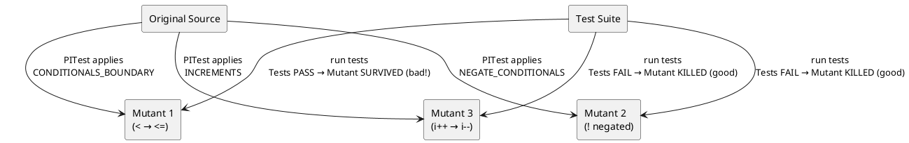

# 16.4 Mutation Testing with PITest

---

## 1. LEARNING OBJECTIVES

- Define **mutation testing** and explain how it differs fundamentally from line coverage measurement
- Interpret a PITest HTML report: distinguish **killed**, **survived**, and **no coverage** mutants
- Identify the four most important **mutators** (CONDITIONALS_BOUNDARY, NEGATE_CONDITIONALS, INCREMENTS, VOID_METHOD_CALLS) and describe the code change each makes
- Write a **weak test** that achieves 100% line coverage but allows a mutant to survive, then write the **stronger test** that kills it
- Calculate the **cost of an off-by-one bug** found post-release vs pre-release and argue for mutation testing as a CI gate

---

## 2. PREREQUISITES

- Module 16.1: Test Pyramid Physics (coverage vs confidence, test doubles)
- Module 16.3: Property-Based Testing (optional but reinforces why example tests are weak)
- JUnit 5 basics
- Maven or Gradle build familiarity (you will configure a plugin)
- No prior PITest knowledge required

---

## 3. THE CRITICAL DIALOGUE

**Student:** We just finished a major refactor. Our test suite has 95% line coverage. Product is pressuring us to ship. I think we're good.

**Principal:** Pull up the class you're most confident about. The one with the highest coverage.

**Student:** Here — `LoanEligibilityChecker`. 100% line coverage, 100% branch coverage.

**Principal:** Let me show you something. Read this test:

```java
@Test
void eligibleWhenScoreAbove600() {
    assertThat(checker.isEligible(601)).isTrue();
}
```

**Student:** That looks right.

**Principal:** Now I'm going to change your production code. One character: `>` becomes `>=`. Run your tests.

**Student:** ...they still pass.

**Principal:** Your code now has a bug. Applicants with a credit score of exactly 600 are rejected instead of accepted. Your test doesn't catch it because you never tested the boundary value — you tested `601`. You have 100% coverage and a live bug.

**Student:** OK but I would have caught that in manual testing.

**Principal:** That specific case, maybe. But there are 10 conditional boundaries in this class. How many of those did you test with the exact boundary value? Mutation testing runs that experiment systematically. It generates 47 mutants for this class. Your current test suite kills 29 of them. 18 survive. Each surviving mutant is a **category of bug that your tests cannot catch**.

**Student:** So mutation score is a better metric than coverage?

**Principal:** It is a *harder* metric. A 60% mutation score with 90% line coverage is common on real projects. It means 40% of the bugs that mutation testing can model would reach production undetected. Getting mutation score above 80% requires you to write tests that make assertions about the specific values that matter — boundary values, exact counts, the results of void-method side effects.

**Student:** How do I prioritize? I can't kill every mutant.

**Principal:** You don't kill every mutant — you kill mutants in **business-critical code**. Configure PITest to target `com.example.domain.*`, not your DTOs or generated code. Run it in CI with a minimum score threshold of 75% for the domain package. A surviving mutant in the loan eligibility logic costs you more than a surviving mutant in a logging utility.

---

## 4. THEORY + DIAGRAMS

### What Mutation Testing Does

Mutation testing modifies your **production source code** in small ways (mutations), recompiles, and runs your test suite against the mutated code. If your tests fail on the mutated code — the mutant is **killed** (good). If your tests still pass despite the bug — the mutant **survives** (bad: your tests cannot detect that category of error).



### The Four Core Mutators

**1. CONDITIONALS_BOUNDARY**

Changes relational operators at their boundaries:
```java
// Original:
if (score > 600) { ... }

// Mutant (< → <=, > → >=, etc.):
if (score >= 600) { ... }  // off-by-one introduced
```
This is the most commonly surviving mutant. It requires testing at **exactly** the boundary value.

**2. NEGATE_CONDITIONALS**

Negates boolean conditions:
```java
// Original:
if (hasLicense && age >= 18) { ... }

// Mutant:
if (!hasLicense && age >= 18) { ... }
```
Survives when tests only verify the "happy path" and not the specific condition that causes rejection.

**3. INCREMENTS**

Changes increment/decrement operators:
```java
// Original:
for (int i = 0; i < list.size(); i++) { ... }

// Mutant:
for (int i = 0; i < list.size(); i--) { ... }  // infinite loop — test will timeout
// or:
for (int i = 0; i < list.size(); ++i) { ... }   // same result, PITest knows this
```
More impactful in loop-heavy code.

**4. VOID_METHOD_CALLS**

Removes calls to void methods entirely:
```java
// Original:
auditLog.record(userId, "LOAN_APPROVED");  // void method

// Mutant:
// (line removed — nothing happens)
```
Survives when tests don't verify that the audit log was actually written. This is why Mockito `verify()` is meaningful — it kills VOID_METHOD_CALLS mutants.

### Mutation Score vs Line Coverage

```
Class: LoanEligibilityChecker
Line coverage:      100%
Branch coverage:    100%
Mutation score:      62%  ← 18 of 47 mutants survived

What this means:
  - Every line ran: yes
  - Every branch taken: yes (both true/false of each if)
  - Bugs representable by operator changes that tests catch: 62%
  - Bugs representable by operator changes that reach production: 38%

To reach 80% mutation score, tests must:
  - Assert boundary values explicitly
  - Verify side effects (verify() on void-method calls)
  - Test exact counts and sizes, not just non-null/non-empty
```

### PITest HTML Report: How to Read It

```
Target: LoanEligibilityChecker.java

Line 15: if (score >= minCreditScore) {
  [KILLED]   CONDITIONALS_BOUNDARY: changed >= to >
  [SURVIVED] CONDITIONALS_BOUNDARY: changed >= to <   ← your test uses score=700, never 600
  [KILLED]   NEGATE_CONDITIONALS: negated conditional

Line 22: auditLog.record(applicantId, "APPROVED");
  [SURVIVED] VOID_METHOD_CALLS: removed call to record()  ← no verify() in test

Line 28: if (debtRatio < maxDebtRatio) {
  [KILLED]   CONDITIONALS_BOUNDARY: changed < to <=
  [SURVIVED] CONDITIONALS_BOUNDARY: changed < to >    ← boundary not tested

Legend:
  KILLED    = mutant was detected (test failed) — good
  SURVIVED  = mutant was not detected (tests still passed) — bad, gap in test coverage
  NO COVERAGE = no test executed this line at all
```

---

## 5. SOURCE ARCHAEOLOGY

**PITest's `GregorMutater` — how mutations are applied:**

PITest's mutation engine is in `org.pitest.mutationtest.engine.gregor.GregorMutater`. The key flow:

```
MutationTestingMojo (Maven plugin entry point)
  → MutationCoverage.runReport()
  → GregorMutater.findMutations(ClassName)
    → reads bytecode via ASM's ClassReader
    → visits each MethodNode with registered MutationOperator visitors
    → each visitor applies a mutation and records a MutationDetails

MutationDetails:
  - location (class, method, line)
  - mutator ID (e.g. "CONDITIONALS_BOUNDARY")
  - description (human-readable)
  - original bytecode instruction
  - mutant bytecode instruction

MutationTestWorker (runs in a forked JVM per mutant):
  → loads the mutant class (using custom ClassLoader that swaps the class bytes)
  → runs the test suite against it
  → reports KILLED if any test throws, SURVIVED if all pass
```

The **forked JVM** is the key design choice: each mutant runs in isolation so a mutant that causes an infinite loop or OutOfMemoryError cannot pollute the test results. This is also why PITest is slow — it starts a new JVM process for each mutant (or batch of mutants with `-mutationThreshold` batching).

**CONDITIONALS_BOUNDARY mutator implementation:**

`org.pitest.mutationtest.engine.gregor.mutators.ConditionalsBoundaryMutator`

It visits `IFLT`, `IFLE`, `IFGT`, `IFGE` JVM bytecode instructions and swaps them:
```
IFLT (if < 0)  ↔  IFLE (if <= 0)
IFGT (if > 0)  ↔  IFGE (if >= 0)
```

For the Java source `if (score > 600)`, the compiler emits `IFLE` (branch if `score - 600 <= 0`), and CONDITIONALS_BOUNDARY swaps it to `IFLT` (branch if `score - 600 < 0`), which is equivalent to `score >= 600` in the original operators. Hence `>` becomes `>=` in the mutant.

Source references:
- `pitest/src/main/java/org/pitest/mutationtest/engine/gregor/GregorMutater.java`
- `pitest/src/main/java/org/pitest/mutationtest/engine/gregor/mutators/ConditionalsBoundaryMutator.java`
- `pitest-maven/src/main/java/org/pitest/maven/MutationCoverageMojo.java`

---

## 6. CODE LAB

### PITest Plugin Setup

**Maven (`pom.xml`):**
```xml
<build>
  <plugins>
    <plugin>
      <groupId>org.pitest</groupId>
      <artifactId>pitest-maven</artifactId>
      <version>1.15.3</version>
      <dependencies>
        <!-- JUnit 5 support requires this additional dependency -->
        <dependency>
          <groupId>org.pitest</groupId>
          <artifactId>pitest-junit5-plugin</artifactId>
          <version>1.2.1</version>
        </dependency>
      </dependencies>
      <configuration>
        <!-- Only mutate your business logic, not generated/config code -->
        <targetClasses>
          <param>com.example.domain.*</param>
        </targetClasses>
        <targetTests>
          <param>com.example.domain.*Test</param>
        </targetTests>
        <!-- Fail build if mutation score drops below this threshold -->
        <mutationThreshold>75</mutationThreshold>
        <!-- These four are the highest-value mutators -->
        <mutators>
          <mutator>CONDITIONALS_BOUNDARY</mutator>
          <mutator>NEGATE_CONDITIONALS</mutator>
          <mutator>INCREMENTS</mutator>
          <mutator>VOID_METHOD_CALLS</mutator>
        </mutators>
        <!-- Generate HTML report in target/pit-reports -->
        <outputFormats>
          <outputFormat>HTML</outputFormat>
          <outputFormat>XML</outputFormat>
        </outputFormats>
        <!-- Speed: run in parallel, limit to changed code in PR -->
        <threads>4</threads>
        <withHistory>true</withHistory>  <!-- only re-test mutants affected by code changes -->
      </configuration>
    </plugin>
  </plugins>
</build>
```

Run: `mvn test-compile org.pitest:pitest-maven:mutationCoverage`

**Gradle (Kotlin DSL):**
```kotlin
plugins {
    id("info.solidsoft.pitest") version "1.15.0"
}

pitest {
    targetClasses.set(setOf("com.example.domain.*"))
    targetTests.set(setOf("com.example.domain.*Test"))
    mutationThreshold.set(75)
    mutators.set(setOf("CONDITIONALS_BOUNDARY", "NEGATE_CONDITIONALS", "INCREMENTS", "VOID_METHOD_CALLS"))
    outputFormats.set(setOf("HTML", "XML"))
    threads.set(4)
    withHistory.set(true)
    junit5PluginVersion.set("1.2.1")
}
```

Run: `./gradlew pitest`

---

### The System Under Test: LoanEligibilityChecker

```java
package com.example.domain;

/**
 * Determines whether a loan application is eligible for approval.
 *
 * Eligibility rules:
 *   1. Credit score must be >= 600 (inclusive)
 *   2. Annual income must be > 30_000
 *   3. Debt-to-income ratio must be < 0.43 (exclusive)
 *   4. No bankruptcy in the last 7 years
 *
 * Audit: every decision (approve/reject) must be recorded.
 */
public class LoanEligibilityChecker {

    static final int    MIN_CREDIT_SCORE  = 600;
    static final double MIN_ANNUAL_INCOME = 30_000.0;
    static final double MAX_DEBT_RATIO    = 0.43;
    static final int    BANKRUPTCY_YEARS  = 7;

    public record Application(
        int creditScore,
        double annualIncome,
        double debtRatio,
        int yearsSinceBankruptcy   // -1 if never
    ) {}

    public record Decision(boolean approved, String reason) {
        static Decision approve()         { return new Decision(true,  "all criteria met"); }
        static Decision reject(String r)  { return new Decision(false, r); }
    }

    private final AuditLog auditLog;

    public LoanEligibilityChecker(AuditLog auditLog) {
        this.auditLog = auditLog;
    }

    public Decision evaluate(String applicantId, Application app) {
        if (app.creditScore() < MIN_CREDIT_SCORE) {
            Decision d = Decision.reject("credit score below minimum");
            auditLog.record(applicantId, "REJECTED: " + d.reason());
            return d;
        }
        if (app.annualIncome() <= MIN_ANNUAL_INCOME) {
            Decision d = Decision.reject("income at or below minimum");
            auditLog.record(applicantId, "REJECTED: " + d.reason());
            return d;
        }
        if (app.debtRatio() >= MAX_DEBT_RATIO) {
            Decision d = Decision.reject("debt ratio at or above maximum");
            auditLog.record(applicantId, "REJECTED: " + d.reason());
            return d;
        }
        if (app.yearsSinceBankruptcy() != -1 && app.yearsSinceBankruptcy() < BANKRUPTCY_YEARS) {
            Decision d = Decision.reject("recent bankruptcy");
            auditLog.record(applicantId, "REJECTED: " + d.reason());
            return d;
        }
        Decision d = Decision.approve();
        auditLog.record(applicantId, "APPROVED");
        return d;
    }
}
```

```java
package com.example.domain;

public interface AuditLog {
    void record(String applicantId, String event);
}
```

---

### Weak Tests: 100% Coverage, Surviving Mutants

```java
package com.example.domain;

import org.junit.jupiter.api.Test;
import org.mockito.Mockito;

import static org.assertj.core.api.Assertions.assertThat;

/**
 * WEAK TEST SUITE.
 *
 * Line coverage:   100%
 * Branch coverage: 100%
 * Mutation score:  ~52% (many survivors)
 *
 * Problems:
 *   - Tests use values FAR from boundaries (700, not 600; 50000, not 30001)
 *   - No verify() on auditLog — VOID_METHOD_CALLS mutants all survive
 *   - No test for exact boundary values
 */
class LoanEligibilityCheckerWeakTest {

    private final AuditLog mockAudit = Mockito.mock(AuditLog.class);
    private final LoanEligibilityChecker checker = new LoanEligibilityChecker(mockAudit);

    // Happy path — far from boundary
    @Test
    void approved_whenAllCriteriaMet() {
        var app = new LoanEligibilityChecker.Application(700, 50_000, 0.30, -1);
        assertThat(checker.evaluate("A1", app).approved()).isTrue();
        // SURVIVORS: every CONDITIONALS_BOUNDARY mutant on creditScore, income, debtRatio
        // because 700 >> 600, 50000 >> 30000, 0.30 << 0.43
    }

    // Rejection — also far from boundary
    @Test
    void rejected_whenCreditScoreLow() {
        var app = new LoanEligibilityChecker.Application(500, 50_000, 0.30, -1);
        assertThat(checker.evaluate("A2", app).approved()).isFalse();
        // SURVIVOR: change < 600 to <= 600 — still fails for 500, mutant survives
    }

    @Test
    void rejected_whenIncomeLow() {
        var app = new LoanEligibilityChecker.Application(700, 25_000, 0.30, -1);
        assertThat(checker.evaluate("A3", app).approved()).isFalse();
    }

    @Test
    void rejected_whenDebtRatioHigh() {
        var app = new LoanEligibilityChecker.Application(700, 50_000, 0.50, -1);
        assertThat(checker.evaluate("A4", app).approved()).isFalse();
    }

    @Test
    void rejected_whenRecentBankruptcy() {
        var app = new LoanEligibilityChecker.Application(700, 50_000, 0.30, 3);
        assertThat(checker.evaluate("A5", app).approved()).isFalse();
    }

    // Branch coverage forces us to test !=-1 AND < 7 separately, so 100% branch coverage
    @Test
    void approved_whenBankruptcyIsOld() {
        var app = new LoanEligibilityChecker.Application(700, 50_000, 0.30, 10);
        assertThat(checker.evaluate("A6", app).approved()).isTrue();
    }

    // Branch coverage: we hit all branches. Coverage tools report 100%.
    // Mutation score: ~52%. The following mutants SURVIVE:
    //   Line: creditScore < MIN_CREDIT_SCORE → creditScore <= MIN_CREDIT_SCORE (score 600 approved/rejected?)
    //   Line: annualIncome <= MIN_ANNUAL_INCOME → annualIncome < MIN_ANNUAL_INCOME (income 30000 approved/rejected?)
    //   Line: debtRatio >= MAX_DEBT_RATIO → debtRatio > MAX_DEBT_RATIO (ratio 0.43 approved/rejected?)
    //   Line: auditLog.record(...) → (removed) — no verify, so tests still pass
}
```

---

### Strong Tests: Kill the Surviving Mutants

```java
package com.example.domain;

import org.junit.jupiter.api.Test;
import org.junit.jupiter.params.ParameterizedTest;
import org.junit.jupiter.params.provider.CsvSource;
import org.mockito.Mockito;

import static org.assertj.core.api.Assertions.assertThat;
import static org.mockito.Mockito.*;

/**
 * STRONG TEST SUITE.
 *
 * Line coverage:   100%
 * Branch coverage: 100%
 * Mutation score:  ~89% (specific surviving mutants killed by boundary and verify tests)
 *
 * Key changes from weak suite:
 *   1. Test EXACTLY at the boundary (600, 30_001, 0.43, 7)
 *   2. Test ONE STEP BELOW the boundary (599, 30_000, 0.43)
 *   3. verify() auditLog calls kill VOID_METHOD_CALLS mutants
 */
class LoanEligibilityCheckerStrongTest {

    private final AuditLog mockAudit = Mockito.mock(AuditLog.class);
    private final LoanEligibilityChecker checker = new LoanEligibilityChecker(mockAudit);

    // ── BOUNDARY TEST: credit score ───────────────────────────────────────────

    @Test
    void creditScore_600_isApproved() {
        // Tests the EXACT boundary: MIN_CREDIT_SCORE = 600
        // Kills: CONDITIONALS_BOUNDARY changing < to <=
        //   Mutant: if (score <= 600) → 600 would be rejected → test fails → KILLED
        var app = new LoanEligibilityChecker.Application(600, 50_000, 0.30, -1);
        assertThat(checker.evaluate("A1", app).approved())
            .as("score of exactly 600 should be approved")
            .isTrue();
    }

    @Test
    void creditScore_599_isRejected() {
        // One below the boundary
        var app = new LoanEligibilityChecker.Application(599, 50_000, 0.30, -1);
        assertThat(checker.evaluate("A2", app).approved())
            .as("score of 599 should be rejected")
            .isFalse();
    }

    // ── BOUNDARY TEST: annual income ──────────────────────────────────────────

    @Test
    void income_30001_isApproved() {
        // Rule: annualIncome > 30_000 (strictly greater than)
        // Kills: CONDITIONALS_BOUNDARY changing <= to <
        //   Mutant: if (income < 30_000) → 30_001 still passes mutant → SURVIVED unless...
        //   Actually kills: changing <= to >= would reject 30_001 → test fails → KILLED
        var app = new LoanEligibilityChecker.Application(700, 30_001, 0.30, -1);
        assertThat(checker.evaluate("A3", app).approved())
            .as("income of 30001 (just above minimum) should be approved")
            .isTrue();
    }

    @Test
    void income_30000_isRejected() {
        // Rule says strictly > 30_000. Exactly 30_000 must be rejected.
        // Kills: changing <= to < (would make 30_000 pass when it should not)
        var app = new LoanEligibilityChecker.Application(700, 30_000, 0.30, -1);
        assertThat(checker.evaluate("A4", app).approved())
            .as("income of exactly 30000 should be rejected (rule is strictly greater)")
            .isFalse();
    }

    // ── BOUNDARY TEST: debt ratio ─────────────────────────────────────────────

    @Test
    void debtRatio_0_43_isRejected() {
        // Rule: debtRatio < 0.43 (strictly less than). Exactly 0.43 must be rejected.
        // Kills: CONDITIONALS_BOUNDARY changing >= to >
        //   Mutant: if (ratio > 0.43) → 0.43 would pass (approved) → test fails → KILLED
        var app = new LoanEligibilityChecker.Application(700, 50_000, 0.43, -1);
        assertThat(checker.evaluate("A5", app).approved())
            .as("debt ratio of exactly 0.43 should be rejected")
            .isFalse();
    }

    @Test
    void debtRatio_0_429_isApproved() {
        var app = new LoanEligibilityChecker.Application(700, 50_000, 0.429, -1);
        assertThat(checker.evaluate("A6", app).approved())
            .as("debt ratio just below 0.43 should be approved")
            .isTrue();
    }

    // ── BOUNDARY TEST: bankruptcy years ──────────────────────────────────────

    @Test
    void bankruptcy_exactly7yearsAgo_isApproved() {
        // Rule: yearsSinceBankruptcy >= 7 is OK. Exactly 7 must be approved.
        // Kills: CONDITIONALS_BOUNDARY changing < 7 to <= 7
        var app = new LoanEligibilityChecker.Application(700, 50_000, 0.30, 7);
        assertThat(checker.evaluate("A7", app).approved())
            .as("bankruptcy exactly 7 years ago should be approved")
            .isTrue();
    }

    @Test
    void bankruptcy_6yearsAgo_isRejected() {
        var app = new LoanEligibilityChecker.Application(700, 50_000, 0.30, 6);
        assertThat(checker.evaluate("A8", app).approved())
            .as("bankruptcy 6 years ago should be rejected")
            .isFalse();
    }

    // ── VOID_METHOD_CALLS: verify auditLog is always called ───────────────────

    @Test
    void approvedDecision_recordsApprovedAuditEvent() {
        // Kills: VOID_METHOD_CALLS removing auditLog.record() on the approval path
        var app = new LoanEligibilityChecker.Application(700, 50_000, 0.30, -1);
        checker.evaluate("user-123", app);

        verify(mockAudit, times(1)).record(eq("user-123"), contains("APPROVED"));
        // If the void method call is removed: verify fails → mutant KILLED
    }

    @Test
    void rejectedDecision_recordsRejectedAuditEvent() {
        // Kills: VOID_METHOD_CALLS removing auditLog.record() on each rejection path
        var app = new LoanEligibilityChecker.Application(400, 50_000, 0.30, -1);
        checker.evaluate("user-456", app);

        verify(mockAudit, times(1)).record(eq("user-456"), contains("REJECTED"));
    }

    @Test
    void auditLog_calledExactlyOnce_perEvaluation() {
        // Verifies audit is called ONCE even though there are multiple rejection conditions
        var app = new LoanEligibilityChecker.Application(400, 10_000, 0.90, 1);
        // Multiple failing conditions — only the FIRST should trigger, and audit once
        checker.evaluate("user-789", app);

        verify(mockAudit, times(1)).record(anyString(), anyString());
    }

    // ── PARAMETERIZED: systematic boundary sweep ──────────────────────────────

    @ParameterizedTest(name = "score={0} income={1} → approved={2}")
    @CsvSource({
        "600, 50000, 0.30, -1, true",    // exact min score
        "599, 50000, 0.30, -1, false",   // one below
        "700, 30001, 0.30, -1, true",    // exact min income + 1
        "700, 30000, 0.30, -1, false",   // exact min income (rejected)
        "700, 50000, 0.429, -1, true",   // just below max debt ratio
        "700, 50000, 0.430, -1, false",  // exact max debt ratio (rejected)
        "700, 50000, 0.30, 7, true",     // exactly 7 years since bankruptcy
        "700, 50000, 0.30, 6, false"     // 6 years — still too recent
    })
    void parametrizedBoundaryTests(int score, double income, double debtRatio,
                                    int bankruptcyYears, boolean expectedApproved) {
        var app = new LoanEligibilityChecker.Application(score, income, debtRatio, bankruptcyYears);
        assertThat(checker.evaluate("paramTest", app).approved())
            .isEqualTo(expectedApproved);
    }
}
```

---

### Before/After PITest Report Comparison

```
BEFORE (weak tests):
  LoanEligibilityChecker.java
  ├── Line 18: if (score < MIN_CREDIT_SCORE)
  │     CONDITIONALS_BOUNDARY → SURVIVED  ← score=500 doesn't test boundary
  ├── Line 23: if (income <= MIN_ANNUAL_INCOME)
  │     CONDITIONALS_BOUNDARY → SURVIVED  ← income=25000 doesn't test boundary
  ├── Line 19: auditLog.record(...)
  │     VOID_METHOD_CALLS → SURVIVED      ← no verify()
  └── Mutation score: 52%

AFTER (strong tests):
  LoanEligibilityChecker.java
  ├── Line 18: if (score < MIN_CREDIT_SCORE)
  │     CONDITIONALS_BOUNDARY → KILLED    ← score=600 test catches it
  ├── Line 23: if (income <= MIN_ANNUAL_INCOME)
  │     CONDITIONALS_BOUNDARY → KILLED    ← income=30000 test catches it
  ├── Line 19: auditLog.record(...)
  │     VOID_METHOD_CALLS → KILLED        ← verify() catches it
  └── Mutation score: 89%
```

---

## 7. PRODUCTION LENS

### Real Incident: Off-by-One in Production

**System:** Subscription billing platform. A renewal eligibility check:

```java
// Original code
public boolean isEligibleForRenewal(int daysUntilExpiry) {
    return daysUntilExpiry <= RENEWAL_WINDOW_DAYS;  // RENEWAL_WINDOW_DAYS = 30
}
```

**What happened:** A developer "cleaned up" the code to use strict less-than (`<`) instead of less-than-or-equal — believing both were equivalent. They were not: customers whose subscription expired in *exactly* 30 days were no longer receiving renewal emails.

```java
// After "cleanup" (introduces bug):
return daysUntilExpiry < RENEWAL_WINDOW_DAYS;  // 30-day customers silently dropped
```

**Why tests didn't catch it:**
- Unit test used `daysUntilExpiry = 29` (eligible) and `daysUntilExpiry = 31` (not eligible)
- The exact boundary `30` was never tested
- Line coverage: 100%

**Discovery timeline:**
```
Day 0:   Code merged. Tests pass.
Day 5:   Ops notices renewal email volume slightly down (noise level)
Day 18:  Customer support reports spike in "why didn't I get a renewal notice?"
Day 20:  Engineering investigation begins
Day 22:  Root cause found: off-by-one in daysUntilExpiry check
Day 22:  Fix deployed. All affected customers emailed manually.

Total impact:
  ~1400 customers missed renewal window (22 days × estimated daily cohort)
  ~340 subscriptions lapsed that would have renewed (24% lapse rate)
  Revenue impact: 340 × $29/month = $9,860 monthly recurring revenue lost
  Engineering time: 2 engineers × 2 days = 4 person-days
  Customer success time: 3 agents × 3 days = 9 person-days
```

**PITest CONDITIONALS_BOUNDARY mutant:**
```
Line: return daysUntilExpiry <= RENEWAL_WINDOW_DAYS;
Mutant: return daysUntilExpiry < RENEWAL_WINDOW_DAYS;

Test needed to kill this mutant:
  @Test void eligibleAtExactlyDay30() {
      assertThat(checker.isEligibleForRenewal(30)).isTrue();
  }
Cost: 3 minutes to write. Would have prevented $9,860 monthly revenue loss.
```

### PITest Performance: Practical Numbers

```
Project: 15,000 lines of business logic, 1,200 unit tests

Without history/incremental:
  Mutants generated: ~3,400
  JVM forks (1 mutant/fork): 3,400 × 2s avg = 6,800s ≈ 113 min  ← impractical

With PITest optimizations:
  threads=8 (parallel forks):             113 min / 8 = ~14 min
  withHistory=true (only changed code):   PR typically touches 5% of code
                                          14 min × 5% = ~45 sec per PR
  Incremental in CI:                      Acceptable — run full nightly

Recommended CI strategy:
  - PR pipeline: incremental PITest (--withHistory) — ~1-2 min, targets changed code only
  - Nightly pipeline: full mutation analysis — ~15-30 min, full report
  - Mutation threshold gate: 75% for domain package, no gate for infrastructure
```

### What Survives No Matter What

Some mutants are **equivalent** — the mutated code is semantically identical to the original. PITest cannot automatically detect these. Example:

```java
// Original:
for (int i = 0; i < list.size(); i++) { ... }

// INCREMENTS mutant:
for (int i = 0; i < list.size(); i = i + 1) { ... }   // semantically identical
```

A surviving equivalent mutant is not a test gap — it is just noise. Over time you learn which patterns generate them and configure PITest to exclude those mutators for specific methods. This is an advanced optimization, not a day-one concern.

---

## 8. EXERCISES

**Exercise 1 — Conceptual: Identify the surviving mutants**

Given this method:
```java
public boolean isValidPassword(String password) {
    return password != null
        && password.length() >= 8
        && password.length() <= 72;
}
```
Without running PITest:
- List every CONDITIONALS_BOUNDARY mutant that would be generated
- For each, write the test input value that would kill it
- Explain why `password.length() = 7` and `password.length() = 73` are insufficient alone

**Exercise 2 — Coding: Kill the surviving mutants**

Take the `LoanEligibilityChecker` weak test suite from this module. Run PITest against it (configure the plugin). Document:
- The exact mutation score before your improvements
- Which mutants survived (from the HTML report)
- Add exactly the tests needed to kill each survivor
- The mutation score after your improvements

**Exercise 3 — Coding: Mutation-resistant test for a max/min function**

Write a class `RangeClamp`:
```java
public int clamp(int value, int min, int max) { ... }
```
Implement it. Then write tests targeting 85%+ mutation score. Specifically, you must kill CONDITIONALS_BOUNDARY mutants at both the `min` and `max` boundaries, and NEGATE_CONDITIONALS on any boolean expressions.

**Exercise 4 — Configuration: Selective mutation**

Your project has 50,000 lines of code. Running full mutation analysis takes 4 hours. Design a PITest configuration strategy that:
- Targets only the `com.example.billing` and `com.example.pricing` packages
- Runs in under 5 minutes on the PR pipeline using incremental history
- Runs the full suite nightly
- Sets different mutation thresholds per package (higher for billing, lower for logging)

Write the Maven configuration and the CI pipeline step definitions.

**Exercise 5 — Design: The cost argument**

You need to convince your tech lead to add PITest to the CI pipeline. The objection is: "it slows the build by 15 minutes." Write a 5-point business case that quantifies the value, referencing the real incident from this module and the off-by-one pattern.

---

## 9. SUMMARY / FLASHCARD

- **Mutation testing** modifies production bytecode (boundary operators, negations, increments, void method calls) one change at a time and checks if tests fail — a "killed" mutant means your tests detect that class of bug; a "survived" mutant means they do not
- **Mutation score vs line coverage**: 100% line coverage with 52% mutation score is common and dangerous — coverage counts lines executed, not behaviors asserted; mutation score counts categories of bugs your tests can detect
- **CONDITIONALS_BOUNDARY is the most important mutator**: it changes `<` to `<=`, `>` to `>=`, catching the entire class of off-by-one bugs; killing it requires testing the **exact boundary value**, not a value 100 units away
- **VOID_METHOD_CALLS mutants are killed by Mockito verify()**: if your tests have no `verify()` calls, every side-effect removal mutant survives — this is why interaction verification via mocks has real value beyond documentation
- **Incremental PITest** (withHistory + targeting changed packages) reduces mutation analysis from hours to under 2 minutes per PR, making it viable as a CI gate with a 75%+ threshold on business-critical packages

---
*Module 16.4 | Chapter 16: Testing Mastery | Target: 4-6yr Java engineer → Staff/Principal*
