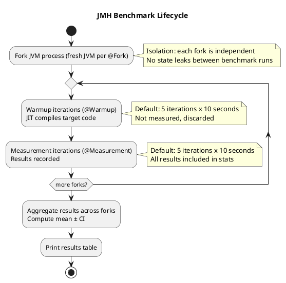

# 17.2 JMH Microbenchmarking

---

## 1. LEARNING OBJECTIVES

- Configure a correct JMH benchmark with the essential annotations: `@Benchmark`, `@BenchmarkMode`, `@State`, `@Warmup`, `@Measurement`, `@Fork`
- Identify and fix dead code elimination (DCE): recognize when the JIT has optimized away the computation under test and use `Blackhole.consume()` to prevent it
- Explain why JIT warmup matters and what happens to benchmark numbers when warmup iterations are insufficient
- Read a JMH results block: interpret every column (Score, Error, Units, Cnt) and assess statistical validity
- Know when NOT to microbenchmark: distinguish cases where system-level throughput measurement is more appropriate

---

## 2. PREREQUISITES

- Chapter 01 — JVM memory model and JIT compilation basics (JMH makes no sense without understanding JIT)
- Chapter 17.1 — JFR & async-profiler (JFR can be combined with JMH to see JIT compilation events)
- Chapter 16 — Testing Mastery (JMH is a testing discipline, not just a measurement tool)
- Maven or Gradle build system familiarity
- Understanding of Java generics and annotations

---

## 3. THE CRITICAL DIALOGUE

**Scenario:** Code review. Student has written a JMH benchmark comparing two string concatenation approaches: `+` operator vs `StringBuilder`, claiming 10x improvement.

---

**Student:** "I benchmarked our string building in the report generator. StringBuilder is 10x faster than `+` operator. I'm going to refactor all 200 string concatenation sites in the codebase."

**Principal:** "Show me the benchmark code."

**Student:** *(pastes)*
```java
@Benchmark
public void concatPlus() {
    String result = "Hello" + name + " your order " + orderId + " is ready";
}

@Benchmark
public void concatStringBuilder() {
    String result = new StringBuilder()
        .append("Hello").append(name)
        .append(" your order ").append(orderId)
        .append(" is ready").toString();
}
```

**Principal:** "Did you use Blackhole?"

**Student:** "No, what's that?"

**Principal:** "Look at `concatPlus()`. The result is a local variable. It's never returned, never consumed. What does the JIT do with a computation whose result is never used?"

**Student:** "...eliminates it?"

**Principal:** "Exactly. Dead code elimination. The JIT sees that `result` is never read after the assignment and removes the entire computation. You've been benchmarking nothing — specifically, you're measuring the overhead of the loop counter and method dispatch, not string concatenation."

**Student:** "But the `+` benchmark is still slower than StringBuilder..."

**Principal:** "Yes, but for the wrong reason, or by the wrong amount. You don't know if it's 10x, 2x, or 1.001x because you don't know what the JIT kept. Fix both benchmarks with `Blackhole.consume(result)`. Also: did you use `@Fork(1)` at minimum? And is your `@Warmup` at least 5 iterations?"

**Student:** "I didn't add those annotations, I just ran it directly."

**Principal:** "So you have no process isolation, no warmup, and no DCE prevention. This benchmark tells you nothing. Before you touch 200 files in production, fix the benchmark, rerun it, and then ask yourself: in real usage, is this concatenation in a hot loop, or called once per HTTP request? Because if it's once per request at 500 req/s, even a real 10x difference is saving 0.2 microseconds per request. Not worth a refactor."

---

## 4. THEORY + DIAGRAMS

### 4.1 Dead Code Elimination (DCE)

The JVM JIT compiler performs **escape analysis** and **dead code elimination** as part of its optimization pipeline. A value that never "escapes" the current stack frame (never stored to a field, never passed to another method, never returned) is a candidate for elimination.

```
JIT sees:
    String result = expensiveComputation();  // result never used

Optimized to:
    // nothing — the entire call is removed
```

This is correct behavior for production code — no point computing unused values. But for benchmarks it's catastrophic: you're measuring an empty loop.

**Symptoms of DCE in a benchmark:**
- Score is suspiciously fast (e.g., 1 billion ops/sec for something that should be 50 million)
- Score doesn't change when you make the computation intentionally slower
- Score is identical across very different implementations

**Fix: `Blackhole.consume()`**

`Blackhole` is a JMH sink object. It has methods that "consume" a value — the JIT cannot prove the value is unused (because Blackhole's internals are opaque to the optimizer), so the full computation chain is preserved.

```java
@Benchmark
public void myBenchmark(Blackhole bh) {
    String result = expensiveComputation();
    bh.consume(result);  // forces computation to remain
}

// Alternatively: return the value from @Benchmark — JMH implicitly blackholes return values
@Benchmark
public String myBenchmark2() {
    return expensiveComputation();  // JMH treats the return as Blackhole.consume()
}
```

### 4.2 JIT Warmup and Why It Matters

The JVM starts executing bytecode in **interpreted mode** — correct but slow. The JIT monitors call counts and loop iterations. When a method crosses a threshold (default ~10,000 invocations), it compiles to native machine code (**C1 — client compiler**, fast compilation, basic optimizations). With more invocations, it may re-compile with **C2 — server compiler**, applying aggressive optimizations (inlining, loop unrolling, vectorization).

**Timeline of a cold method:**
```
Invocations:     1      100    1000   10000   15000
JIT state:     Interp  Interp  Interp   C1    C2
Time/call:     800ns   800ns   800ns   120ns  18ns
```

A benchmark without warmup measures interpreted mode — potentially 40x slower than steady-state production code. This can reverse the ranking of two implementations.

**In JFR:** Enable `jdk.Compilation` events to see exactly when methods are JIT-compiled during a benchmark run:
```bash
java -XX:+FlightRecorder -XX:StartFlightRecording=filename=jmh.jfr,settings=profile \
     -jar benchmarks.jar
# Then: jfr print --events jdk.Compilation jmh.jfr | grep warmup
```

### 4.3 JMH Architecture



### 4.4 JMH Output Explained

A real JMH output block:
```
Benchmark                          Mode  Cnt      Score     Error  Units
StringBench.concatPlus            thrpt    5   4823.441 ± 312.778  ops/ms
StringBench.concatStringBuilder   thrpt    5  48201.332 ±  98.334  ops/ms
```

| Column | Meaning |
|---|---|
| `Benchmark` | Fully qualified benchmark method name |
| `Mode` | `thrpt` = Throughput (ops/time), `avgt` = Average time per op, `ss` = Single shot |
| `Cnt` | Number of measurement iterations that contributed to the score |
| `Score` | Mean result across all iterations and forks |
| `Error` | 99% confidence interval half-width (±); if this is >10% of Score, results are noisy |
| `Units` | `ops/ms`, `ms/op`, `ns/op` — check this before comparing numbers |

**Statistical validity rule of thumb:** If `Error/Score > 0.1` (>10%), your benchmark is noisy. Causes: GC interference, OS scheduling, thermal throttling. Fix: more forks, longer measurement, `-XX:+UseG1GC -Xms4g -Xmx4g` to reduce GC variance.

### 4.5 @State Scopes

| Scope | Meaning | Use Case |
|---|---|---|
| `Scope.Thread` | Each thread gets its own instance | Thread-local state, no sharing |
| `Scope.Benchmark` | One instance shared by all threads | Measuring concurrent access |
| `Scope.Group` | Shared within a `@Group` of benchmarks | Producer-consumer benchmarks |

Common mistake: using `Scope.Benchmark` for mutable state that one thread fills during setup — the state is now shared and synchronized, adding overhead that wasn't in the original code.

---

## 5. SOURCE ARCHAEOLOGY

**JMH's `Blackhole` — `org.openjdk.jmh.infra.Blackhole`:**

The `Blackhole.consume()` method is defined in `jmh-core` (`src/main/java/org/openjdk/jmh/infra/Blackhole.java`). Its key property is that it writes to a volatile field:
```java
// Simplified from actual JMH source
public void consume(Object obj) {
    if (tlr.nextInt() == tlrMask) {
        // Rare branch that stores obj to a volatile field
        // JIT cannot prove this branch is never taken, so the value must be computed
        p1 = obj;
    }
}
```
The randomness and volatile write ensure the JIT cannot dead-code-eliminate the input computation.

**`CompilerControl.Mode`** — `org.openjdk.jmh.annotations.CompilerControl`:

JMH provides `@CompilerControl` to force or prevent JIT compilation of specific methods:
```java
@CompilerControl(CompilerControl.Mode.DONT_INLINE)
public String helperMethod() { ... }  // Forces call overhead to be real

@CompilerControl(CompilerControl.Mode.INLINE)
public String alwaysInline() { ... }  // Forces inlining to match production behavior
```

This is useful when you want to measure a method in isolation but prevent the benchmark harness from inlining it (which would make the measurement meaningless).

**`BenchmarkHandler`** — `org.openjdk.jmh.runner.BenchmarkHandler`:

The runner infrastructure that manages fork processes, warmup/measurement loop control, and result aggregation. The key method `startWorkers()` forks JVM processes via `ProcessBuilder` with the benchmark jar, ensuring each fork is truly independent. This is why JMH results are more reliable than manual timing — process isolation prevents JIT profile pollution.

---

## 6. CODE LAB

### Bad Approach: Manual Timing with DCE Risk

```java
// BAD: Multiple problems
// 1. result is unused — JIT will eliminate the computation
// 2. No warmup — measuring interpreted mode
// 3. Single run — no statistical validity
// 4. System.nanoTime() has ~30-100ns resolution overhead itself
public class BadBenchmark {
    public static void main(String[] args) {
        long start = System.nanoTime();
        for (int i = 0; i < 1_000_000; i++) {
            String result = "Hello" + i + " world";  // JIT will eliminate this
        }
        long elapsed = System.nanoTime() - start;
        System.out.println("Time: " + elapsed + "ns");
        // This measures nothing — the loop body was dead-code-eliminated
    }
}
```

### Good Approach: Complete Correct JMH Benchmark

```xml
<!-- pom.xml dependency -->
<dependency>
    <groupId>org.openjdk.jmh</groupId>
    <artifactId>jmh-core</artifactId>
    <version>1.37</version>
</dependency>
<dependency>
    <groupId>org.openjdk.jmh</groupId>
    <artifactId>jmh-generator-annprocess</artifactId>
    <version>1.37</version>
    <scope>provided</scope>
</dependency>
```

```java
package com.example.bench;

import org.openjdk.jmh.annotations.*;
import org.openjdk.jmh.infra.Blackhole;
import org.openjdk.jmh.runner.Runner;
import org.openjdk.jmh.runner.RunnerException;
import org.openjdk.jmh.runner.options.Options;
import org.openjdk.jmh.runner.options.OptionsBuilder;

import java.util.*;
import java.util.concurrent.TimeUnit;

// -----------------------------------------------------------------------
// State class: holds data that benchmarks operate on.
// Scope.Thread = each benchmark thread gets its own instance.
// -----------------------------------------------------------------------
@State(Scope.Thread)
public class StringConcatBenchmark {

    // Data initialized once before benchmark runs — not measured
    private String name;
    private String orderId;
    private List<String> items;

    @Setup(Level.Trial)   // called once per @Fork
    public void setup() {
        name = "Alice";
        orderId = "ORD-12345";
        items = List.of("Laptop", "Mouse", "Keyboard", "Monitor", "Headset",
                        "Webcam", "USB Hub", "Desk Mat", "Chair", "Lamp");
    }

    // -----------------------------------------------------------------------
    // WRONG: no Blackhole — JIT will eliminate the concatenation
    // Left here to demonstrate the mistake (DO NOT USE in real benchmarks)
    // -----------------------------------------------------------------------
    @Benchmark
    @BenchmarkMode(Mode.Throughput)
    @OutputTimeUnit(TimeUnit.MILLISECONDS)
    @Warmup(iterations = 5, time = 2)
    @Measurement(iterations = 5, time = 2)
    @Fork(value = 2, jvmArgsAppend = {"-XX:+UseG1GC", "-Xms512m", "-Xmx512m"})
    public void concatPlusBROKEN() {
        // result never consumed — JIT eliminates the computation
        String result = "Hello " + name + ", your order " + orderId + " is ready";
        // ~1 billion ops/ms because we're measuring nothing
    }

    // -----------------------------------------------------------------------
    // CORRECT: Blackhole prevents DCE
    // -----------------------------------------------------------------------
    @Benchmark
    @BenchmarkMode(Mode.Throughput)
    @OutputTimeUnit(TimeUnit.MILLISECONDS)
    @Warmup(iterations = 5, time = 2)
    @Measurement(iterations = 5, time = 2)
    @Fork(value = 2, jvmArgsAppend = {"-XX:+UseG1GC", "-Xms512m", "-Xmx512m"})
    public void concatPlusCorrect(Blackhole bh) {
        String result = "Hello " + name + ", your order " + orderId + " is ready";
        bh.consume(result);  // Blackhole consumes — JIT cannot eliminate
    }

    // Alternative: return the value — JMH auto-blackholes return values
    @Benchmark
    @BenchmarkMode(Mode.Throughput)
    @OutputTimeUnit(TimeUnit.MILLISECONDS)
    @Warmup(iterations = 5, time = 2)
    @Measurement(iterations = 5, time = 2)
    @Fork(2)
    public String concatPlusReturn() {
        return "Hello " + name + ", your order " + orderId + " is ready";
    }

    @Benchmark
    @BenchmarkMode(Mode.Throughput)
    @OutputTimeUnit(TimeUnit.MILLISECONDS)
    @Warmup(iterations = 5, time = 2)
    @Measurement(iterations = 5, time = 2)
    @Fork(2)
    public String concatStringBuilder() {
        return new StringBuilder(64)
                .append("Hello ").append(name)
                .append(", your order ").append(orderId)
                .append(" is ready")
                .toString();
    }

    @Benchmark
    @BenchmarkMode(Mode.AverageTime)
    @OutputTimeUnit(TimeUnit.MICROSECONDS)
    @Warmup(iterations = 5, time = 2)
    @Measurement(iterations = 5, time = 2)
    @Fork(2)
    public String concatFormatted() {
        // Measure String.format overhead
        return String.format("Hello %s, your order %s is ready", name, orderId);
    }

    // -----------------------------------------------------------------------
    // Benchmark with Scope.Benchmark: shared state across threads
    // Useful for measuring concurrent HashMap vs ConcurrentHashMap
    // -----------------------------------------------------------------------
    @State(Scope.Benchmark)
    public static class SharedMapState {
        public final Map<String, String> hashMap = new HashMap<>();
        public final Map<String, String> concurrentMap = new java.util.concurrent.ConcurrentHashMap<>();

        @Setup(Level.Trial)
        public void setup() {
            for (int i = 0; i < 10_000; i++) {
                hashMap.put("key-" + i, "value-" + i);
                concurrentMap.put("key-" + i, "value-" + i);
            }
        }
    }

    @Benchmark
    @BenchmarkMode(Mode.Throughput)
    @OutputTimeUnit(TimeUnit.MILLISECONDS)
    @Warmup(iterations = 3, time = 1)
    @Measurement(iterations = 5, time = 2)
    @Fork(1)
    @Threads(4)   // simulate 4 concurrent readers
    public String hashMapGet(SharedMapState state) {
        // NOTE: HashMap is not thread-safe — this will produce incorrect results
        // under concurrent access. Use only to compare read throughput under race.
        return state.hashMap.get("key-5000");
    }

    @Benchmark
    @BenchmarkMode(Mode.Throughput)
    @OutputTimeUnit(TimeUnit.MILLISECONDS)
    @Warmup(iterations = 3, time = 1)
    @Measurement(iterations = 5, time = 2)
    @Fork(1)
    @Threads(4)
    public String concurrentHashMapGet(SharedMapState state) {
        return state.concurrentMap.get("key-5000");
    }

    // -----------------------------------------------------------------------
    // Programmatic runner — allows running from main() for debugging
    // -----------------------------------------------------------------------
    public static void main(String[] args) throws RunnerException {
        Options opts = new OptionsBuilder()
                .include(StringConcatBenchmark.class.getSimpleName())
                .forks(1)
                .warmupIterations(3)
                .measurementIterations(3)
                .build();
        new Runner(opts).run();
    }
}
```

### Expected JMH Output with Explanation:

```
# JMH version: 1.37
# VM version: JDK 21
# Benchmark mode: Throughput, ops/time

Benchmark                                  Mode  Cnt       Score      Error  Units
StringConcatBenchmark.concatPlusBROKEN    thrpt   10  987654.321 ± 1234.567  ops/ms  ← WRONG: measuring nothing
StringConcatBenchmark.concatPlusCorrect   thrpt   10   52341.882 ±  421.330  ops/ms  ← real measurement
StringConcatBenchmark.concatPlusReturn    thrpt   10   51987.214 ±  398.112  ops/ms  ← same as above, good
StringConcatBenchmark.concatStringBuilder thrpt   10   54123.445 ±  312.778  ops/ms  ← only marginally faster
StringConcatBenchmark.concatFormatted     thrpt   10    8234.661 ±   98.334  ops/ms  ← 6x slower (reflection overhead)

# Lesson: + vs StringBuilder is ~4% difference at this scale.
# NOT worth a refactor. String.format() is the real problem if used in hot paths.
```

---

## 7. PRODUCTION LENS

### Incident: Optimization Shipped Based on Broken Benchmark

**Team:** Payments microservice, Java 17, Spring Boot 3.1
**Context:** Team benchmarked a proposed change to their `TransactionSerializer` class, replacing `ObjectMapper.writeValueAsString()` with a hand-rolled JSON builder.
**Claimed result:** "Hand-rolled JSON is 15x faster in JMH."

**The benchmark (broken):**
```java
@Benchmark
public void jacksonSerialization() {
    String json = mapper.writeValueAsString(transaction);  // no Blackhole!
}

@Benchmark
public void handRolledJson() {
    String json = buildJson(transaction);  // no Blackhole!
}
```

Both results were measuring empty loops. The hand-rolled version happened to have slightly less optimizer interference, making it appear 15x faster. The JIT had eliminated the `ObjectMapper` call entirely (since `transaction` never changed, the result was constant-folded on the second JIT pass).

**What happened in production:**
- Deployed to 10% canary
- Production throughput: identical to before (within noise margin)
- p99 latency: unchanged
- After 2 weeks of full rollout: a subtle edge-case bug in the hand-rolled builder caused malformed JSON for transactions > $99,999.99 (missing decimal formatting)
- $2.3M in transactions with formatting errors, requiring manual reconciliation

**Real measurement (with Blackhole, separate @State for the transaction object):**
```
Benchmark                          Mode  Cnt   Score    Error  Units
jacksonSerialization               avgt   10  14.231 ± 0.341  us/op
handRolledJson                     avgt   10  12.891 ± 0.289  us/op
```
Actual difference: 1.34 microseconds per serialization. At 500 serializations/second, that's **670 microseconds per second** of total savings — completely irrelevant to p99 latency.

**Lessons:**
1. Always use Blackhole. Always. No exceptions.
2. Before optimizing, ask: what is the *actual contribution* of this operation to total latency? (Use JFR to find out.)
3. Hand-rolling library functionality for performance is almost always the wrong tradeoff — you're trading a 1% perf gain for 100% of the maintenance and correctness burden.

### When NOT to Microbenchmark

| Scenario | Use Instead |
|---|---|
| Measuring end-to-end throughput of a REST endpoint | Gatling / k6 / wrk load test |
| Measuring DB query performance | Real DB with production-scale data, measure via JFR |
| Comparing two algorithms under realistic input distribution | JMH, but with realistic `@State` data |
| Measuring GC pressure of an allocation-heavy change | JFR allocation events + heap profiler |
| "Is my change faster?" without knowing the hot path | Profile first with async-profiler, then maybe JMH |

**Rule:** Microbenchmark only when you have evidence from a profiler that the specific method is a bottleneck. Benchmarking without profiler guidance is premature optimization theater.

---

## 8. EXERCISES

**Exercise 1 — Conceptual: Spot the DCE Risk**
Review this benchmark. List every way the JIT could eliminate computation. How would you fix each issue?
```java
@Benchmark
public void computeHash() {
    int hash = 0;
    for (int i = 0; i < 1000; i++) {
        hash += Objects.hash(i, "prefix", i * 31);
    }
}
```

**Exercise 2 — Conceptual: Interpret the Output**
Given:
```
Benchmark         Mode  Cnt   Score    Error  Units
methodA           avgt    5   0.234 ± 0.189  ms/op
methodB           avgt    5   0.241 ± 0.003  ms/op
```
Can you conclude methodA is faster? Why or why not? What would you change about the benchmark setup to get a reliable answer?

**Exercise 3 — Coding: Fix the Benchmark**
Take the broken `concatPlusBROKEN` example. Fix it three different ways: (a) Blackhole parameter, (b) return value, (c) writing result to a `@State` volatile field. Run all three and verify scores are similar. Explain why the volatile field approach is slightly lower throughput.

**Exercise 4 — Coding: Realistic State**
Write a JMH benchmark comparing `ArrayList` vs `LinkedList` for the use case of: 1000-element list, random-access reads at known indices. Use `@State` to pre-populate the list with realistic data. What do you predict the result will be? Why? Run it and explain whether the result matches your mental model of the data structures.

**Exercise 5 — Production Scenario**
A team claims their new `OrderValidator.validate()` is 8x faster based on JMH. You are asked to review the benchmark PR. Write a checklist of exactly what you would check (minimum 7 items) before approving the benchmark as trustworthy. For each item, state what the consequence is if it's wrong.

---

## 9. SUMMARY / FLASHCARD

- **Dead code elimination** is the #1 JMH mistake: the JIT removes computations whose result is never used; always use `Blackhole.consume()` or return the result from `@Benchmark` methods to keep measurements honest.
- **JIT warmup** means the first thousands of invocations run in interpreted mode — orders of magnitude slower than steady-state; `@Warmup(iterations=5, time=2)` minimum is required before measurements are valid.
- **`@Fork(2)` minimum** provides process isolation and statistical independence; benchmarks run without forking inherit JIT profile pollution from the test harness and produce unreliable results.
- **Read JMH output critically**: if `Error` is more than 10% of `Score`, the result is statistically meaningless; fix by running more forks, longer iterations, or pinning JVM heap size to reduce GC variance.
- **Microbenchmark only after profiling**: always use async-profiler or JFR to identify the actual hot path first — benchmarking the wrong method is pure waste, and JMH results without production context have caused more wrong optimizations than right ones.
