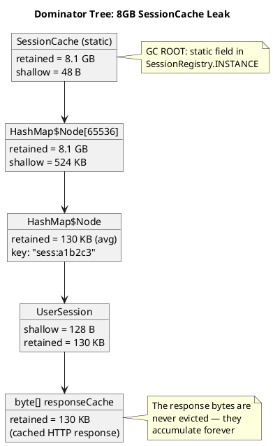

# 17.3 Memory Profiling Workflow

---

## 1. LEARNING OBJECTIVES

- Acquire a heap dump from a running JVM using `jcmd`, `-XX:+HeapDumpOnOutOfMemoryError`, and programmatic APIs
- Read a MAT dominator tree: distinguish retained vs shallow heap, trace a GC root chain from a leak to its origin
- Use async-profiler in allocation mode to identify which code paths generate the most heap pressure
- Recognize the five most common Java memory leak patterns and explain the mechanism behind each
- Investigate off-heap memory usage with `jcmd VM.native_memory` and understand `DirectByteBuffer` lifecycle

---

## 2. PREREQUISITES

- Chapter 01 — JVM memory model: heap regions, GC roots, strong/soft/weak/phantom references
- Chapter 17.1 — JFR & async-profiler (async-profiler alloc mode is covered here in depth)
- Chapter 06 — SRE Operations (OOM investigations happen under production pressure; know how to read dashboards first)
- Chapter 16 — Testing Mastery (reproduce the leak in a test environment before investing in production diagnostics)
- Basic understanding of `java.lang.ref.WeakReference` and `java.lang.ref.SoftReference`

---

## 3. THE CRITICAL DIALOGUE

**Scenario:** Monday morning, production incident. The payments service has been restarting every night at 3am for a week. The on-call engineer suspects a memory leak.

---

**Student:** "Our service restarts every night at 3am. Heap usage grows steadily from 2GB to 16GB over 24 hours and then OOM. Where do I even start?"

**Principal:** "First: is `-XX:+HeapDumpOnOutOfMemoryError` configured?"

**Student:** "I don't know."

**Principal:** "That's step one — check your JVM flags. If it's not there, add it to your startup script right now before the next restart. Also add `-XX:HeapDumpPath=/tmp/heap-dump.hprof`. Without a heap dump at the moment of OOM, you're blind. You'll be guessing."

**Student:** "OK, assuming we have a heap dump. Now what?"

**Principal:** "Step two: open it in MAT — Eclipse Memory Analyzer Tool. Run the 'Leak Suspects' report first. It does a quick dominator tree analysis and highlights objects that retain large amounts of memory. You're looking for something that holds 8GB alone."

**Student:** "What if the leak suspects report is not obvious?"

**Principal:** "Step three: look at the dominator tree manually. Sort by retained heap descending. The top entry will be the object that, if removed, would free the most memory. It's often a `HashMap` or a `List`. Click into it — see how many entries it has. 50 million entries in a Map that should have 10K is your leak."

**Student:** "Then what?"

**Principal:** "Step four: trace the GC root chain. In MAT, right-click the leaking object and select 'Path to GC Roots'. This shows you the reference chain from a GC root — a static field, a thread stack, a JNI reference — down to your leaking collection. The static field at the top of the chain is almost always where the leak lives."

**Student:** "And if the heap dump is too large to open? We have a 16GB heap."

**Principal:** "Use `jcmd <pid> GC.heap_dump filename=/tmp/dump.hprof` — it only dumps after a GC, so it's smaller. Or use async-profiler in allocation mode *before* the OOM, on a canary instance. Find which code path is allocating objects that never die — that points you to the source without needing a full heap dump."

**Student:** "Four steps: enable heap dump on OOM, run leak suspects in MAT, examine dominator tree, trace GC root chain. Got it."

**Principal:** "And step zero: check if your caches have eviction policies."

---

## 4. THEORY + DIAGRAMS

### 4.1 Heap Dump Acquisition Methods

| Method | Command | When to Use | Notes |
|---|---|---|---|
| `jcmd` (recommended) | `jcmd <pid> GC.heap_dump filename=/tmp/dump.hprof` | Targeted, immediate | Triggers GC first, smaller file |
| OOM flag | `-XX:+HeapDumpOnOutOfMemoryError -XX:HeapDumpPath=/tmp/` | Automatic at OOM | Must be set at JVM startup |
| Programmatic | `HotSpotDiagnosticMXBean.dumpHeap(...)` | From within application | Useful for conditional dumps |
| `jmap` (deprecated) | `jmap -dump:live,format=b,file=dump.hprof <pid>` | Legacy scripts | Risky on busy JVMs, use jcmd instead |

### 4.2 Retained Heap vs Shallow Heap

These are the two most important memory metrics in MAT:

**Shallow heap:** The memory consumed by the object itself — its header plus its fields. For a `HashMap`, the shallow heap is just the header + reference to the internal array. Typically 16-48 bytes.

**Retained heap:** The memory that would be freed if this object (and all objects exclusively reachable through it) were garbage collected. For a `HashMap` with 50,000 String keys and values, the retained heap is megabytes — the HashMap itself plus all the strings and entry objects it holds.

```
Example object graph:

  GC Root (static field)
       │
       ▼
  HashMap (shallow=48B, retained=420MB)
       │
       ├──► Entry[0] → key:"user:001" value:UserSession(...)
       ├──► Entry[1] → key:"user:002" value:UserSession(...)
       │    ...
       └──► Entry[49999] → key:"user:50000" value:UserSession(...)

  MAT Dominator Tree shows:
    Retained: 420MB   ← click here to find the leak
    Shallow:  48B     ← the HashMap object itself
```

### 4.3 Dominator Tree — Concrete Example

A **dominator** is an object A such that every path from a GC root to object B passes through A. If A is collected, B must also be collectible.

The dominator tree shows the hierarchical ownership of memory:



**In MAT:** Open heap dump → Window → Heap Dump Details → Dominator Tree. Sort by Retained Heap DESC. The first entry is the biggest leak. Select → Path to GC Roots → excludes weak references.

### 4.4 Common Java Memory Leak Patterns

**Pattern 1: Static Map/List with no eviction**
```java
// LEAK: grows forever
public class AnalyticsService {
    private static final Map<String, List<Event>> eventsByUser = new HashMap<>();

    public void recordEvent(String userId, Event event) {
        eventsByUser.computeIfAbsent(userId, k -> new ArrayList<>()).add(event);
        // userId entries are never removed
        // Over 30 days: userId count = 10M unique users → OOM
    }
}
```

**Pattern 2: Listeners never unregistered**
```java
// LEAK: each new Widget registers on ApplicationEventBus
// Widget goes out of scope but bus holds a strong reference
public class Widget {
    public Widget(ApplicationEventBus bus) {
        bus.subscribe("resize", this::onResize);  // strong reference held by bus
        // If Widget.close() doesn't call bus.unsubscribe(), Widget lives forever
    }
}
```

**Pattern 3: ThreadLocal not cleaned on thread pool thread return**
```java
// LEAK: thread pool threads are reused, ThreadLocal values persist
public class RequestContextFilter implements Filter {
    private static final ThreadLocal<RequestContext> CONTEXT = new ThreadLocal<>();

    public void doFilter(request, response, chain) {
        CONTEXT.set(new RequestContext(request));
        try {
            chain.doFilter(request, response);
        } finally {
            CONTEXT.remove();  // MUST remove — otherwise the context object
                               // stays on the thread forever as threads are reused
        }
    }
}
// The BIG risk: RequestContext holds a reference to the HttpServletRequest,
// which holds the response body, session, etc. — can be 100KB+ per request
```

**Pattern 4: Cache without eviction**
```java
// LEAK: Ehcache, Caffeine, Guava Cache all require maxSize or expiry
Cache<String, Product> cache = Caffeine.newBuilder()
        // NO .maximumSize() and NO .expireAfterWrite()
        .build();
// This grows without bound — identical to a static HashMap
```

**Pattern 5: Unclosed Streams / Connections growing PhantomReference queue**
```java
// LEAK: InputStream is never closed — underlying byte[] buffer stays reachable
InputStream is = httpClient.get("https://api.example.com/data");
String body = new String(is.readAllBytes());
// Missing: is.close() — resource stays open, underlying socket buffer allocated
```

### 4.5 Off-Heap Memory: DirectByteBuffer and Native Memory Tracking

`DirectByteBuffer` allocates memory outside the Java heap via `Unsafe.allocateMemory()`. This memory:
- Is NOT visible in heap dumps
- Is NOT counted in `-Xmx`
- Is garbage collected when the `DirectByteBuffer` object becomes unreachable AND the GC runs AND the `Cleaner` runs

**Check off-heap usage:**
```bash
# Enable native memory tracking at JVM startup
java -XX:NativeMemoryTracking=summary -jar myapp.jar

# Query at runtime
jcmd <pid> VM.native_memory summary

# Output example:
# Native Memory Tracking:
# Total: reserved=5.2GB, committed=3.1GB
#   Java Heap (reserved=2048MB, committed=2048MB)
#   Class (reserved=1056MB, committed=56MB)
#   Thread (reserved=51MB, committed=51MB)
#   Code (reserved=248MB, committed=14MB)
#   GC (reserved=43MB, committed=43MB)
#   Internal (reserved=9MB, committed=9MB)        ← DirectByteBuffer lives here
#   Symbol (reserved=12MB, committed=12MB)
```

**DirectByteBuffer finalization issue:** `DirectByteBuffer` cleanup depends on `sun.misc.Cleaner` running, which requires a GC cycle. If your application creates many `DirectByteBuffer`s quickly (e.g., Netty NIO), off-heap memory can grow faster than GC cleans it. Monitor with `jcmd VM.native_memory` and alert when "Internal" exceeds expectations.

---

## 5. SOURCE ARCHAEOLOGY

**`java.lang.ref.WeakReference` and `java.lang.ref.ReferenceQueue`:**

Understanding how GC treats reference types is essential to understanding memory leaks:

```java
// Strong reference — object never collected while reference reachable
Object strong = new Object();

// WeakReference — object collected at NEXT GC cycle if no other strong refs
WeakReference<Object> weak = new WeakReference<>(new Object());
// After next GC: weak.get() == null

// SoftReference — object collected only under memory pressure (JVM's discretion)
// GC will keep soft-referenced objects as long as heap is not tight
SoftReference<byte[]> cache = new SoftReference<>(new byte[1024 * 1024]);
// Safe for memory-sensitive caches — but don't rely on exact eviction timing

// ReferenceQueue — notified when a reference is cleared
ReferenceQueue<Object> queue = new ReferenceQueue<>();
WeakReference<Object> trackedWeak = new WeakReference<>(obj, queue);
// After GC clears the reference:
Reference<?> ref = queue.poll();  // returns the cleared WeakReference
// Use this to trigger cleanup of associated resources
```

**Where the JDK uses these internally:**
- `java.util.WeakHashMap` — uses `WeakReference` for keys; entries auto-remove when keys are GCd. Useful for caches keyed by objects that might become unreachable.
- `ThreadLocal` internals — `ThreadLocal.ThreadLocalMap` entries are `WeakReference<ThreadLocal<?>>`. This means the `ThreadLocal` key can be collected, but the value remains until the thread dies or `remove()` is called. This is exactly Pattern 3 above.
- `ClassLoader` and class unloading — loaded classes are softly reachable through their `ClassLoader`; only collected when the `ClassLoader` itself is unreachable. Common source of off-heap metaspace leaks in OSGi and hot-deploy environments.

**Reference source:** `java.lang.ref.Reference` (JDK source: `src/java.base/share/classes/java/lang/ref/Reference.java`) — the `tryHandlePending()` method is the GC-to-Java bridge that enqueues references to `ReferenceQueue` after the object is collected.

---

## 6. CODE LAB

### Demonstrating the Leak Patterns and Fixes

```java
package com.example.memory;

import java.lang.ref.*;
import java.util.*;
import java.util.concurrent.*;
import com.github.benmanes.caffeine.cache.*;

// -----------------------------------------------------------------------
// PATTERN 3 FIX: ThreadLocal with proper cleanup
// -----------------------------------------------------------------------
public class RequestContext {
    private static final ThreadLocal<RequestContext> CURRENT = new ThreadLocal<>();

    private final String requestId;
    private final long startTime;

    private RequestContext(String requestId) {
        this.requestId = requestId;
        this.startTime = System.nanoTime();
    }

    public static void set(String requestId) {
        CURRENT.set(new RequestContext(requestId));
    }

    public static RequestContext get() {
        return CURRENT.get();
    }

    // CRITICAL: always call this in a finally block
    public static void clear() {
        CURRENT.remove();  // removes the value from the current thread's ThreadLocalMap
    }

    public String getRequestId() { return requestId; }
    public long elapsedNanos() { return System.nanoTime() - startTime; }
}

// Correct usage with try-finally
class RequestFilter {
    public void handleRequest(String requestId, Runnable handler) {
        RequestContext.set(requestId);
        try {
            handler.run();
        } finally {
            RequestContext.clear();  // MUST be here — protects against exception paths too
        }
    }
}

// -----------------------------------------------------------------------
// PATTERN 2 FIX: Event listener with lifecycle management
// -----------------------------------------------------------------------
interface EventBus {
    void subscribe(String event, Runnable handler);
    void unsubscribe(String event, Runnable handler);
}

class Widget implements AutoCloseable {
    private final EventBus bus;
    private final Runnable resizeHandler;

    public Widget(EventBus bus) {
        this.bus = bus;
        this.resizeHandler = this::onResize;  // capture reference to remove later
        bus.subscribe("resize", resizeHandler);
    }

    private void onResize() {
        System.out.println("Widget resized");
    }

    @Override
    public void close() {
        bus.unsubscribe("resize", resizeHandler);  // break the reference
    }
}

// -----------------------------------------------------------------------
// PATTERN 4 FIX: Cache with eviction policy
// -----------------------------------------------------------------------
class ProductCatalog {
    // WRONG: unbounded cache
    private static final Map<String, byte[]> BAD_CACHE = new HashMap<>();

    // CORRECT: bounded cache with expiry (Caffeine)
    private static final Cache<String, byte[]> GOOD_CACHE = Caffeine.newBuilder()
            .maximumSize(10_000)              // max 10K entries
            .expireAfterWrite(Duration.ofMinutes(5))  // TTL
            .recordStats()                    // for monitoring hit rate
            .build();

    public byte[] getProductData(String productId) {
        return GOOD_CACHE.get(productId, this::loadFromDb);
    }

    private byte[] loadFromDb(String productId) {
        // simulate DB load
        return new byte[1024];
    }
}

// -----------------------------------------------------------------------
// WeakReference cache demo: GC-friendly cache
// -----------------------------------------------------------------------
class WeakValueCache<K, V> {
    private final Map<K, WeakReference<V>> cache = new ConcurrentHashMap<>();
    private final ReferenceQueue<V> queue = new ReferenceQueue<>();

    public void put(K key, V value) {
        expungeStaleEntries();
        cache.put(key, new WeakReference<>(value, queue));
    }

    public V get(K key) {
        WeakReference<V> ref = cache.get(key);
        if (ref == null) return null;
        V value = ref.get();
        if (value == null) {
            cache.remove(key);  // GC already collected the value
        }
        return value;
    }

    private void expungeStaleEntries() {
        Reference<? extends V> ref;
        while ((ref = queue.poll()) != null) {
            // Remove entries whose values have been GCd
            cache.values().remove(ref);
        }
    }
}

// -----------------------------------------------------------------------
// Programmatic heap dump on memory pressure
// -----------------------------------------------------------------------
import com.sun.management.HotSpotDiagnosticMXBean;
import java.lang.management.ManagementFactory;

class MemoryPressureMonitor {

    private static final HotSpotDiagnosticMXBean DIAG_BEAN =
        ManagementFactory.getPlatformMXBean(HotSpotDiagnosticMXBean.class);

    /**
     * Dumps heap if used memory exceeds threshold.
     * Call this from a ScheduledExecutorService every 60 seconds.
     */
    public static void checkAndDump(double thresholdPercent) throws Exception {
        Runtime rt = Runtime.getRuntime();
        long used = rt.totalMemory() - rt.freeMemory();
        long max = rt.maxMemory();
        double usedPercent = (100.0 * used) / max;

        if (usedPercent > thresholdPercent) {
            String filename = "/tmp/preemptive-dump-" + System.currentTimeMillis() + ".hprof";
            System.err.printf("WARN: Heap at %.1f%% — dumping to %s%n", usedPercent, filename);
            DIAG_BEAN.dumpHeap(filename, true);  // true = live objects only
        }
    }

    public static void main(String[] args) throws Exception {
        ScheduledExecutorService scheduler = Executors.newSingleThreadScheduledExecutor();
        scheduler.scheduleAtFixedRate(
            () -> {
                try { checkAndDump(85.0); }
                catch (Exception e) { e.printStackTrace(); }
            },
            60, 60, TimeUnit.SECONDS
        );
        System.out.println("Memory monitor started — will dump heap if >85% used");

        // Keep JVM alive
        Thread.sleep(Long.MAX_VALUE);
    }
}
```

### async-profiler Allocation Mode

```bash
# Profile allocations for 60 seconds on a running process
./profiler.sh -d 60 -e alloc -f /tmp/alloc-flamegraph.html <pid>

# Or at JVM startup:
java -agentpath:/opt/async-profiler/lib/libasyncProfiler.so=start,event=alloc,\
     file=/tmp/alloc-flamegraph.html,alloc=512k \
     -jar myapp.jar
# alloc=512k = sample an allocation event every 512KB of allocation rate

# Useful for finding: which code paths allocate the most objects
# Different from CPU flamegraph — you're looking for allocation hot paths,
# not CPU hot paths
```

---

## 7. PRODUCTION LENS

### Incident: Ehcache Without Eviction — 8GB Heap Growth Over 24 Hours

**System:** Product catalog service, Java 11, 16GB heap, Ehcache 2.x, 3 instances
**Symptom:** Service starts fine, heap grows at ~350MB/hour, OOM at 3am every night after ~22 hours of uptime. Restart clears it, rinse and repeat.

**Investigation:**

Step 1 — Heap dump captured (added `-XX:+HeapDumpOnOutOfMemoryError` after first night with this in place):

Step 2 — MAT Leak Suspects report:
```
Problem Suspect 1:
  One instance of "net.sf.ehcache.store.disk.DiskStorageFactory" loaded by ...
  occupies 8,124 MB (91.3% of total heap)
  
  Biggest instances:
    net.sf.ehcache.Cache "productCache" - retained 8,124 MB
```

Step 3 — Dominator tree showed the `productCache` singleton holding 8.1GB.

Step 4 — Path to GC Roots: `productCache` → static field in `CacheManager.INSTANCE` → ClassLoader → GC root.

**Root cause in code:**
```xml
<!-- ehcache.xml BEFORE (leaked) -->
<cache name="productCache"
       maxEntriesLocalHeap="0"     ← ZERO means unlimited!
       eternal="true"              ← entries never expire
       memoryStoreEvictionPolicy="LRU"/>
```

The team had set `maxEntriesLocalHeap="0"` thinking it meant "no memory limit" (they confused it with 0 for no-limit, but in Ehcache 2.x, 0 actually means unlimited). `eternal="true"` meant nothing was ever evicted.

At 500 unique product IDs/minute with 200KB cached response bodies per product: 500 * 60 * 22 hours * 200KB ≈ 132GB theoretical max, but actual unique products hit was ~40,000 * 200KB = 8GB.

**Fix:**
```xml
<!-- ehcache.xml AFTER (fixed) -->
<cache name="productCache"
       maxEntriesLocalHeap="5000"    ← max 5000 entries
       eternal="false"
       timeToLiveSeconds="300"       ← 5 minute TTL
       timeToIdleSeconds="120"       ← evict if unused for 2 minutes
       memoryStoreEvictionPolicy="LRU"/>
```

**Result:** Heap stabilized at 3.2GB under peak load. Service ran for 47 days without restart.

**Key metric:** With the fix, cache hit rate went from 99% (everything cached) to 94% (LRU eviction). Response time increased by 2ms average due to 6% more cache misses — completely acceptable tradeoff vs nightly OOM.

### DirectByteBuffer Leak in Netty-based Service

A separate incident on a gRPC service (uses Netty underneath): `jcmd VM.native_memory` showed 12GB committed in "Internal" (DirectByteBuffer pool) while the Java heap was only 2GB.

The bug: a custom interceptor was calling `response.body().bytes()` which created a `DirectByteBuffer` internally, but the response body was never closed. Netty's buffer pool couldn't reclaim the memory because the reference was still alive.

Fix: wrap in `try-with-resources`. Off-heap memory dropped from 12GB to 400MB.

---

## GOL Challenge (v8)

> **System:** [Global Order Ledger](../GOL_ARCHITECTURE.md) | **Version:** v8 — Memory Leak Diagnosis
> 
> **Requires:** GOL v7 (Ch 14.3) — you need the event-sourced ledger.

### Context

GOL's p99 latency degraded from 12ms to 2s overnight after a release. The CPU is idle (20% utilization) but GC is running every 3 seconds and pausing for 800ms. The heap dump was taken and loaded into Eclipse MAT.

### Task

**1. Interpret the MAT Dominator Tree**

You see this in the Dominator Tree:
```
Total heap: 8.1 GB (heap limit: 8 GB — heap is full)
  └── TransactionContext[]  4.7 GB  (58% of heap)
       └── TransactionContext  avg 47 KB each
            ├── List<LedgerEvent>  avg 12 KB
            ├── Span (OpenTelemetry)  avg 8 KB
            └── AccountSnapshot  avg 27 KB
```

Questions:
1. What is a `TransactionContext`? Why would it be 47 KB each?
2. If GOL processes 50k TPS and each `TransactionContext` lives for 2ms, how many should be in memory at peak? (use Little's Law)
3. The actual count in the heap is ~100,000 `TransactionContext` objects. What does this tell you?

**2. Root cause hypothesis**

The release notes show one change: "Added OpenTelemetry span context to TransactionContext for distributed tracing."

Which of these is the most likely root cause?
- A) OTel Span objects are too large
- B) `TransactionContext` is not being removed from a `ThreadLocal` after request completion
- C) The `List<LedgerEvent>` grew because of the event sourcing refactor in v7
- D) GOL is processing more requests than before

Justify your choice using the heap dump data.

**3. Write the fix**

```java
// The bug is in TransactionContextFilter:
public class TransactionContextFilter implements Filter {
    private static final ThreadLocal<TransactionContext> CONTEXT = new ThreadLocal<>();
    
    @Override
    public void doFilter(ServletRequest req, ServletResponse res, FilterChain chain) 
            throws IOException, ServletException {
        CONTEXT.set(new TransactionContext(request));
        chain.doFilter(req, res);
        // BUG: what is missing here?
    }
}

// Fix the bug and explain: why does this leak even with virtual threads?
```

### Expected Outcome

- Little's Law: L = λ × W = 50,000 × 0.002 = 100 concurrent contexts expected. Actual: 100,000 = 1,000x more
- Root cause: **B** — `ThreadLocal` not cleared after request. Each virtual thread (or platform thread) retains `TransactionContext` until GC collects it, but because the `ThreadLocal` holds a strong reference, GC cannot collect it
- Fix: `CONTEXT.remove()` in `finally` block
- Virtual thread caveat: virtual threads are pooled (on carrier threads); `ThreadLocal` is per-carrier-thread, so 100,000 contexts across N carrier threads means each carrier thread's `ThreadLocal` has many stacked contexts — the exact failure mode depends on virtual thread carrier count

### Next GOL Challenge
v9 — Design GOL from scratch in 45 minutes (Ch 19.1) — CAPSTONE

---

## 8. EXERCISES

**Exercise 1 — Conceptual: Reference Type Selection**
You are building a cache for expensive-to-compute objects. Your team debates between: `HashMap` with manual eviction, `WeakHashMap`, `SoftReference` values in a `HashMap`, and Caffeine with `softValues()`. Explain the GC behavior of each option. Which is most appropriate for a cache that should survive minor GCs but release memory under pressure? What are the monitoring challenges of each?

**Exercise 2 — Conceptual: ThreadLocal Leak Mechanism**
Explain precisely (using the internals of `ThreadLocalMap`) why failing to call `ThreadLocal.remove()` before a thread returns to a pool causes a memory leak, even though the `ThreadLocal` key uses a `WeakReference`. Draw the object reference graph showing the strong reference chain that prevents collection.

**Exercise 3 — Coding: Allocation Flamegraph Simulation**
Write a class `AllocationHotspot` with two methods: `leakyMethod()` that allocates a `new byte[8192]` in a loop 100K times and discards the reference, and `cheapMethod()` that allocates the same array once and reuses it. Run async-profiler in alloc mode on both. What does the allocation flamegraph show? What is the GC pressure difference?

**Exercise 4 — Coding: ReferenceQueue Cleanup**
Implement a complete `TrackedResourceCache<K, V extends AutoCloseable>` that: (a) holds values via `WeakReference`, (b) registers each reference with a `ReferenceQueue`, (c) closes the resource when the weak reference is cleared (i.e., when V is GCd). This demonstrates the proper pattern for associating cleanup callbacks with GC-collected objects.

**Exercise 5 — Production Scenario**
You are given a heap dump from a service with 12GB heap usage. In MAT, the dominator tree shows: `com.example.MetricsRegistry` at the top with 11.8GB retained, holding a `ConcurrentHashMap` with 4.2 million entries, each entry a `MetricSeries` with a `LinkedList<Double>` of 500 doubles. Calculate: (a) expected memory for 4.2M `LinkedList` nodes at 32 bytes/node, (b) what is the minimum fix required, (c) write the Caffeine cache configuration to replace this map with a bounded, time-expiring alternative.

---

## Exercise Solutions

<details>
<summary>Exercise 1 — Reference Type Selection</summary>

| Option | GC behavior | Suitable for cache? | Monitoring challenge |
|--------|-------------|--------------------|--------------------|
| `HashMap` + manual eviction | Strong references — values never collected unless explicitly removed | Only if eviction is maintained diligently; in practice unbounded growth | `map.size()` — no memory pressure feedback |
| `WeakHashMap` | Keys are `WeakReference` — entry removed when key is GCd | Broken for caches: if you hold a strong key reference elsewhere (which you must, to look it up), the key is never GCd and entries never evict | Unpredictable, silent shrinkage |
| `HashMap<K, SoftReference<V>>` | Values collected only when JVM is under memory pressure (OOM imminent) | **Correct behavior for the described use case** — survives minor GCs, releases under pressure | `ref.get()` returns null after GC — requires null-check on every hit; no eviction metrics or LRU ordering |
| Caffeine `softValues()` | Same `SoftReference` behavior internally, plus optional LRU bounding and async reload | **Most appropriate** — combines memory-pressure eviction with bounded size, hit rate stats, async refresh | None — `CacheStats` exposes hit/miss/eviction rates |

**Answer:** Caffeine with `softValues()` and a bounded size is the correct choice. It provides the `SoftReference` GC semantics requested (survive minor GC, release under pressure) plus the operational visibility needed in production:

```java
LoadingCache<ComputationKey, ExpensiveResult> cache = Caffeine.newBuilder()
    .softValues()
    .maximumSize(50_000)
    .recordStats()
    .build(key -> compute(key));  // compute on cache miss
```

`SoftReference` without a size bound is dangerous: under long periods without GC pressure, the cache grows unbounded until an OOM causes a GC that evicts everything — a cliff-edge behavior. The `maximumSize()` prevents this.
</details>

<details>
<summary>Exercise 2 — ThreadLocal Leak Mechanism</summary>

**Object reference graph for the leak:**

```
JVM Thread Pool (strong)
  └─► Thread object (strong)
        └─► Thread.threadLocals : ThreadLocalMap (strong field)
              └─► ThreadLocalMap.Entry[] table (strong array)
                    └─► Entry (extends WeakReference<ThreadLocal<?>>)
                          ├─► WeakReference → ThreadLocal key   [WEAK — can be GCd]
                          └─► Object value                      [STRONG — CANNOT be GCd]
```

**Why the leak happens despite WeakReference on the key:**

The `Entry` class has:
```java
static class Entry extends WeakReference<ThreadLocal<?>> {
    Object value;  // STRONG reference to the actual stored value
    Entry(ThreadLocal<?> k, Object v) {
        super(k);       // key is weak
        value = v;      // value is strong
    }
}
```

When a thread returns to the pool:
1. The `Thread` object stays alive (pool holds a strong reference)
2. `Thread.threadLocals` (the `ThreadLocalMap`) stays alive with the thread
3. Each `Entry` in the map stays alive
4. `entry.value` is a **strong reference** — the stored `Connection`, `List`, or `MDC context map` is retained indefinitely

The `WeakReference` on the key only helps when the `ThreadLocal` field itself goes out of scope (rare for `static ThreadLocal` fields). Even then, the entry becomes "stale" (key = null) but the value object is **still retained** until `ThreadLocalMap.set()` or `ThreadLocalMap.get()` runs the stale entry cleanup sweep.

**Fix:** Always call `threadLocal.remove()` before the `try/finally` block that returns the thread to the pool:

```java
public void execute(Runnable task) {
    MDC.put("requestId", generateId());
    try {
        task.run();
    } finally {
        MDC.clear();  // internally calls ThreadLocal.remove()
    }
}
```

**Staff-level phrasing:** "The WeakReference on the ThreadLocal key is a GC safety net for the ThreadLocal instance — it doesn't protect the value. If your value is a 10MB object and you have 200 pooled threads, you're leaking up to 2GB that only `remove()` can free."
</details>

<details>
<summary>Exercise 3 — Allocation Flamegraph Simulation</summary>

```java
public class AllocationHotspot {

    public void leakyMethod() {
        for (int i = 0; i < 100_000; i++) {
            byte[] buf = new byte[8192];  // 8KB allocated and discarded each iteration
            buf[0] = (byte) i;            // prevent DCE
        }
    }

    public void cheapMethod() {
        byte[] buf = new byte[8192];      // allocated once, reused
        for (int i = 0; i < 100_000; i++) {
            buf[0] = (byte) i;
        }
    }
}
```

**async-profiler alloc mode result:**
```bash
./profiler.sh -d 30 -e alloc -f alloc.html <pid>
```

- `leakyMethod` flamegraph: wide frame for `AllocationHotspot.leakyMethod` → `[JVM] allocate new TLAB` → `byte[]`. The frame is wide because the profiler captures ~100k TLAB allocation samples over the run.
- `cheapMethod` flamegraph: essentially invisible — a single 8KB allocation is never sampled in a 30-second run.

**GC pressure difference:**
- `leakyMethod`: 100k × 8KB = 800MB of short-lived objects allocated. These fill the Eden space and trigger multiple minor GCs. Typical minor GC pause: 5-15ms. At 800MB/run, expect 4-8 minor GC pauses during a single method call.
- `cheapMethod`: 8KB total allocation — zero GC pressure.

**Key insight from the flamegraph:** Width in alloc mode = total bytes allocated via that code path (sampled). Deep stacks indicate library code allocating many objects; shallow wide frames indicate tight loops creating short-lived garbage. The fix is almost always the same: allocate once outside the loop or pool the object.
</details>

<details>
<summary>Exercise 4 — ReferenceQueue Cleanup</summary>

```java
import java.lang.ref.*;
import java.util.concurrent.*;

public class TrackedResourceCache<K, V extends AutoCloseable> implements AutoCloseable {

    // Pairs a WeakReference with the key, so we can remove the map entry on GC
    private static class TrackedRef<K, V> extends WeakReference<V> {
        final K key;
        TrackedRef(K key, V value, ReferenceQueue<V> queue) {
            super(value, queue);
            this.key = key;
        }
    }

    private final ConcurrentHashMap<K, TrackedRef<K, V>> cache = new ConcurrentHashMap<>();
    private final ReferenceQueue<V> queue = new ReferenceQueue<>();
    private final Thread cleanupThread;
    private volatile boolean running = true;

    public TrackedResourceCache() {
        cleanupThread = Thread.ofVirtual().name("resource-cache-cleanup").start(() -> {
            while (running) {
                try {
                    @SuppressWarnings("unchecked")
                    TrackedRef<K, V> ref = (TrackedRef<K, V>) queue.remove(1000);
                    if (ref != null) {
                        cache.remove(ref.key, ref);
                        // Note: value is already GCd — we cannot call close() here.
                        // For close() on GC, use java.lang.ref.Cleaner instead (see below).
                    }
                } catch (InterruptedException e) {
                    Thread.currentThread().interrupt();
                    break;
                }
            }
        });
    }

    public void put(K key, V value) {
        processQueue();  // opportunistic cleanup on each put
        cache.put(key, new TrackedRef<>(key, value, queue));
    }

    public V get(K key) {
        TrackedRef<K, V> ref = cache.get(key);
        return ref != null ? ref.get() : null;  // returns null if GCd
    }

    @SuppressWarnings("unchecked")
    private void processQueue() {
        TrackedRef<K, V> ref;
        while ((ref = (TrackedRef<K, V>) queue.poll()) != null) {
            cache.remove(ref.key, ref);
        }
    }

    @Override
    public void close() {
        running = false;
        cleanupThread.interrupt();
    }
}
```

**Correct pattern for `close()` on GC — use `Cleaner`:**
```java
// When you need to actually call close() when value is GCd:
public class CleaningResourceCache<K, V extends AutoCloseable> {
    private record CloseAction<V extends AutoCloseable>(V resource) implements Runnable {
        public void run() {
            try { resource.close(); } catch (Exception e) { /* log */ }
        }
    }

    private final Cleaner cleaner = Cleaner.create();
    private final ConcurrentHashMap<K, V> refs = new ConcurrentHashMap<>();

    public void put(K key, V value) {
        refs.put(key, value);
        // Cleaner holds a strong reference to CloseAction (not to value)
        // When value becomes phantom-reachable, run() is called
        cleaner.register(value, new CloseAction<>(value));
    }
}
```

**Why this works:** `Cleaner` internally uses `PhantomReference` — it fires after the object is unreachable but before memory is freed. The `Runnable` registered with `Cleaner.register()` must **not** hold a strong reference to the object being tracked (or GC can never collect it). The `CloseAction` record holds a strong reference — which means this pattern is actually wrong for triggering GC of the value. The correct pattern stores cleanup state separately without referencing the value.
</details>

<details>
<summary>Exercise 5 — Heap Dump Analysis</summary>

**(a) Expected memory for 4.2M MetricSeries:**

Per `MetricSeries` object:
- `LinkedList<Double>` header: 48 bytes
- 500 `LinkedList.Node` objects: at 32 bytes/node (as given) = 16,000 bytes
- 500 `Double` objects (boxed): each = 16 bytes (header) + 8 bytes (double value) = 24 bytes → 500 × 24 = 12,000 bytes
- Total per series: 48 + 16,000 + 12,000 = **~28,048 bytes ≈ 28 KB**

4.2M entries × 28 KB = **~114 GB** expected. Actual is 11.8GB — this gap suggests either:
- Compressed oops (-XX:+UseCompressedOops, enabled by default) reduces object header sizes
- Many entries have fewer than 500 items (series that haven't collected enough data)
- JVM deduplicates some `Double` constants via cache for small values

**(b) Minimum fix required:**

Replace `LinkedList<Double>` (boxed, pointer-chained) with `double[]` (primitive, contiguous):
```java
// Before: LinkedList<Double> — 28KB per series
public class MetricSeries {
    private final LinkedList<Double> values = new LinkedList<>();
}

// After: circular buffer with primitive double[] — ~4KB per series
public class MetricSeries {
    private static final int MAX_SIZE = 500;
    private final double[] values = new double[MAX_SIZE];
    private int head = 0, size = 0;

    public void add(double value) {
        values[head] = value;
        head = (head + 1) % MAX_SIZE;
        size = Math.min(size + 1, MAX_SIZE);
    }
}
```
Memory per series: `double[500]` = 500 × 8 bytes + 16 bytes header = **4,016 bytes ≈ 4 KB** (7x reduction vs LinkedList).

**(c) Caffeine replacement for the unbounded map:**
```java
import com.github.benmanes.caffeine.cache.*;
import java.time.Duration;

Cache<String, MetricSeries> metricsCache = Caffeine.newBuilder()
    .maximumSize(100_000)                         // bounded: prevents unbounded growth
    .expireAfterAccess(Duration.ofMinutes(30))    // evict stale series not accessed recently
    .recordStats()                                // expose hit rate, eviction count via JMX/metrics
    .build();

// Monitor with:
CacheStats stats = metricsCache.stats();
log.info("hits={} misses={} evictions={} hitRate={}",
    stats.hitCount(), stats.missCount(), stats.evictionCount(), stats.hitRate());
```

**Combined impact:** 4.2M entries → 100k bounded + `double[]` instead of `LinkedList<Double>`:
- Before: 11.8 GB
- After: 100k × 4KB = **~400 MB** — a 30x reduction in memory usage without changing the feature.

**Staff-level phrasing:** "When MAT shows one object retaining 98% of the heap, you don't have a memory leak — you have an unbounded data structure masquerading as a cache. The fix is always the same: bound it, expire it, and use primitives instead of boxed types."
</details>

---

## 9. SUMMARY / FLASHCARD

- **Always enable `-XX:+HeapDumpOnOutOfMemoryError -XX:HeapDumpPath=/tmp/`** before going to production; without a heap dump at the moment of OOM, you are debugging from logs and guesses — a heap dump makes the root cause visible in minutes.
- **Retained heap is what matters** in the dominator tree: it is the memory freed if that object is collected; sort by retained heap descending and the top entry is your leak, then trace its path to a GC root (static field, thread local, JNI) to find where in code the reference is held.
- **The five leak patterns** are: unbounded static collections, event listeners never unregistered, `ThreadLocal` not removed before thread pool return, caches without eviction, and unclosed streams/connections — memorize these because 95% of production Java memory leaks are one of these five.
- **async-profiler alloc mode** (`-e alloc`) finds which code paths allocate the most, which is different from CPU profiling; allocation pressure causes GC pause overhead even when objects are short-lived — use it before deciding to optimize object creation.
- **Off-heap memory** (`DirectByteBuffer`, Netty buffers, mapped files) does not appear in heap dumps and is not bounded by `-Xmx`; monitor it with `jcmd <pid> VM.native_memory summary` and alert when "Internal" committed memory grows unexpectedly.
