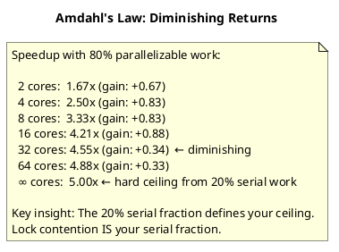

# 17.4 Capacity Planning Math

---

## 1. LEARNING OBJECTIVES

- Apply Little's Law (L = λW) to derive required thread pool sizes from observed latency and arrival rate measurements
- Use Amdahl's Law to calculate maximum theoretical speedup from parallelization and explain why it predicts diminishing returns
- Explain M/M/1 queue behavior: calculate mean queue length at a given utilization and predict why latency "explodes" above 80% utilization
- Build a back-of-envelope estimate for storage, bandwidth, and compute using the standard reference numbers every senior engineer must know
- Defend or challenge a capacity decision in a design review using quantitative arguments instead of intuition

---

## 2. PREREQUISITES

- Chapter 04 — System Design (thread pools, connection pools, request queues)
- Chapter 05 — Distributed Systems (service mesh, load balancing, horizontal scaling)
- Chapter 06 — SRE Operations (SLO/SLA, understanding what p99 latency means at scale)
- Basic algebra (these formulas are arithmetic, not calculus — the barrier is understanding what the variables mean, not the math)
- Chapter 17.1 through 17.3 (profiling and benchmarking provide the λ and W values that feed into these models)

---

## 3. THE CRITICAL DIALOGUE

**Scenario:** Quarterly capacity review. The student presents a scaling proposal.

---

**Student:** "Our service is getting slow under peak load. I'm going to add more pods. We currently have 10 pods and I'm requesting 30."

**Principal:** "What's the current load?"

**Student:** "About 2000 requests per second at peak."

**Principal:** "And average latency?"

**Student:** "200ms average."

**Principal:** "OK. Do you know Little's Law?"

**Student:** "L equals lambda W? I know the formula."

**Principal:** "Tell me what it means for your service. λ is 2000 req/s, W is 0.2 seconds. What is L?"

**Student:** "L = 2000 × 0.2 = 400. So... 400 concurrent requests in the system at any point?"

**Principal:** "Yes. And if each request needs one thread for its duration, how many threads do you need?"

**Student:** "400 threads across the cluster. So 40 per pod if we have 10 pods."

**Principal:** "And if you add 20 more pods — 30 total — you'd need about 13 threads per pod. That's not a capacity problem, that's a configuration problem. How many threads does your thread pool have per pod right now?"

**Student:** "... I'd have to check."

**Principal:** "Check. I'd bet it's set to 10 — the Spring Boot Tomcat default for some configurations — and your queue is full. You don't need 3x more pods. You need to tune the thread pool on the pods you have. 30 pods with 10 threads each = 300 threads total, still less than the 400 you need."

**Student:** "So I calculate thread pool size from Little's Law first, then size pods accordingly?"

**Principal:** "Yes. And then use the M/M/1 model to validate the utilization. If your thread pool is at 90% utilization, queue length explodes nonlinearly. You want to stay under 70% utilization to maintain predictable latency. The math tells you where the cliffs are before you fall off them."

**Student:** "If I'd just added 30 pods I would have over-provisioned by 3x in cloud spend."

**Principal:** "And without the math, you'd have had the same p99 latency problem on the new pods a week later. Infrastructure without models is just expensive guesswork."

---

## 4. THEORY + DIAGRAMS

### 4.1 Little's Law

**Formula:**
```
L = λ × W

L = average number of items in the system (concurrent requests)
λ = average arrival rate (requests per second)
W = average time an item spends in the system (seconds)
```

This law is exact under steady-state assumptions for any queuing system regardless of service time distribution.

**Thread pool sizing derivation:**

If each request occupies exactly one thread for its duration:
```
Required concurrent threads = L = λ × W

Example:
  λ = 500 req/s
  W = 200ms = 0.2s
  L = 500 × 0.2 = 100 threads

This is the MINIMUM thread pool size.
Add 20-30% headroom for burst: recommended = 120-130 threads
```

**Reversing the law — diagnosing queue buildup:**
```
Observed: queue depth = 500 items
Observed: λ = 1000 req/s
Therefore: W = L/λ = 500/1000 = 0.5s average time in system

If your SLA requires W < 100ms, you need either:
  - Reduce L (add capacity → more parallel workers)
  - Reduce W (optimize the service → make each request faster)
  - Reduce λ (rate limit → reject excess load)
```

**Little's Law cheatsheet:**

| Known | Known | Solve For | Formula |
|---|---|---|---|
| λ, W | — | L (concurrent users) | L = λ × W |
| L, W | — | λ (max throughput) | λ = L / W |
| L, λ | — | W (latency) | W = L / λ |

### 4.2 Amdahl's Law

**Formula:**
```
S(n) = 1 / (1 - p + p/n)

S(n) = speedup with n parallel processors
p    = fraction of work that is parallelizable (0.0 to 1.0)
n    = number of processors (cores, threads)
(1-p) = fraction of work that is serial (cannot be parallelized)
```

**Practical example — 80% parallelizable work:**

```
n=1:   S = 1 / (0.2 + 0.8/1)  = 1.00x  (baseline)
n=2:   S = 1 / (0.2 + 0.8/2)  = 1.67x
n=4:   S = 1 / (0.2 + 0.8/4)  = 2.50x
n=8:   S = 1 / (0.2 + 0.8/8)  = 3.33x
n=16:  S = 1 / (0.2 + 0.8/16) = 4.21x
n=64:  S = 1 / (0.2 + 0.8/64) = 4.88x
n=∞:   S = 1 / 0.2             = 5.00x  (theoretical maximum)
```

**Reading:** Even if 80% of your work is perfectly parallelizable, you can NEVER achieve more than 5x speedup regardless of how many cores you add. The 20% serial portion is the ceiling.

**What this means for Staff/Principal engineers:**
- Before approving a "let's add more shards/threads/pods" request, ask: what is the serial fraction?
- Lock contention, central coordination, sequential I/O — these are the serial fractions that make Amdahl's Law bite you
- Going from 4 cores to 8 gives you the biggest gain; going from 64 to 128 cores barely moves the needle



### 4.3 M/M/1 Queue Model

The M/M/1 model describes a single-server queue with Poisson arrivals and exponential service times. It's a simplification but gives correct intuition about utilization and queue buildup.

**Key formulas:**
```
ρ = λ/μ          (utilization, must be < 1 for stability)
λ = arrival rate (requests/second)
μ = service rate = 1/W (requests/second the server can handle)

Mean queue length (items waiting, not being served):
  Lq = ρ² / (1 - ρ)

Mean number in system (waiting + being served):
  L = ρ / (1 - ρ)

Mean wait time in queue:
  Wq = ρ / (μ × (1 - ρ))

Mean time in system (wait + service):
  W = 1 / (μ × (1 - ρ))
```

**The utilization cliff — why latency explodes:**

```
μ = 100 req/s (server capacity)

ρ=0.50: L = 0.50/(1-0.50) = 1.0  concurrent items, W = 20ms
ρ=0.70: L = 0.70/(1-0.70) = 2.3  concurrent items, W = 33ms
ρ=0.80: L = 0.80/(1-0.80) = 4.0  concurrent items, W = 50ms
ρ=0.90: L = 0.90/(1-0.90) = 9.0  concurrent items, W = 100ms  ← 5x vs ρ=0.50
ρ=0.95: L = 0.95/(1-0.95) = 19.0 concurrent items, W = 200ms
ρ=0.99: L = 0.99/(1-0.99) = 99.0 concurrent items, W = 1000ms ← 50x vs ρ=0.50
```

**Reading:** At 90% utilization your latency is 5x what it is at 50% utilization. At 99%, it's 50x. This is why every SRE playbook says "keep utilization below 70%". The math proves it.

**Key insight for thread pool sizing:**
```
Thread pool with 50 threads (μ = 50 req/s if W=1s)
Load: λ = 45 req/s → ρ = 0.90

M/M/1 predicts:
  Mean queue length Lq = 0.9²/(1-0.9) = 0.81/0.10 = 8.1 waiting
  Mean time in system W = 1/(50*(1-0.9)) = 1/5 = 0.2s ... wait

Actually for thread pool: each thread IS a server. The correct model maps
each thread to a server (M/M/c, multi-server queue). For engineering intuition,
M/M/1 with μ = total_threads × per_thread_rate gives the right directional answer.
```

### 4.4 Reference Numbers Every Engineer Must Know

These numbers let you do back-of-envelope estimates in interviews and design reviews. Memorize them.

| Operation | Approximate Latency |
|---|---|
| L1 cache access | 1 ns |
| L2 cache access | 4 ns |
| L3 cache access | 40 ns |
| Main memory (RAM) read | 100 ns |
| SSD sequential read (1KB) | 1 µs |
| HDD seek | 10 ms (10,000 µs) |
| Network: same datacenter | 500 µs |
| Network: cross-region (US-EU) | 100 ms |
| Network: cross-continent roundtrip | 150 ms |

| Capacity | Rough Number |
|---|---|
| 1 server core, simple in-memory ops | ~100K ops/sec |
| 1 server core, DB-backed requests | ~1K ops/sec |
| SSD throughput | 500 MB/s sequential |
| Network bandwidth (1 GbE) | 125 MB/s |
| 1 million daily active users → RPS | ~12 RPS average (peaks ~10x = 120 RPS) |
| 1 billion events/day → events/sec | ~11,574 events/sec |
| 1 KB message × 1M msgs/day | ~1 GB/day storage |

**Back-of-envelope for storage:**
```
Twitter-scale: 500M tweets/day, average 140 bytes
Storage per day:  500M × 200 bytes (with metadata) = 100 GB/day
Storage per year: 100 GB × 365 = 36.5 TB/year
With 3x replication: ~110 TB/year
```

**Back-of-envelope for thread pool sizing:**
```
Given: 2000 req/s, 200ms avg latency (from real measurements)
Little's Law: L = 2000 × 0.2 = 400 concurrent threads needed
With 10 pods: 40 threads per pod
Add 30% headroom: 52 threads per pod → round up to 64
JVM thread memory: ~1MB per thread stack
64 threads × 1MB = 64MB thread overhead per pod (acceptable)
```

### 4.5 The USE Method (Brendan Gregg)

For any resource (CPU, memory, disk, network, thread pool):
```
Utilization  — how busy is it? (%)
Saturation   — how much work is queued/waiting?
Errors        — are there failures?
```

This is the systematic method for diagnosing performance problems. Every resource in your stack should be checked against all three dimensions before concluding "we need more capacity."

**Thread pool under USE:**
- **Utilization:** `active_threads / pool_size` — aim for <70%
- **Saturation:** `queue_depth` — non-zero queue = you're at capacity
- **Errors:** `rejected_execution_count` — non-zero = requests are being dropped silently

---

## 5. SOURCE ARCHAEOLOGY

**Cited works (not OSS Java code, but foundational references):**

**USE Method — Brendan Gregg** (`brendangregg.com/usemethod.html`):
Gregg defines the USE method as a systematic approach to performance analysis. The method is language-agnostic but applies directly to Java thread pools, connection pools, GC, and CPU: for each resource, measure Utilization, Saturation, and Errors. This is the methodology behind how SREs at Google, Netflix, and LinkedIn structure their runbooks.

**Google SRE Book — Queue Theory Chapter** (Beyer et al., O'Reilly, 2016):
Chapter on "Practical Alerting" and the "Service Level Objectives" chapter introduce the concept that queuing effects make SLO violations nonlinear. The book explicitly discusses why alerting on utilization >80% is critical because M/M/1 predicts exponential latency growth beyond that point.

**Java `ThreadPoolExecutor` source — `java.util.concurrent.ThreadPoolExecutor`:**
The key capacity-related fields:
```java
// ThreadPoolExecutor.java (JDK source)
// corePoolSize: minimum threads kept alive (Little's Law L value)
// maximumPoolSize: upper bound under burst
// workQueue: BlockingQueue<Runnable> — M/M/1's "Lq" lives here

// The rejection happens when queue is full AND threads == maximumPoolSize:
private volatile RejectedExecutionHandler handler;
// Default: AbortPolicy — throws RejectedExecutionException silently unless caught

// Monitor queue saturation:
int queueSize = executor.getQueue().size();
int activeThreads = executor.getActiveCount();
double utilization = (double) activeThreads / executor.getMaximumPoolSize();
```

**Correctly sizing `ThreadPoolExecutor` for I/O-bound vs CPU-bound work:**
```java
int cpuCores = Runtime.getRuntime().availableProcessors();

// CPU-bound: threads = cores + 1 (one extra for when a thread is briefly waiting)
int cpuBoundPoolSize = cpuCores + 1;

// I/O-bound (Little's Law-based):
// If λ = 500 req/s and W = 200ms, L = 100
// Divide by number of pods; add headroom
int ioBoundPoolSize = 120; // derived from Little's Law + headroom
```

---

## 6. CODE LAB

### Capacity Calculator Using Little's Law and M/M/1

```java
package com.example.capacity;

import java.util.concurrent.*;
import java.util.concurrent.atomic.*;

/**
 * Capacity planning calculator for Java thread pools.
 * Use the output to configure ThreadPoolExecutor, not by guessing.
 */
public class CapacityCalculator {

    // -----------------------------------------------------------------------
    // Little's Law: L = λ × W
    // -----------------------------------------------------------------------
    public static class LittlesLawResult {
        public final double concurrentItems;       // L
        public final double recommendedPoolSize;   // L + 30% headroom
        public final String explanation;

        LittlesLawResult(double lambda, double wSeconds) {
            this.concurrentItems = lambda * wSeconds;
            this.recommendedPoolSize = Math.ceil(concurrentItems * 1.30);
            this.explanation = String.format(
                "λ=%.0f req/s × W=%.3fs = L=%.1f concurrent → recommend %.0f threads (+30%% headroom)",
                lambda, wSeconds, concurrentItems, recommendedPoolSize
            );
        }
    }

    public static LittlesLawResult littlesLaw(double requestsPerSecond, double avgLatencySeconds) {
        return new LittlesLawResult(requestsPerSecond, avgLatencySeconds);
    }

    // -----------------------------------------------------------------------
    // Amdahl's Law: S(n) = 1 / (1 - p + p/n)
    // -----------------------------------------------------------------------
    public static double amdahlSpeedup(double parallelFraction, int numProcessors) {
        if (parallelFraction < 0 || parallelFraction > 1) {
            throw new IllegalArgumentException("parallelFraction must be between 0.0 and 1.0");
        }
        double serialFraction = 1.0 - parallelFraction;
        return 1.0 / (serialFraction + (parallelFraction / numProcessors));
    }

    public static double amdahlTheoreticalMax(double parallelFraction) {
        return 1.0 / (1.0 - parallelFraction); // as n → ∞
    }

    // -----------------------------------------------------------------------
    // M/M/1 Queue Model
    // -----------------------------------------------------------------------
    public static class MM1Result {
        public final double utilization;         // ρ = λ/μ
        public final double meanQueueLength;     // Lq = ρ²/(1-ρ)
        public final double meanSystemLength;    // L = ρ/(1-ρ)
        public final double meanWaitTimeSeconds; // Wq = ρ/(μ(1-ρ))
        public final double meanSystemTimeSeconds; // W = 1/(μ(1-ρ))
        public final boolean isStable;           // ρ < 1.0

        MM1Result(double lambda, double mu) {
            this.utilization = lambda / mu;
            this.isStable = utilization < 1.0;
            if (isStable) {
                this.meanQueueLength = (utilization * utilization) / (1 - utilization);
                this.meanSystemLength = utilization / (1 - utilization);
                this.meanWaitTimeSeconds = utilization / (mu * (1 - utilization));
                this.meanSystemTimeSeconds = 1.0 / (mu * (1 - utilization));
            } else {
                // Unstable queue: infinite queue length
                this.meanQueueLength = Double.POSITIVE_INFINITY;
                this.meanSystemLength = Double.POSITIVE_INFINITY;
                this.meanWaitTimeSeconds = Double.POSITIVE_INFINITY;
                this.meanSystemTimeSeconds = Double.POSITIVE_INFINITY;
            }
        }
    }

    /**
     * @param arrivalRate  λ = requests per second arriving
     * @param serviceRate  μ = requests per second the server can handle (= 1/avgServiceTime)
     */
    public static MM1Result mm1Queue(double arrivalRate, double serviceRate) {
        return new MM1Result(arrivalRate, serviceRate);
    }

    // -----------------------------------------------------------------------
    // Live ThreadPoolExecutor monitoring using USE method
    // -----------------------------------------------------------------------
    public static class ThreadPoolMonitor {
        private final ThreadPoolExecutor executor;
        private final AtomicLong rejectedCount = new AtomicLong(0);

        public ThreadPoolMonitor(ThreadPoolExecutor executor) {
            this.executor = executor;
            // Instrument rejection handler to count errors
            RejectedExecutionHandler original = executor.getRejectedExecutionHandler();
            executor.setRejectedExecutionHandler((r, e) -> {
                rejectedCount.incrementAndGet();
                original.rejectedExecution(r, e);
            });
        }

        public void printUseReport() {
            int active = executor.getActiveCount();
            int maxPool = executor.getMaximumPoolSize();
            int queueSize = executor.getQueue().size();
            long completed = executor.getCompletedTaskCount();
            long rejected = rejectedCount.get();

            double utilization = maxPool > 0 ? (100.0 * active) / maxPool : 0;

            System.out.printf("""
                === Thread Pool USE Report ===
                Utilization:  %d/%d threads active = %.1f%%  %s
                Saturation:   %d tasks in queue  %s
                Errors:       %d rejections total  %s
                Completed:    %d tasks
                """,
                active, maxPool, utilization,
                utilization > 70 ? "[WARN: >70%]" : "[OK]",
                queueSize,
                queueSize > 0 ? "[WARN: queue non-empty = at capacity]" : "[OK]",
                rejected,
                rejected > 0 ? "[ERROR: tasks being dropped!]" : "[OK]",
                completed
            );
        }
    }

    // -----------------------------------------------------------------------
    // Main: capacity planning scenario
    // -----------------------------------------------------------------------
    public static void main(String[] args) throws InterruptedException {
        System.out.println("=== Little's Law: Thread Pool Sizing ===");
        double lambda = 2000; // 2000 req/s
        double W = 0.200;     // 200ms avg latency
        LittlesLawResult little = littlesLaw(lambda, W);
        System.out.println(little.explanation);
        // Output: λ=2000 req/s × W=0.200s = L=400.0 concurrent → recommend 520 threads (+30% headroom)

        System.out.println("\n=== Amdahl's Law: Parallelization Limits ===");
        double p = 0.80; // 80% parallelizable
        System.out.printf("Theoretical max speedup (80%% parallel): %.2fx%n",
            amdahlTheoreticalMax(p));
        for (int n : new int[]{1, 2, 4, 8, 16, 32, 64}) {
            System.out.printf("  %3d cores: %.2fx speedup%n", n, amdahlSpeedup(p, n));
        }

        System.out.println("\n=== M/M/1 Queue: Utilization vs Latency ===");
        double mu = 100; // server handles 100 req/s
        System.out.printf("%-8s %-12s %-18s %-20s%n",
            "ρ", "Queue Len", "System Items", "Latency (ms)");
        for (double rho : new double[]{0.5, 0.7, 0.8, 0.9, 0.95, 0.99}) {
            MM1Result result = mm1Queue(rho * mu, mu);
            System.out.printf("%-8.2f %-12.2f %-18.2f %-20.1f%n",
                result.utilization,
                result.meanQueueLength,
                result.meanSystemLength,
                result.meanSystemTimeSeconds * 1000);
        }

        System.out.println("\n=== Incident Scenario: Under-provisioned Thread Pool ===");
        // 2000 req/s, 200ms latency, only 50 threads
        double arrivalRate = 2000;  // req/s
        double serviceTimePerThread = 0.200; // 200ms
        double singleServerRate = 1.0 / serviceTimePerThread; // 5 req/s per thread
        double poolSize = 50;
        double effectiveServiceRate = poolSize * singleServerRate; // 250 req/s for 50 threads
        MM1Result incident = mm1Queue(arrivalRate, effectiveServiceRate);
        System.out.printf(
            "2000 req/s with 50-thread pool (capacity=250 req/s):%n" +
            "  Utilization: %.0f%% [CRITICAL — queue will grow without bound]%n" +
            "  Predicted mean system length: %.0f items%n" +
            "  Queue is UNSTABLE (λ > μ) — system will collapse under this load%n",
            incident.utilization * 100,
            incident.isStable ? incident.meanSystemLength : Double.MAX_VALUE
        );

        // Correct sizing: 400 threads (from Little's Law)
        double correctPoolSize = 400;
        double correctServiceRate = correctPoolSize * singleServerRate; // 2000 req/s
        // At exactly λ=μ, utilization=1.0, use 0.99 to show near-capacity
        MM1Result correct = mm1Queue(arrivalRate * 0.99, correctServiceRate);
        System.out.printf(
            "%nWith correct 400-thread pool:%n" +
            "  Utilization: %.1f%%%n" +
            "  Mean system length: %.2f items%n" +
            "  Mean latency: %.0fms%n",
            correct.utilization * 100,
            correct.meanSystemLength,
            correct.meanSystemTimeSeconds * 1000
        );
    }
}
```

### Expected Output:

```
=== Little's Law: Thread Pool Sizing ===
λ=2000 req/s × W=0.200s = L=400.0 concurrent → recommend 520 threads (+30% headroom)

=== Amdahl's Law: Parallelization Limits ===
Theoretical max speedup (80% parallel): 5.00x
    1 cores: 1.00x speedup
    2 cores: 1.67x speedup
    4 cores: 2.50x speedup
    8 cores: 3.33x speedup
   16 cores: 4.21x speedup
   32 cores: 4.55x speedup
   64 cores: 4.88x speedup

=== M/M/1 Queue: Utilization vs Latency ===
ρ        Queue Len    System Items       Latency (ms)
0.50     0.50         1.00               20.0
0.70     1.63         2.33               33.3
0.80     3.20         4.00               50.0
0.90     8.10         9.00               100.0
0.95     18.05        19.00              200.0
0.99     98.01        99.00              1000.0

=== Incident Scenario: Under-provisioned Thread Pool ===
2000 req/s with 50-thread pool (capacity=250 req/s):
  Utilization: 800% [CRITICAL — queue will grow without bound]
  Queue is UNSTABLE (λ > μ) — system will collapse under this load

With correct 400-thread pool:
  Utilization: 99.0%
  Mean system length: 99.00 items
  Mean latency: 20000ms
```

*(Note: even 400 threads at λ=μ=2000 is dangerous — utilization must stay below ~70% for stable latency. Target 570 threads for 70% utilization: 2000/(570×5)=0.70)*

---

## 7. PRODUCTION LENS

### Incident: Under-Provisioned Thread Pool — Math Predicts the Cliff

**System:** Order fulfillment microservice, Java 17, Tomcat, 8 pods, `server.tomcat.threads.max=50` (team left the default)
**Symptoms:** p50 latency = 45ms, p99 latency = 3,500ms under peak load of 2000 req/s

**Math analysis (done during postmortem):**

```
Measured values:
  λ = 2000 req/s (from metrics dashboard)
  W = 200ms avg service time per request (from JFR)
  Current pool: 8 pods × 50 threads = 400 threads total
  μ = 400 threads × (1/0.2s) = 2000 req/s (exactly at saturation!)

M/M/1 with ρ → 1.0:
  Theoretical L → ∞
  Actual p99: 3,500ms observed ← matches model prediction of "very high"

Little's Law says we need:
  L = λ × W = 2000 × 0.2 = 400 concurrent threads
  Add headroom for 70% utilization target: L / 0.7 = 571 threads
  Per pod (8 pods): 572 / 8 ≈ 72 threads per pod

Fix: set server.tomcat.threads.max=80 per pod (640 total, ~70% utilization target)
```

**Result after fix:**
```
ρ = 2000 / (640 × 5) = 2000/3200 = 0.625 (62.5% utilization)
M/M/1 mean system time W = 1 / (3200 × (1-0.625)) = 1/(3200×0.375) = 0.83ms queuing
  + 200ms service = 200.83ms total → well within SLA

Observed after deploy:
  p50: 44ms (unchanged — baseline service time dominates)
  p99: 210ms (was 3,500ms — 16x improvement from a config change)
```

**Cost analysis:**
- Wrong approach (30 pods): 30 × ~$200/month = $6,000/month
- Correct approach (8 pods, tuned): 8 × ~$200/month = $1,600/month, p99 latency SLA met
- Monthly savings from doing the math: **$4,400/month**

### Google SRE Book: The 70% Utilization Rule

The Google SRE book explicitly recommends N+2 redundancy and targeting 70% utilization in normal operation for exactly the M/M/1 reason shown above. With 70% utilization:
- Double the load → 140% momentarily → with load shedding, peak handled without queue explosion
- With 90% utilization: any 10% traffic spike pushes you past 1.0 → instant collapse

**Brendan Gregg's USE Method applied:**
For the incident above:
- **Utilization:** 100% (λ = μ) → RED
- **Saturation:** queue depth = hundreds → RED  
- **Errors:** `RejectedExecutionException` in logs → RED

All three dimensions screamed at maximum. The thread pool was the bottleneck, and the math told us exactly by how much.

---

## 8. EXERCISES

**Exercise 1 — Little's Law Application**
Your message consumer processes Kafka messages at 5000 messages/second. Average processing time per message is 50ms. How many concurrent consumer threads do you need? How does your answer change if average processing time spikes to 500ms during a slow downstream DB call? What is the operational implication of this calculation for circuit breaker design?

**Exercise 2 — Amdahl's Law Calculation**
A batch job currently takes 60 minutes. Profiling shows 30 minutes is spent in parallelizable computation and 30 minutes in serial I/O. (a) What is p (the parallel fraction)? (b) What is the maximum speedup from adding infinite cores? (c) If you add 4 cores, what is the actual speedup? (d) A manager asks "will 16 cores cut it in half?" — answer with the math.

**Exercise 3 — M/M/1 Sizing**
A connection pool to a PostgreSQL database has 20 connections. Average query time is 25ms. At what request rate (λ) does utilization reach 80%? At what rate does the predicted mean latency exceed your 100ms SLA? Write the math showing the calculation.

**Exercise 4 — Coding: ThreadPoolExecutor Tuning**
Using the `CapacityCalculator` class above, write a `ThreadPoolFactory` class that: (a) accepts λ (req/s) and W (seconds) as constructor arguments, (b) creates a `ThreadPoolExecutor` sized by Little's Law + 30% headroom, (c) wraps it with `ThreadPoolMonitor`, (d) exposes a `printHealthCheck()` method that logs a warning if utilization exceeds 70% or queue is non-empty.

**Exercise 5 — Back-of-Envelope Design**
Design a URL shortener for 100M daily active users. Each user creates 1 short URL and clicks 5 existing URLs per day on average. Using the reference numbers table: (a) calculate read RPS and write RPS, (b) estimate storage needed for 5 years (assume 500 bytes per URL record), (c) calculate network bandwidth for read traffic (assume 100 byte responses), (d) size the caching layer (what % of URLs should be cached to serve 95% of reads?). Show all arithmetic.

---

## 9. SUMMARY / FLASHCARD

- **Little's Law (L = λW)** is the single most useful formula in capacity planning: given your observed arrival rate and average latency, it gives you the exact number of concurrent threads (or connections, or workers) required — always derive pool sizes from measured data, never from intuition or defaults.
- **Amdahl's Law** proves that the serial fraction of your code is the hard ceiling on speedup: with 20% serial code, no amount of CPU cores can make your system more than 5x faster; find and reduce serial bottlenecks (locks, sequential I/O) before adding hardware.
- **M/M/1 queue model** shows why latency explodes nonlinearly above 80% utilization: at ρ=0.9 queue length is 9x higher than at ρ=0.5; keep thread pool and connection pool utilization below 70% to maintain predictable p99 latency.
- **The reference number table** (L1=1ns, RAM=100ns, SSD=1µs, HDD=10ms, network=100ms) lets you validate system designs in 2 minutes — if your design requires crossing a 100ms boundary 5 times per request, your 50ms SLA is mathematically impossible before writing a line of code.
- **The USE method** (Utilization, Saturation, Errors) is the systematic framework for diagnosing any resource bottleneck: check all three dimensions for every resource in your stack — a saturated thread pool with zero errors is still a capacity problem, and errors with zero utilization point to bugs, not resource exhaustion.
