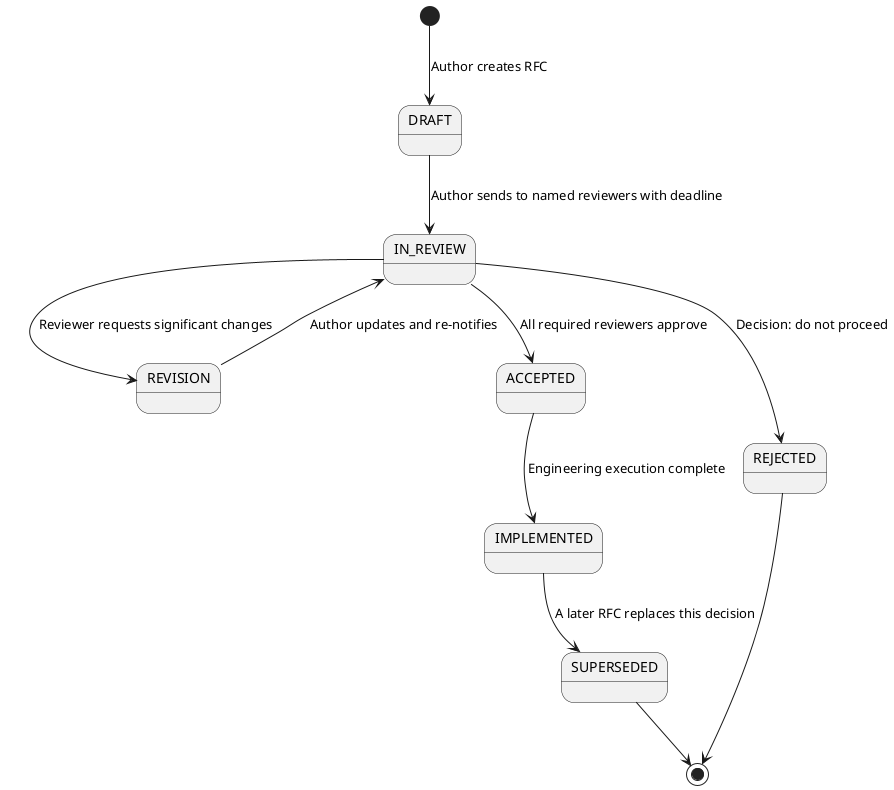

# 18.1 RFC Writing and Adoption

---

## 1. LEARNING OBJECTIVES

- Construct a complete, reviewer-ready RFC using the seven-section template with correct content in each section.
- Distinguish intellectually honest alternatives sections from strawman alternatives and rewrite the latter.
- Explain how organizational memory is encoded in RFCs and why that memory degrades without them.
- Apply the "sticky RFC" techniques to drive actual decisions through documents rather than through Slack.
- Evaluate an RFC's decision criteria section and identify whether it is falsifiable and outcome-linked.

---

## 2. PREREQUISITES

- Chapter 12 (Engineering Leadership) — understanding of technical authority and influence without direct authority.
- Chapter 14 (Domain-Driven Design) — familiarity with bounded contexts, because RFCs often propose boundary changes.
- Chapter 4 (System Design) — baseline competency in distributed architecture, since most Staff-level RFCs involve system-level decisions.
- You should have attended or led at least one architectural review meeting. This module teaches you how to replace ad-hoc meetings with structured written reasoning.

---

## 3. THE CRITICAL DIALOGUE

**Setting:** Post-sprint retrospective. The student has just shipped a gRPC migration that was decided in a 45-minute Slack thread. They are frustrated.

---

**Student:** I actually wrote an RFC for the gRPC migration. Spent three days on it. Sent it to the team channel, asked for feedback. Nothing happened. Two days later, the tech lead posted in Slack, "We're going with gRPC, let's move fast." My RFC wasn't even mentioned. What's the point?

**Principal:** Three questions before I answer. Did your RFC have a deadline for feedback? Did it name specific people whose input you needed? Did you post it in a channel where decisions are actually made, or in a general engineering channel?

**Student:** I... posted it in #engineering-team. No deadline. Just "feedback welcome."

**Principal:** That is not an RFC process. That is a document attached to a hope. "Feedback welcome" is an invitation that busy engineers decline by default. The RFC sat in a Slack channel that engineers check twice a day while your tech lead made the decision in a DM thread with two senior engineers. Your document was never in the room where the decision happened.

**Student:** So the RFC format itself doesn't matter?

**Principal:** The format matters enormously — but format is necessary, not sufficient. You also need process. An RFC without process is a diary entry. Let me tell you what a functional RFC process looks like.

First: before you write the RFC, have a brief alignment conversation with your tech lead. Not to get approval — to get sponsorship. Say, "I'm going to write an RFC for this decision. Can we agree that the RFC is the decision artifact?" If your tech lead won't agree to that, writing the RFC is optional. They have already decided they want to decide in Slack. That is a culture problem, not an RFC problem.

Second: your RFC needs a named review panel and a hard deadline. "Reviewers: @techLead, @seniorEngineer1, @seniorEngineer2 — feedback by Thursday EOD. Decision logged by Friday." Without names and dates, "feedback welcome" collects nothing.

Third: the RFC itself needs to do work the Slack conversation does not do. The Slack decision on gRPC was almost certainly "it's faster and more type-safe, let's do it." Your RFC should have surfaced: What happens to the three internal clients that are not under our control? What is the rollback plan if the platform team's Envoy version doesn't support HTTP/2 trailers? What are the operational runbook changes? If your RFC answers questions the Slack thread cannot answer, engineers will read the RFC because the RFC has information Slack does not have.

**Student:** What if the culture is just "we move fast, we don't write things down"?

**Principal:** Then your job as a Staff candidate is to make writing things down feel faster, not slower. The way you do that is by making your first RFC demonstrably save someone time. Pick a decision that bit the team in the past — a mistake that was repeated, a question that keeps coming up in onboarding. Write the RFC retroactively for that decision. Now it's not bureaucracy; it's documentation that pays off immediately. Once one engineer says "I just sent the new hire our RFC on the message queue decision and didn't have to explain it for 45 minutes," the culture starts to shift.

**Student:** How do I handle it when the RFC process produces a decision I disagree with?

**Principal:** You write your disagreement into the RFC before the decision is finalized. There is a section called Open Questions. You can also add a minority dissent note after the decision is logged: "Engineer X agreed to this decision but on record believes the latency risk under load was underweighted." Then you commit fully to execution. Disagree and commit is not optional at Staff level. The value of the RFC is that your objection is on record. If the decision turns out to be wrong, the RFC is the postmortem artifact. Your dissent note is not an "I told you so" — it is the input that the next RFC on the same topic should weigh.

---

## 4. THEORY + DIAGRAMS

### The Seven-Section RFC Template

Every section has a single job. Violating the section's contract is the most common RFC failure mode.

```
┌─────────────────────────────────────────────────────────────────┐
│  RFC-001: [TITLE]                    Status: DRAFT / ACCEPTED   │
│  Author: [name]   Date: [YYYY-MM-DD]  Decision by: [date]       │
├─────────────────────────────────────────────────────────────────┤
│  1. CONTEXT         Why does this decision exist now?           │
│  2. PROBLEM         What exactly is broken or insufficient?     │
│  3. PROPOSAL        What are we doing?                          │
│  4. ALTERNATIVES    What else did we seriously consider?        │
│  5. TRADE-OFFS      What do we give up with the proposal?       │
│  6. DECISION CRIT.  How do we know we made the right call?      │
│  7. OPEN QUESTIONS  What is still unresolved?                   │
└─────────────────────────────────────────────────────────────────┘
```

#### Section 1 — Context

**Job:** Give the reader enough background that they can evaluate the problem without Googling or asking you.

**What belongs here:** Current state of the system, relevant constraints (team size, SLA, technology stack), and the trigger event that prompted the RFC.

**Common mistake:** Writing a history lesson. The reader does not need the full evolution of your service since 2018. Two to four sentences of present-state context is usually sufficient.

**One-sentence rule:** A reader who knows nothing about your system should understand what the system does and why this decision is timely after reading this section.

---

#### Section 2 — Problem Statement

**Job:** Define the problem with enough precision that two engineers reading it independently would agree on whether a given solution solves it.

**What belongs here:** The symptom (what engineers observe), the root cause (why it happens), and the impact (what breaks, who is affected, how often).

**Common mistake:** Conflating problem with solution. "We need to migrate to gRPC" is a solution, not a problem. "REST-based inter-service calls produce schema drift that causes production incidents 2-3 times per quarter, costing ~4 engineer-hours of debugging each" is a problem.

**One-sentence rule:** After reading this section, a skeptical reader should be able to say, "Yes, this is a real problem worth solving."

---

#### Section 3 — Proposal

**Job:** Describe the chosen approach with enough precision that a senior engineer could begin implementation planning.

**What belongs here:** The proposed solution, the key architectural decisions within that solution, the implementation phases if relevant, and the teams or systems affected.

**Common mistake:** Writing an implementation spec instead of a design proposal. This section should be at the design level (what changes structurally), not the code level (what classes to create).

**One-sentence rule:** After reading this section, reviewers should be able to judge whether the proposal actually solves the problem from Section 2.

---

#### Section 4 — Alternatives Considered

**Job:** Demonstrate that the author seriously evaluated other options and chose the proposal for defensible reasons.

**What belongs here:** Two to four genuine alternatives with a brief description of each and the reason it was not chosen. Alternatives must be real options that a reasonable engineer would consider.

**The strawman anti-pattern:** Listing one weak alternative alongside your proposal to make yours look good by comparison. Example: "Alternative: do nothing (unacceptable because the problem persists)." This is not an alternatives section. This is padding. Experienced reviewers recognize it immediately and it damages your credibility.

**Honest alternatives section:** Each alternative gets the same analytical frame as the proposal. If you would not actually adopt an alternative, explain specifically what trade-off rules it out — not just "it doesn't scale" but "it does not support bidirectional streaming, which rules out the event-notification use case that is 30% of our traffic."

**One-sentence rule:** A reviewer who prefers a different option should find their preferred option listed here with a fair description.

---

#### Section 5 — Trade-offs

**Job:** Acknowledge what the proposal gives up. Every engineering decision has a cost. Pretending otherwise destroys trust.

**What belongs here:** What the proposal makes worse, what risks it introduces, what constraints it imposes on future decisions. This is not a problem with your proposal — it is honesty.

**Common mistake:** Writing only the benefits of the proposal here instead of the costs. If your trade-offs section sounds like a sales pitch, you have written the wrong section.

**One-sentence rule:** An engineer who inherits this system in two years should be able to read this section and understand what they cannot easily change and why.

---

#### Section 6 — Decision Criteria

**Job:** Define what "success" means in measurable terms so the decision can be evaluated after implementation.

**What belongs here:** Metrics that will be tracked, thresholds that define success, timeline for evaluation, and who is responsible for the post-implementation check.

**Common mistake:** Vague criteria. "The system should be faster" is not a decision criterion. "p99 inter-service call latency under 50ms at 1,000 req/s within 90 days of full rollout" is a decision criterion.

**One-sentence rule:** Six months after implementation, a different engineer should be able to look at dashboards and determine whether this RFC's decision was correct.

---

#### Section 7 — Open Questions

**Job:** Surface unresolved issues that need answers before or during implementation.

**What belongs here:** Questions that affect implementation, questions about organizational dependencies, and questions that might change the proposal if answered differently.

**Common mistake:** Leaving this section empty to make the proposal look more complete than it is. Open questions are a sign of intellectual honesty, not incompleteness.

**One-sentence rule:** Each open question should have an owner and a resolution deadline assigned before the RFC is accepted.

---

### RFC Lifecycle State Machine



### Why RFCs Become Organizational Memory

The half-life of tribal knowledge in a fast-growing team is approximately 18 months — roughly the tenure of the median engineer before they leave or move to a different team. After 18 months, the engineers who made a decision are often no longer present or no longer remember the reasoning.

Without RFCs, the organization re-learns the same lessons through repeated mistakes. With RFCs, new engineers can search the RFC archive for "gRPC" or "message queue" and find the exact reasoning that led to the current architecture. This transforms onboarding from oral tradition into structured archaeology.

The compounding value: each RFC that references previous RFCs builds a citation graph. "This decision supersedes RFC-007 because condition X in RFC-007 section 5 no longer holds." This is the same mechanism that makes academic literature durable over decades.

---

## 5. SOURCE ARCHAEOLOGY

### Google's Design Doc Culture (circa 2005 onward)

Google formalized design docs as a prerequisite for significant infrastructure changes early in the company's growth phase. The key insight, documented in multiple engineering blog posts by Google engineers, is that the act of writing the document forces the author to confront gaps in their reasoning that are invisible when the idea lives only in conversation.

Google's design doc template (publicly described by ex-Googlers including at Increment magazine and various engineering blogs) includes: Goals, Non-Goals, Background, Overview, Detailed Design, Cross-cutting Concerns, Alternatives Considered, and Appendix. The Non-Goals section in particular is a practice worth borrowing: explicitly stating what the proposal does not address prevents scope creep during review and implementation.

### Amazon's RFC and Narrative Culture

Amazon's 6-pager narrative memo format (described in detail by Jeff Bezos in shareholder letters and extensively by ex-Amazon engineers) enforces a discipline that PowerPoint slides do not: prose forces logical dependencies to be made explicit. You cannot skip from premise to conclusion in a sentence without the gap being visible.

Amazon's "Working Backwards" process for product decisions (starting from the press release and FAQ before writing any code) is architecturally similar to RFC-first engineering: the written artifact forces alignment on the outcome before resources are committed. The key lesson from Amazon's culture is the distinction between one-way doors (decisions that cannot be easily reversed, requiring full process) and two-way doors (decisions that can be reversed cheaply, requiring lighter process). This distinction is covered in depth in Chapter 18.3.

### IETF RFC Process

The Internet Engineering Task Force has published RFCs since 1969 (RFC 1, authored by Steve Crocker, was a process note, not a protocol specification). The IETF process requires an RFC to go through an Informational, Experimental, or Standards Track designation, with review by working groups and a designated area director.

The key lessons from IETF's process that transfer to internal engineering RFCs:
- An RFC is not a living document. Once accepted, it is immutable. Corrections are published as separate errata or superseding RFCs. This immutability is what makes RFCs trustworthy as historical artifacts.
- The IETF practice of explicit "MUST", "SHOULD", "MAY" language (RFC 2119) for normative requirements is directly applicable to internal RFCs: distinguishing between hard constraints and soft recommendations makes the document actionable.

### Apache Kafka KIP (Kafka Improvement Proposal) Process

Kafka's KIP process (documented at cwiki.apache.org) is one of the best examples of an open-source RFC process that scales across hundreds of contributors globally. Each KIP requires: Motivation, Public Interfaces (what APIs change), Proposed Changes, Compatibility/Migration/Deprecation, Test Plan, and Rejected Alternatives.

Notable: the Rejected Alternatives section in KIPs is taken seriously by maintainers. KIPs with thin or strawman alternatives sections receive review feedback asking for more rigorous comparison before the KIP advances.

### Java JEP (JDK Enhancement Proposal) Process

JEPs (openjdk.org/jeps) require: Summary, Goals, Non-Goals, Motivation, Description, Alternatives, Testing, Risks/Dependencies. The explicit Non-Goals and Alternatives sections mirror the best practices described in this module. JEP 355 (Text Blocks) and JEP 395 (Records) are excellent reading examples of honest alternatives sections in practice — both document considered syntax alternatives with specific reasons for rejection.

---

## 6. CODE LAB

### Worked Example: RFC — Migrate Internal Service Communication from REST to gRPC

Below is a complete, annotated mini-RFC. Annotations appear as inline comments in brackets.

---

```
RFC-042: Migrate Internal Service Communication from REST to gRPC
Author: [Your Name]
Date: 2024-03-15
Status: DRAFT
Reviewers: @techLead, @seniorEngineerA, @seniorEngineerB, @platformTeamLead
Feedback deadline: 2024-03-22
Decision by: 2024-03-25
```

**[Annotation: The header block answers "who needs to act by when" before the reader reads a single word of content. Named reviewers cannot claim they didn't know they were on the hook.]**

---

**1. Context**

Our platform consists of 12 microservices communicating over synchronous HTTP/REST. All services use OpenAPI 3.0 specs, but spec enforcement is manual — no contract test prevents a service from drifting out of compliance. The platform currently handles 8,000 req/s at peak with a p99 inter-service latency of 180ms.

**[Annotation: Two sentences of current state, one key constraint (manual spec enforcement), and one baseline number. Reviewers now have a mental model of what is being changed.]**

---

**2. Problem Statement**

Three production incidents in Q4 2023 (INC-1201, INC-1247, INC-1312) were caused by inter-service schema drift: a producer updated a response field without updating the OpenAPI spec, and consumer services deserialized stale schemas. Total impact: 4.5 hours of degraded availability across the payment and notification services. Root cause review for all three incidents identified schema drift detection as the systemic gap.

Additionally, five of our twelve services have been identified as candidates for bidirectional streaming (real-time pricing updates, live order status). HTTP/1.1 REST does not support bidirectional streaming without SSE workarounds that add 60-80ms of latency overhead.

**[Annotation: Named real incidents, quantified the impact (hours of degraded availability), identified the root cause specifically, AND added a second problem (streaming) that was not the primary motivation but is a legitimate driver. Two problems, neither of which is "REST is old."]**

---

**3. Proposal**

Adopt gRPC with Protocol Buffers as the inter-service communication protocol for all internal service-to-service calls. External-facing APIs (currently 3 public REST endpoints) remain REST.

Phase 1 (Q1 2024): Define .proto contracts for the 4 highest-traffic service pairs (order-service → inventory-service, order-service → payment-service, payment-service → notification-service, user-service → auth-service). Implement contract validation in CI/CD pipeline using buf.build.

Phase 2 (Q2 2024): Migrate remaining 8 service pairs. Decommission REST-to-REST paths after smoke test validation.

Key decisions within this proposal:
- buf.build for proto linting and breaking-change detection (prevents schema drift in CI rather than production)
- Envoy proxy for service-mesh-level gRPC load balancing (existing Envoy deployment, no new infrastructure)
- Keep REST for external-facing APIs; gRPC is internal only

**[Annotation: Design-level, not implementation-level. We know WHAT changes structurally (protocol, contracts, CI tooling) but not HOW (no class names, no Spring config). The proposal is evaluable by a reviewer who has never seen our codebase.]**

---

**4. Alternatives Considered**

**Option A: GraphQL Federation for all inter-service communication**
GraphQL federation (Apollo Federation or Netflix DGS) would solve the schema contract problem and provide flexible querying. Rejected because: (1) bidirectional streaming support in GraphQL requires subscriptions, which add operational complexity we do not currently have expertise for; (2) GraphQL's resolver model introduces N+1 query risk that requires DataLoader patterns — a non-trivial development overhead; (3) our inter-service calls are not consumer-driven queries but producer-defined operations, which is the use case gRPC is designed for.

**Option B: Strengthen REST with OpenAPI contract testing (no protocol change)**
Implement consumer-driven contract tests (Pact) for all service pairs. This solves the schema drift problem without changing the communication protocol. Rejected because: (1) Pact tests are written per consumer, requiring each service team to maintain contracts; (2) Pact does not solve the streaming use case; (3) benchmark data from the platform team (attached) shows gRPC reduces serialization overhead by ~40% vs JSON, which addresses the latency concern.

**Option C: Async messaging (Kafka) for all inter-service communication**
Replacing synchronous REST with Kafka would eliminate coupling and improve resilience. Rejected because: (1) 7 of 12 service interactions are request-response with synchronous acknowledgment requirements (payment confirmation, inventory reservation) — converting these to async requires compensating transaction logic that is significantly more complex; (2) Kafka introduces operational overhead (broker management, consumer group management) that is not justified for synchronous RPC use cases.

**[Annotation: Three real options. Each gets a fair description (not "do nothing" as one of the options). Each rejection cites a specific, technical reason tied to the problem statement. Option B in particular is an option the author clearly considered seriously — it would solve the primary problem. The author explains why it was rejected despite that.]**

---

**5. Trade-offs**

- **Developer experience gap:** Engineers familiar with REST/curl/Postman debugging lose their tooling. gRPC debugging requires grpcurl or Postman gRPC support, which has a learning curve of approximately 1-2 days per engineer. Mitigation: Internal workshop + shared grpcurl cheat sheet.
- **Envoy version constraint:** buf.build breaking-change detection requires proto descriptor sets that our current Envoy 1.18 deployment supports. Upgrading Envoy to 1.24+ is a dependency for Phase 2. Platform team has confirmed this is in their Q2 roadmap, but it is a hard dependency.
- **External API divergence:** Internal gRPC + external REST creates two communication paradigms. New engineers must understand both. This is a permanent operational complexity trade-off.
- **Rollback complexity:** Once service pairs are migrated in Phase 1, rolling back requires re-deploying REST handlers that will have been removed. Phase 1 will maintain dual-protocol support for 30 days before decommissioning REST paths.

**[Annotation: Four real costs. No benefits here — benefits belong in the Proposal. This section answers: "What do we lose?" The author is not trying to sell the proposal. They are being honest about what engineers who inherit this system will have to live with.]**

---

**6. Decision Criteria**

Success is defined as:
- Zero schema-drift incidents in the migrated service pairs within 90 days of Phase 1 completion (baseline: 3 incidents in 90 days prior to migration)
- p99 inter-service latency ≤ 120ms at 8,000 req/s within 60 days of Phase 1 completion (baseline: 180ms)
- buf.build breaking-change CI check runs in ≤ 30 seconds (must not slow PR feedback loop)
- All 12 service-pair migrations complete within Phase 2 timeline (EOQ2 2024)

Failure criteria:
- If Phase 1 migration exceeds 6 weeks of engineering time, we reassess scope before proceeding to Phase 2
- If Envoy upgrade slips past Q2, Phase 2 is blocked; fallback is to maintain dual-protocol longer

**[Annotation: Measurable success criteria AND explicit failure criteria. The failure criteria are particularly important — they define the point at which the team reassesses rather than pushing forward on a failing plan.]**

---

**7. Open Questions**

| Question | Owner | Resolution deadline |
|---|---|---|
| Does buf.build support our monorepo layout (nested proto directories)? | @platformTeamLead | 2024-03-20 |
| What is the timeline for Envoy 1.24 upgrade in staging? | @platformTeamLead | 2024-03-22 |
| Do the 3 external REST APIs have consumers who may bypass our API gateway and call internal services directly? (Would affect "gRPC internal only" assumption) | @securityTeamLead | 2024-03-22 |

**[Annotation: Three real questions that could change the proposal if answered differently. Each has a named owner and a deadline that is before the decision date. These are not rhetorical questions — they are blockers.]**

---

### Strawman vs Honest Alternatives — Side by Side

**Strawman (bad):**
```
Alternatives Considered:
- Do nothing: unacceptable, the problem persists.
- Rewrite everything in Rust: out of scope for this team.
```

These two "alternatives" were never real options. No engineer on the team proposed them. The author included them to make gRPC look like the only sensible choice. An experienced reviewer sees this immediately.

**Honest (good):**
The alternatives section in the RFC above. Option B (Pact contract testing) is an option that would actually solve the primary problem. The author explains specifically why it was not chosen. A reviewer who prefers Option B can evaluate the rejection reason and push back if they disagree.

---

## 7. PRODUCTION LENS

### Case Study: The Caching Strategy Rediscovered Three Times

A mid-size e-commerce platform (staff of approximately 40 engineers) ran without an RFC process for three years. Architectural decisions were made in Jira comments, Slack threads, and architecture review meetings where notes were rarely kept.

In month 6, the team decided not to implement a distributed cache (Redis) for the product catalog service, because the team's SRE had concerns about cache invalidation complexity and the team had recently had a Redis-related incident at a previous company. This was a reasonable decision for the context.

By month 18, half the engineers who made that decision had left or rotated to different teams. A new senior engineer, unfamiliar with the earlier decision, proposed a distributed cache for the product catalog service. Three weeks of design work and a proof-of-concept were done before a long-tenured engineer recalled the original discussion. The reasoning had to be reconstructed from memory — imperfectly — and the new engineer had no way to evaluate whether the original reasons still applied.

By month 30, the same pattern repeated with a third engineer.

The third recurrence triggered a postmortem. The postmortem estimate: 14 engineer-weeks of total effort across three cycles, all of which was spent re-evaluating a decision that had been made twice before.

When the team finally did adopt an RFC process and wrote a retroactive RFC for the caching decision, they discovered that the original SRE's concern (cache invalidation complexity) no longer applied — the team had subsequently adopted an event-driven invalidation pattern (described in an ADR that was itself only known to the engineer who wrote it). The RFC process, applied retroactively, caused the team to re-evaluate and then reverse the original decision with full context. That reversal was correct — the distributed cache was implemented and reduced p99 catalog latency from 340ms to 28ms.

**The counterfactual:** A single RFC written at month 6 with an honest trade-offs section would have saved the team from two re-evaluation cycles and potentially accelerated the correct decision by 24 months. The RFC would have been found by the month-18 engineer in a document search. The RFC's trade-offs section would have included the SRE's cache invalidation concern with enough specificity that the month-18 engineer could evaluate whether it still applied.

**The lesson:** RFCs are not bureaucracy. They are leveraged engineering effort — the same three days of thinking done once, accessible to every engineer who faces the same decision for as long as the system runs.

---

## 8. EXERCISES

**Exercise 1 — RFC Autopsy (Writing)**
Take a technical decision your team has made in the past 6 months that was decided in Slack, a meeting, or a Jira comment thread. Write a retroactive RFC for it using the seven-section template. Your alternatives section must include at least two options that a reasonable engineer would have genuinely considered. Time budget: 2 hours. This is not a polish exercise — completeness matters more than prose quality.

**Exercise 2 — Alternatives Audit (Writing)**
Find an RFC, design doc, or ADR in your codebase or company wiki. Evaluate its alternatives section using this rubric: (a) Are the alternatives genuinely real options, or are they strawmen? (b) Does each rejection cite a specific technical reason? (c) Is there an option that you personally would have preferred that is either missing or unfairly described? Write a one-page critique. If you cannot find an existing document, use a public KIP from the Apache Kafka KIP wiki.

**Exercise 3 — Sticky RFC Design (Reflection)**
Your RFC process is failing: documents are written but decisions are made in other channels. What three specific process changes would you propose? For each change, explain the mechanism by which it makes the RFC the decision artifact (not just a reference artifact). Consider: deadlines, named reviewers, escalation paths, RFC-gating deployment approvals.

**Exercise 4 — Open Questions Severity (Writing)**
Take the worked gRPC RFC example from this chapter. For each open question in Section 7, write one paragraph describing what happens to the proposal if the answer is unfavorable. For example: if Envoy 1.24 upgrade slips to Q3, what changes? Does Phase 2 slip? Is there an alternative approach? This exercise trains you to write open questions that are genuinely decision-relevant, not just "nice to know."

**Exercise 5 — Decision Criteria Falsifiability (Reflection)**
Review the decision criteria section of the gRPC RFC example. For each criterion, ask: "Could an engineer, six months from now, look at a dashboard and definitively determine whether this criterion was met or not met?" Rewrite any criterion that fails this test. Then apply the same evaluation to a real RFC or design doc you have read recently.

---

## 9. SUMMARY / FLASHCARD

- **RFC structure is a contract:** Each section has one job. Context gives background, Problem Statement defines the gap, Proposal describes the solution, Alternatives demonstrates intellectual honesty, Trade-offs acknowledges costs, Decision Criteria defines measurable success, Open Questions surfaces unresolved blockers.

- **Strawman alternatives destroy credibility:** An alternatives section that lists only options no reasonable engineer would choose is worse than no alternatives section. Experienced reviewers recognize strawmen, and it signals the author is selling rather than reasoning.

- **An RFC without process is a diary entry:** Format is necessary but not sufficient. Named reviewers, hard deadlines, and organizational agreement that the RFC is the decision artifact are required for an RFC to actually drive decisions.

- **RFCs encode organizational memory with a compounding return:** The three days spent writing an RFC are paid back every time a new engineer reads it instead of asking "why did we do this?" The payoff grows as the team grows and tenure decreases.

- **Behavioral signal for Staff-level interviews:** When asked "How do you drive technical decisions across teams?", the answer must include: how you write the decision artifact, how you build the review audience, how you handle disagreement in writing, and how you ensure the decision is revisited when conditions change. An answer that relies entirely on meetings and influence is insufficient at Staff level.
