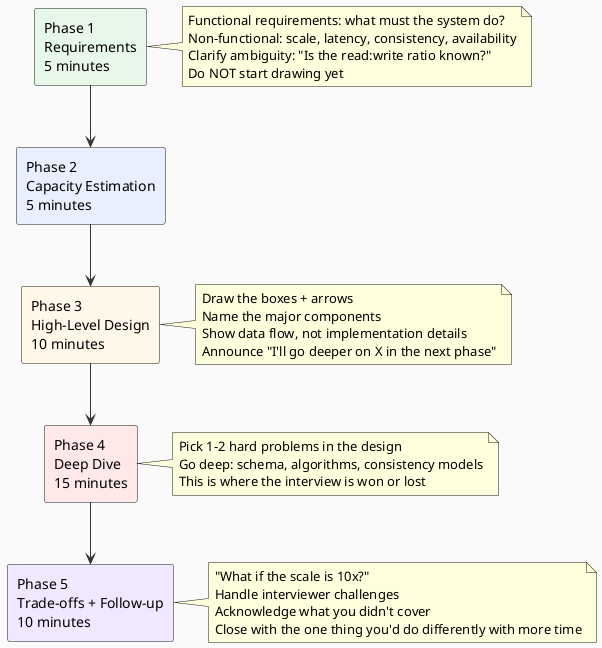

# 19.1 System Design Interview Framework

---

## 1. LEARNING OBJECTIVES

By the end of this module you will be able to:

- Execute a 45-minute system design interview using a repeatable five-phase structure with correct time allocation
- Perform capacity estimation using the DAU → RPS → storage → bandwidth template and produce credible numbers without a calculator
- Articulate the difference between a Senior-level technically correct answer and a Staff-level trade-off-driven answer on the same question
- Recover fluently from going blank or losing the thread mid-interview using three specific verbal techniques
- Anticipate and handle the five most common interviewer follow-up patterns

---

## 2. PREREQUISITES

| Dependency | Where to find it |
|---|---|
| Distributed systems fundamentals (CAP theorem, eventual consistency) | Chapter 5 – Distributed Systems |
| Core data structures and storage trade-offs (SQL vs NoSQL, caching layers) | Chapter 3 – Databases |
| Back-of-envelope math comfort (powers of 2, orders of magnitude) | Chapter 17 – Performance Engineering, estimation section |
| Basic messaging patterns (pub/sub, event streaming) | Chapter 5 – Distributed Systems |

---

## 3. THE CRITICAL DIALOGUE

**Student:** I got rejected after a system design round at a mid-size tech company. The feedback was "didn't demonstrate Staff-level thinking." But I designed a correct, scalable system. I covered caching, I mentioned eventual consistency, I drew the right boxes. What am I missing?

**Principal:** Correctness is the floor, not the ceiling. Every candidate who gets to that round can draw a horizontally scalable web tier. The interviewer has seen that diagram fifty times this month. What they're evaluating is *how you think when you don't know the answer* — not whether you know the answer.

**Student:** But I did know the answer. The design was solid.

**Principal:** Let me ask you what the interviewer probably asked themselves: "Did this person ever say 'I'm making this choice because of X, and the trade-off is Y, and I'd revisit it if Z happened'?" Did you?

**Student:** I said "I'd use Redis for caching because it's fast."

**Principal:** "It's fast" is not a trade-off. A Staff engineer says: "I'd start with Redis because the team already operates it, it gives us sub-millisecond reads, and the data fits in memory with room to spare. The trade-off is that Redis is single-region by default, so if we ever need cross-region reads we'd need Redis Enterprise or a different strategy. I'd not solve that now — I'd wait until we actually see the need rather than add complexity upfront." That answer signals architectural judgment. It signals you've operated systems, not just designed them on a whiteboard.

**Student:** I didn't say any of that because I thought it would make me sound uncertain.

**Principal:** You have the reflex backwards. Certainty about a complex system is a red flag to a senior interviewer. Uncertainty acknowledged and handled is a green flag. The person who says "I'm confident this design works, full stop" has either never operated it at scale or isn't being honest. The person who says "this works up to X, and here's what breaks first and why" has shipped real systems.

---

## 4. THEORY + DIAGRAMS

### 4.1 The Five-Phase Structure

A 45-minute system design interview has five phases with fixed time budgets. Going over on early phases is the most common way candidates fail — they spend 20 minutes on requirements and never get to show depth.



### 4.2 Phase 1 — Requirements (5 minutes)

**What to do:**
Ask targeted questions to bound the problem. Do not ask open-ended questions ("what are the requirements?") — come in with a hypothesis and confirm it.

**Exact phrases to use:**

> "Let me confirm the scope before I start. I'll assume we're building the core read/write path and not the admin/analytics side — is that right?"

> "For scale, is this in the range of Twitter-scale, 100M DAU? Or are we starting smaller and designing for growth?"

> "The hardest design decision here will probably be around [consistency vs availability / hot spots / write throughput]. Do you want me to call out trade-offs as I go?"

**What to write down** (visible to interviewer):
- Functional: list 3–5 user-facing capabilities
- Non-functional: read:write ratio, target latency, availability SLA (99.9% vs 99.99%)
- Out of scope: explicitly state 2–3 things you are NOT designing

### 4.3 Phase 2 — Capacity Estimation (5 minutes)

Use the DAU → RPS → storage → bandwidth chain. Do this fast and approximate — orders of magnitude matter, exact numbers do not.

**Template with "Design Twitter" example:**

```
Given: 300M DAU, average user reads 100 tweets/day, writes 2 tweets/day

Step 1: Requests per second
  Reads:  300M × 100 / 86,400 ≈ 347,000 RPS  → ~350K read RPS
  Writes: 300M × 2   / 86,400 ≈   7,000 RPS  → ~7K write RPS
  Read:Write ratio ≈ 50:1  (important for cache strategy)

Step 2: Storage per day
  Tweet: 140 chars × 2 bytes = 280 bytes + metadata ≈ 500 bytes
  New tweets/day: 300M × 2 = 600M tweets × 500 bytes = 300 GB/day
  5-year storage: 300 GB × 365 × 5 ≈ 547 TB → ~500 TB total

Step 3: Bandwidth
  Read: 350K RPS × 500 bytes = 175 MB/s inbound read
  Media tweets (assume 10%): 350K × 0.1 × 1MB = 35 GB/s  ← media is the real driver
  → Need CDN for media; text-only reads are manageable

Key sizing outputs:
  Write RPS: 7K → single primary DB can handle this; replicas for reads
  Read RPS: 350K → must cache; DB alone cannot serve this
  Media bandwidth: 35 GB/s → CDN is non-negotiable, not optional
```

**The point of estimation is not precision — it is decision justification.** When you say "I need a cache," you can now say *why*: "350K read RPS is 100x what a single DB instance handles, so cache is required, not optional."

### 4.4 High-Level Design (10 minutes)

Draw the canonical boxes. Do not over-engineer. The interviewer will prompt you to go deeper on what they care about.

**Components to always include (if applicable):**
- Client → Load Balancer → API Gateway → Service layer
- Storage layer (primary DB + read replicas)
- Cache layer (L1 app cache + L2 Redis)
- Message queue (if async processing needed)
- CDN (if serving media or static assets)

**What to say as you draw:**

> "I'm drawing the happy path first — client calls API, API reads from cache, falls back to DB. I'll handle failure cases and consistency in the deep dive."

> "I'm intentionally leaving out the auth service, rate limiting, and monitoring — those are real but not the interesting design problems here. Let me know if you want to cover them."

### 4.5 Senior vs Staff — Same Question, Different Answer

**Question:** "Design a rate limiter."

**Senior answer (technically correct, not Staff-level):**

> "I'd use Redis with a sliding window counter. Each request key is `user_id:minute_bucket`. We increment the counter and check against the limit. If over limit, return 429. TTL auto-expires old buckets."

**Staff answer (same correctness, different signal):**

> "I'd start with Redis sliding window because it's the simplest thing that works and the team already operates Redis. The trade-off is that it's eventually consistent in a distributed setup — if you have 5 Redis nodes without strong consistency, a user could briefly exceed their limit by a factor of N nodes. For most rate limiting use cases that's acceptable. If we were protecting a payment endpoint where every cent matters, I'd use a token bucket backed by a single Redis primary with read-through, accepting the lower read throughput for correctness. I'd instrument this decision point with a metric — if we see the inconsistency window causing real problems, I'd add that constraint then rather than now. The simpler version gets us to production in a week; the correct version takes a month and might never be needed."

**What the Staff answer signals:**
1. Operational awareness ("team already operates Redis")
2. Failure mode knowledge ("eventual consistency in distributed Redis")
3. Use-case sensitivity ("most cases vs payment endpoint")
4. Incremental complexity ("simpler first, add constraint when needed")
5. Time-to-production thinking ("a week vs a month")

### 4.6 Recovery Techniques — When You Go Blank

Going blank is normal. The interviewer knows you're in a timed, high-pressure situation. What matters is how you handle it.

**Technique 1 — Buy time with a framing statement:**

> "Let me think about this from first principles for a moment — the core constraint here is [X], so the approach should..."

Say this slowly. It signals that you think before you speak, which is a positive signal, not a negative one.

**Technique 2 — Return to the trade-off frame:**

> "I see a few directions here. Option A is simpler to build but has [downside]. Option B handles [downside] but adds complexity. Let me think about which constraint matters more for this use case..."

Even if you haven't landed on the answer yet, this response demonstrates Staff-level thinking. You're structuring the problem space, not flailing.

**Technique 3 — Acknowledge and redirect:**

> "I haven't personally built [X] in production, but I've dealt with the adjacent problem of [Y]. The solution there was [Z]. Let me reason about whether the same approach applies..."

This is honest and shows intellectual integrity. Interviewers can tell when you're faking familiarity. Acknowledging a gap and reasoning through it is more impressive than a confident wrong answer.

### 4.7 Handling Common Interviewer Follow-ups

| Follow-up | What it's testing | How to respond |
|---|---|---|
| "What if the scale is 10x?" | Can you identify the first bottleneck | "The first thing that breaks is [component] because [reason]. I'd address it by [change]." |
| "How do you handle failures?" | Do you think about the unhappy path | Name the failure mode, then the detection mechanism, then the recovery mechanism |
| "Why not [alternative]?" | Do you know the trade-offs | Acknowledge the trade-off: "That works too. My choice of X over Y was because [specific reason]. If [condition], I'd reconsider." |
| "How would you test this?" | Production readiness | Name 3 layers: unit tests, integration tests, and load tests with a specific metric target |
| "What would you do differently?" | Self-reflection and learning | Have a genuine answer ready. "I'd [X] because in hindsight [Y] is the actual bottleneck" |

---

## 5. SOURCE ARCHAEOLOGY

### 5.1 How Real Companies Structure System Design Interviews

**Google (L5/L6/L7 — Senior/Staff/Senior Staff):**
The rubric is published in "Software Engineering at Google" (O'Reilly, 2020, Chapter 6). The key dimensions evaluated are: problem clarification, technical depth, communication clarity, and awareness of trade-offs. L7 (Staff equivalent) specifically requires "demonstrating broad technical leadership" — the ability to reason about organisational and operational constraints, not just technical ones.

**Meta (E5/E6):**
Meta's interview prep guide (publicly available via Meta Careers) states that E6 candidates are expected to "own the problem end-to-end" — which means not just designing the system but proactively calling out what you are not designing and why, what the first failure mode is, and how you'd validate the design.

**Stripe:**
Stripe engineering blog posts and ex-employee accounts (levels.fyi, blind) consistently describe their system design rounds as conversation-based. The interviewer explicitly gives hints if you go off track. Correctly responding to hints (adjusting direction, not ignoring them) is itself evaluated.

**Amazon (L6/L7):**
Amazon's bar raiser process evaluates all dimensions including "Dive Deep" and "Think Big" leadership principles. System design is evaluated against these principles — a correct design that shows no operational depth fails "Dive Deep." An answer that doesn't address failure handling fails "Ownership."

### 5.2 The "Parking Lot" Technique

Used by experienced interviewers at all major companies: when a candidate mentions something interesting but tangential, the interviewer writes it on the side of the whiteboard ("parking lot") and says "we'll come back to that." 

Recognition signal: when an interviewer parks something, they want to see if you remember it and offer to return to it. If you designed a rate limiter and the interviewer parked "how do you handle Redis failure," proactively saying "I'd like to come back to the Redis failure mode I mentioned" signals that you don't drop threads.

---

## 6. CODE LAB

### Lab 19.1-A: The Capacity Estimation Cheat Sheet

Memorise these constants. You will use them in every capacity estimation.

```
Time constants:
  1 day   = 86,400 seconds  ≈ 100K seconds
  1 month = 2.6M seconds
  1 year  = 31.5M seconds   ≈ 30M seconds

Storage constants:
  1 char (UTF-8 ASCII) = 1 byte
  1 char (UTF-8 Unicode) = 2-4 bytes
  1 JPEG photo (mobile) = 1-5 MB → use 3 MB
  1 short video (1 min, 720p) = 50-100 MB → use 75 MB
  UUID = 16 bytes
  Timestamp = 8 bytes

Throughput rules of thumb:
  MySQL/Postgres: 1K-5K writes/sec on a single primary
  Redis: 100K ops/sec single node
  Kafka: 100K-500K msgs/sec per partition (throughput-tuned)
  CDN: virtually unlimited (scale horizontally)

Powers of 2 (for storage math):
  2^10 = 1K
  2^20 = 1M
  2^30 = 1G
  2^40 = 1T
```

### Lab 19.1-B: Practice Estimation — "Design a URL Shortener"

Work through this before reading the answer.

```
Given: 100M new URLs shortened per day, 10:1 read:write ratio

Step 1: Writes
  100M / 86,400 ≈ 1,200 writes/sec → ~1.2K writes RPS

Step 2: Reads
  10:1 ratio → 12K reads/sec

Step 3: Storage
  URL record: short_code (7 bytes) + long_url (avg 100 bytes) + metadata = ~200 bytes
  100M URLs/day × 200 bytes = 20 GB/day
  5-year retention: 20 GB × 365 × 5 = 36.5 TB → ~40 TB

Step 4: Key insight from the math
  Writes: 1.2K RPS → a single Postgres instance handles this
  Reads: 12K RPS → cache heavily; each hit is a hot short code
  40 TB: not big; a single database server can hold this
  
  Conclusion: the interesting problem is NOT scale — it's uniqueness guarantees
  for the short code generation under concurrent writes.
  This is where the deep dive should go.
```

**Note how the estimation drives the design conversation.** The interviewer now knows you won't spend 10 minutes on sharding when the dataset fits on a laptop.

### Lab 19.1-C: Full Written Senior vs Staff Contrast — "Design a Notification System"

**Senior answer structure:**

> "I'd use a message queue like Kafka. When a user action triggers a notification, the service publishes an event to Kafka. A notification consumer reads from Kafka, looks up the user's notification preferences, and sends the notification via email/push/SMS using third-party providers. For scale, I'd partition Kafka by user_id to maintain ordering per user."

**Staff answer structure:**

> "The interesting problem in notification systems isn't the happy path — it's delivery guarantees and the fan-out problem. Let me address both.
>
> For delivery guarantees: at-most-once delivery means some notifications get dropped; at-least-once means duplicates. For push notifications, duplicates are acceptable (the user sees the same notification twice). For email, duplicates are annoying but not harmful. For payment confirmations, we need exactly-once semantics — I'd use idempotency keys at the provider level and deduplication at the write path.
>
> For fan-out: imagine a celebrity with 50M followers posts something. A naive system tries to write 50M notification records immediately — that's a 50M-record write burst that takes down your database. Twitter calls this the 'Selena Gomez problem.' I'd separate high-fan-out users (>10K followers) from normal users. Normal users get their notifications precomputed and pushed to a fan-out queue. High-fan-out users get pull-based notifications — followers query 'what did accounts I follow post in the last X minutes' lazily.
>
> The trade-off is complexity: now you have two code paths. I'd start with the simple approach, instrument celebrity posting as a risk metric, and add the fan-out bifurcation when it causes a real incident, not speculatively."

The Staff answer is longer not because it shows off — it's longer because it addresses the actual hard problems in the domain.

---

## 7. PRODUCTION LENS

### Real Interview Failure Patterns

**Pattern 1 — The scope creep failure**
Candidate spends 25 minutes on requirements and high-level design. Gets to deep dive with 10 minutes left. Interviewer gives low score on "technical depth." The candidate knows the answer — they just ran out of time.
Fix: keep a clock visible. If you've been talking for 12 minutes without drawing anything, force yourself into the next phase.

**Pattern 2 — The technology-first failure**
Candidate leads with technology ("I'd use Kafka for this") before establishing why. When asked "why Kafka?", they say "because it handles high throughput" — which is true but doesn't demonstrate they know when Kafka is the *wrong* choice.
Fix: always establish the constraint before naming the technology. "We have 7K writes/sec and need at-least-once delivery to three consumers — that's where Kafka's consumer group model fits well."

**Pattern 3 — The no-numbers failure**
Candidate designs correctly but never does any sizing. Cannot answer "how many servers do you need?" or "what's the cache hit rate required to meet SLA?"
Fix: force yourself to write at least five numbers on the whiteboard before the design phase ends. Any numbers. They give the interviewer concrete handles to challenge.

**Pattern 4 — The agreement failure**
Interviewer says "wouldn't that cause a single point of failure?" Candidate says "yes, you're right, I should fix that." Interviewer challenges again. Candidate agrees again. This continues until the candidate has redesigned away everything they said.
Fix: defend your choices when they are defensible. "Yes, it is a single point of failure — I deliberately chose simplicity here because the SLA is 99.9%, which allows 8 hours of downtime per year. Adding redundancy for that Redis node costs two weeks of eng time. I'd revisit if the SLA changes to 99.99%."

**Pattern 5 — The textbook answer failure**
Candidate gives the canonical answer for the problem category (URL shortener → base62 encoding + MySQL, rate limiter → Redis sliding window) without any personalisation. No mention of operational realities, team capabilities, or real trade-offs.
Fix: always add an "in practice" sentence. "The textbook answer is X. In practice I've found Y because Z." Even if you haven't personally done it, connect it to something you have done.

---

## GOL Challenge (v9) — CAPSTONE

> **System:** [Global Order Ledger](../GOL_ARCHITECTURE.md) | **Version:** v9 — Full System Design
> 
> **Requires:** GOL v8 (Ch 17.3) — you have built the system from v0 to v8.

### The Challenge

**"Design the Global Order Ledger. You have 45 minutes."**

This is the capstone GOL challenge. You have seen every component of this system from Chapter 1 to Chapter 17. Now design it from scratch without notes, as if it were a Staff Engineer interview.

### Constraints (provided by interviewer)

- 50,000 financial transactions/second per region
- 3 active regions: EU, US-EAST, AP-SOUTH
- ACID per account (no lost updates)
- 99.99% availability (< 52 min downtime/year)
- Full immutable audit log (PCI-DSS compliant)
- p99 balance read < 50ms
- 200 million active accounts

### 45-Minute Framework (use this structure)

| Time | Activity |
|---|---|
| 0–5 min | Clarify requirements, identify what's NOT in scope |
| 5–10 min | Capacity estimation (write TPS, storage, bandwidth) |
| 10–20 min | High-level design (components, data flow diagram) |
| 20–35 min | Deep dive: 2-3 critical components |
| 35–45 min | Failure modes, scaling bottlenecks, what you'd do with more time |

### Self-Assessment Rubric

After completing the 45-minute design, score yourself:

| Dimension | Expected (Senior) | Strong (Staff) | Exceptional (Principal) |
|---|---|---|---|
| Storage choice | Chose PostgreSQL with justification | Chose PostgreSQL + justified sharding strategy + quantified node count | Included event sourcing, CQRS, justified the read model |
| Availability | Mentioned replication | Explained 99.99% math (52 min/year budget), mentioned multi-region | Specified: synchronous replication within region, async across; justified RPO/RTO |
| Consistency | Mentioned ACID | Specified isolation level + explained why | Addressed cross-region consistency + CAP tradeoff explicitly |
| Resilience | Mentioned circuit breaker | Specified Resilience4j composition order: Bulkhead→Retry→CB→TimeLimiter | Included graceful shutdown, K8s SIGTERM lifecycle, deployment strategy |
| Caching | Mentioned Redis | Specified PER for stampede prevention, TTL strategy | Justified short TTL + write-through invalidation, addressed stale balance risk |
| Kafka | Mentioned as audit log | Specified partition key (accountId), consumer group isolation | Justified topic-per-region for data residency, MirrorMaker 2 cross-region |
| Security | Mentioned JWT | Specified EdDSA vs RSA choice with reason | Included mTLS, separate audit TX propagation, CSRF disabled rationale |

### What You Know Now

You have built this system across 14 GOL Challenges, from:
- v0: sealed `LedgerEvent` hierarchy (Ch 1.2)
- v0.5: async validation with virtual threads (Ch 1.7)
- v1–v1.5: Spring Boot service + JWT security (Ch 2.0, 2.5)
- v2–v2.5: MVCC, N+1 fix, HikariCP sizing (Ch 3.5, 3.6)
- v3: full test suite with Testcontainers + Pact (Ch 16.1)
- v4: capacity plan — 28 PostgreSQL primaries per region (Ch 4.1)
- v5: Kafka audit log, topic-per-region, partition by accountId (Ch 7.1)
- v6–v6.5: Circuit breaker + Redis cache with PER (Ch 20.1, 8.1b)
- v7: event-sourced ledger with snapshot strategy (Ch 14.3)
- v8: ThreadLocal leak diagnosis via MAT (Ch 17.3)

A Staff Engineer who hasn't built GOL will have theoretical knowledge of these patterns. You have **implementation experience** with every one. That is the difference.

---

## 8. EXERCISES

**Exercise 1 — Timed capacity estimation**
Set a 5-minute timer. Estimate storage and throughput requirements for "Design Instagram" with 500M DAU. Write down DAU → RPS → storage per day → 5-year storage. Do not use a calculator. Check your work after the timer.

**Exercise 2 — Senior to Staff rewrite**
Rewrite this Senior answer as a Staff answer (focus on trade-offs, operational awareness, and explicit decision criteria):

> "I'd use PostgreSQL with a read replica. The primary handles writes and the replica handles reads. I'd add a connection pool with PgBouncer to handle many concurrent connections."

**Exercise 3 — Follow-up handling drill**
Take any system you've designed (could be a work project). Practice answering these five questions out loud, timing yourself at 2 minutes each:
1. What's the first component that fails if traffic triples tomorrow?
2. How do you detect that failure before users report it?
3. What would you have done differently with hindsight?
4. What did you not build because it would have taken too long?
5. If you had to cut scope by 50%, what stays?

**Exercise 4 — Recovery practice**
Pick a system design topic you're weak on (e.g. distributed consensus, vector clocks, CRDTs). Write out the "Technique 3 — Acknowledge and redirect" response you'd give if an interviewer asked about it. The response must be honest, must connect to something adjacent you do know, and must show reasoning rather than knowledge recall.

**Exercise 5 — Full mock interview**
Using the five-phase structure, time-box a full 45-minute system design for "Design a distributed job scheduler (like Sidekiq or Celery, but distributed)." Record yourself or write the full design out. After, score yourself on: requirements clarity (were they complete?), estimation (did it drive your design decisions?), deep dive (did you go at least 2 levels deep on the hard problem?), trade-offs (did you say "I chose X over Y because Z" at least three times?).

---

## Exercise Solutions

<details>
<summary>Exercise 1 — Timed capacity estimation: Instagram 500M DAU</summary>

**Without a calculator — use round numbers and powers of 10:**

**Step 1 — RPS:**
- 500M DAU ≈ 5 × 10⁸ users
- 86,400 seconds/day ≈ 10⁵ seconds
- Active users / second: 500M / 10⁵ = 5,000/s baseline activity
- Assume 1 photo upload/user/day, 10 feed/photo views/user/day

Write RPS: 500M × 1 / 10⁵ ≈ **5,000 writes/sec** → round to 6k/s
Read RPS: 500M × 10 / 10⁵ ≈ **50,000 reads/sec** → round to 60k/s (10:1 read:write)

**Step 2 — Storage per day:**
- Average compressed photo: ~3 MB (JPEG after mobile compression)
- 500M uploads/day × 3 MB = 1,500,000 GB = **1.5 PB/day**
- With 3× replication: 4.5 PB/day raw storage

**Step 3 — 5-year storage:**
4.5 PB/day × 365 × 5 = 4.5 × 1,825 ≈ 4.5 × 2,000 = **~9,000 PB ≈ 9 EB** (9 exabytes)

**Design implications (the key point of estimation):**
- Read-heavy (10:1): CDN is mandatory — without it 60k × 3MB = 180 GB/s outbound
- Write volume (6k/s): manageable for Kafka + object storage write pipeline
- Storage at 9 EB over 5 years: object storage (S3/MinIO), not RDBMS — no SQL database handles PB-scale blob storage
- Conclusion: "Cache reads aggressively at CDN, use object storage for blobs, use metadata DB (PostgreSQL) only for indexes and user relationships"

**Staff-level framing:** "The estimation doesn't predict the exact answer — it justifies the architectural choices. '1.5 PB/day of photos proves we need object storage, not a file system' is a design decision, not trivia."
</details>

<details>
<summary>Exercise 2 — Senior to Staff rewrite</summary>

**Original Senior answer:**
> "I'd use PostgreSQL with a read replica. The primary handles writes and the replica handles reads. I'd add a connection pool with PgBouncer to handle many concurrent connections."

**Staff-level rewrite (after doing capacity math):**

"For this system at scale — based on our 60k read RPS estimate — PostgreSQL + read replicas is the right foundation, but I want to be explicit about what we're accepting and where we'll hit limits.

**Replication lag:** Async replication means replicas are 50-200ms behind the primary. For most feed reads (displaying someone else's post) that's fine. For write-your-own-read consistency — a user uploads a photo and immediately sees it in their own feed — we need read-after-write: either route that user's reads to the primary for 5 seconds post-write, or use a session token to flag 'this user just wrote, prefer primary.'

**PgBouncer mode matters:** Transaction-mode pooling, not session-mode. Session-mode holds a DB connection for the entire HTTP session — 60k concurrent users × 1 connection = 60k connections, and PostgreSQL collapses around 10k. Transaction-mode allows 500 application threads to share 50 DB connections because each connection is released after each transaction commit.

**Where this breaks:** At 10× traffic — 600k read RPS — a single PostgreSQL primary saturates. That's when I'd evaluate horizontal read scaling via sharding on user ID. I'd defer that decision until we measure it; premature sharding adds complexity that costs 3 months of engineering for a problem we don't have yet.

I'd make this a stated decision criterion: 'revisit sharding when primary CPU > 60% during peak.'"

**What changed:**
- Explicit trade-off stated: replication lag → named problem (read-after-write), named solution
- Specific production concern: PgBouncer mode is not optional, it's the mechanism that prevents connection exhaustion
- 10× failure mode named proactively: shows operational awareness, not just happy-path design
- Decision criterion given: defines when to revisit, not just "it might need sharding later"
</details>

<details>
<summary>Exercise 3 — Follow-up handling drill</summary>

**Model answers for the five follow-up questions (for any system you own):**

**Q1: What's the first component that fails if traffic triples tomorrow?**

Frame your answer around the utilization bottleneck:
"The read replica — it's currently at 55% CPU at peak. 3× traffic would saturate it within minutes. Second to fail: the PgBouncer pool; we have 50 connections configured and 3× traffic would exhaust them, causing connection queue buildup and p99 latency above 5s."

The Staff-level signal: you answer with a specific component, a specific metric, and a specific failure mode — not "the database would get slow."

**Q2: How do you detect that failure before users report it?**

"Prometheus alert: `pg_stat_replication_lag_seconds > 1s` for 2 minutes. PgBouncer alert: `pool_free_connections < 10`. Both alert before user-visible errors appear in HTTP 5xx rates. On-call runbook: when both fire simultaneously, scale up replicas before checking application logs."

The Staff-level signal: specific metric, specific threshold, specific alert, and a runbook pointer.

**Q3: What would you have done differently with hindsight?**

Honest failure, not humble-brag:
"We used random UUID as the primary key for the photo metadata table, following a convention from our old service. After 2 years of production data, we discovered that random UUIDs cause B-tree fragmentation — index size grew 3× compared to sequential IDs. Every index scan on `photos.id` now reads 3× more pages. Migrating to UUID v7 (time-ordered) would require a full table rebuild. I'd choose UUID v7 from day one if I started over."

**Q4: What did you not build because it would have taken too long?**

"We didn't build cross-region CDN failover. All static assets are served from us-east-1. European users experience 180ms CDN latency on photo loads. We took this as deliberate tech debt — the business case for multi-region CDN didn't justify 4 sprints of infrastructure work at our user base size. It's tracked in our backlog with the revenue metric threshold that would trigger prioritization."

**Q5: If you had to cut scope by 50%, what stays?**

"Core write path (upload → object store → CDN invalidation) and core read path (feed generation + photo serve). Cut: push notifications, search indexing, analytics pipeline, story feature. A user who can upload and view content can tolerate degraded notifications and missing search for a week. The write and read paths together are 80% of user value."
</details>

<details>
<summary>Exercise 4 — Recovery practice: Technique 3</summary>

**Template for "Acknowledge and redirect" on an area you're weak:**

```
"[Honest acknowledgment] + [What you do know about the adjacent area] + 
[How you'd reason from first principles] + [redirect to a concrete direction]"
```

**Example — Distributed consensus (Raft/Paxos):**

"Distributed consensus is an area where I have conceptual understanding but haven't implemented it in production. What I do have is hands-on experience with the failure modes it's designed to prevent. We had a Kafka controller re-election incident where the broker took 34 seconds to elect a new controller, causing producer timeouts cascade across 6 services. Debugging that taught me the mechanics of Raft leader election: quorum requirements, split-brain scenarios, and why 2f+1 nodes are needed to tolerate f failures.

If you're asking about Raft in the context of a distributed database coordinator — which I think is the direction this question is going — I'd reason from that incident: the core challenge is that any write that reaches the old leader before the new leader is elected creates a divergent log. Raft addresses this by requiring the leader to have the most up-to-date log before accepting writes. I'd approach the design by first asking: what's the maximum acceptable time to elect a new leader, and how does that bound our quorum size?"

**Why this works:**
- Honest: doesn't fake expertise
- Shows mechanism understanding: quorum, 2f+1, leader election timing
- Grounds in real experience: the Kafka incident is specific and credible
- Redirects to reasoning: "I'd approach this by asking..." shows problem-solving process

**What to avoid:** "I haven't worked with Raft but I've read about it" — no mechanism, no experience, no direction.
</details>

<details>
<summary>Exercise 5 — Full mock interview: Distributed job scheduler</summary>

**45-minute design walkthrough with scoring criteria:**

**Phase 1 — Requirements (5 min)**

Questions to ask:
- "At-most-once vs at-least-once delivery?" → At-least-once (jobs are idempotent or we'll design for it)
- "Priority queues needed?" → Yes, 3 levels (critical/normal/batch)
- "Job result storage?" → Yes, 24h retention
- "Cron-style scheduling?" → Yes
- "Target scale?" → 10k jobs/sec enqueue, 10k workers processing

Clarified requirements: at-least-once delivery, 3-priority queues, cron scheduling, 10k jobs/sec.

**Phase 2 — Capacity (5 min)**

- Enqueue: 10k jobs/sec × 1KB payload = **10 MB/s** write
- Workers: 10k workers × 10s avg job → 100k concurrent "in-flight" jobs
- Storage: 10k/sec × 86,400s/day × 1KB = 864 GB job records/day; 30-day retention = **~26 TB**
- Queue depth (steady state): 0 (balanced). At 2× burst: 10k excess jobs/sec backlog → queue grows 10KB/sec

**Design implication from estimation:** "26 TB over 30 days is too large for PostgreSQL — we'll need time-series partitioning with automated DROP of old partitions, or use Kafka log compaction with 30-day retention."

**Phase 3 — High-level design (10 min)**

Components:
```
Client API → Kafka (3 topics: critical/normal/batch) 
→ Worker Pool (stateless, 10k workers per topic partition)
→ Job State DB (PostgreSQL with lease tracking)
→ Scheduler Service (cron jobs → enqueue)
→ Result Store (Redis, 24h TTL)
```

**Phase 4 — Deep dive (15 min) — focus on at-least-once + worker lease**

The hard problem: worker takes a job, processes it, crashes before acknowledging. Next worker takes the same job → duplicate execution.

Worker lease mechanism:
1. Worker takes job from Kafka (offset not committed yet)
2. Worker writes `{ job_id, worker_id, expires_at = now + 30s }` to PostgreSQL `job_leases` table
3. Worker heartbeats every 10s (`UPDATE job_leases SET expires_at = now + 30s`)
4. On completion: worker commits Kafka offset + deletes lease atomically (idempotent via job_id unique key)
5. Lease monitor (runs every 5s): `SELECT * FROM job_leases WHERE expires_at < now` → re-enqueue to Kafka

Poison pill: job fails 3× → move to dead-letter topic `jobs-dlq`. Monitor with alert: if DLQ grows > 100 jobs/min, page on-call.

**Phase 5 — Trade-offs (10 min)**

Trade-off 1: "I chose Kafka over Redis Streams because Kafka provides replay (at-least-once redelivery from any offset) and durable storage at 26 TB. Redis Streams would be simpler to operate but has no replay and data loss on crash without AOF. At 10k/sec, Kafka is the right call."

Trade-off 2: "I chose PostgreSQL for lease tracking instead of Redis because leases require ACID transactions — updating the lease and marking completion must be atomic. Redis has no native transactions for distributed scenarios."

Trade-off 3: "I chose at-least-once over exactly-once because exactly-once requires idempotent consumers or distributed transactions across Kafka and PostgreSQL — 6+ weeks of additional engineering. We'll require job handlers to be idempotent and test with duplicate injection."

**Self-scoring checklist:**
- [ ] Requirements complete (scale, delivery guarantee, priority, cron)
- [ ] Estimation drove decisions (26 TB → partitioned storage; 10k workers → lease mechanism scale)
- [ ] Deep dive went 2 levels (worker lease → atomic commit → idempotency)
- [ ] Trade-offs stated 3× with explicit "X over Y because Z" structure
</details>

---

## 9. SUMMARY / FLASHCARD

- **Five phases, fixed time:** Requirements (5min) → Capacity (5min) → High-Level (10min) → Deep Dive (15min) → Trade-offs (10min); the deep dive is where the interview is won — protect its time budget aggressively.
- **Capacity estimation drives design:** the purpose of estimation is not precision but decision justification — "350K read RPS is 100x DB capacity, therefore cache is required" is stronger than "we should probably cache."
- **Correctness is the floor:** every candidate who reaches the Staff-level round designs a working system; the differentiator is explicit trade-off reasoning — "I chose X because Y, the downside is Z, I'd revisit if W."
- **Uncertainty handled well is a green flag:** saying "this approach breaks at 10x scale because the hot partition becomes a bottleneck — here's how I'd detect and fix that" signals more operational depth than confident certainty about a flawed design.
- **Three recovery phrases:** buy time with "let me think from first principles"; structure the problem with "I see two options, A with downside X, B with downside Y"; acknowledge gaps honestly with "I haven't built X, but the adjacent problem of Y had the same constraint and was solved by Z."
