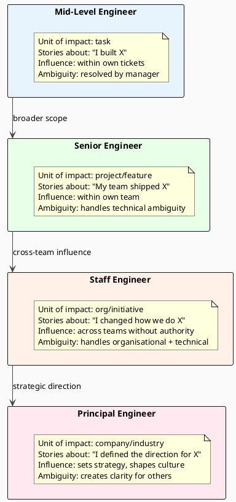

# 19.2 Staff-Level Behavioral Interviews and the STAR Framework

---

## 1. LEARNING OBJECTIVES

By the end of this module you will be able to:

- Identify the five behavioral question patterns that appear specifically at Staff and Principal level and distinguish them from Senior-level behavioral patterns
- Apply the STAR framework with Staff-level emphasis: Actions that demonstrate cross-team influence, Results that include quantified business impact
- Transform a "bug fix" or "feature implementation" story into a Staff-level signal by surfacing the systemic thinking behind it
- Quantify vague impact claims ("improved performance") into specific, defensible metrics ("reduced p99 from 800ms to 120ms, enabling $180k/year in compute savings")
- Deliver a complete, annotated Staff-level STAR answer for the "influence without authority" pattern

---

## 2. PREREQUISITES

| Dependency | Where to find it |
|---|---|
| Understanding of Staff vs Senior scope (breadth of impact, ambiguity tolerance) | Chapter 12 – Engineering Leadership, leveling section |
| Basic STAR framework familiarity | Any general interview prep resource |
| Technical vocabulary for impact quantification | Chapter 17 – Performance Engineering, metrics section |
| SLO/SLI concepts (for quantifying reliability improvements) | Chapter 6.4 – SLO Math and Error Budgets |

---

## 3. THE CRITICAL DIALOGUE

**Student:** I've been doing what I think is Staff-level work for two years. I upgraded the entire data pipeline, I mentored three engineers, I drove adoption of a new framework across the backend team. But when I interview, I get offered Senior roles. The feedback is always "not enough impact."

**Principal:** Tell me your answer to "tell me about a time you influenced a technical decision across teams."

**Student:** Sure. Last year I identified that our event pipeline was using an outdated serialisation format that was causing schema evolution problems. I built a proof of concept with Avro, documented the migration path, presented it to the team, and they adopted it. We migrated four services over six months.

**Principal:** That's a good Senior story. Here's why it reads as Senior and not Staff. You built the thing, you documented it, you presented it. That's execution. What I don't hear: What was the business problem that created urgency? Who was resistant and how did you handle the resistance? What was the organisational decision, not just the technical one? What happened to those four services after migration — what did the migration enable?

**Student:** The business problem was that schema changes were causing downtime. The principal engineer on the platform team pushed back because they didn't want to own Avro Schema Registry. I eventually just did it for them.

**Principal:** Stop there. "I eventually just did it for them" is the Staff-level action you buried. That's the story. You identified a technical problem that affected multiple teams, you met the real objection (ownership cost), and you reduced that cost to zero by absorbing it yourself. The result is that a Principal-level person who was blocking the change aligned with you. That's influence without authority. And you didn't tell me that part at all.

**Student:** I didn't think it was interesting. It just seemed like working around bureaucracy.

**Principal:** That IS the Staff-level work. Senior engineers solve technical problems. Staff engineers solve the organisational problems that block technical solutions. "Working around bureaucracy" is you underselling the most important thing you did.

---

## 4. THEORY + DIAGRAMS

### 4.1 Senior vs Staff — The Behavioral Distinction

The fundamental difference is the unit of impact.



### 4.2 The Five Staff-Level Behavioral Patterns

Interviewers at top companies use these patterns specifically for Staff and above. Preparing a story for each pattern before any interview is non-negotiable.

**Pattern 1 — Influence Without Authority**

> "Tell me about a time you drove a technical change across multiple teams when you had no formal authority over them."

What it tests: Can you align people who don't report to you? Do you understand that at Staff level, most of your impact comes through people you don't manage?

Staff-level signal: The story must show *how* you aligned them — not just that you eventually succeeded. Did you address their real concern (not the stated one)? Did you run a small experiment to de-risk their objection? Did you offer to take on work that removed friction for them?

**Pattern 2 — Technical Decision Under Uncertainty**

> "Tell me about a time you made a significant technical decision without having complete information."

What it tests: Judgment under ambiguity. Can you act when the data is incomplete? Do you build in checkpoints to validate the decision?

Staff-level signal: The story must include: what information was missing, why you couldn't wait for it, what decision criteria you used anyway, and how you validated or revised the decision later.

**Pattern 3 — Disagreed With Direction**

> "Tell me about a time you disagreed with a technical direction taken by someone senior to you."

What it tests: Intellectual honesty and courage. Can you push back professionally without being obstructive? Do you know when to escalate vs when to commit and execute?

Staff-level signal: The story must show the specific reasoning you used to push back, how you made your case (data, framing, building allies), and what the actual outcome was — including if the decision went against you and you executed it anyway.

**Pattern 4 — Identified a Systemic Problem**

> "Tell me about a time you identified a problem that was affecting multiple teams or products, not just your own."

What it tests: Systemic thinking and proactivity. Do you look beyond your immediate scope? When you see a pattern that suggests a broader problem, do you act on it?

Staff-level signal: The story must show how you noticed the pattern (not just your own pain, but a signal across teams), how you validated that it was indeed systemic (not just your team's problem), and what the intervention was at the right level (fixing the root, not each symptom).

**Pattern 5 — Mentoring and Leveling Up Others**

> "Tell me about a time you significantly improved the technical capabilities of engineers around you."

What it tests: Leadership as a force multiplier. At Staff level, your leverage is through other engineers, not just your own output.

Staff-level signal: The story must show deliberate investment in someone else's growth, a specific skill or mindset change you targeted, and a measurable outcome (the engineer took on a harder problem, got promoted, independently solved a problem they previously needed help with).

### 4.3 STAR with Staff-Level Emphasis

The STAR structure (Situation, Task, Action, Result) works for all behavioral questions. Staff-level answers have specific requirements for each section.

```
S — Situation (20% of answer length)
  ✓ Set the business context, not just the technical one
  ✓ State the scale: how many teams, users, or dollars were affected
  ✗ Do NOT: spend this section on technical background the interviewer doesn't need
  
T — Task (10% of answer length)
  ✓ State your specific role: were you the initiator, the technical lead, the mediator?
  ✓ If you had no formal authority, say so explicitly — it makes the story more impressive
  ✗ Do NOT: conflate the task with what you did
  
A — Action (50% of answer length — this is where Staff-level stories live)
  ✓ Show breadth: what did you do that crossed team boundaries?
  ✓ Show the obstacle you had to navigate (human, organisational, technical)
  ✓ Show the specific choices you made and why (not just what you did)
  ✓ Name real people's concerns and how you addressed them
  ✗ Do NOT: list a series of technical steps — that's a Senior-level action section
  
R — Result (20% of answer length)
  ✓ Quantify: latency numbers, cost savings, deployment frequency, incident rate
  ✓ Show breadth of impact: which teams benefited, not just your team
  ✓ Optionally: what you would do differently — shows maturity and learning
  ✗ Do NOT: say "the project was successful" — that's not a result
```

### 4.4 Impact Quantification — The Translation Table

| Vague statement | Staff-level restatement |
|---|---|
| "Improved performance" | "Reduced p99 latency from 800ms to 120ms under the same load profile" |
| "Saved the team time" | "Eliminated ~4 hours/week of manual runbook work per on-call engineer (8 engineers), ~32 engineer-hours/month" |
| "Reduced costs" | "Cut EC2 spend from $18K/month to $11K/month by right-sizing after the migration, saving $84K/year" |
| "The service became more reliable" | "Reduced error rate from 0.3% to 0.02%, moving us from 99.7% to 99.98% availability" |
| "Improved developer productivity" | "Reduced time-to-first-PR for new engineers from 3 weeks to 4 days" |
| "Fewer incidents" | "P1 incident rate dropped from 3/month to 0.5/month in the 6 months after the change" |
| "Enabled the team to move faster" | "Deployment frequency increased from once per week to 15 times per week after CI/CD overhaul" |

If you don't have exact numbers, use reasonable estimates and say so: "I don't have the exact figure, but based on our $2M/year compute budget and the ~15% we freed up, it was in the range of $300K annually."

---

## 5. SOURCE ARCHAEOLOGY

### 5.1 How Companies Evaluate Behavioral Questions at Staff Level

**Amazon Leadership Principles in Staff+ interviews:**
Amazon publishes its Leadership Principles and their bar-raiser documentation. For L7 (Staff equivalent), interviewers evaluate "Invent and Simplify" and "Think Big" at a higher bar. The published guidance states that L7 answers must demonstrate impact at the organisation or business unit level, not just the team level. "Ownership" at L7 means "accountable for multi-team outcomes."

**Google's Behavioural Rubric (from "Software Engineering at Google"):**
The book describes the promotion criteria for L6 (Staff) as explicitly including: "Influences the technical direction of multiple teams" and "creates clarity out of ambiguity." The behavioral questions are designed to find evidence of these behaviours. An L5 (Senior) answer to a behavioral question describes a problem solved. An L6 answer describes how the problem was *identified* and *why it mattered* across the organisation.

**Meta's "Architect" Dimension:**
Meta's interview process for E6 (Staff) includes an explicit "Architect" signal: can you design systems that other teams will use and depend on? The behavioral questions test whether you've done this in the past. "What you've shipped" is less important than "what other people shipped better because of what you did."

### 5.2 The "Regret Minimisation" Pattern in Staff Interviews

Jeff Bezos's "regret minimisation framework" (publicly documented in multiple interviews) is used implicitly in Staff-level behavioral evaluation: the interviewer is asking "will this person make decisions they and the company can live with under uncertainty, or do they paralise?" Staff-level decisions are rarely fully reversible and rarely have complete data. The behavioral question "technical decision under uncertainty" specifically probes whether the candidate has a framework for acting under ambiguity — or whether they avoid decisions until forced.

---

## 6. CODE LAB

### Lab 19.2-A: Full Annotated STAR Answer — "Influence Without Authority"

**Question:** "Tell me about a time you influenced a technical change across teams when you had no formal authority."

**Complete answer:**

---

*Situation:*
"Our platform had four backend services that all independently implemented session management. Each had different expiry logic, different storage backends — two used Redis, one used Postgres, one used in-memory — and different security assumptions. This wasn't causing incidents yet, but when we needed to implement a platform-wide session invalidation feature (for GDPR compliance), I discovered we'd have to implement it four different ways with no guarantee of correctness.

[**Interviewer signal:** Business context (GDPR compliance creates urgency and stakes), scale (four teams), problem identified proactively before an incident]"

*Task:*
"I had no authority over three of the four teams. I was a Staff engineer on the platform team, and the other three were product teams. My manager was supportive but this wasn't on any roadmap.

[**Interviewer signal:** No authority explicitly stated — makes the action section impressive, not just expected]"

*Action:*
"I started by understanding why we had four implementations instead of one. I had one-on-one conversations with the tech leads on each product team. The consistent answer was: 'We evaluated the shared session service two years ago and it was too slow.' That was the real blocker — not stubbornness, a specific past failure.

I pulled the metrics from that old service. It was using synchronous Postgres reads on every request with no caching, and it was doing a full JWT validation on every call. No wonder it was slow. But the concern was legitimate — they'd tried it and it had hurt them.

So instead of presenting 'here's the shared session service we should all use,' I proposed an experiment: one team, one month, with a new implementation that addressed the specific performance concern. I built the new version with Redis-backed caching and async Postgres writes, reducing the read path to a single Redis lookup. I ran load tests before presenting and showed 2ms p99 on the read path — comparable to in-memory. I offered to do the migration work for the first team myself.

One team agreed to the experiment. The other two watched. After 6 weeks with no incidents and measurably better performance than their own implementation, the second team asked to migrate. The third came two months later — they were the most skeptical initially, but they were also the ones who'd been burned hardest by the old service, so once they saw two teams running successfully on it, the social proof outweighed their risk aversion.

I also explicitly addressed the ownership concern: I wrote runbooks, added it to the platform team's on-call rotation, and set up a dedicated Slack channel where any team could ask questions. Removing the fear of being stuck with a broken shared service that no one owned was the key to the third team's buy-in.

[**Interviewer signals:** Found the *real* objection (past bad experience, not stubbornness); addressed it with data (performance benchmarks); reduced risk with an experiment instead of an all-or-nothing proposal; addressed the ownership concern explicitly; showed patience with the social dynamics (third team needed social proof)]"

*Result:*
"All four services migrated over eight months. GDPR session invalidation was implemented once in the shared service and applied to all four in a single afternoon — what would have been 4 separate implementations taking estimated 3 weeks of engineering time. The shared service now handles 120K sessions/sec across the platform and has had zero P1 incidents in 18 months. The teams that were most resistant are now the ones most willing to adopt platform services because they saw we take reliability seriously.

[**Interviewer signals:** Quantified result (120K sessions/sec, 18 months zero P1); business impact framed (GDPR compliance enabled, 3 weeks of work avoided); cultural outcome stated (changed team's willingness to use platform services)]"

---

### Lab 19.2-B: Finding Staff-Level Signals in "Normal" Work

**Example: A senior engineer who spent 6 months fixing flaky tests.**

*Senior framing:*
"I fixed 200 flaky tests in our CI pipeline. The build is now more reliable."

*Staff-level excavation questions:*
- Why were there 200 flaky tests? Was it a tooling problem, a culture problem, a framework problem?
- Did fixing them change how the team writes tests going forward?
- Did other teams have the same problem? Did your solution spread?
- What was the cost of the flakiness (wasted CI minutes, loss of trust in the test suite, false failures blocking deploys)?
- Did fixing this change the deployment frequency or incident rate?

*Staff framing of the same work:*
"Our CI failure rate was 40% — almost half of all builds failed due to flaky tests, not real bugs. I traced the pattern: 80% of flakiness came from integration tests with shared state and timing-dependent assertions. I built a test utilities library that eliminated shared-state patterns and added a linter rule to catch new occurrences. I ran an internal session with all backend teams showing the pattern and the fix. Within 4 months, CI failure rate dropped from 40% to 3%. Deployment frequency increased from 5 deploys/week to 35 deploys/week as engineers stopped manually re-triggering builds. The utilities library is now used by all 6 backend teams."

Same 6 months of work. Completely different scope of story.

---

## 7. PRODUCTION LENS

### Real Behavioral Interview Failure Patterns

**Failure Pattern 1 — The execution trap**
Candidate answers "influence without authority" with: "I wrote a design doc, reviewed it with the teams, and they approved it." This is influence by consent — the teams were already aligned. Real influence-without-authority stories involve a resistant party that changed position because of something specific the candidate did.
Diagnosis: go back to your story and ask "who was resistant, and what was the specific thing I did that changed their mind?"

**Failure Pattern 2 — The humility failure**
Candidate says "we decided to..." and "the team built..." throughout the action section. This is modesty performing as a team player, but it actively harms your interview performance. The interviewer cannot evaluate you if you've erased yourself from the story.
Fix: use "I" for things you personally did; use "we" only for collective decisions. "I built the prototype. I ran the performance benchmarks. I presented to the TLs. The team ultimately decided to proceed."

**Failure Pattern 3 — The no-obstacle story**
Candidate describes a situation where everyone agreed, the work went smoothly, and the outcome was positive. This is a low-signal story. Interviewers specifically look for adversity: a resistant stakeholder, a technical constraint you had to work around, a failure partway through that you recovered from.
Fix: if your story has no obstacle, find a different story. If all your stories have no obstacle, that is useful feedback: either you've been working in environments with too much consensus, or you've been unconsciously editing the friction out of your recollection.

**Failure Pattern 4 — The vague result**
"The migration was successful and everyone was happy with the result." This tells the interviewer nothing. No time bound, no metric, no scope.
Fix: before any interview, write down the quantified result for every story in your list. If you don't have the number, estimate it and say you're estimating: "I don't have the exact figure, but the migration covered 12 services and based on our incident rate before and after, we estimate 6-8 fewer P2 incidents per quarter."

**Failure Pattern 5 — The perfect-in-hindsight story**
Every decision was right, every trade-off was well-considered, there were no mistakes. This is implausible to an experienced interviewer and signals either a lack of self-awareness or a lack of real experience with complexity.
Fix: end every story with one sentence on what you'd do differently. "In hindsight, I would have done the experiment with two teams simultaneously rather than sequentially — it would have cut the total adoption time from 8 months to 5." This signals maturity, not weakness.

---

## 8. EXERCISES

**Exercise 1 — Story mining**
List five projects or initiatives you've been part of in the last two years. For each one, ask these questions and write down the answers:
- What was the business problem, not just the technical one?
- Who was resistant, and what did I do about it?
- What did this enable that wasn't possible before?
- What is the measurable before/after?
Pick the one that most clearly maps to a Staff-level pattern.

**Exercise 2 — Quantification drill**
Take three impact statements from your current resume and transform each one using the quantification table format from Section 4.4. If you don't have the exact number, write an estimate with your reasoning. For each statement, add: which teams were affected beyond your own.

**Exercise 3 — Pattern-to-story mapping**
Map one story from your work history to each of the five Staff-level behavioral patterns. It is acceptable to use the same project for multiple patterns if it genuinely covers them. If you cannot find a story for one of the five patterns, that is a signal about your experience — note it and plan what type of project would fill that gap.

**Exercise 4 — Full STAR rehearsal**
Record yourself (audio is fine) answering this question: "Tell me about a time you disagreed with a technical direction taken by someone senior to you." Time yourself. The answer should be 3–4 minutes. Listen back and score yourself:
- Did you state the business stakes in the Situation? (Y/N)
- Did you name the specific person's objection in the Action? (Y/N)
- Did you quantify the Result? (Y/N)
- Was there an obstacle you had to navigate? (Y/N)
- Did you include what you'd do differently? (Y/N)

**Exercise 5 — The "so what" test**
Take your strongest behavioral story and practice the "so what" test: after every sentence, ask yourself "so what?" If you cannot answer that question — if the sentence has no consequence — cut it. Repeat until every sentence in the story has a clear "so what." This compression exercise typically cuts story length by 30% while making it more impactful.

---

## Exercise Solutions

<details>
<summary>Exercise 1 — Story mining</summary>

**The five excavation questions to apply to each project:**

| Question | What it surfaces | Staff signal if answer is... |
|----------|-----------------|------------------------------|
| What was the **business problem**, not just the technical one? | Can you translate technical work to business impact? | "Checkout abandonment was costing $X/day" not "latency was high" |
| Who was **resistant**, and what did you do about it? | Influence without authority — the core Staff competency | Named person or team, specific objection, your response |
| What did this **enable that wasn't possible before**? | Capability expansion beyond your team | Other teams could now ship faster, a new product became feasible |
| What is the **measurable before/after**? | Quantified impact | Specific metric, specific delta, specific time window |
| Which **teams beyond yours** were affected? | Cross-team scope | 3+ teams affected = strong Staff signal |

**Story classification rubric:**

| Score on questions | Story level |
|-------------------|-------------|
| 2, 3, 4, 5 all answered | Staff-level — tell this one |
| 3 and 4 answered, not 2 and 5 | Senior-level — add cross-team context to upgrade |
| Only 4 answered | Junior-to-mid — execution story, not leadership story |

**Most common finding:** You have Staff-level work buried in Senior-level stories because you're narrating what you built, not who depended on it and what it enabled. The same project can sound Senior or Staff depending on which questions you answer.

**Staff-level phrasing:** "Story mining is not about finding bigger projects — it's about finding the Staff-level angle in the projects you've already done. The influence and breadth are usually there; the narrative just needs to surface them."
</details>

<details>
<summary>Exercise 2 — Quantification drill</summary>

**Three-step transformation for any resume statement:**

**Template:**
`Before: "[vague action or achievement]"`
`After: "[specific metric] [improved/reduced/enabled] from [X] to [Y] ([Z× change]), [how measured], affecting [which teams beyond yours]"`

**Examples:**

Before: "Improved checkout performance"
After: "Reduced checkout p99 latency from 2.3s to 180ms (12.8× improvement) by rewriting N+1 queries to JOIN FETCH — confirmed via Datadog 2-week post-deploy comparison — reducing cart abandonment 12% (Analytics A/B test), affecting the payment, notification, and CDN configuration teams"

Before: "Led migration to microservices"
After: "Led decomposition of the monolithic order service into 6 independently deployable services over 4 months — reducing deploy frequency ceiling from 2/month (coordinated releases) to 14/month (independent), enabling 3 teams to ship without release windows, and cutting deploy-caused incidents from 2/month to 0.3/month (6.7× reduction, Pagerduty data)"

Before: "Mentored junior engineers"
After: "Grew 2 junior engineers to mid-level in 18 months — both now own separate microservices with no supervision. Reduced onboarding time for new engineers from 6 weeks to 3 weeks by writing 4 ADRs and 2 architecture decision guides they now use for self-service decisions"

**When you don't have the exact number:**
"I know deploys went from 2/month to approximately daily — I'd confirm the exact number from our Jira release dashboard before an interview, but the order of magnitude is correct and matches what I remember from the retro."

Estimation with labeling is better than omitting: "~14/month (estimated)" is more credible than "significantly more" and invites a productive follow-up, not skepticism.
</details>

<details>
<summary>Exercise 3 — Pattern-to-story mapping</summary>

**Five Staff-level behavioral patterns with story fit signals:**

| Pattern | Core question it answers | Minimum story requirements |
|---------|-------------------------|---------------------------|
| **Influence without authority** | Can you drive change when no one reports to you? | Named team/person you influenced, their initial position, your mechanism of influence, measurable outcome |
| **Decision under uncertainty** | Can you ship when data is incomplete? | Decision made without full information, explicit acknowledgment of what you didn't know, how you managed the risk, what you learned |
| **Disagreement with senior engineers** | Can you respectfully challenge up? | Named senior person, specific technical disagreement, how you escalated or didn't, outcome either way (you being wrong is fine) |
| **Systemic problem** | Do you fix root causes or symptoms? | Incident or repeated problem → systematic change (tooling, process, architecture) that prevented recurrence |
| **Mentoring with leverage** | Do you multiply engineers? | Specific engineer you grew, what they can now do independently, what you changed about how you transferred knowledge |

**Finding stories for each pattern:**

For "influence without authority": search for moments when you changed another team's decision about their API, their infrastructure, or their process. If you've only ever changed things within your own team's codebase, this pattern may be genuinely absent — that's a signal to seek cross-team initiatives.

For "decision under uncertainty": search for architectural choices you made before all the data was in — choosing a message broker before knowing the exact throughput, or designing a schema before the product requirements were final.

**The gap signal:** If you cannot find a story for one pattern, that is real information. Plan what work would fill it: "I haven't led a cross-team initiative. I should seek out an RFC for a platform change that affects other teams, or volunteer to lead a working group."
</details>

<details>
<summary>Exercise 4 — Full STAR rehearsal</summary>

**Scoring guide for "Tell me about a time you disagreed with a technical direction taken by someone senior to you":**

| Scoring criterion | Why it matters | Upgrade if missing |
|------------------|---------------|-------------------|
| **Business stakes in Situation** | "I disagreed with the architecture" is vague. "The architecture decision affected our SLA for 3M users" is specific — it tells the interviewer why the disagreement mattered | Add: "This decision would have [specific consequence] for [specific users/teams/product]" |
| **Specific technical objection** | "I disagreed with their approach" is Senior. "I was concerned that [mechanism X] would cause [specific failure mode Y]" is Staff — it shows technical depth | Replace vague disagreement with: "My specific concern was [mechanism]" |
| **Quantified result** | "Things improved" leaves the interviewer guessing at impact | Add the metric: "p99 dropped from X to Y" or "reduced incidents from N to M/month" |
| **Obstacle navigated** | A story with no setback is not a Staff story — it's too smooth | Add where the first attempt failed or where the senior person initially didn't change their position |
| **What you'd do differently** | Shows growth beyond the event | Add: "In hindsight I would [specific different action] because [mechanism] — I learned this from [subsequent event]" |

**Time distribution for a 3-4 minute answer:**
- Situation (business context + people involved): **30-45 seconds**
- Task (what you needed to achieve): **15-20 seconds**
- Action (how you navigated the disagreement): **2-2.5 minutes** — this is where Staff shows
- Result (quantified, cross-team): **30-45 seconds**

**Common failure mode:** Spending 90 seconds on Situation ("Let me give you context about our team and our tech stack and what we were building...") and 30 seconds on Action. The interview evaluates Action — everything before it is setup.
</details>

<details>
<summary>Exercise 5 — The "so what" test</summary>

**Step-by-step compression example:**

**Before (8 sentences, unfocused):**
"I was working on the payment service in Q3 2023. We had a problem with high latency. I noticed that we were making N+1 queries to the database. I analyzed the query logs and found 50 DB calls per payment request. I wrote a fix using JOIN FETCH and rewrote three queries. I coordinated the deploy with the ops team. I deployed it. Latency improved."

**Applying "so what?" to each sentence:**

1. "I was working on the payment service in Q3 2023" → so what? Context for the listener. **Keep, compress to a phrase.**
2. "We had a problem with high latency" → so what? How bad? Unknown. **Cut — fold into sentence 4.**
3. "I noticed N+1 queries" → so what? This is the finding. **Keep, fold into sentence 4.**
4. "50 DB calls per payment request" → so what? This caused the latency. **Keep — this is the key diagnostic fact.**
5. "Rewrote 3 queries with JOIN FETCH" → so what? This is the fix. **Keep, compress.**
6. "Coordinated with ops team" → so what? No consequence stated. **Cut** unless it was difficult coordination worth mentioning.
7. "I deployed it" → so what? **Cut — assumed.**
8. "Latency improved" → so what? By how much? Unknown. **Must quantify or cut.**

**After (3 sentences, 30% shorter, more impact):**
"In the payment service, 50 DB queries per payment request were causing p99 latency of 2.3s — users were abandoning checkout at 4% higher than baseline. I traced it to N+1 queries in the order-lookup path and rewrote 3 HQL queries with JOIN FETCH, reducing DB calls to 2 per request. p99 dropped to 180ms within 24 hours of deployment, recovering the full 4% abandonment gap as confirmed by our analytics A/B comparison over two weeks."

**The 30% compression rule:** If your story is 4 minutes, "so what?" analysis typically gets it to 2.5 minutes while making it more impactful. The sentences you cut were setup or filler — they felt necessary to you (you lived through them) but add no information value for the interviewer.

**Staff-level phrasing:** "The 'so what' test is how you find out if your story is a narrative or a sequence of events. A sequence of events has no arc — it just stops. A narrative has consequence at every step, and the listener never loses track of why it matters."
</details>

---

## 9. SUMMARY / FLASHCARD

- **Staff behavioral patterns are about influence, not execution:** the five patterns (influence without authority, decision under uncertainty, disagreement, systemic problem, mentoring) all test whether you can create impact beyond your direct authority — this is the core Staff-level competency.
- **STAR with Staff emphasis:** Situation needs business context and scale; Action must show how you navigated a resistant party or organisational obstacle, not just what you built; Result must be quantified with numbers and show cross-team breadth.
- **Excavate your "normal" work:** the systemic thinking, cross-team influence, and measurable impact of Staff-level work is often hidden inside stories framed as "I just fixed a bug" — the Staff-level signal is in why the problem existed, who else was affected, and what changed permanently.
- **Quantification is non-negotiable:** "improved performance" is a Senior-level result; "reduced p99 from 800ms to 120ms, enabling $180k/year in compute savings" is a Staff-level result — numbers give interviewers concrete evidence and signal operational depth.
- **Obstacles and mistakes signal credibility:** a story where everything went smoothly and everyone agreed is low-signal; a story with a resistant stakeholder whose mind you changed, or a decision that was partly wrong and that you corrected, is high-signal because it demonstrates real operational experience.
