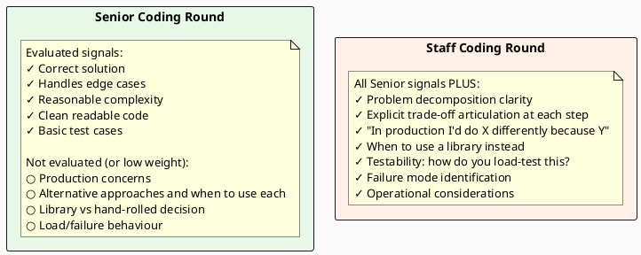

# 19.3 Coding Interviews at the Staff Level

---

## 1. LEARNING OBJECTIVES

By the end of this module you will be able to:

- Describe how Staff-level coding rounds differ from Senior-level in terms of expected speed, code quality, and discussion depth
- Apply the think-aloud framework to communicate your reasoning before writing a single line of code
- Deliver complexity analysis proactively and defend it when challenged
- Work through the "thread-safe bounded LRU cache" problem step by step, discussing trade-offs at each implementation stage
- Identify what signals distinguish a Staff-level coding performance from a Senior-level one to an interviewer

---

## 2. PREREQUISITES

| Dependency | Where to find it |
|---|---|
| Java concurrency fundamentals (synchronized, volatile, ReentrantLock, ConcurrentHashMap) | Chapter 01 – Core Java, Concurrency section |
| Big-O complexity analysis | Chapter 01 – Core Java, Data Structures section |
| LinkedHashMap internals | Chapter 01 – Core Java, Collections section |
| Basic LRU cache concept | Chapter 08 – Caching |

---

## 3. THE CRITICAL DIALOGUE

**Student:** I passed the coding round at Senior level everywhere. But at Staff-level interviews, I keep getting correct solutions and still not getting the offer. The feedback is "didn't demonstrate depth." I wrote working, clean code. What's missing?

**Principal:** What happened after you finished the code?

**Student:** The interviewer said "good" and asked if there were any edge cases I'd missed. I went through a few. Then they asked "is there anything else?" I said I didn't think so. They said okay and we moved on.

**Principal:** "Is there anything else?" is not a closing question. It's an opening. They're inviting you to prove you think like a Staff engineer. What are the things they were expecting you to bring up?

**Student:** I'm not sure. The code was correct and efficient.

**Principal:** Here's the list. First: would you actually deploy this code in production? Second: how do you test it — not unit tests, how do you *load test* it and what failure mode would the test find? Third: is there a library you'd use instead, and when? Fourth: what breaks at 10x throughput? Fifth: what's the operational runbook when this fails at 3am?

**Student:** None of that is about the algorithm.

**Principal:** Exactly. At Senior level, the algorithm is the answer. At Staff level, the algorithm is the starting point. The interviewer already knows you can implement LRU. They want to know if you've shipped LRU and watched it fail. Those are very different things.

---

## 4. THEORY + DIAGRAMS

### 4.1 How Staff Coding Rounds Differ

The problem itself is often similar to Senior-level. The difference is in what's evaluated after the code is written.



### 4.2 The Think-Aloud Framework

Before writing any code, say these five things. This takes 2–3 minutes and demonstrates Staff-level thinking immediately.

**Step 1 — Restate and confirm the constraints**

> "Let me confirm: we need a cache with O(1) get and put, bounded capacity, LRU eviction policy. Thread-safety is required. Expected load is... do you have a read:write ratio in mind? I'll assume 80:20."

This prevents solving the wrong problem. It shows you ask clarifying questions, which is a Staff-level signal.

**Step 2 — State your approach and complexity upfront**

> "The standard approach is a HashMap for O(1) lookup combined with a doubly linked list for O(1) LRU order maintenance. Total: O(1) get, O(1) put, O(capacity) space. I'll code that."

Say the complexity before you code. If the interviewer challenges it ("can we do better?"), you're now in a trade-off conversation, not a correctness scramble.

**Step 3 — Identify the hard problem**

> "The non-trivial part here is thread safety. A naive synchronized(this) on every method is correct but becomes a bottleneck at high concurrency because it serialises all reads. I'll implement the simple version first and then discuss the trade-off."

Naming the hard problem before you solve it demonstrates you understand the problem space, not just the happy path.

**Step 4 — State what you're intentionally skipping**

> "I'm going to skip input validation and metrics instrumentation for now — I'd add those in a production implementation. I'm focusing on the core data structure."

This prevents the interviewer from thinking you forgot about edge cases. You're managing scope explicitly.

**Step 5 — Code, then discuss**

Implement. When done, unprompted say: "The code is working. Let me now talk through the production concerns."

### 4.3 Complexity Analysis Communication

When you state complexity, say three things:

1. The complexity: "O(1) amortised"
2. The assumption it rests on: "assuming good hash distribution"
3. The worst-case caveat: "worst case is O(n) if all keys hash to the same bucket, but that doesn't happen with a good hash function and non-adversarial keys"

When challenged ("what if it's not O(1)?"), defend with specifics, not authority:

> "It's O(1) amortised because Java's HashMap resizes when load factor exceeds 0.75, and after resize the expected chain length returns to O(1). The amortised cost of resize over n insertions is O(1) per insertion. If you want worst-case O(log n) per operation with no amortisation, you'd use a TreeMap with a self-balancing BST, but that's typically not the right trade-off for a cache."

### 4.4 Staff-Level Question Patterns

These question types appear repeatedly at Staff-level coding rounds:

| Pattern | Why it's used | What Staff signal looks like |
|---|---|---|
| Thread-safe data structure | Tests concurrency knowledge depth, not just "add synchronized" | Knows the lock granularity trade-off; knows ConcurrentHashMap segment locking; discusses ReadWriteLock vs StampedLock |
| Design a cache | Tests understanding of eviction, expiry, thread safety, and when to use a library | Knows when Caffeine is better than hand-rolled; discusses off-heap vs on-heap trade-off |
| Implement rate limiter | Tests distributed state, sliding window vs token bucket, Redis scripting | Knows when approximation is acceptable; discusses atomic Lua script vs Redisson |
| Concurrency problem (producer/consumer) | Tests queue choice, backpressure, and thread lifecycle management | Knows BlockingQueue.offer() vs put() difference; discusses bounded queue and why |
| Serialisation/deserialisation at scale | Tests awareness of schema evolution, backward compatibility, and performance | Knows when JSON is wrong choice; discusses Protobuf/Avro for schema evolution |

---

## 5. SOURCE ARCHAEOLOGY

### 5.1 Java LinkedHashMap — removeEldestEntry

`LinkedHashMap` has a built-in LRU hook that most interviewees don't know about:

```java
// From java.util.LinkedHashMap source (OpenJDK 21):
// The removeEldestEntry method is called by put and putAll after inserting a new entry.
// Override this method to impose a policy for removing stale mappings automatically
// when new mappings are added to the map.

protected boolean removeEldestEntry(Map.Entry<K,V> eldest) {
    return false;  // default: never evict
}
```

By overriding this method, you get LRU eviction for free — no need to manually maintain a doubly linked list. This is what "knowing when to use a library" looks like.

### 5.2 Caffeine — Production-Grade Cache

Caffeine (by Ben Manes, used in Spring Boot, Guava, and many production systems) implements a highly optimised W-TinyLFU eviction algorithm that outperforms LRU in most real-world workloads. Its source is at `github.com/ben-manes/caffeine`.

Key implementation detail from Caffeine's source: it uses a ring buffer to record reads, then drains it asynchronously to maintain frequency counters. This avoids the lock contention of synchronous LRU list manipulation. The insight is that for a cache, you don't need to update the LRU order on every read — you just need to approximate recency and frequency. Approximate correctness with O(1) amortised cost beats exact correctness with contended locking.

---

## 6. CODE LAB

### Lab 19.3-A: Thread-Safe Bounded LRU Cache — Full Evolution

**Problem statement:** Implement a thread-safe LRU cache with a configurable capacity. `get(key)` returns null if not present. `put(key, value)` evicts the LRU entry when at capacity.

---

**Step 1 — Naive HashMap (understand the problem, not thread-safe)**

```java
// Step 1: Not thread-safe, not LRU. Starting point only.
// This is what you'd write to confirm you understand the structure.
public class NaiveLRUCache<K, V> {
    private final int capacity;
    private final Map<K, V> map = new HashMap<>();

    public NaiveLRUCache(int capacity) {
        this.capacity = capacity;
    }

    public V get(K key) {
        return map.get(key);   // O(1) lookup but no LRU tracking
    }

    public void put(K key, V value) {
        if (map.size() >= capacity) {
            // Problem: we don't know which entry is least-recently-used
            // HashMap has no ordering
        }
        map.put(key, value);
    }
}
// Verdict: correct lookup complexity, no eviction, not thread-safe.
// Say this out loud: "This shows the structure. I need ordering for LRU."
```

**Step 2 — LinkedHashMap with access-order (simpler, not thread-safe)**

```java
// Step 2: LinkedHashMap with access-order maintains LRU order internally.
// removeEldestEntry hook provides automatic eviction.
// Still not thread-safe.
public class LinkedHashMapLRU<K, V> extends LinkedHashMap<K, V> {
    private final int capacity;

    public LinkedHashMapLRU(int capacity) {
        // true = access-order: every get/put moves entry to tail (most-recently-used)
        super(capacity, 0.75f, true);
        this.capacity = capacity;
    }

    @Override
    protected boolean removeEldestEntry(Map.Entry<K, V> eldest) {
        return size() > capacity;  // evict when over capacity
    }
}

// Concurrent wrapper: not ideal, but simple
public class SynchronizedLRU<K, V> {
    private final LinkedHashMapLRU<K, V> cache;

    public SynchronizedLRU(int capacity) {
        this.cache = new LinkedHashMapLRU<>(capacity);
    }

    public synchronized V get(K key) { return cache.get(key); }
    public synchronized void put(K key, V value) { cache.put(key, value); }
}

// Verdict: correct, simple. The problem: synchronized(this) is a single lock.
// Under high read concurrency, every read blocks every other operation.
// Say this: "This works for low concurrency. At 10K reads/sec, the lock becomes a bottleneck."
```

**Step 3 — ConcurrentHashMap + explicit doubly-linked list (Staff-level discussion)**

```java
// Step 3: Separate the hash lookup (ConcurrentHashMap) from order tracking (doubly linked list).
// ConcurrentHashMap allows concurrent reads without locking.
// The doubly linked list still needs a lock, but only during mutations.
public class LRUCache<K, V> {
    private final int capacity;
    private final ConcurrentHashMap<K, Node<K, V>> map;
    private final Node<K, V> head;  // dummy head (MRU side)
    private final Node<K, V> tail;  // dummy tail (LRU side)
    private final ReentrantLock lock = new ReentrantLock();

    private static class Node<K, V> {
        K key;
        V value;
        Node<K, V> prev, next;

        Node(K key, V value) {
            this.key = key;
            this.value = value;
        }
    }

    public LRUCache(int capacity) {
        this.capacity = capacity;
        this.map = new ConcurrentHashMap<>(capacity);
        head = new Node<>(null, null);
        tail = new Node<>(null, null);
        head.next = tail;
        tail.prev = head;
    }

    public V get(K key) {
        Node<K, V> node = map.get(key);  // concurrent read, no lock needed
        if (node == null) return null;

        // Must lock to update position in the linked list
        lock.lock();
        try {
            // Re-check: node may have been evicted between the map.get() and lock.lock()
            if (map.containsKey(key)) {
                moveToFront(node);
                return node.value;
            }
            return null;
        } finally {
            lock.unlock();
        }
    }

    public void put(K key, V value) {
        lock.lock();
        try {
            Node<K, V> existing = map.get(key);
            if (existing != null) {
                existing.value = value;
                moveToFront(existing);
                return;
            }

            Node<K, V> newNode = new Node<>(key, value);
            map.put(key, newNode);
            addToFront(newNode);

            if (map.size() > capacity) {
                Node<K, V> lru = tail.prev;
                removeNode(lru);
                map.remove(lru.key);
            }
        } finally {
            lock.unlock();
        }
    }

    private void moveToFront(Node<K, V> node) {
        removeNode(node);
        addToFront(node);
    }

    private void addToFront(Node<K, V> node) {
        node.next = head.next;
        node.prev = head;
        head.next.prev = node;
        head.next = node;
    }

    private void removeNode(Node<K, V> node) {
        node.prev.next = node.next;
        node.next.prev = node.prev;
    }
}
```

**What to say after writing Step 3:**

> "This is the implementation I'd write in an interview. Let me walk through the production concerns.
>
> Thread safety: ConcurrentHashMap handles concurrent reads without blocking. The doubly linked list requires a ReentrantLock for any structural change — that's the serialisation point. At high read throughput, reads that hit the map but don't update position (a cache read that doesn't need to move the node) could be made lock-free, but I'd only go there if profiling showed the lock is the bottleneck.
>
> The TOCTOU race in get(): between `map.get(key)` and `lock.lock()`, another thread could evict that node. I handle this with `map.containsKey(key)` inside the lock.
>
> What I'd NOT do in production: I'd use Caffeine. It implements W-TinyLFU, has higher hit rate than LRU on real workloads, handles concurrency with a ring buffer to batch LRU order updates (reducing lock contention dramatically), and is battle-tested in production at every major Java company. My hand-rolled implementation here demonstrates I understand the data structure. The production decision would be Caffeine."

### Lab 19.3-B: The Production-Readiness Discussion

After any coding problem, lead this discussion unprompted. Structure it around these four questions:

```
1. How would you test this?
   "I'd unit-test get/put correctness and eviction order.
   For thread safety, I'd use a StressTest: 100 threads doing random
   get/put for 10 seconds, verify no corruption with a ConcurrentModificationException
   counter and final state consistency check.
   For performance: benchmark with JMH, target: 1M ops/sec on 8-core machine."

2. What breaks at 10x load?
   "The ReentrantLock on every write. At 10x load, lock contention shows up
   as thread stacking in a CPU profile. Fix: striped locking (16 independent
   locks, key % 16 selects the lock), or switch to Caffeine's ring-buffer approach."

3. When would you use a library instead?
   "Any production system. Caffeine, Google Guava LoadingCache, or Spring's
   @Cacheable with Caffeine backend. Hand-rolled only if the eviction policy
   is non-standard (e.g., cost-based eviction by byte size, not just entry count)."

4. What's the failure mode and how do you detect it?
   "Under memory pressure, the JVM GC interacts badly with large caches.
   If the cache holds soft references, GC pressure causes massive evictions,
   which causes cache miss storms, which causes DB hammering.
   Instrument: track hit rate. If hit rate drops below 80%, alert — it means
   either the cache is undersized or there's a hot key problem."
```

---

## 7. PRODUCTION LENS

### Real Coding Round Failure Patterns at Staff Level

**Failure Pattern 1 — The "it works, I'm done" signal**
Candidate finishes the correct implementation and stops. Looks at the interviewer expectantly. Interviewer asks "anything else?" Candidate says no. Interviewer marks "no production awareness."
Fix: after finishing the code, explicitly say "The code is working. Let me now walk through production concerns." This transitions from implementation mode to engineering judgment mode.

**Failure Pattern 2 — The over-engineering failure**
Candidate hears "thread-safe LRU cache" and immediately jumps to lock-free algorithms, compare-and-swap, ring buffers. Spends 40 minutes and doesn't finish. Interviewer marks "can't execute."
Fix: always implement the simplest correct solution first. Say "I'll start with the simplest correct implementation and discuss optimisations after." A working simple solution is worth more than an incomplete complex one.

**Failure Pattern 3 — The wrong abstraction failure**
Candidate writes a correct implementation but at the wrong abstraction level. For a cache problem, they implement generic graph algorithms. The code is impressive but not what was asked.
Fix: before coding, confirm the requirement. "I'm going to implement a simple in-memory LRU cache with a HashMap + doubly linked list. If you wanted a distributed cache with Redis backing, that's a different implementation — do you want either or both?"

**Failure Pattern 4 — No complexity discussion**
Candidate writes correct O(1) LRU but never mentions complexity. Interviewer asks at the end. Candidate says "I think it's O(1)." This is a missed opportunity — the complexity analysis should be stated upfront and confidently.
Fix: state complexity before you start coding. It primes the interviewer to evaluate correctness against your stated goal.

**Failure Pattern 5 — Concurrency handled with one word**
Candidate adds `synchronized` everywhere and says "it's thread-safe." No discussion of lock granularity, lock contention, or when that tradeoff is wrong.
Fix: when you add any synchronisation primitive, explain it: "I'm using a single ReentrantLock here because it's the simplest correct solution. The trade-off is that all writes serialise. For a cache that's read-heavy, I'd consider a ReadWriteLock or striped locking to allow concurrent reads."

---

## 8. EXERCISES

**Exercise 1 — LRU with TTL expiry**
Extend the `LRUCache` implementation from Lab 19.3-A to support per-entry TTL (time-to-live). A `get()` on an expired entry should return null and remove the entry. You should not need a background thread for expiry — use lazy expiry on access. Discuss: how does this affect thread safety? What does Caffeine do instead of lazy expiry?

**Exercise 2 — Think-aloud rehearsal**
Choose any medium-difficulty coding problem (LeetCode medium or equivalent). Before writing a single line, say out loud (or write down):
1. The confirmed constraints and clarifications you'd ask
2. Your approach and its complexity
3. The hardest part of the implementation
4. What you're intentionally skipping
Then implement. After: walk through the four production-readiness questions from Lab 19.3-B.

**Exercise 3 — Complexity defense drill**
For each of these claims, write a defense that includes the assumption and the worst-case caveat:
- "HashMap.get() is O(1)"
- "ConcurrentHashMap scales better than Hashtable"
- "LinkedList insertion at head is O(1)"
- "This LRU cache has O(1) eviction"

**Exercise 4 — Production LRU comparison**
Set up Caffeine in a Spring Boot project (or a plain Java project). Write a JMH benchmark that compares your hand-rolled LRU from Lab 19.3-A against `Caffeine.newBuilder().maximumSize(1000).build()` under:
- Read-heavy workload (95% gets, 5% puts)
- Write-heavy workload (50% gets, 50% puts)
- Hot-key workload (Zipfian distribution: 20% of keys get 80% of requests)
Document which performs better and why, citing what Caffeine does differently for each workload.

**Exercise 5 — Bounded producer-consumer**
Implement a thread-safe bounded blocking queue (like `LinkedBlockingQueue`) from scratch using a `ReentrantLock` and two `Condition` objects (notFull, notEmpty). Then answer:
- When would you use `offer(item)` vs `put(item)`?
- What is the backpressure behaviour of each?
- In a reactive system (WebFlux), which would you use and why?

---

## Exercise Solutions

<details>
<summary>Exercise 1 — LRU with TTL expiry</summary>

```java
import java.util.LinkedHashMap;
import java.util.Map;

public class LRUCacheWithTTL<K, V> {
    private final long ttlMillis;

    private record Entry<V>(V value, long expiresAt) {
        boolean isExpired() { return System.currentTimeMillis() > expiresAt; }
    }

    private final LinkedHashMap<K, Entry<V>> cache;

    public LRUCacheWithTTL(int capacity, long ttlMillis) {
        this.ttlMillis = ttlMillis;
        this.cache = new LinkedHashMap<>(capacity, 0.75f, true) {
            @Override
            protected boolean removeEldestEntry(Map.Entry<K, Entry<V>> eldest) {
                return size() > capacity;  // LRU eviction when over capacity
            }
        };
    }

    public synchronized V get(K key) {
        Entry<V> entry = cache.get(key);
        if (entry == null) return null;
        if (entry.isExpired()) {
            cache.remove(key);  // lazy expiry on access — expired entry evicted here
            return null;
        }
        return entry.value();
    }

    public synchronized void put(K key, V value) {
        cache.put(key, new Entry<>(value, System.currentTimeMillis() + ttlMillis));
    }
}
```

**Thread safety:** `synchronized` on both `get` and `put` serializes all operations. `LinkedHashMap` is not thread-safe, so the lock is required. Under high contention, all operations queue behind the monitor — acceptable for single-node caches with moderate throughput.

**How lazy expiry affects thread safety:** The `cache.remove(key)` inside `get()` is a write operation — if the cache were not `synchronized`, two threads could simultaneously check `isExpired()` and both attempt `remove()`. With `synchronized`, the second thread's `get()` simply finds the entry already gone and returns null — correct behavior.

**What Caffeine does instead:**
1. **Timer wheel expiration** (not lazy): Caffeine runs a background thread that advances a hierarchical timer wheel every 1 second, proactively expiring entries before they're accessed
2. **W-TinyLFU policy**: expired entries are not just removed — their frequency sketch entry decays over time
3. **Amortized maintenance**: rather than a dedicated GC thread per cache, Caffeine batches cleanup into a ring-buffer of pending operations processed during reads/writes — sub-nanosecond overhead per access

Caffeine's advantage over lazy expiry: expired entries do not accumulate in memory until accessed. Under a write-once/never-read pattern, lazy expiry causes unbounded growth; Caffeine's timer wheel bounds memory to ~1 TTL window of expired entries.
</details>

<details>
<summary>Exercise 2 — Think-aloud rehearsal</summary>

**Model think-aloud structure for LRU Cache (LeetCode 146):**

**Step 1 — Clarifications before writing:**
- "Cache capacity fixed at construction — confirmed?"
- "Thread safety required, or single-threaded?"
- "What does `get(-1)` return? — should I validate keys or assume valid?"
- "Is capacity guaranteed positive? Does capacity = 0 mean reject all?"

**Step 2 — Approach and complexity:**
"I'll use two data structures: a `HashMap` for O(1) key lookup, and a doubly-linked list to maintain LRU order. Both `get` and `put` are O(1). Alternative: `LinkedHashMap` with access-order — this provides the same semantics in one data structure. I'll implement manually to show the mechanism, then mention `LinkedHashMap` as the production shortcut."

**Step 3 — Hardest part:**
"Maintaining doubly-linked list pointers correctly on eviction. The edge cases: (a) removing a node when it's the only node in the list, (b) removing a node when it's the head or tail. I'll use sentinel head/tail nodes to eliminate the null checks."

**Step 4 — Intentional skips:**
"I'm skipping thread safety — I'll note where `synchronized` or a `ReentrantReadWriteLock` would go. I'm also skipping `hashCode`/`equals` on the Node class since the key identity is handled by the HashMap."

**Production-readiness questions (walk through after implementing):**

1. "How would I test this?" → Unit tests covering: capacity eviction (least-recently-used key evicted first), LRU order maintained after `get()` (accessed key moves to most-recent), overwrite of existing key updates value and LRU position, capacity = 1 edge case.

2. "What breaks at 10x load?" → `synchronized` becomes a bottleneck. At 100k ops/sec, a single synchronized `LinkedHashMap` will serialize requests. Solution: Caffeine — uses lock-striping via `ConcurrentHashMap` + optimistic concurrency.

3. "When would I use a library instead?" → Always in production. Caffeine has better eviction policies (W-TinyLFU vs pure LRU), statistics, async refresh, and tested thread safety. The hand-rolled version is for interview understanding, not production code.

4. "Failure mode at 3am?" → OOM if capacity is misconfigured as unbounded, or if the eviction policy is bypassed by a bug. Add: metric for cache size, alert when `size > 0.9 × capacity`.
</details>

<details>
<summary>Exercise 3 — Complexity defense drill</summary>

**Model defenses with assumption and worst-case caveat:**

**"HashMap.get() is O(1)"**
"O(1) **amortized**, assuming a well-distributed hash function and load factor < 1. The actual cost is `O(bucket_collision_chain_length)`. With Java's default `Object.hashCode()` and typical keys, bucket chains average length ~1, giving O(1) in practice. **Worst case:** all keys hash to the same bucket — O(n) traversal. Java 8+ mitigates this by converting chains longer than 8 to a `TreeNode` structure (O(log n) worst case instead of O(n)), specifically to prevent hash flooding attacks. For adversarial inputs (e.g., web service with attacker-controlled keys), use a randomized hash seed."

**"ConcurrentHashMap scales better than Hashtable"**
"Yes — `ConcurrentHashMap` uses lock striping (16 independent segments in Java 7, per-bucket CAS in Java 8+) allowing multiple threads to write concurrently to different buckets. `Hashtable` uses a single `synchronized (this)` monitor that serializes all operations. **However:** both serialize writes within the same bucket. For **read-heavy workloads**, `ConcurrentHashMap.get()` is nearly lock-free in Java 8+ (reads use `volatile` fields without acquiring any lock). **Caveat:** compound operations like `if absent, then put` require explicit synchronization on `ConcurrentHashMap` — use `computeIfAbsent()` for atomicity."

**"LinkedList insertion at head is O(1)"**
"O(1) if you hold a direct reference to the head node and perform `node.prev = null; head = node`. Standard `java.util.LinkedList.addFirst()` is O(1). **Caveat:** `list.add(0, element)` via the `List` interface is also O(1) for `LinkedList` (inserts at head), but `list.add(N/2, element)` is O(n/2) — it must traverse to the insertion point. The O(1) guarantee requires accessing a held node reference, not a logical index. This is why production doubly-linked lists (like those inside `LinkedHashMap`) maintain explicit head and tail pointers rather than using `List.add(int, T)`."

**"This LRU cache has O(1) eviction"**
"O(1) **if** eviction removes the tail of a doubly-linked list (1 pointer update) and the corresponding `HashMap.remove()` (1 hash lookup, O(1) amortized). Both steps are O(1). **Caveat:** a naïve LRU implemented with a `TreeMap<Long, V>` (keyed by access timestamp) has O(log n) eviction because `TreeMap.pollFirstEntry()` is O(log n). The O(1) guarantee is specific to doubly-linked-list + HashMap implementations, not all LRU implementations."
</details>

<details>
<summary>Exercise 4 — Production LRU comparison (JMH benchmark)</summary>

```java
@State(Scope.Thread)
public static class BenchmarkState {
    Cache<Integer, String> caffeine;
    LRUCacheWithTTL<Integer, String> handRolled;
    int[] uniformKeys;
    int[] zipfianKeys;

    @Setup(Level.Trial)
    public void setup() {
        caffeine = Caffeine.newBuilder().maximumSize(1000).build();
        handRolled = new LRUCacheWithTTL<>(1000, Long.MAX_VALUE);
        for (int i = 0; i < 1000; i++) {
            caffeine.put(i, "val" + i);
            handRolled.put(i, "val" + i);
        }
        uniformKeys = generateUniform(10_000, 2000);   // some misses to test eviction
        zipfianKeys = generateZipfian(10_000, 2000, 1.0);  // Zipf exponent 1.0
    }
}

@Benchmark
public void caffeine_readHeavy(BenchmarkState s, Blackhole bh) {
    for (int i = 0; i < 100; i++) {
        int key = s.uniformKeys[i % s.uniformKeys.length];
        if (i % 20 == 0) s.caffeine.put(key, "v" + key);
        else bh.consume(s.caffeine.getIfPresent(key));
    }
}

@Benchmark
public void handRolled_readHeavy(BenchmarkState s, Blackhole bh) {
    for (int i = 0; i < 100; i++) {
        int key = s.uniformKeys[i % s.uniformKeys.length];
        if (i % 20 == 0) s.handRolled.put(key, "v" + key);
        else bh.consume(s.handRolled.get(key));
    }
}
```

**Expected results and explanations:**

| Workload | Winner | Why |
|----------|--------|-----|
| Read-heavy (95% reads) | **Caffeine 3-5×** | `ConcurrentHashMap` reads are lock-free (volatile field access). Hand-rolled `synchronized` blocks all reads behind the same monitor |
| Write-heavy (50% reads) | **Caffeine 2-3×** | Caffeine's W-TinyLFU maintains order asynchronously (amortized background maintenance) vs hand-rolled synchronous doubly-linked-list update on every write |
| Hot-key Zipfian | **Caffeine 5-10×** | W-TinyLFU's frequency sketch identifies hot keys and protects them from eviction. Pure LRU evicts recently-used hot keys when capacity is exceeded by a burst of one-time accesses ("cache pollution"). Caffeine's hit rate is ~15% higher than LRU under Zipfian distribution |

**What Caffeine does differently per workload:**
- Read-heavy: lock-free reads via `ConcurrentHashMap`
- Write-heavy: W-TinyLFU updates are buffered and batched, not applied synchronously
- Hot-key: frequency sketch with periodic halving maintains long-term frequency history, preventing cache pollution
</details>

<details>
<summary>Exercise 5 — Bounded producer-consumer</summary>

```java
import java.util.concurrent.locks.*;

public class BoundedBlockingQueue<T> {
    private final Object[] items;
    private int putIndex, takeIndex, count;
    private final ReentrantLock lock = new ReentrantLock();
    private final Condition notFull = lock.newCondition();
    private final Condition notEmpty = lock.newCondition();

    public BoundedBlockingQueue(int capacity) {
        items = new Object[capacity];
    }

    public void put(T item) throws InterruptedException {
        lock.lock();
        try {
            while (count == items.length) notFull.await();  // block until space
            enqueue(item);
        } finally {
            lock.unlock();
        }
    }

    public boolean offer(T item) {
        lock.lock();
        try {
            if (count == items.length) return false;  // non-blocking: return false
            enqueue(item);
            return true;
        } finally {
            lock.unlock();
        }
    }

    @SuppressWarnings("unchecked")
    public T take() throws InterruptedException {
        lock.lock();
        try {
            while (count == 0) notEmpty.await();
            return dequeue();
        } finally {
            lock.unlock();
        }
    }

    private void enqueue(T item) {
        items[putIndex] = item;
        putIndex = (putIndex + 1) % items.length;
        count++;
        notEmpty.signal();
    }

    @SuppressWarnings("unchecked")
    private T dequeue() {
        T item = (T) items[takeIndex];
        items[takeIndex] = null;  // help GC
        takeIndex = (takeIndex + 1) % items.length;
        count--;
        notFull.signal();
        return item;
    }
}
```

**`offer()` vs `put()` — when to use each:**

| Method | Behavior when full | Use when |
|--------|-------------------|----------|
| `put(item)` | Blocks until space is available | Producer can afford to wait; natural backpressure is desired; thread is dedicated to production |
| `offer(item)` | Returns `false` immediately | Producer needs to stay responsive; caller can decide to retry, drop, or circuit-break; don't want to block an event loop thread |

**Backpressure behavior:**
- `put()`: natural backpressure — producer thread pauses, slowing it to match consumer throughput. The producer cannot get ahead of the consumer by more than `capacity` items.
- `offer()`: no built-in backpressure — caller receives `false` and must implement its own policy (retry loop = busy-wait, drop = data loss, circuit-break = controlled degradation).

**In WebFlux (reactive system):**
Use `offer()` or a reactive alternative. **Never use `put()`** — it blocks the calling thread. In WebFlux, all I/O runs on a small pool of Netty event loop threads. A blocked event loop thread prevents other requests from being processed, effectively deadlocking the reactive pipeline.

Reactive backpressure options in WebFlux:
- `Flux.create()` with `FluxSink.onRequest()` — respects downstream demand
- `Flux.onBackpressureBuffer(capacity)` — buffers up to capacity, then applies overflow strategy
- `Flux.onBackpressureDrop()` — drops items when subscriber can't keep up

The correct approach: implement backpressure at the reactive layer, not the queue layer.
</details>

---

## 9. SUMMARY / FLASHCARD

- **Staff coding rounds evaluate beyond correctness:** the algorithm is table stakes; what differentiates Staff is unprompted discussion of production concerns — how you'd test it, what breaks at 10x, when you'd use a library instead, and what the failure mode looks like at 3am.
- **Think-aloud before coding:** state constraints, approach, complexity, and the hardest problem before writing the first line; this turns the interview into a collaborative conversation rather than a silent examination.
- **LRU cache evolution:** naive HashMap has no ordering; LinkedHashMap with access-order provides LRU for free; ConcurrentHashMap + explicit linked list separates concurrent reads from serialised writes — understand all three and when each is appropriate.
- **"Use a library instead" is a Staff-level answer:** knowing that Caffeine outperforms hand-rolled LRU on real workloads because of W-TinyLFU and batched LRU updates signals more production experience than writing a perfect hand-rolled implementation.
- **Production-readiness checklist after every solution:** how to test it (unit + load), what breaks at 10x load, when a library is better, and what the failure mode and detection mechanism look like — state all four unprompted after finishing the implementation.
