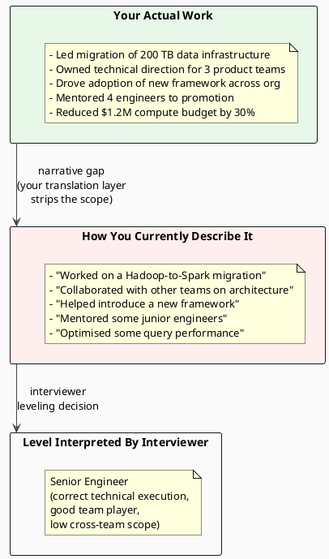

# 19.4 The Staff Engineer Narrative

---

## 1. LEARNING OBJECTIVES

By the end of this module you will be able to:

- Deliver a 90-second self-introduction that positions you as a Staff engineer before the first technical question is asked
- Identify Staff-level signals in your own work history using five diagnostic questions
- Transform a Senior-framed project story into a Staff-framed story without adding or fabricating experience
- Talk about professional failure in a way that increases interviewer confidence rather than raising red flags
- Write a two-sentence resume summary that communicates scope, scale, and technical depth
- Diagnose why doing Staff-level work does not automatically result in Staff-level offers, and close the narrative gap

---

## 2. PREREQUISITES

| Dependency | Where to find it |
|---|---|
| Staff vs Senior scope definition | Chapter 12 – Engineering Leadership, leveling section |
| STAR framework and Staff-level behavioral patterns | Chapter 19.2 – Staff-Level Behavioral STAR |
| Impact quantification | Chapter 19.2 – Staff-Level Behavioral STAR, Section 4.4 |
| System design framework | Chapter 19.1 – System Design Framework |

---

## 3. THE CRITICAL DIALOGUE

**Student:** I've been doing Staff-level work for two years at a Series B company. I led the migration of our entire data infrastructure, owned the technical direction for three teams, mentored four engineers who all got promoted. But every offer I get is at Senior level. I just had another one come back at Senior this week. I'm starting to think the market just doesn't recognise what I do.

**Principal:** The market recognised what you do — it recognised it as Senior. That's not a market failure, it's a communication failure. Specifically yours.

**Student:** That's harsh.

**Principal:** It's accurate. The work you described — data infrastructure migration, owned technical direction, four promotions in your team — that's Staff-level work. But the interview is not the work. The interview is a performance of the work. And right now, you're performing at Senior level even though you're working at Staff level. Let me guess what your intro sounds like. "Hi, I'm [name], I've been at [company] for 3 years, I work on the data platform team, recently I led a migration from Hadoop to Spark, and I'm looking for a Staff role."

**Student:** That's pretty close, yes.

**Principal:** In that intro, you described what you did. You never told me the scale you operated at, the business impact of the migration, who depended on your decisions, or what you own going forward. The interviewer heard "technical lead on a migration project." A Staff engineer would say something like: "I own the technical direction for the data infrastructure that processes $X billion in transactions for three product teams. I led the migration from Hadoop to Spark — that's 40 engineers' workflows, 200 TB of data, and a $1.2M annual compute budget — while simultaneously leveling up four engineers who are now leading their own initiatives. I'm looking to bring that same kind of cross-functional ownership to a larger organisation."

**Student:** I feel like I'm bragging.

**Principal:** You're confusing bragging with positioning. Bragging is claiming more than you did. Positioning is making sure the interviewer has the correct context to evaluate what you actually did. If you understate your scope and they offer you Senior, that's not humility — that's a category error that costs you title, compensation, and career trajectory. The company you're joining deserves to know what level of leader they're getting. Help them get it right.

---

## 4. THEORY + DIAGRAMS

### 4.1 The Narrative Gap

The narrative gap is the distance between the level of work you do and the level of work you communicate in an interview. Most engineers doing Staff-level work understate themselves because:

1. They mistake humility for underselling scope
2. They describe *what they built*, not *why it mattered* or *what it enabled*
3. They attribute organisational outcomes to "the team" without claiming personal ownership of the decision
4. They don't have practice articulating their work at the right altitude



### 4.2 The 90-Second Introduction Framework

The intro is the frame for everything else. If you frame yourself as Senior in the intro, the interviewer evaluates all subsequent answers through a Senior lens. Get the frame right at the start.

**Structure:**

```
Sentence 1: Your current scope (not your current role)
  "I own [system/initiative] that [business impact at scale]."

Sentence 2: What you've done recently that demonstrates Staff-level breadth
  "Most recently I [cross-team initiative] which [measurable outcome]."

Sentence 3: What you shaped, not just what you built
  "Beyond the code, I've [influenced direction / defined standards / leveled up team]."

Sentence 4: What you're looking for
  "I'm looking to [bring this scope to / expand this to] a [larger/different] context."
```

**Before (Senior framing):**

> "Hi, I'm Jana. I've been at FinTech Co for 3 years, working on the backend data platform. I recently led a migration from our old Hadoop-based pipeline to Spark, which was a big project. I managed the technical side and worked with a few other teams. I'm looking for a Staff role now."

**After (Staff framing):**

> "I own the data infrastructure that processes every transaction and analytics event for our main product — about $2 billion in annual transaction volume, 40 engineers depending on it daily. My most recent initiative was leading a full migration from Hadoop to Spark: 200 TB of data, two quarters of execution, zero production incidents during cutover. The migration also reduced our annual compute bill by $360K and unblocked three product teams who were waiting on data pipeline throughput. Beyond the execution, I've built the technical standards for how we write data pipelines — standards that four engineers now use independently. I'm looking for a company where that kind of ownership spans a larger technical surface area."

Same 3 years, same work. Completely different frame.

### 4.3 Identifying Staff-Level Signals in Your Own Experience

Use these five diagnostic questions on any project you've been part of:

**Question 1: Who depended on your decisions?**
- Senior answer: "my team"
- Staff signal: "two other product teams that consumed the API I defined" or "the 8 engineers on-call who used the runbook I wrote"

**Question 2: What wouldn't have happened without you?**
- Senior answer: "the feature would have been delayed"
- Staff signal: "the GDPR compliance deadline would have been missed, exposing the company to regulatory risk" or "the three teams waiting on the data migration would have remained blocked for another quarter"

**Question 3: What did you change that is still in place?**
- Senior answer: "I fixed the bug"
- Staff signal: "I introduced a linting rule and test template that prevents the class of bug from reappearing — it's been 18 months and it hasn't recurred"

**Question 4: What technical direction did you set, not just execute?**
- Senior answer: "I built it according to the design doc"
- Staff signal: "I wrote the design doc and had it approved, and three months later two other teams built their systems to the same standard because I wrote it to be reusable"

**Question 5: What measurable outcome did your decision have?**
- Senior answer: "the performance improved"
- Staff signal: "latency dropped from 400ms to 60ms p99, which unblocked the mobile team from shipping the feature they'd been waiting on — that feature drove 15% of the quarter's new signups"

### 4.4 Senior Story → Staff Story Transformation

**Project:** "I migrated the authentication service from a custom JWT implementation to Auth0."

**Senior version:**

> "I evaluated Auth0, built a proof-of-concept integration, documented the migration plan, and executed the migration over 6 weeks. The new system is more secure and requires less maintenance from the team."

**Staff story excavation questions:**
- Why did this migration happen? Was there a security incident? A compliance requirement? A maintenance burden that was blocking something?
- How many other services depended on the auth service? Did the migration affect them?
- Who was skeptical of the migration and why? How did you address that?
- What did "more secure" mean in measurable terms?
- What does the team no longer have to do because of this migration? How much time does that free up?

**Staff version of the same work:**

> "Our custom JWT implementation had accumulated 3 years of security-adjacent technical debt: non-standard token rotation, no refresh token revocation, and no support for enterprise SSO — which was blocking a sales deal worth $400K ARR. I made the case to leadership that the engineering maintenance cost (estimated 0.5 FTE per year patching and extending it) plus the sales blocker justified migrating to Auth0. The push-back was from the platform team who worried about vendor lock-in and operational dependency on an external service. I addressed that by writing an adapter interface between our services and the auth layer — if we ever needed to swap Auth0, the interface was the only change point. I also built the migration tooling so that the 12 downstream services could migrate independently on their own timeline without a big-bang cutover. Six months later, 11 of 12 services have migrated. The sales deal closed, we've reclaimed the 0.5 FTE maintenance effort, and we haven't had a security incident in the auth layer since. The 12th service is delayed due to unrelated team priorities."

Notice what was added: business context (sales deal), the real objection (vendor lock-in), how it was addressed (adapter interface), the mechanism for adoption (independent migration tooling), and a complete result including the one service that hasn't finished.

### 4.5 Talking About Failure Productively

Every Staff-level interview will contain a question about failure. "Tell me about a time something went wrong" or "tell me about your biggest mistake." This question is not a trap — it is a direct evaluation of self-awareness and learning orientation.

**What interviewers are testing:**
1. Do you take ownership without making excuses?
2. Do you learn and change behaviour after failures?
3. Is your self-assessment credible? (wildly minimising OR wildly catastrophising are both red flags)
4. Have you operated at a scale where failure has real consequences?

**The structure that works:**

```
1. State the failure directly. No hedging.
   "I shipped a database migration that caused 45 minutes of downtime."
   Not: "We had an incident that was partly related to a change I was involved in."

2. Take ownership of your specific contribution.
   "My decision to run the migration during business hours without a rollback plan
   was the proximate cause."
   Note: do NOT blame others, even if they were also at fault.

3. State the impact honestly.
   "It cost us approximately 10K in SLA credits and generated 3 customer escalations."

4. What you learned — specifically.
   "I learned that migration plans need a time-bounded rollback trigger: if the
   migration hasn't completed in X minutes, roll back automatically. I also learned
   to never execute database migrations during business hours regardless of estimated
   time."

5. What you changed — demonstrably.
   "I wrote a migration checklist that's now standard practice for the team. In the
   18 months since, we've run 7 migrations with zero incidents."
```

**What the "what I changed" sentence signals:** You don't just learn in the abstract — you convert learning into systematic change. That's a Staff-level behaviour.

### 4.6 Researching a Target Company

Before any interview, invest 2 hours in targeted research. This pays dividends in the system design and behavioral rounds.

**Layer 1 — Engineering blog**
Search `[company] engineering blog` or check `engineering.[company].com`. Look for:
- What scale do they operate at? (DAU, RPS, data volume)
- What hard technical problems have they publicly solved?
- What technology choices have they made and why?
- What patterns appear repeatedly? (observability, distributed systems, ML infra)

**Layer 2 — Job description archaeology**
Read the Staff/Principal JD carefully. Look for:
- What technical systems are called out explicitly? These are production systems, not aspirational.
- What non-technical signals appear? ("partner with product," "define the technical roadmap") — these tell you how the company thinks about Staff.
- What are the must-haves vs nice-to-haves?

**Layer 3 — Levels.fyi and blind**
Search for the company + role. Look for:
- What questions were asked in the design round?
- What calibration signals did successful candidates report?
- What gaps caused rejections?

**Layer 4 — LinkedIn — your interviewers**
If you know your interviewers (many companies tell you in advance), look at their engineering background. What systems have they worked on? Their experience shapes which design choices they'll find interesting.

### 4.7 The Staff-Level Resume Summary

The resume summary is your written 90-second intro. Two sentences maximum. Every word must carry weight.

**Structure:**
- Sentence 1: Scope + scale + technical domain
- Sentence 2: What you uniquely bring + what you're seeking

**Before (generic):**

> "Senior Software Engineer with 7 years of experience in Java and distributed systems. Strong background in microservices architecture and team leadership."

**After (Staff-level):**

> "Staff-level backend engineer who has defined and executed the technical direction for transaction-processing infrastructure handling $2B in annual volume across 3 product teams, driving a 40% reduction in latency and $360K in annual compute savings."
>
> "I drive consensus on hard architectural decisions across team boundaries and build the platforms and standards that let smaller teams move faster — looking to bring that scope to a company scaling from Series C to IPO."

The second summary tells an interviewer: scope (infrastructure), scale ($2B, 3 teams), evidence (40% latency, $360K savings), how you work (consensus, platforms, standards), and what you want (growth stage company). That's 2 sentences doing the work of 10.

---

## 5. SOURCE ARCHAEOLOGY

### 5.1 The "Staff Engineer" Level Definition in Practice

**Will Larson's "Staff Engineer" (O'Reilly, 2021):**
The most cited resource on Staff engineering. Larson identifies four archetypes: Tech Lead, Architect, Solver, Right Hand. The key observation relevant to interviews: each archetype has different primary impact mechanisms. A Tech Lead's impact is through team execution. An Architect's impact is through technical direction that other teams adopt. A Solver's impact is through solving problems nobody else can. The Right Hand's impact is through organisational leverage.

Interviewers at Staff-level don't always know which archetype they're hiring for. Your job is to identify which archetype the role needs (usually evident in the JD and company stage) and frame your stories accordingly.

**Tanya Reilly's "The Staff Engineer's Path" (O'Reilly, 2022):**
Reilly's concept of "the big picture" is directly relevant to interview preparation. She argues that Staff engineers must have context that individual contributors don't — business priorities, organisational constraints, cross-team dependencies. In an interview, demonstrating this context is what separates Staff answers from Senior answers. When you say "I chose this approach because the other team had a hard deadline and a big-bang migration would have blocked them," you're demonstrating big-picture context.

### 5.2 Why Technical Depth Alone Doesn't Get You to Staff

Patrick Lencioni's "The Five Dysfunctions of a Team" (not technical, but frequently cited by engineering managers) identifies trust and conflict resolution as foundational team functions. The "disagreed with direction" behavioral question is directly testing whether you can navigate constructive conflict — a prerequisite for cross-team influence. Interviewers who have read Lencioni (and many engineering VPs have) are specifically looking for candidates who can push back with data and professionalism, not candidates who either defer or become combative.

---

## 6. CODE LAB

### Lab 19.4-A: Written Self-Introduction Exercise

Write your 90-second introduction using the framework from Section 4.2. Then evaluate it against this rubric:

| Criterion | Present? | If no, add this |
|---|---|---|
| Scale stated (users, volume, or dollar amount) | | "which handles X per day/year" |
| Breadth of impact (teams affected, not just your team) | | "relied on by N teams" |
| A specific measurable outcome | | "reduced X by Y%, saving $Z" |
| What you shaped (not just executed) | | "I defined the standards / owned the direction" |
| What you're looking for (and why this company) | | "I'm looking to bring this scope to..." |

### Lab 19.4-B: Senior → Staff Story Transformation

Take the most significant project from your last two years. Write it out as:

**Version A — Senior framing:**
Write it as you currently tell it. (This takes 5 minutes — just write naturally.)

**Version B — Staff framing:**
Apply the five diagnostic questions from Section 4.3 to find the buried Staff-level signals, then rewrite the story. The content must be identical — you cannot add work that didn't happen. You can only surface what you haven't been saying.

Compare the two versions. The Staff version should:
- Be 30-50% longer in the Action section
- Have a quantified Result
- Name a specific obstacle you navigated
- Show cross-team impact in the Result

### Lab 19.4-C: Resume Summary Rewrite

Rewrite your current resume summary using the two-sentence structure from Section 4.7. Then check:
- Does sentence 1 contain a scale indicator (number, dollar amount, team count)?
- Does sentence 1 contain a technical domain signal?
- Does sentence 1 contain a measurable outcome?
- Does sentence 2 describe how you work, not just what you know?
- Does sentence 2 state what you're looking for?

If any answer is no, revise until all are yes.

### Lab 19.4-D: Company Research Template

Before your next interview, complete this template:

```
Company: [Name]
Stage: [Series X / Public / IPO-track]

From engineering blog:
  Scale: _____ (DAU / RPS / data volume)
  Hard problems they've publicly solved: 
    1. 
    2.
  Technology patterns I see repeatedly:
    1.
    2.

From the JD:
  Technical systems explicitly called out:
    1.
    2.
  Non-technical Staff signals in the JD:
    1.
    2.
  Staff archetype this role needs (Tech Lead / Architect / Solver / Right Hand):

From levels.fyi / blind:
  Common interview questions at this company:
    Design:
    Behavioral:
  What successful candidates said distinguished their interview:
  What gaps caused rejections:

My customised angle for this company:
  Which of my stories maps to their stated hard problems:
  What in my experience is directly relevant to their scale:
```

---

## 7. PRODUCTION LENS

### Real Narrative Gap Patterns

**Pattern 1 — The modesty penalty**
Engineer with genuine Staff-level scope (owned technical direction for 3 teams) consistently describes work as "I helped the team with..." and "we decided to...". Every interviewer evaluates them at Senior. They get frustrated that the market "doesn't see" them.
Root cause: they've been conditioned in a culture that penalises self-promotion, and they've transferred that conditioned behaviour to an interview context where self-promotion is required information. The interviewer cannot telepathically verify your scope — they can only evaluate what you say.
Fix: in preparation, write every story with "I" as the subject of every action sentence. Editing it to "we" where genuinely appropriate is fine in delivery, but force yourself to start from the first-person framing.

**Pattern 2 — The level mismatch (wrong archetype positioning)**
Engineer is a strong Tech Lead archetype: drives execution in their team, technical quality is high, juniors learn from them. They interview at a company that needs an Architect: someone who defines standards adopted by five teams. Their stories are all about team execution. The interviewer marks "not Staff."
Root cause: the engineer has Staff-level skills in one archetype but is interviewing for a role that needs a different archetype. Neither party is wrong.
Fix: before every loop, identify which Staff archetype the role needs. If it doesn't match your primary archetype, either withdraw or be explicit: "My primary impact has been in [Tech Lead] mode, and I'm looking to grow into [Architect] mode — here's why this role is the right vehicle for that."

**Pattern 3 — The narrative-work divergence**
Engineer has been doing Staff-level work but hasn't had the title yet. Their stories are genuinely Staff-level, but they're interviewing at a company that requires candidates to have the title already. This is a real constraint at some companies (especially ones with rigid leveling rubrics).
Fix: target companies that level by demonstrated scope, not by title history. Startups and mid-stage companies (Series B-D) are more willing to level from demonstrated work. Large tech companies (FAANG) level from demonstrated work in the interview, not from previous title.

**Pattern 4 — The failure answer that backfires**
Candidate answers "tell me about a failure" by describing a situation where they were right and everyone else was wrong, and the project failed because others didn't listen. Even if accurate, this answer signals poor self-awareness and inability to operate in complex organisations.
Fix: choose failures where your decision was the proximate cause. Even if others contributed, your answer must focus on what you controlled and changed. An answer that blames others is worse than an answer that exaggerates your fault.

**Pattern 5 — The company-agnostic narrative**
Candidate gives identical answers to every company. No mention of the company's specific technical challenges, scale, or engineering culture. Interviewer senses the candidate hasn't done their homework and may not be genuinely interested.
Fix: in every interview, include one sentence that connects your experience to their specific context: "I saw from your engineering blog post on your cache invalidation work that you're dealing with the same hot-key problem I solved at [company] — here's what we found."

---

## 8. EXERCISES

**Exercise 1 — 90-second intro timed delivery**
Write your Staff-level intro using the framework in Section 4.2. Time yourself delivering it out loud. Target: 80–100 seconds. If under 60 seconds, you're underselling scope. If over 120 seconds, you're not respecting the interviewer's time. Iterate until the timing and content are both right.

**Exercise 2 — Project story inventory**
List every significant project from the last 3 years. For each, apply the five diagnostic questions from Section 4.3. Classify each story as: Staff-level signal (cross-team, measurable, you set direction), Senior-level signal (technical execution, within-team), or needs excavation (you suspect Staff-level work is hidden inside it). The goal: have at least 3 unambiguous Staff-level stories ready.

**Exercise 3 — Failure story preparation**
Write one failure story using the 5-step structure from Section 4.5. The failure must be real, the impact must be stated in concrete terms, and the "what I changed" sentence must describe a systematic change (not "I was more careful"). Test: if an interviewer said "how do I know you actually changed?" could you answer with evidence?

**Exercise 4 — Company research execution**
Pick one company you'd genuinely like to work at. Complete the full company research template from Lab 19.4-D. Then write one sentence explaining specifically why your experience is relevant to their stated technical challenges. This sentence should not appear in your generic interview prep — it should only make sense for this company.

**Exercise 5 — Full mock introduction + Q&A**
Ask a peer, mentor, or senior colleague to do a 20-minute mock interview session. Your task: deliver your 90-second intro, then answer these five questions:
1. Tell me about a time you owned a technical direction across multiple teams.
2. What's a decision you made that you'd make differently today?
3. How do you handle a situation where two senior engineers fundamentally disagree on an architecture?
4. What's the scale of the largest system you've owned?
5. Why Staff at this company specifically?
After: ask for one specific thing you should add and one specific thing you should cut.

---

## Exercise Solutions

<details>
<summary>Exercise 1 — 90-second intro timed delivery</summary>

**The four-element framework:**

| Element | What to include | Senior mistake |
|---------|----------------|---------------|
| **Scope** (what you own) | System, domain, or platform name + what it does | Job title or team name ("I'm on the payments team") |
| **Scale** (how large) | Users, RPS, transaction volume, data size | Architecture details ("we use microservices") |
| **Breadth** (who depended on you) | Number of teams, products, or users that relied on your decisions | Listing technologies ("we use Kafka, PostgreSQL, Redis") |
| **Direction** (not just execution) | "I set the technical direction for…" / "I led the decision to…" | "I built…" / "I implemented…" |

**Model intro (correctly scoped, ~85 seconds):**

"I'm a Staff Engineer at FinCore, where I own the payment processing platform — the infrastructure that handles 50k transactions/second across three regions. My platform is a foundational dependency for eight product teams: every checkout flow the company ships goes through something I'm responsible for. Most recently I drove the migration from synchronous to event-sourced transaction processing, which reduced incident-caused checkout failures from 3/month to 0.1/month over 18 months and enabled two new teams to build on the platform independently. Before that, I led the Kafka migration that decoupled the fraud detection team from our release cycle — they went from deploying every 2 weeks with us to deploying daily on their own."

**Timing check:** Record and measure. Target: 80-100 seconds.
- Under 60 seconds → you're underselling scope (probably cutting the Breadth or Direction elements)
- Over 120 seconds → you're adding implementation details or technology lists (cut those)

**The frame effect:** An interviewer who hears "Staff level scope" in your intro evaluates every subsequent answer with that lens. An interviewer who hears "Senior framing" — even unintentionally — will look for confirmation of the Senior pattern in your stories.
</details>

<details>
<summary>Exercise 2 — Project story inventory</summary>

**Five diagnostic questions applied to each project:**

| Question | What to ask yourself | Staff signal |
|---------|---------------------|-------------|
| Who depended on my decisions? | Not who used my code — who would have been blocked or affected if I got the architecture wrong | "3 teams couldn't ship until I resolved the API contract" |
| What wouldn't have happened without me? | Not "I contributed to X" — "X would have happened on a different timeline or not at all" | "The fraud detection team's real-time capability required the Kafka migration I drove" |
| What did I change that is still in place? | Systems, processes, or norms that outlived my direct involvement | "The schema review process I established is still used for all migrations" |
| What technical direction did I set (rather than execute)? | Did I decide what to build, or did I build what was decided? | "I wrote the RFC that chose gRPC over REST for the internal API" |
| What measurable outcome did my decision have? | Before/after metric, not "it improved" | "Latency dropped from 2.3s to 180ms, confirmed via 2-week A/B test" |

**Story classification:**

- **Staff-level signal**: 3+ questions answered, especially questions 1, 2, 4 — have at least 3 of these
- **Senior-level signal**: Questions 3, 4, 5 answered but not 1 and 2 — add cross-team context to upgrade
- **Needs excavation**: only question 5 partially answered — may have Staff-level work you're not crediting yourself for

**Most common finding from the excavation:** You have Staff-level work in projects you're describing as Senior execution. The upgrade is almost always: add "who depended on this" and "what wouldn't have happened without you" to the Situation — the rest of the STAR story stays the same.
</details>

<details>
<summary>Exercise 3 — Failure story preparation</summary>

**The 5-step failure story structure:**

| Step | What to include | Common gap |
|------|----------------|------------|
| 1. System and stakes | What system, who used it, what would break | Missing: the interviewer needs to know why the failure mattered |
| 2. Your decision and reasoning | What you chose and why you thought it was right | Missing: "we decided" (diffuses responsibility) vs "I decided" (takes ownership) |
| 3. What happened | Concrete failure with measured impact | Missing: specifics — "things got slow" vs "p99 exceeded 10s for 4 hours" |
| 4. Immediate response | What you did, in what order | Missing: the first attempt that didn't work (stories with no setback feel fabricated) |
| 5. Systemic change | What changed permanently to prevent recurrence | Missing: or too vague — "we were more careful" doesn't pass the test |

**The "how do I know you changed?" test for step 5:**

| Fails the test | Passes the test |
|---------------|----------------|
| "I was more careful afterward" | "I added a canary analysis step to the deploy pipeline that blocks if error rate > 0.5% — it's fired 3 times since and caught 2 real regressions" |
| "I communicated better" | "I wrote an ADR mandating that all DB schema changes include a rollback script — this is now enforced in the PR review checklist" |
| "I tested it more thoroughly" | "I added a property-based test for the boundary condition that caused the bug — it's in CI and has caught 2 future mutations via PITest" |
| "I reviewed the code more carefully" | "I wrote an ArchUnit rule that enforces the constraint we violated — the rule runs in CI and has blocked 4 PRs since" |

**Staff-level phrasing:** "The failure story is not a demonstration of humility — it is a demonstration of learning architecture. What you changed permanently is the only thing that distinguishes someone who had an incident from someone who grew from it."
</details>

<details>
<summary>Exercise 4 — Company research execution</summary>

**Full company research template:**

1. **Engineering blog**: Read the 3 most recent posts. What technical problems are they publicly investing in? What choices did they make and why?

2. **Job posting**: For Staff/Principal roles, the "what you'll do" section reveals current pain points. "Drive consistency across services" = they have a platform fragmentation problem. "Own the reliability roadmap" = they have an SRE gap.

3. **Public incidents**: postmortem.io, HackerNews threads, status page history. What failed? What did they learn publicly? This is the most direct signal of real technical challenges.

4. **Scale context**: Crunchbase/LinkedIn for funding stage, team size, and growth rate. A Series B company has different Staff-level problems than a 10,000-person public company.

5. **Your relevance sentence**: "Based on [engineering blog post about their distributed cache invalidation problem], my experience building [specific cache invalidation system at your company] is directly relevant because I've solved [specific sub-problem they mentioned]."

**Evaluating your sentence:**
- Does it reference something specific from their engineering output (not generic like "I like your products")?
- Does it name a specific technical challenge they have?
- Does it connect to a specific experience you have with that exact challenge?
- Would this sentence be wrong for every other company? (If yes, it's company-specific enough.)

**Common failure:** "I'm excited to work on distributed systems at scale at your company." This sentence is true for 50 companies and specific to none of them. It signals that the interview is a box-ticking exercise, not a genuine match.
</details>

<details>
<summary>Exercise 5 — Full mock introduction + Q&A</summary>

**Model responses to the five mock interview questions:**

**Q1: "Tell me about a time you owned a technical direction across multiple teams."**

This is the "influence without authority" pattern. Required elements:
- Named teams (not just "other teams")
- Their initial position (resistance or misalignment)
- Your mechanism of influence (RFC, data, prototype, escalation)
- Measurable outcome with cross-team breadth

Green flag: "I wrote an RFC proposing we standardize on event sourcing for the ledger domain. Three teams had already started separate implementations with different patterns. I ran 4 working sessions with the leads, incorporated their constraints into revision 2, and got all three teams to adopt the same event store interface. 18 months later, all 3 teams ship independently with no cross-team coordination on deploys."

**Q2: "What's a decision you made that you'd make differently today?"**

The failure/growth story. Red flag: humble-brag ("I would have over-communicated even more"). Green flag: genuine technical learning with mechanism:
"I chose random UUID as the primary key for our transaction table to avoid the UUID v1 security issue. Three years and 500M rows later, I discovered this caused severe B-tree fragmentation — index size grew 3× compared to sequential IDs, slowing range queries by 40%. UUID v7 (time-ordered, opaque) was available and would have given me both properties. I didn't know about v7 at the time — if I'd done a day of research before the decision, I would have found it."

**Q3: "How do you handle two senior engineers who fundamentally disagree on architecture?"**

Staff differentiator: you don't pick sides or force consensus.
Framework:
1. Understand both positions technically — "I'd spend 30 minutes with each, separately, getting to the root concern behind the position"
2. Surface the actual disagreement — "Often they agree on the goal but disagree on the failure mode they're most afraid of. Making that explicit removes the personal dimension"
3. Define decision criteria — "I'd write down: what would need to be true for approach A to be right vs approach B? This turns a debate into a measurement question"
4. Time-box experiment if feasible — "If we can prototype one approach in a sprint, that's cheaper than a month of debate"
5. Escalate if the blocker is timeline — "If the real problem is that neither engineer wants to be wrong, that's an engineering manager conversation, not a technical one"

**Q4: "What's the scale of the largest system you've owned?"**

Answer in consistent units: "Xk requests/second, Y total users/services depending on it, Z regions."
If you haven't owned a large system: be honest about your level of ownership and the system's scale separately: "I was a primary contributor to [system] that handled [X], with ownership of [specific component at Y scale]."

**Q5: "Why Staff at this company specifically?"**

Template: "[Specific technical challenge from their engineering blog or job posting] is a problem I've worked on directly. At [your company], I [specific relevant experience]. Based on their [specific recent post / incident], I think I could contribute meaningfully to [specific area] — specifically [one concrete thing you'd bring that they need]."

**What to ask your mock interviewer:**
"What's one specific thing I said that positioned me at Staff level, and one thing that could have sounded Senior?" This is more actionable than generic feedback.
</details>

---

## 9. SUMMARY / FLASHCARD

- **The narrative gap is a communication failure, not a market failure:** doing Staff-level work and interviewing at Senior level means your translation layer is stripping the scope from your stories — the fix is in how you tell the story, not in doing different work.
- **The 90-second intro sets the frame:** state scope (what you own), scale (how large), breadth (who depended on you), and shaped direction (not just executed); an interviewer who hears Senior framing in your intro evaluates every subsequent answer through a Senior lens.
- **Five diagnostic questions to excavate Staff-level signals:** who depended on your decisions, what wouldn't have happened without you, what you changed that is still in place, what technical direction you set rather than executed, and what measurable outcome your decision had.
- **Senior story → Staff story:** the project content is identical; the Staff version adds the business problem that created urgency, the resistant party and how you changed their mind, the cross-team impact, and the quantified before/after result — all of which were true but unstated.
- **Failure answers signal self-awareness:** take direct ownership without blaming others, state the impact in concrete terms, describe what specifically changed in your practice afterward — the "what I changed" sentence is the signal interviewers are actually listening for.
