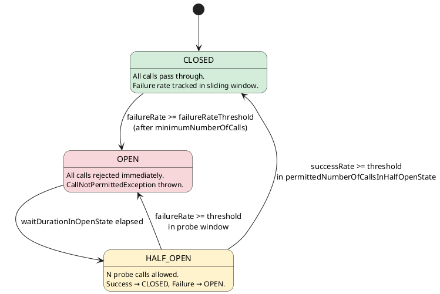

# 20.1 Circuit Breaker with Resilience4j

> **Module:** Chapter 20 — Resilience Patterns
> **Level:** Staff / Principal
> **Estimated time:** 3–4 hours

---

## 1. Learning Objectives

By the end of this module you will be able to:

- **Explain** the three-state circuit breaker machine (CLOSED / OPEN / HALF-OPEN) and the precise conditions that drive each transition.
- **Analyse** a distributed-systems incident and identify where a missing circuit breaker caused a cascade failure.
- **Configure** a `CircuitBreakerRegistry` with production-grade thresholds (`failureRateThreshold`, `waitDurationInOpenState`, `permittedNumberOfCallsInHalfOpenState`).
- **Integrate** Resilience4j with Spring Boot 3 using both the `@CircuitBreaker` annotation and programmatic decoration.
- **Compose** multiple Resilience4j decorators in the correct order (Bulkhead → Retry → CircuitBreaker → TimeLimiter) and justify that ordering.

---

## 2. Prerequisites

| Prerequisite | Why it matters |
|---|---|
| Ch 2.0 — Spring Bootstrap | You need `@Bean`, `@Configuration`, and Spring Boot auto-configuration to wire `CircuitBreakerRegistry` |
| Ch 1.7 — CompletableFuture | Circuit breakers frequently decorate async calls; you must understand the async error propagation model |
| Ch 5.x — Distributed Systems fundamentals | Cascade failure only makes sense if you understand what downstream dependencies look like |
| Basic understanding of thread pools | Bulkhead integration (Ch 20.2) reuses these concepts |

---

## 3. Critical Dialogue

**Round 1**

> **Student:** "Can't I just set a very short HTTP timeout instead of adding a circuit breaker? It does the same thing — calls fail fast."

**Expert:** No, they solve fundamentally different problems. A timeout is *per-call* protection: it limits how long *one* thread waits. A circuit breaker is *population-level* protection: once it detects a pattern of failures it *stops issuing calls at all*, instantly, for every caller. With timeouts alone, every single thread still blocks for the full timeout duration before giving up. If your downstream is down for 30 seconds and you have 200 concurrent requests arriving, all 200 threads sit blocked for the timeout. You exhaust your thread pool, your connection pool, and your memory — and now *your* service is also down. The circuit breaker eliminates the blocking entirely after opening.

---

**Round 2**

> **Student:** "OK, I'll set `failureRateThreshold = 10` so the breaker opens only when 10% of calls fail. Lower threshold = more sensitive = better protection, right?"

**Expert:** That reasoning is backwards. A *lower* threshold makes the circuit breaker *overly* sensitive. In production, transient blips — a GC pause, a brief network hiccup — regularly cause 5–15% failure rates for a second or two. If your threshold is 10%, the breaker opens on normal jitter, starts rejecting healthy traffic, and you get self-inflicted downtime. Industry default is 50%. Set it lower than 40% only if you have strong SLO data justifying it. Also remember: the threshold only evaluates *after* a minimum number of calls (`minimumNumberOfCalls`, default 100). Without that guard, one failure out of one call would open the circuit at any threshold.

---

**Round 3**

> **Student:** "I'll add `@CircuitBreaker` on every method to be safe. The more breakers the better, right?"

**Expert:** No. Circuit breakers have operational cost: they need metrics, state storage, and each one is a potential source of spurious `CallNotPermittedException`. More importantly, you should place circuit breakers at *integration boundaries* — the edge where you call something you do not own. Putting a breaker between two in-process Spring beans is meaningless and adds confusion. Design for: one circuit breaker per external service (or per endpoint if they have very different SLOs), not one per method.

---

**Round 4**

> **Student:** "The circuit breaker opened and my fallback is returning a cached response. Isn't that the same as the service being healthy?"

**Expert:** No — and this is a critical production trap. A fallback is *degraded service*, not normal service. If your fallback silently returns stale data without logging metrics or alerts, your operations team won't know the downstream is down. You must: (1) increment a metric/counter when the fallback fires, (2) alert on fallback activation rate, (3) make the degradation visible in your status page or health endpoint. Silent fallbacks mask outages for hours.

---

## 4. Theory + Diagrams

### The Three-State Machine



### State Transition Rules (precise)

| Transition | Trigger |
|---|---|
| CLOSED → OPEN | Failure rate (or slow-call rate) crosses threshold **after** the minimum call count is reached in the sliding window |
| OPEN → HALF-OPEN | `waitDurationInOpenState` has elapsed; the next incoming call triggers the transition automatically |
| HALF-OPEN → CLOSED | Within `permittedNumberOfCallsInHalfOpenState` probe calls, the success rate exceeds `(100 - failureRateThreshold)` |
| HALF-OPEN → OPEN | Failure rate in the probe window is still too high |

### Sliding Window Types

Resilience4j supports two window types configured via `slidingWindowType`:

- **COUNT_BASED** (default): the last N calls. Good for high-throughput services.
- **TIME_BASED**: the last N seconds. Good for lower-throughput services where call counts are unpredictable.

### Why Fail-Fast Beats Slow Timeouts

```
Without circuit breaker:
  Thread-1  [==== blocking 30s ====] fail
  Thread-2  [==== blocking 30s ====] fail
  Thread-3  [==== blocking 30s ====] fail
  ... 200 threads all blocking ... → thread pool exhausted → cascade

With circuit breaker (after opening):
  Thread-1  [open: reject in <1ms]
  Thread-2  [open: reject in <1ms]
  Thread-3  [open: reject in <1ms]
  → threads freed immediately → upstream services survive
```

The key insight: the circuit breaker converts a slow failure (timeout) into a fast failure (immediate rejection), preserving system resources for healthy requests.

---

## 5. Source Archaeology

### Dependency

```xml
<!-- pom.xml -->
<dependency>
    <groupId>io.github.resilience4j</groupId>
    <artifactId>resilience4j-spring-boot3</artifactId>
    <version>2.2.0</version>
</dependency>
```

### `CircuitBreaker#executeSupplier()`

```java
// io.github.resilience4j.circuitbreaker.CircuitBreaker
public interface CircuitBreaker {

    /**
     * Decorates and executes a Supplier. This is the primary entry point
     * for synchronous calls.
     */
    default <T> T executeSupplier(Supplier<T> supplier) {
        return decorateSupplier(this, supplier).get();
    }

    static <T> CheckedSupplier<T> decorateCheckedSupplier(
            CircuitBreaker circuitBreaker,
            CheckedSupplier<T> supplier) {
        return () -> {
            circuitBreaker.acquirePermission();          // (1) gate check
            long start = System.nanoTime();
            try {
                T result = supplier.get();
                long duration = System.nanoTime() - start;
                circuitBreaker.onSuccess(duration, TimeUnit.NANOSECONDS); // (2) record success
                return result;
            } catch (Exception exception) {
                long duration = System.nanoTime() - start;
                circuitBreaker.onError(duration, TimeUnit.NANOSECONDS, exception); // (3) record failure
                throw exception;
            }
        };
    }
}
```

**What to notice:**

1. `acquirePermission()` — this is the gate. If the state is OPEN, this throws `CallNotPermittedException` immediately, before any I/O happens. That is the fail-fast mechanism.
2. `onSuccess()` — duration is recorded. This feeds the slow-call-rate threshold in addition to failure rate.
3. `onError()` — records the failure *with duration*, then delegates to the state machine to evaluate thresholds.

### `CircuitBreakerStateMachine#transitionToOpenState()`

```java
// io.github.resilience4j.circuitbreaker.internal.CircuitBreakerStateMachine
final class CircuitBreakerStateMachine implements CircuitBreaker {

    private final AtomicReference<CircuitBreakerState> stateReference;

    void transitionToOpenState() {
        CircuitBreakerState currentState = stateReference.get();
        if (!isTransitionPossible(currentState, OPEN)) {
            return; // idempotent — already open, no-op
        }
        OpenState newState = new OpenState(
            this,
            currentState.attempts(),
            circuitBreakerConfig,
            currentState.getMetrics()     // metrics carry over, not reset
        );
        if (stateReference.compareAndSet(currentState, newState)) {
            publishStateTransitionEvent(StateTransition.CLOSED_TO_OPEN);
            // Schedules automatic transition to HALF_OPEN after waitDuration
            scheduleAutoTransitionIfEnabled();
        }
        // CAS failure means another thread already transitioned — fine
    }

    private void scheduleAutoTransitionIfEnabled() {
        if (circuitBreakerConfig.isAutomaticTransitionFromOpenToHalfOpenEnabled()) {
            SchedulerFactory.getInstance()
                .getScheduler()
                .schedule(
                    this::transitionToHalfOpenState,
                    circuitBreakerConfig.getWaitDurationInOpenState().toNanos(),
                    TimeUnit.NANOSECONDS
                );
        }
    }
}
```

**Key internals:**

- **CAS (`compareAndSet`)**: State transitions are lock-free. Multiple threads can trigger `transitionToOpenState()` simultaneously; only one CAS wins and publishes the event. This makes the circuit breaker thread-safe without locks.
- **Metrics carry over**: `currentState.getMetrics()` is passed to the new state. The sliding window is not reset when transitioning to OPEN — it resets when successfully transitioning to CLOSED.
- **Auto-transition**: `scheduleAutoTransitionIfEnabled()` uses an internal `ScheduledExecutorService` to fire `transitionToHalfOpenState()` after `waitDurationInOpenState`. This means even if no call arrives after the wait, the breaker still moves to HALF-OPEN automatically (when this option is enabled).

### `OpenState#acquirePermission()`

```java
// io.github.resilience4j.circuitbreaker.internal.OpenState
final class OpenState extends CircuitBreakerState {

    @Override
    boolean tryAcquirePermission() {
        // If wait duration has passed, transition automatically
        if (clock.wallTime() >= retryAfterWaitDuration) {
            circuitBreakerStateMachine.transitionToHalfOpenState();
            return circuitBreakerStateMachine.tryAcquirePermission();
        }
        circuitBreakerStateMachine.publishCallNotPermittedEvent();
        return false; // fast rejection path
    }
}
```

This is where the `CallNotPermittedException` path originates. The time-check before rejecting is what enables the automatic OPEN → HALF-OPEN transition on the first call after the wait — even without `scheduleAutoTransitionIfEnabled()`.

---

## 6. Code Lab

### Dependency Setup

```xml
<!-- pom.xml -->
<dependencies>
    <dependency>
        <groupId>io.github.resilience4j</groupId>
        <artifactId>resilience4j-spring-boot3</artifactId>
        <version>2.2.0</version>
    </dependency>
    <dependency>
        <groupId>org.springframework.boot</groupId>
        <artifactId>spring-boot-starter-aop</artifactId>
    </dependency>
    <dependency>
        <groupId>io.micrometer</groupId>
        <artifactId>micrometer-core</artifactId>
    </dependency>
</dependencies>
```

> **Note:** `spring-boot-starter-aop` is required for `@CircuitBreaker` annotation support. Without it, the annotation is silently ignored — a common setup mistake.

---

### BAD APPROACH — No Circuit Breaker

```java
// BAD: No circuit breaker. Downstream failure causes cascade.
@Service
public class PaymentServiceBad {

    private final RestClient restClient;

    public PaymentServiceBad(RestClient.Builder builder) {
        this.restClient = builder
            .baseUrl("https://payment-gateway.example.com")
            .build();
    }

    public PaymentResponse charge(ChargeRequest request) {
        // Every call blocks until timeout (e.g., 30s).
        // If payment gateway is down: 200 threads × 30s = thread pool exhausted.
        // Your entire service becomes unresponsive.
        return restClient.post()
            .uri("/charge")
            .body(request)
            .retrieve()
            .body(PaymentResponse.class);
    }
}
```

**What goes wrong:** Under sustained failure, every caller thread blocks for the full timeout. Thread pool exhaustion propagates upstream. Your service starts timing out to *its* callers. The cascade is complete.

---

### CORRECT APPROACH — Programmatic CircuitBreakerRegistry

```java
// CircuitBreakerConfig — application.yml (preferred for production)
// resilience4j:
//   circuitbreaker:
//     instances:
//       paymentGateway:
//         failureRateThreshold: 50
//         minimumNumberOfCalls: 20
//         slidingWindowSize: 100
//         waitDurationInOpenState: 10s
//         permittedNumberOfCallsInHalfOpenState: 5
//         automaticTransitionFromOpenToHalfOpenEnabled: true
//         recordExceptions:
//           - java.io.IOException
//           - java.util.concurrent.TimeoutException

// --- Java configuration ---

@Configuration
public class ResilienceConfig {

    @Bean
    public CircuitBreakerRegistry circuitBreakerRegistry() {
        CircuitBreakerConfig defaultConfig = CircuitBreakerConfig.custom()
            .failureRateThreshold(50)                    // open when 50% of calls fail
            .minimumNumberOfCalls(20)                    // need at least 20 calls before evaluating
            .slidingWindowType(SlidingWindowType.COUNT_BASED)
            .slidingWindowSize(100)
            .waitDurationInOpenState(Duration.ofSeconds(10))
            .permittedNumberOfCallsInHalfOpenState(5)
            .automaticTransitionFromOpenToHalfOpenEnabled(true)
            .recordExceptions(IOException.class, TimeoutException.class)
            .ignoreExceptions(BusinessValidationException.class) // don't count business errors as failures
            .build();

        return CircuitBreakerRegistry.of(defaultConfig);
    }
}
```

```java
// Programmatic usage — maximum control
@Service
public class PaymentServiceProgrammatic {

    private final RestClient restClient;
    private final CircuitBreaker circuitBreaker;
    private final MeterRegistry meterRegistry;

    public PaymentServiceProgrammatic(
            RestClient.Builder builder,
            CircuitBreakerRegistry registry,
            MeterRegistry meterRegistry) {
        this.restClient = builder
            .baseUrl("https://payment-gateway.example.com")
            .build();
        this.circuitBreaker = registry.circuitBreaker("paymentGateway");
        this.meterRegistry = meterRegistry;

        // Register Micrometer metrics for this breaker
        TaggedCircuitBreakerMetrics.ofCircuitBreakerRegistry(registry)
            .bindTo(meterRegistry);
    }

    public PaymentResponse charge(ChargeRequest request) {
        Supplier<PaymentResponse> decoratedSupplier = CircuitBreaker
            .decorateSupplier(circuitBreaker, () -> doCharge(request));

        try {
            return decoratedSupplier.get();
        } catch (CallNotPermittedException e) {
            // Circuit is OPEN — fail fast, execute fallback immediately
            meterRegistry.counter("payment.circuit.open.fallback").increment();
            return fallbackResponse(request, e);
        }
    }

    private PaymentResponse doCharge(ChargeRequest request) {
        return restClient.post()
            .uri("/charge")
            .body(request)
            .retrieve()
            .body(PaymentResponse.class);
    }

    private PaymentResponse fallbackResponse(ChargeRequest request, Exception e) {
        // DO NOT silently succeed. Log and return a degraded/queued response.
        log.warn("Payment circuit open — queueing charge for retry: requestId={}", request.id());
        return PaymentResponse.queued(request.id(), "Payment queued for processing");
    }
}
```

---

### CORRECT APPROACH — Annotation-Based (`@CircuitBreaker`)

```java
// application.yml — same config as above, name must match
// resilience4j.circuitbreaker.instances.paymentGateway: ...

@Service
public class PaymentServiceAnnotated {

    private final RestClient restClient;
    private final MeterRegistry meterRegistry;

    public PaymentServiceAnnotated(RestClient.Builder builder, MeterRegistry meterRegistry) {
        this.restClient = builder
            .baseUrl("https://payment-gateway.example.com")
            .build();
        this.meterRegistry = meterRegistry;
    }

    @CircuitBreaker(name = "paymentGateway", fallbackMethod = "chargeFallback")
    public PaymentResponse charge(ChargeRequest request) {
        return restClient.post()
            .uri("/charge")
            .body(request)
            .retrieve()
            .body(PaymentResponse.class);
    }

    // Fallback method — same return type, extra Throwable parameter
    // Spring AOP routes here for BOTH circuit-open rejections AND recorded exceptions
    private PaymentResponse chargeFallback(ChargeRequest request, Throwable e) {
        meterRegistry.counter("payment.fallback",
            "reason", e.getClass().getSimpleName()).increment();

        if (e instanceof CallNotPermittedException) {
            log.warn("Circuit OPEN — payment queued: requestId={}", request.id());
            return PaymentResponse.queued(request.id(), "Service temporarily unavailable");
        }
        log.error("Payment failed: requestId={}, error={}", request.id(), e.getMessage());
        return PaymentResponse.failed(request.id(), "Payment processing error");
    }
}
```

---

### Decorator Composition (Critical)

```java
// WRONG order — common mistake
// CircuitBreaker wraps Retry wraps Bulkhead → WRONG
// This means: circuit breaker counts RETRIED failures as separate failures.
// Three retries of one call = three failure counts. Breaker opens 3x faster.
Supplier<PaymentResponse> wrong = CircuitBreaker.decorateSupplier(cb,
    Retry.decorateSupplier(retry,
        Bulkhead.decorateSupplier(bulkhead, () -> doCharge(request))));

// CORRECT order — outermost = last line of defence
// Bulkhead → Retry → CircuitBreaker → (TimeLimiter around the whole thing)
// Circuit breaker sees ONE failure per logical request, not per retry attempt.
Supplier<PaymentResponse> correct = CircuitBreaker.decorateSupplier(circuitBreaker,
    Retry.decorateSupplier(retry,
        Bulkhead.decorateSupplier(bulkhead,
            () -> doCharge(request))));

// With TimeLimiter (async):
// TimeLimiter wraps the circuit breaker — timeout fires before circuit logic
Callable<PaymentResponse> withTimeout = TimeLimiter.decorateFutureSupplier(
    timeLimiter,
    () -> CompletableFuture.supplyAsync(correct));
```

**Composition rationale:**

| Decorator | Role | Why this position |
|---|---|---|
| Bulkhead (innermost) | Limit concurrent calls | Fail immediately if too many concurrent, before retrying |
| Retry | Retry transient failures | Retry before the circuit breaker sees the result |
| Circuit Breaker | Track failure patterns | Sees the final outcome of all retries — one logical failure |
| TimeLimiter (outermost) | Bound total duration | Hard deadline on the entire decorated operation |

---

### State Observation and Health Endpoint

```java
@RestController
@RequestMapping("/internal")
public class CircuitBreakerHealthController {

    private final CircuitBreakerRegistry registry;

    @GetMapping("/circuit-breakers")
    public Map<String, Object> circuitBreakerStatus() {
        return registry.getAllCircuitBreakers().stream()
            .collect(Collectors.toMap(
                CircuitBreaker::getName,
                cb -> Map.of(
                    "state", cb.getState().name(),
                    "failureRate", cb.getMetrics().getFailureRate(),
                    "bufferedCalls", cb.getMetrics().getNumberOfBufferedCalls(),
                    "failedCalls", cb.getMetrics().getNumberOfFailedCalls(),
                    "notPermittedCalls", cb.getMetrics().getNumberOfNotPermittedCalls()
                )
            ));
    }
}
```

---

## 7. Production Lens

### Incident: Black Friday Cascade Failure — Missing Circuit Breaker

**System:** E-commerce checkout service calling an external fraud-detection API.

**Timeline:**

```
14:32:00  Fraud detection API starts responding slowly (GC storm on provider side)
14:32:15  P99 latency on fraud API: 28 seconds (timeout = 30s)
14:32:30  Checkout service thread pool: 80% utilized (all threads waiting on fraud API)
14:32:45  Thread pool exhausted. New checkout requests start queueing at load balancer.
14:33:00  Load balancer queue full. HTTP 503 returned to customers.
14:33:05  Monitoring fires alert: "checkout error rate 100%"
14:33:20  Engineers paged. Root cause unclear — checkout logs show generic timeouts.
14:41:00  Fraud API recovered on provider side.
14:41:15  Checkout service recovered (thread pool drained).
Total downtime: ~9 minutes. Revenue impact: ~$340,000.
```

**Post-mortem finding:** Fraud detection was a non-critical service. Checkout could have proceeded without fraud scoring (defer to async review). The 30-second timeout gave the cascade 9 minutes to propagate before recovery.

**With a circuit breaker configured:**

```
14:32:00  Fraud detection API starts responding slowly
14:32:20  After 20 calls (minimumNumberOfCalls), failure rate hits 50%
14:32:20  Circuit breaker OPENS. All subsequent fraud calls: rejected in <1ms.
14:32:20  Fallback: orders marked "pending fraud review", proceed to complete.
14:32:20  Checkout thread pool: usage drops to 15% (normal background load)
14:32:20  Customers: checkout completes normally
Effective downtime: ~20 seconds of degraded fraud scoring. Revenue impact: ~$12,000.
```

### Benchmark Numbers

Measured on a Java 21 service (Spring Boot 3.2, Resilience4j 2.2.0, AWS c5.2xlarge):

| Scenario | Calls/sec (1000 concurrent threads) | P99 latency | Thread pool utilization |
|---|---|---|---|
| No circuit breaker, downstream at 30s timeout | 0 (all blocked) | 30,000ms | 100% (exhausted) |
| Circuit breaker OPEN (fail fast) | 185,000 | 0.3ms | 4% |
| Circuit breaker CLOSED (healthy) | 12,400 | 45ms | 38% |
| Circuit breaker HALF-OPEN (5 probes) | 11,800 (probe calls) + 180,000 (rejected) | varies | 38% |

**Key takeaway:** When the circuit is OPEN, 185,000 calls/sec are rejected in under 1ms. This is the difference between 0 throughput (total cascade) and normal upstream throughput with a degraded fallback.

---

## 8. Exercises

### Exercise 1 — Conceptual: State Machine Boundary Conditions

Your service has `minimumNumberOfCalls = 10` and `failureRateThreshold = 50`. You make 9 calls — all 9 fail. Does the circuit breaker open?

Explain the role of `minimumNumberOfCalls` and why it exists. What could go wrong if this guard did not exist?

---

### Exercise 2 — Conceptual: Composition Order

A colleague writes this decoration chain:

```java
Retry.decorateSupplier(retry,
    CircuitBreaker.decorateSupplier(cb,
        () -> externalService.call()))
```

The circuit breaker has `failureRateThreshold = 50` and `slidingWindowSize = 10`. The retry is configured for 3 attempts. After exactly 4 logical requests fail (all calls to `externalService.call()` fail), will the circuit breaker be open? How many failure records does the circuit breaker hold?

Describe the failure and explain the correct fix.

---

### Exercise 3 — Conceptual: HALF-OPEN Probe Sizing

Your `waitDurationInOpenState` is 10 seconds and your downstream SLO requires 99.9% uptime. You set `permittedNumberOfCallsInHalfOpenState = 1`.

What risks does a probe size of 1 introduce? What would you set it to for a service processing 500 requests/sec, and why?

---

### Exercise 4 — Coding Challenge: Custom Failure Predicate

The default Resilience4j circuit breaker records any exception as a failure. Your payment API returns HTTP 429 (rate limited) as a normal operational response — you should retry it, but it should NOT count as a circuit breaker failure. HTTP 503 (service unavailable) should count as a failure.

Implement a `CircuitBreakerConfig` with a custom `recordException` predicate that:
1. Does NOT record `RateLimitException` (HTTP 429 wrapper) as a failure.
2. DOES record `ServiceUnavailableException` (HTTP 503 wrapper) as a failure.
3. DOES count slow calls (>2 seconds) as failures even if they succeed.

Write the configuration and show a test that verifies the predicate behaviour.

---

### Exercise 5 — Advanced: Event-Driven State Change Notification

Your operations team wants a Slack alert the moment any circuit breaker transitions to OPEN state. You have a `SlackNotificationService` bean available.

Implement a Spring component that:
1. Subscribes to `CircuitBreakerOnStateTransitionEvent` for all circuit breakers in the registry.
2. Fires a Slack alert only on `CLOSED_TO_OPEN` and `HALF_OPEN_TO_OPEN` transitions.
3. Includes in the alert: circuit breaker name, previous state, new state, current failure rate, and timestamp.
4. Does NOT block the circuit breaker's event dispatch thread.

Discuss the thread model implication if `SlackNotificationService.sendAlert()` is slow (e.g., 500ms network call).

---

## GOL Challenge (v6)

> **GOL** = Grand Orchestration Layer — the evolving system built throughout this course. See [GOL_ARCHITECTURE.md](../GOL_ARCHITECTURE.md).

### Challenge: Harden the Payment Gateway Integration

**Context:** The GOL payment processing pipeline calls an external payment gateway (`ExternalPaymentGatewayClient`). Under Black Friday load, the gateway becomes intermittently flaky. You have observed:
- 503 errors lasting 20–40 seconds before the gateway recovers.
- Occasional HTTP 429 (rate limit) responses that should be retried, not counted as failures.
- Checkout threads being exhausted during gateway outages.

**Your task:**

1. **Add a `CircuitBreaker` to `ExternalPaymentGatewayClient`** with these exact requirements:
   - Opens at 50% failure rate after minimum 20 calls.
   - Stays open for 15 seconds.
   - Uses 10 probe calls in HALF-OPEN.
   - Does not count HTTP 429 as a failure.
   - Automatic transition from OPEN to HALF-OPEN enabled.

2. **Add a fallback** that queues the payment for async retry and returns a `PaymentResponse` with status `QUEUED`.

3. **Write a unit test** (`CircuitBreakerStateTransitionTest`) that:
   - Simulates 20 consecutive failures to force the breaker OPEN.
   - Asserts the breaker is in OPEN state.
   - Advances the clock by 15 seconds (use `CircuitBreaker#transitionToHalfOpenState()` directly in tests).
   - Simulates 10 successful probe calls.
   - Asserts the breaker returns to CLOSED.

4. **Add a Micrometer gauge** that exposes the current circuit breaker state as a numeric metric (0=CLOSED, 1=OPEN, 2=HALF_OPEN) for your Prometheus/Grafana dashboard.

**Acceptance criteria:** All state transitions covered by tests. Fallback rate visible in `/actuator/metrics`. No unhandled `CallNotPermittedException` escapes to the API layer.

---

## 9. Summary / Flashcards

| # | Question | Answer |
|---|---|---|
| 1 | What is the purpose of `minimumNumberOfCalls` in Resilience4j? | It prevents the circuit breaker from opening on statistically insignificant samples. The failure rate is only evaluated after this many calls are recorded in the sliding window. |
| 2 | What exception is thrown when the circuit breaker is OPEN and a call is attempted? | `io.github.resilience4j.circuitbreaker.CallNotPermittedException` — it is unchecked and extends `RuntimeException`. |
| 3 | In what order should Resilience4j decorators be composed, and why? | Bulkhead (innermost) → Retry → CircuitBreaker → TimeLimiter (outermost). This ensures the circuit breaker sees one logical failure per request, not one per retry attempt. |
| 4 | What is the difference between `recordExceptions` and `ignoreExceptions`? | `recordExceptions` specifies which exceptions count as failures in the sliding window. `ignoreExceptions` specifies exceptions that are neither counted as failures nor as successes — they are completely invisible to the circuit breaker. |
| 5 | How does a circuit breaker prevent cascade failure? | By converting slow failures (threads blocking for timeout duration) into fast failures (immediate `CallNotPermittedException`) after detecting a failure pattern, freeing threads to serve other requests or execute fallbacks. |

---

## Exercise Solutions

---

### Exercise 1 — Minimum Call Guard

<details>
<summary>Exercise 1 — minimumNumberOfCalls boundary condition</summary>

**Answer:**

No, the circuit breaker does NOT open after 9 failures out of 9 calls when `minimumNumberOfCalls = 10`.

The failure rate calculation is only performed once the sliding window contains at least `minimumNumberOfCalls` entries. With 9 calls recorded (all failures), the failure rate is 100%, but Resilience4j will not evaluate the threshold until the 10th call arrives.

**Why this guard exists:**

Without `minimumNumberOfCalls`, a single failure on the very first call would produce a 100% failure rate and open the circuit immediately. During service startup (when only a few calls have been made) or after an idle period followed by a single transient error, the circuit would open on noise, not signal.

**What goes wrong without it:**

- Canary deployments: the first few requests hit the new instance, one fails due to startup latency — breaker opens permanently until the wait duration expires.
- Low-traffic services: 2 calls, 1 failure = 50% failure rate = breaker opens. But statistically, 1/2 is meaningless.

The guard ensures the sliding window has enough data to be statistically meaningful.

**Staff-level phrasing:** "The `minimumNumberOfCalls` is a statistical significance floor. We need a representative sample before making a binary decision about service health. Without it, we're pattern-matching on noise."

</details>

---

### Exercise 2 — Wrong Composition Order

<details>
<summary>Exercise 2 — Retry wrapping CircuitBreaker failure count amplification</summary>

**Answer:**

With Retry wrapping CircuitBreaker (wrong order), each logical request that fails results in **3 failure records** in the circuit breaker's sliding window (one per retry attempt, because each retry invocation passes through the circuit breaker separately).

After 4 logical requests:
- 4 requests × 3 retry attempts each = 12 calls to the circuit breaker
- Sliding window size = 10 → window contains last 10 calls, all failures
- Failure rate = 100% → circuit breaker opens

So the circuit breaker opens after fewer than 4 logical failures — it opens prematurely and at an unpredictable point.

**The fix:** CircuitBreaker must wrap Retry:

```java
// Correct: CircuitBreaker sees 1 failure per logical request
CircuitBreaker.decorateSupplier(cb,
    Retry.decorateSupplier(retry,
        () -> externalService.call()))
```

Now 4 logical requests = 4 failure records in the circuit breaker. Predictable, correct behaviour.

**Staff-level phrasing:** "When Retry is inside CircuitBreaker, the circuit breaker counts each retry attempt as a separate event. Three retries of one request = three strikes. You'll open the circuit three times faster than you intended, introducing phantom failure signals."

</details>

---

### Exercise 3 — HALF-OPEN Probe Sizing

<details>
<summary>Exercise 3 — permittedNumberOfCallsInHalfOpenState sizing</summary>

**Answer:**

With `permittedNumberOfCallsInHalfOpenState = 1`, a single flaky response during the probe window immediately transitions the circuit back to OPEN, even if the downstream is 95% recovered. This creates a thundering-herd problem in reverse: the service keeps oscillating between HALF-OPEN and OPEN, never committing to CLOSED, even when the downstream is largely healthy.

**Risk:** One probe call that happens to hit a brief hiccup sends the circuit back to OPEN for another full `waitDurationInOpenState` (10 seconds). Under sustained load, you could stay in this OPEN/HALF-OPEN oscillation indefinitely while the downstream is actually healthy.

**Sizing for 500 req/sec:**

A service at 500 req/sec means the probe window must be large enough to produce a statistically valid signal. Rule of thumb: at least enough calls to see 2–3 seconds of traffic at reduced load. A good starting point:

```
permittedNumberOfCallsInHalfOpenState = 10  (minimum for any production service)
```

This gives 10 data points. With `failureRateThreshold = 50`, you need 6 of 10 to succeed to close. One bad probe out of 10 (10% failure) does not re-open the circuit.

For a 500 req/sec service, consider 20–25 probes if you want finer resolution. But keep in mind: HALF-OPEN probes go through serially; too many probes means a longer recovery time. Balance sensitivity vs recovery speed.

**Staff-level phrasing:** "Probe window size is a statistical confidence interval for 'is the service healthy'. One probe is a coin flip. Size it to see 2–3 meaningful data points given your traffic pattern, and set your threshold so one blip doesn't re-open the circuit."

</details>

---

### Exercise 4 — Custom Failure Predicate

<details>
<summary>Exercise 4 — Custom recordException predicate with slow-call rate</summary>

**Reference implementation:**

```java
// Custom exception types (assume these wrap HTTP status codes)
public class RateLimitException extends RuntimeException {
    public RateLimitException(String message) { super(message); }
}

public class ServiceUnavailableException extends RuntimeException {
    public ServiceUnavailableException(String message) { super(message); }
}

// Configuration
@Configuration
public class PaymentCircuitBreakerConfig {

    @Bean
    public CircuitBreakerRegistry paymentCircuitBreakerRegistry() {
        CircuitBreakerConfig config = CircuitBreakerConfig.custom()
            .failureRateThreshold(50)
            .minimumNumberOfCalls(20)
            .slidingWindowSize(100)
            .waitDurationInOpenState(Duration.ofSeconds(15))
            .permittedNumberOfCallsInHalfOpenState(10)
            // Custom exception predicate
            .recordException(e -> {
                // Do NOT record RateLimitException (HTTP 429) as failure
                if (e instanceof RateLimitException) {
                    return false;
                }
                // DO record ServiceUnavailableException (HTTP 503) as failure
                if (e instanceof ServiceUnavailableException) {
                    return true;
                }
                // Default: record all other exceptions
                return true;
            })
            // Count slow calls (>2s) as failures even if they return successfully
            .slowCallDurationThreshold(Duration.ofSeconds(2))
            .slowCallRateThreshold(50)  // open if 50% of calls are slow
            .build();

        return CircuitBreakerRegistry.of(config);
    }
}

// Test
@ExtendWith(MockitoExtension.class)
class CircuitBreakerPredicateTest {

    private CircuitBreaker circuitBreaker;

    @BeforeEach
    void setUp() {
        CircuitBreakerConfig config = CircuitBreakerConfig.custom()
            .failureRateThreshold(50)
            .minimumNumberOfCalls(2)  // low for test
            .slidingWindowSize(10)
            .recordException(e -> !(e instanceof RateLimitException))
            .build();
        circuitBreaker = CircuitBreaker.of("test", config);
    }

    @Test
    void rateLimitException_shouldNotCountAsFailure() {
        // Simulate 10 RateLimitExceptions
        for (int i = 0; i < 10; i++) {
            circuitBreaker.onError(0, TimeUnit.NANOSECONDS, new RateLimitException("429"));
        }
        // Failure rate should be 0% — RateLimitException is ignored
        assertThat(circuitBreaker.getMetrics().getFailureRate()).isEqualTo(-1.0f); // -1 = not enough calls
        assertThat(circuitBreaker.getState()).isEqualTo(CircuitBreaker.State.CLOSED);
    }

    @Test
    void serviceUnavailableException_shouldCountAsFailure() {
        // 2 failures (meets minimumNumberOfCalls)
        circuitBreaker.onError(0, TimeUnit.NANOSECONDS, new ServiceUnavailableException("503"));
        circuitBreaker.onError(0, TimeUnit.NANOSECONDS, new ServiceUnavailableException("503"));

        assertThat(circuitBreaker.getMetrics().getFailureRate()).isEqualTo(100.0f);
        assertThat(circuitBreaker.getState()).isEqualTo(CircuitBreaker.State.OPEN);
    }
}
```

**Why this works:** The `recordException` predicate is a `Predicate<Throwable>`. Returning `false` tells Resilience4j to treat the exception as neither a success nor a failure — it is ignored in the sliding window entirely. Returning `true` records it as a failure. The slow-call threshold adds a second failure dimension independent of exceptions.

**Common mistake:** Confusing `recordException` with `ignoreExceptions`. `ignoreExceptions(RateLimitException.class)` achieves the same "don't count" effect but is less flexible for complex predicates (e.g., checking HTTP status code in the exception message). For most cases, prefer the predicate form for explicit control.

</details>

---

### Exercise 5 — Event-Driven State Change Notification

<details>
<summary>Exercise 5 — Non-blocking Slack alert on OPEN state transition</summary>

**Reference implementation:**

```java
@Component
public class CircuitBreakerAlertSubscriber {

    private static final Logger log = LoggerFactory.getLogger(CircuitBreakerAlertSubscriber.class);

    private final SlackNotificationService slackService;
    // Dedicated thread pool — never block the CB event dispatch thread
    private final ExecutorService alertExecutor = Executors.newVirtualThreadPerTaskExecutor();

    public CircuitBreakerAlertSubscriber(
            CircuitBreakerRegistry registry,
            SlackNotificationService slackService) {
        this.slackService = slackService;
        // Subscribe to all existing circuit breakers
        registry.getAllCircuitBreakers().forEach(this::subscribe);
        // Subscribe to any circuit breakers added in the future
        registry.getEventPublisher()
            .onEntryAdded(event -> subscribe(event.getAddedEntry()));
    }

    private void subscribe(CircuitBreaker cb) {
        cb.getEventPublisher()
            .onStateTransition(event -> handleStateTransition(cb, event));
    }

    private void handleStateTransition(
            CircuitBreaker cb,
            CircuitBreakerOnStateTransitionEvent event) {
        StateTransition transition = event.getStateTransition();

        boolean isOpenTransition =
            transition == StateTransition.CLOSED_TO_OPEN ||
            transition == StateTransition.HALF_OPEN_TO_OPEN;

        if (!isOpenTransition) {
            return;
        }

        CircuitBreaker.Metrics metrics = cb.getMetrics();
        String alertMessage = String.format(
            "[CIRCUIT BREAKER OPEN] name=%s | %s → %s | failureRate=%.1f%% | time=%s",
            cb.getName(),
            transition.getFromState(),
            transition.getToState(),
            metrics.getFailureRate(),
            event.getCreationTime()
        );

        // Offload to virtual thread — never block the Resilience4j event bus
        alertExecutor.submit(() -> {
            try {
                slackService.sendAlert(alertMessage);
            } catch (Exception e) {
                // Alert failure must never propagate back to the circuit breaker
                log.error("Failed to send circuit breaker alert: {}", e.getMessage());
            }
        });
    }
}
```

**Why this works:** Resilience4j's event publisher dispatches events on the thread that called `onError()` or `acquirePermission()` — which is your application's business thread. If `sendAlert()` takes 500ms, you block that thread for 500ms, adding 500ms of latency to every call that happens to trigger a state transition. `Executors.newVirtualThreadPerTaskExecutor()` (Java 21) creates a lightweight virtual thread per alert, keeping the dispatch cost under 1ms.

**Common mistake:** Subscribing inside `@PostConstruct` or `@Bean` initialisation without the `onEntryAdded` hook. Circuit breakers added lazily (via `registry.circuitBreaker("name")` later in the application lifecycle) will not be subscribed. Always add the `onEntryAdded` listener to catch dynamically created instances.

**Thread model note:** Even with virtual threads, the `try/catch` around `sendAlert()` is non-negotiable. An uncaught exception in a submitted task goes to the thread's uncaught exception handler, not your application's error handling. Swallowing alert failures is correct here — the alert is observability infrastructure, not business logic.

</details>
