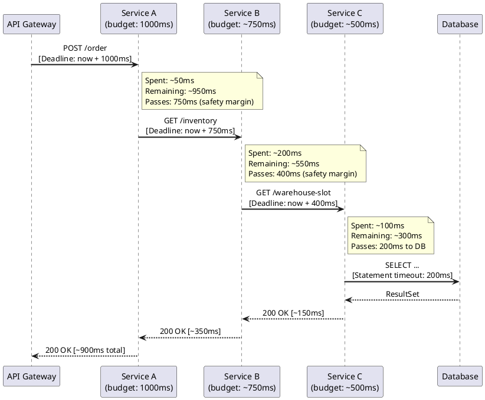

# 20.4 Timeout Propagation & Deadline Budgets

---

## 1. Learning Objectives

By the end of this section, you will be able to:

- **Distinguish** connect timeout, read timeout, and total deadline as three orthogonal concerns and explain why conflating them causes production incidents
- **Design** a deadline propagation chain in which each downstream service receives only the remaining budget, eliminating the "timeout tax"
- **Integrate** Resilience4j `TimeLimiter` with `CompletableFuture` and Project Loom virtual threads, applying the correct decorator composition order
- **Evaluate** the failure modes introduced by per-layer full-timeout configuration and articulate the cascade cost in concrete latency terms
- **Implement** a `DeadlineContext` carrier using `ThreadLocal` (or gRPC `Context`) that survives async hand-offs across a three-service call chain

---

## 2. Prerequisites

- **Chapter 20.1** — Circuit Breaker fundamentals and Resilience4j decorator model
- **Chapter 1.7** — `CompletableFuture`, `CompletableFuture#orTimeout`, `completeOnTimeout`
- **Chapter 1.3** — Project Loom, virtual threads, structured concurrency (`StructuredTaskScope`)
- Familiarity with Spring `WebClient` and at minimum one blocking HTTP client (`RestTemplate`, OkHttp)
- Basic understanding of gRPC deadlines is helpful but not required

---

## 3. Critical Dialogue

**Exchange 1 — "I set a 5-second read timeout, I'm covered"**

> **Student:** I added `readTimeout(5, TimeUnit.SECONDS)` to my OkHttp client. That handles the timeout case, right?

> **Expert:** What happens if the DNS lookup hangs, or the TCP handshake never completes? `readTimeout` only starts counting after a connection is established and bytes are flowing. A misconfigured load balancer can sit in SYN_SENT forever and your thread blocks indefinitely. You need a *connect timeout* for connection establishment and a *call timeout* (OkHttp's name for total deadline) to cap the whole operation end-to-end. These are three separate dials.

---

**Exchange 2 — "Each service has a 10s timeout, so the chain takes at most 10s"**

> **Student:** We have Service A → B → C, each with a 10-second timeout. Worst case the whole request takes 30 seconds, but that's fine because upstream SLAs are 45 seconds.

> **Expert:** You just described a timeout tax. If A's SLA is actually 5 seconds, B's 10-second timeout is worthless — B will time out *after* A has already returned an error to the caller. The caller gave up at 5 seconds, but B's thread is still running for another 5 seconds, holding a connection, a database cursor, maybe a lock. Multiply this across 100 concurrent requests and you have a resource leak shaped like a slow-motion cascade failure. Deadline propagation means A computes "I have 5 seconds total; I've spent 50ms so far; I pass 4950ms to B." Each hop gets only what remains.

---

**Exchange 3 — "ThreadLocal is enough to propagate context"**

> **Student:** I'll just store the deadline in a `ThreadLocal` and read it in each service call. Simple.

> **Expert:** Works fine until you go async. The moment you hand off to a `CompletableFuture`, a different thread picks up execution — your `ThreadLocal` is empty. You need either an `InheritableThreadLocal` (fragile with thread pools), explicit context passing, or a framework-aware context like Micrometer's `ContextSnapshot`, gRPC's `Context`, or Reactor's `contextWrite`. With Project Loom virtual threads and structured concurrency, scoped values (`ScopedValue`, JEP 446) are the clean answer. Know which propagation mechanism your runtime supports before you write a single line.

---

**Exchange 4 — "TimeLimiter should be the innermost decorator so it only wraps the actual call"**

> **Student:** I put `TimeLimiter` closest to the method call since it only makes sense to time the actual operation, not the retry overhead.

> **Expert:** You have the composition order backwards. The correct order is **Bulkhead → Retry → CircuitBreaker → TimeLimiter**, reading outside-in. TimeLimiter is the *outermost* decorator, meaning it wraps everything including retry attempts. If TimeLimiter were innermost, each individual retry would get the full timeout budget, so three retries at 1s each could take 3s total — defeating the point of a 1s total deadline. Outermost TimeLimiter means: "the entire operation, including all retries, must complete within the budget."

---

## 4. Theory + Diagrams

### 4.1 The Three Timeout Concepts

| Concept | What it measures | Configured on |
|---|---|---|
| **Connect timeout** | Time to establish TCP connection | HTTP client |
| **Read timeout** | Max idle time between bytes received | HTTP client |
| **Total deadline** | Wall-clock budget for entire operation | Call site / TimeLimiter |

Setting only a read timeout is the most common mistake. A connection that never completes (e.g., to a black-hole firewall rule) will block indefinitely unless a connect timeout is also set. Neither protects against a slow but steady trickle of bytes — which passes the read timeout check on every chunk but takes 10 minutes to deliver a 1 KB response. Only a total deadline catches that.

### 4.2 Deadline Propagation Through a Call Chain



**Key observation:** Each service shaves a safety margin before passing the remaining budget downstream. A service that takes 250ms internally should not pass its full remaining budget — network latency and downstream processing eat into it. A common heuristic is to pass `remaining * 0.8` or `remaining - expected_downstream_overhead`.

### 4.3 The Timeout Tax (Anti-Pattern)

```
Without deadline propagation:

  Client: SLA = 1s
    └── Service A: timeout = 30s   ← still running after client gave up
          └── Service B: timeout = 30s   ← still running
                └── Service C: timeout = 30s   ← still running

Cascade cost for 100 concurrent failed requests:
  100 threads × 30s = 3000 thread-seconds of wasted work
  + connection pool exhaustion
  + database cursor leaks
```

### 4.4 Resilience4j Composition Order

```
Inbound request
      │
      ▼
 ┌─────────────┐
 │  Bulkhead   │  ← reject if too many concurrent calls
 └──────┬──────┘
        │
        ▼
 ┌─────────────┐
 │    Retry    │  ← retry on failure
 └──────┬──────┘
        │
        ▼
 ┌──────────────────┐
 │  CircuitBreaker  │  ← open if too many failures
 └──────┬───────────┘
        │
        ▼
 ┌─────────────┐
 │ TimeLimiter │  ← outermost: caps total time including retries
 └──────┬──────┘
        │
        ▼
  actual method call
```

---

## 5. Source Archaeology

### `io.github.resilience4j.timelimiter.TimeLimiter#executeFutureSupplier()`

Source: `resilience4j-timelimiter` module, `TimeLimiter.java`

```java
// resilience4j 2.x — simplified for clarity
public interface TimeLimiter {

    /**
     * Decorates and executes the given future supplier, cancelling it if it
     * does not complete within the configured duration.
     *
     * @param futureSupplier a supplier of a CompletableFuture; called once per invocation
     * @param <T>            the result type
     * @return the result of the future if it completes within the time limit
     * @throws TimeoutException        if the future does not complete in time
     * @throws ExecutionException      if the future completes exceptionally
     * @throws InterruptedException    if the current thread is interrupted while waiting
     */
    default <T> T executeFutureSupplier(
            Supplier<? extends Future<T>> futureSupplier
    ) throws Exception {
        Future<T> future = futureSupplier.get();
        try {
            TimeLimiterConfig config = getTimeLimiterConfig();
            return future.get(
                config.getTimeoutDuration().toMillis(),
                TimeUnit.MILLISECONDS
            );
        } catch (TimeoutException e) {
            // cancelRunningFuture defaults to true in TimeLimiterConfig
            if (getTimeLimiterConfig().shouldCancelRunningFuture()) {
                future.cancel(true);  // ← sends interrupt to running thread
            }
            throw TimeLimiterUtil.creationException(getName(), e);
        }
    }
}
```

**What to notice:**

1. `futureSupplier` is a `Supplier<Future<T>>` — TimeLimiter does not start execution; it only wraps an already-submitted task. This is why you typically submit to an `ExecutorService` first, then hand the `Future` to TimeLimiter.
2. `future.get(timeout, MILLISECONDS)` is a blocking call on the calling thread. If you call this from a platform thread, that thread blocks. With virtual threads (Loom), the carrier thread is released — the virtual thread parks instead.
3. `future.cancel(true)` sends an interrupt signal. Your async task must honour `Thread.interrupted()` for cooperative cancellation to work. Tasks that call blocking I/O in a loop without checking interruption will run to completion despite the cancellation.
4. `TimeLimiterConfig.shouldCancelRunningFuture()` defaults to `true`. In rare cases (e.g., non-idempotent operations where partial work must finish), you set this to `false` — but then you're only stopping the *wait*, not the *work*.

### `TimeLimiterConfig` builder

```java
TimeLimiterConfig config = TimeLimiterConfig.custom()
    .timeoutDuration(Duration.ofMillis(500))
    .cancelRunningFuture(true)   // default: true
    .build();

TimeLimiter limiter = TimeLimiter.of("inventory-service", config);
```

---

## 6. Code Lab

### 6.1 Bad: No Deadline Propagation (The Timeout Tax)

```java
// BAD — each layer uses its own full 30-second timeout
// If the caller's SLA is 1 second, all this work is wasted

@Service
public class OrderService {

    private final RestTemplate restTemplate;

    public OrderService() {
        // connect + read timeout set; NO total deadline, NO propagation
        SimpleClientHttpRequestFactory factory = new SimpleClientHttpRequestFactory();
        factory.setConnectTimeout(5_000);
        factory.setReadTimeout(30_000);  // ← 30 seconds! per hop!
        this.restTemplate = new RestTemplate(factory);
    }

    public Order createOrder(String productId, int qty) {
        // Service A → B → C, each will wait up to 30s
        // If caller times out at 1s, these threads keep running for 29 more seconds
        Inventory inv = restTemplate.getForObject(
            "http://inventory-service/check?product=" + productId,
            Inventory.class
        );
        Warehouse wh = restTemplate.getForObject(
            "http://warehouse-service/slot?product=" + productId,
            Warehouse.class
        );
        return buildOrder(inv, wh, qty);
    }
}
```

**Problems:**
- No connect timeout for connection establishment (only `setConnectTimeout` on `SimpleClientHttpRequestFactory`, which applies per connection attempt, not to the full operation)
- 30-second read timeout means a server sending 1 byte/second passes the timeout check indefinitely
- No total deadline; no propagation; downstream services have no idea the caller already gave up

---

### 6.2 Good: Deadline Chain with Remaining Budget

```java
// GOOD — deadline propagated as remaining budget through each hop

import io.github.resilience4j.timelimiter.TimeLimiter;
import io.github.resilience4j.timelimiter.TimeLimiterConfig;
import io.micrometer.context.ContextSnapshot;

import java.time.Duration;
import java.time.Instant;
import java.util.concurrent.*;

/**
 * Carries the absolute deadline for the current request.
 * ScopedValue (JEP 446, Java 21 preview / Java 23 standard) is the
 * clean answer for virtual threads. ThreadLocal shown here for Java 21
 * compatibility without preview features.
 */
public final class DeadlineContext {

    // Use ScopedValue in Java 23+:
    //   public static final ScopedValue<Instant> DEADLINE = ScopedValue.newInstance();
    private static final ThreadLocal<Instant> DEADLINE = new ThreadLocal<>();

    private DeadlineContext() {}

    public static void set(Instant deadline) {
        DEADLINE.set(deadline);
    }

    public static Instant get() {
        return DEADLINE.get();
    }

    /**
     * Returns the remaining budget in milliseconds.
     * Returns 0 if the deadline has already passed.
     */
    public static long remainingMillis() {
        Instant dl = DEADLINE.get();
        if (dl == null) return Long.MAX_VALUE;
        long remaining = Duration.between(Instant.now(), dl).toMillis();
        return Math.max(0, remaining);
    }

    /**
     * Returns a TimeLimiterConfig using the remaining budget,
     * minus a safety margin to account for network overhead.
     */
    public static TimeLimiterConfig toTimeLimiterConfig(long safetyMarginMs) {
        long budget = remainingMillis() - safetyMarginMs;
        if (budget <= 0) throw new IllegalStateException("Deadline already exceeded");
        return TimeLimiterConfig.custom()
            .timeoutDuration(Duration.ofMillis(budget))
            .cancelRunningFuture(true)
            .build();
    }

    public static void clear() {
        DEADLINE.remove();
    }
}
```

```java
@Service
public class OrderService {

    private final WebClient webClient;
    private final ExecutorService virtualThreadExecutor =
        Executors.newVirtualThreadPerTaskExecutor();  // Java 21+

    public OrderService(WebClient.Builder builder) {
        this.webClient = builder
            .baseUrl("http://internal-gateway")
            .build();
    }

    /**
     * Entry point — sets the total deadline for this request.
     * In a real app this is done in a servlet filter or Spring interceptor.
     */
    public Order createOrder(String productId, int qty, Duration totalBudget) {
        DeadlineContext.set(Instant.now().plus(totalBudget));
        try {
            return doCreateOrder(productId, qty);
        } finally {
            DeadlineContext.clear();  // critical — ThreadLocal must be cleaned up
        }
    }

    private Order doCreateOrder(String productId, int qty) throws Exception {
        // Step 1: call inventory service with remaining budget
        Inventory inv = callWithDeadline(
            "inventory",
            () -> webClient.get()
                .uri("/inventory/check?product={p}", productId)
                .header("X-Deadline-Ms", String.valueOf(DeadlineContext.remainingMillis()))
                .retrieve()
                .bodyToMono(Inventory.class)
                .toFuture(),
            50  // safety margin ms
        );

        // Step 2: call warehouse service with *updated* remaining budget
        Warehouse wh = callWithDeadline(
            "warehouse",
            () -> webClient.get()
                .uri("/warehouse/slot?product={p}", productId)
                .header("X-Deadline-Ms", String.valueOf(DeadlineContext.remainingMillis()))
                .retrieve()
                .bodyToMono(Warehouse.class)
                .toFuture(),
            50
        );

        return buildOrder(inv, wh, qty);
    }

    /**
     * Wraps a CompletableFuture supplier with a TimeLimiter built from
     * the current remaining deadline budget.
     */
    private <T> T callWithDeadline(
            String name,
            Supplier<CompletableFuture<T>> futureSupplier,
            long safetyMarginMs
    ) throws Exception {
        TimeLimiterConfig config = DeadlineContext.toTimeLimiterConfig(safetyMarginMs);
        TimeLimiter limiter = TimeLimiter.of(name, config);
        return limiter.executeFutureSupplier(futureSupplier::get);
    }
}
```

---

### 6.3 WebClient vs RestTemplate vs OkHttp Timeout Configuration

```java
// --- Spring WebClient (reactive, non-blocking, preferred for new code) ---

@Bean
public WebClient webClient() {
    HttpClient httpClient = HttpClient.create()
        .option(ChannelOption.CONNECT_TIMEOUT_MILLIS, 2_000)  // connect timeout
        .responseTimeout(Duration.ofMillis(5_000))            // total response timeout
        .doOnConnected(conn -> conn
            .addHandlerLast(new ReadTimeoutHandler(3_000, TimeUnit.MILLISECONDS))
        );

    return WebClient.builder()
        .clientConnector(new ReactorClientHttpConnector(httpClient))
        .build();
}

// Note: responseTimeout is NOT a per-read-chunk timeout — it's a deadline from
// the moment the request is sent to the moment the full response is received.
// This is the closest WebClient gets to a total deadline.
// For true request-scoped deadline propagation, override per-request:

webClient.get()
    .uri("/inventory")
    .retrieve()
    .bodyToMono(Inventory.class)
    .timeout(Duration.ofMillis(DeadlineContext.remainingMillis()))  // ← per-request
    .block();
```

```java
// --- RestTemplate (legacy blocking, still common in older codebases) ---

@Bean
public RestTemplate restTemplate() {
    OkHttpClient okHttp = new OkHttpClient.Builder()
        .connectTimeout(2, TimeUnit.SECONDS)   // TCP connection establishment
        .readTimeout(3, TimeUnit.SECONDS)       // max idle between bytes
        .writeTimeout(3, TimeUnit.SECONDS)      // for request body upload
        .callTimeout(5, TimeUnit.SECONDS)       // ← TOTAL deadline for the whole call
        .build();

    OkHttp3ClientHttpRequestFactory factory =
        new OkHttp3ClientHttpRequestFactory(okHttp);

    return new RestTemplate(factory);
}

// Problem: callTimeout is fixed at bean-creation time. You cannot inject
// a per-request deadline without creating a new OkHttpClient per call
// (expensive) or using a custom ClientHttpRequestInterceptor that rebuilds
// the client. This is why RestTemplate is unsuitable for deadline propagation.
// Migrate to WebClient or use a dedicated HTTP client per call with a
// dynamically configured timeout.
```

```java
// --- OkHttp direct (fine-grained control, good for non-Spring apps) ---

public <T> T callWithOkHttp(String url, Class<T> type, long deadlineMs)
        throws IOException {
    OkHttpClient client = baseClient.newBuilder()
        .callTimeout(deadlineMs, TimeUnit.MILLISECONDS)  // override for this call
        .build();

    Request request = new Request.Builder().url(url).build();
    try (Response response = client.newCall(request).execute()) {
        return objectMapper.readValue(response.body().byteStream(), type);
    }
}

// OkHttpClient.newBuilder() reuses the connection pool — this is efficient.
// The base client holds the shared pool; the derived client only overrides
// timeout settings.
```

---

### 6.4 Resilience4j Full Composition (Bulkhead → Retry → CB → TimeLimiter)

```java
@Configuration
public class ResilienceConfig {

    @Bean
    public Decorators.DecorateSupplier<Inventory> inventoryDecorator(
            BulkheadRegistry bulkheadRegistry,
            RetryRegistry retryRegistry,
            CircuitBreakerRegistry cbRegistry
    ) {
        Bulkhead bulkhead = bulkheadRegistry.bulkhead("inventory");
        Retry retry = retryRegistry.retry("inventory");
        CircuitBreaker cb = cbRegistry.circuitBreaker("inventory");
        // TimeLimiter is created per-request to carry the remaining deadline

        // Composition order: Bulkhead → Retry → CircuitBreaker → TimeLimiter
        // Read as: "bulkhead limits concurrency, retry handles transient failures,
        // CB opens on sustained failures, TimeLimiter caps total time"
        return null; // see usage below
    }
}

@Service
public class InventoryClient {

    private final Bulkhead bulkhead;
    private final Retry retry;
    private final CircuitBreaker cb;
    private final WebClient webClient;
    private final ExecutorService executor = Executors.newVirtualThreadPerTaskExecutor();

    public Inventory check(String productId) throws Exception {
        // Build TimeLimiter from remaining deadline budget
        long remainingMs = DeadlineContext.remainingMillis();
        TimeLimiter timeLimiter = TimeLimiter.of(
            "inventory",
            TimeLimiterConfig.custom()
                .timeoutDuration(Duration.ofMillis(remainingMs - 20))  // 20ms margin
                .cancelRunningFuture(true)
                .build()
        );

        // Correct outside-in order: Bulkhead → Retry → CB → TimeLimiter
        Supplier<CompletableFuture<Inventory>> futureSupplier =
            Decorators.ofSupplier(() -> webClient.get()
                .uri("/inventory/check?product={p}", productId)
                .retrieve()
                .bodyToMono(Inventory.class)
                .toFuture())
            .withBulkhead(bulkhead)       // 1st (outermost after TimeLimiter)
            .withRetry(retry, executor)   // 2nd
            .withCircuitBreaker(cb)       // 3rd
            .decorate();

        // TimeLimiter is the true outermost wrapper
        return timeLimiter.executeFutureSupplier(futureSupplier);
    }
}
```

---

## 7. Production Lens

### Incident: Cascade Timeout Storm — Black Friday 2022

**System:** E-commerce checkout service. Architecture: API Gateway → Order Service → [Inventory Service, Payment Service] → Database.

**Configuration before the incident:**
- Every HTTP client configured with `readTimeout = 30s`, no connect timeout, no total deadline
- No deadline propagation between services

**Timeline (single request perspective):**

| Time | Event |
|---|---|
| T+0ms | User clicks "Place Order". API Gateway SLA: 3 seconds. |
| T+500ms | Inventory Service DB query hits a lock (a batch job took a long table lock). Query hangs. |
| T+3000ms | API Gateway times out. Returns 503 to the user. |
| T+3001ms | Order Service is still waiting. Its `readTimeout` is 30s. |
| T+30000ms | Order Service finally times out. Releases its connection. |

**At scale (500 concurrent requests during peak):**
- 500 requests × 27 seconds of wasted wait = **13,500 thread-seconds** of Order Service threads blocked on dead requests
- Connection pool to Inventory Service exhausted after ~120 threads (pool max = 120)
- New requests to Order Service started failing immediately with `ConnectionPoolExhaustedException`
- Payment Service, co-located in the same process, could not get outbound connections either — payment requests started failing even though the payment DB was healthy
- Cascade: Inventory DB lock lasted 8 seconds. Recovery took 4 minutes due to connection pool drain.

**Fix applied:**
1. Added connect timeout (2s) and total call timeout (500ms) to all HTTP clients
2. Implemented `DeadlineContext` carrier; API Gateway injects `X-Request-Deadline` header
3. Each service reads the header, stores in `DeadlineContext`, passes remaining budget downstream
4. `TimeLimiter` built per-request from remaining budget

**After fix — same DB lock scenario:**
- T+500ms: Inventory Service DB query hangs
- T+500ms: TimeLimiter fires (Order Service had 480ms remaining budget for this hop), cancels the future
- T+501ms: Order Service returns 503 to API Gateway immediately
- T+501ms: No threads stuck. Connection released.
- Recovery: instantaneous. Zero cascade.

**Numbers:**
- Before: 4-minute cascade affecting 100% of checkout traffic
- After: 8-second degradation affecting only requests that actually hit the locked table, ~12% of traffic

---

## 8. Exercises

**Exercise 1 (Conceptual):** A developer argues: "We have a circuit breaker on every service call — if a service is slow, the circuit will open and protect us. We don't need deadline propagation." What is wrong with this reasoning, and under what specific conditions does a circuit breaker fail to prevent resource exhaustion from slow calls?

---

**Exercise 2 (Conceptual):** Explain the difference between these three OkHttp timeout settings and give a concrete failure scenario that each one prevents but the others do not:

```java
okHttpClient.connectTimeout(2, TimeUnit.SECONDS)
okHttpClient.readTimeout(5, TimeUnit.SECONDS)
okHttpClient.callTimeout(8, TimeUnit.SECONDS)
```

---

**Exercise 3 (Conceptual):** You are reviewing a PR. The author has placed `TimeLimiter` as the innermost decorator (closest to the actual method call), reasoning that "the timer should only measure the actual work, not the retry overhead." Write a code review comment explaining the flaw and the correct composition order. Include a concrete example showing how misplacement can cause a 3x budget overrun.

---

**Exercise 4 (Coding):** Implement a servlet filter (`jakarta.servlet.Filter`) named `DeadlineInjectFilter` that:
1. Reads an `X-Request-Deadline-Ms` header from the incoming HTTP request (epoch-millis as a string)
2. If absent or malformed, sets a default 5-second deadline from now
3. Stores the absolute deadline in `DeadlineContext`
4. Clears `DeadlineContext` in the `finally` block after the chain completes
5. If the deadline is already past when the filter runs, returns HTTP 503 immediately without calling the chain

---

**Exercise 5 (Coding):** Implement a method `callWithPropagatedDeadline` that:
1. Takes a `Supplier<CompletableFuture<T>>` and a `String` service name
2. Reads the remaining budget from `DeadlineContext`
3. If remaining budget is ≤ 50ms, throw `DeadlineExceededException` immediately (fail fast)
4. Builds a `TimeLimiter` with `remaining - 30ms` budget (30ms margin)
5. Wraps the supplier in the TimeLimiter, decorates with a `CircuitBreaker` named after the service, and executes it
6. On `TimeoutException`, logs a warning with the service name and remaining budget at time of timeout

---

## Summary / Flashcard

**Q1: What is the difference between a read timeout and a total deadline?**
A read timeout restarts on each chunk of data received — a server streaming 1 byte per second passes the read timeout check indefinitely. A total deadline (call timeout) is a wall-clock cap from request initiation to completion. You need both: read timeout prevents infinite stalls between bytes; total deadline caps the entire operation.

---

**Q2: What is deadline propagation and why is it necessary?**
Deadline propagation means computing the remaining time budget at each service hop and passing it downstream, so each service receives only what is left rather than a full independent timeout. Without it, every layer applies its own full timeout, creating a "timeout tax": upstream callers give up while downstream services keep running, wasting resources and blocking connection pools.

---

**Q3: What is the correct Resilience4j decorator composition order and why does TimeLimiter go outermost?**
Bulkhead → Retry → CircuitBreaker → TimeLimiter (outermost). TimeLimiter must be outermost so it caps the total time including all retry attempts. If TimeLimiter were innermost, each retry would receive the full timeout budget, allowing total latency to be `timeout × retry_count`.

---

**Q4: What does `TimeLimiter#executeFutureSupplier()` actually do when the timeout fires?**
It calls `Future#cancel(true)` on the underlying future (if `cancelRunningFuture` is `true`, the default), which sends an interrupt to the executing thread. The method then throws `TimeoutException`. For cancellation to actually stop the work, the running task must honour `Thread.interrupted()` — if it doesn't check for interruption, the work continues running despite the cancellation signal.

---

**Q5: Why is `ThreadLocal` insufficient for deadline propagation in async code?**
`ThreadLocal` is bound to the current thread. When a `CompletableFuture` continuation runs on a different thread from a pool, the `ThreadLocal` value is not transferred. Solutions include: `InheritableThreadLocal` (works for thread creation but not pool hand-offs), explicit parameter passing, Micrometer `ContextSnapshot`, gRPC `Context`, or (Java 23+) `ScopedValue` which is designed for structured concurrency and is inherited by child scopes.

---

---

## Exercise Solutions

<details>
<summary>Exercise 1 — Circuit Breaker vs Deadline Propagation</summary>

**Staff-level phrasing:** "A circuit breaker is a *failure detection* mechanism — it opens after observing a sufficient number of failures or slow calls over a time window. During that window, threads are still blocking on slow calls, and the circuit breaker's slow-call threshold (typically configured in seconds) is usually much longer than a request-scoped deadline. If a service degrades to, say, 8-second responses and your circuit breaker's slow-call duration threshold is 10 seconds, the breaker never opens — but 100 concurrent callers each block for 8 seconds, exhausting connection pools in ~1.5 seconds at typical pool sizes of 50-100. Deadline propagation operates at a different layer: it limits how long *this specific request* will wait, regardless of the circuit breaker state. The two mechanisms are complementary: circuit breaker protects against repeated failures across requests, deadline propagation protects the resource budget of an individual request. You need both."

</details>

<details>
<summary>Exercise 2 — Three OkHttp Timeout Types</summary>

**Staff-level phrasing:** "Connect timeout (`connectTimeout(2s)`) fires if the TCP handshake is not established within 2 seconds. Scenario it prevents: a misconfigured firewall drops SYN packets silently — without a connect timeout, the thread blocks indefinitely in `socket.connect()`. The read timeout (`readTimeout(5s)`) fires if no bytes are received for 5 consecutive seconds. Scenario it prevents: a server that accepts the connection and starts processing but hangs in a computation loop sending nothing — the client detects this after 5s of silence. The call timeout (`callTimeout(8s)`) is a wall-clock cap from the moment `newCall().execute()` is called to the moment the response is fully consumed. Scenario it prevents: a server that trickles 1 byte every 4 seconds — it satisfies the read timeout on every tick but takes minutes to deliver a full response. Only `callTimeout` catches this. The three timeouts are not redundant; each covers a failure mode the others miss."

</details>

<details>
<summary>Exercise 3 — TimeLimiter Composition Order Code Review</summary>

**Staff-level phrasing:** "The placement of `TimeLimiter` as innermost means each individual attempt gets the full timeout budget. With `TimeLimiter(1s)` innermost and `Retry(maxAttempts=3)` outer, attempt 1 can run for 1s, attempt 2 for 1s, attempt 3 for 1s — total possible latency: 3 seconds, three times the intended budget. The decorator should read, from outermost to innermost: `TimeLimiter → CircuitBreaker → Retry → Bulkhead → method`. With `TimeLimiter` outermost, the 1-second budget is shared across all attempts: if attempt 1 takes 700ms, attempt 2 has only 300ms. This is the correct semantic: 'the entire operation including retries must complete within 1 second.' The Resilience4j `Decorators` fluent API builds the chain in the order methods are called — call `withTimeLimiter` last to make it outermost."

</details>

<details>
<summary>Exercise 4 — DeadlineInjectFilter implementation</summary>

```java
import jakarta.servlet.*;
import jakarta.servlet.http.*;
import org.slf4j.Logger;
import org.slf4j.LoggerFactory;

import java.io.IOException;
import java.time.Instant;

public class DeadlineInjectFilter implements Filter {

    private static final Logger log = LoggerFactory.getLogger(DeadlineInjectFilter.class);
    private static final long DEFAULT_DEADLINE_MS = 5_000L;
    private static final String HEADER = "X-Request-Deadline-Ms";

    @Override
    public void doFilter(
            ServletRequest request,
            ServletResponse response,
            FilterChain chain
    ) throws IOException, ServletException {

        HttpServletRequest httpReq = (HttpServletRequest) request;
        HttpServletResponse httpResp = (HttpServletResponse) response;

        Instant deadline = parseDeadline(httpReq);

        // Fail fast: deadline already past before we even start
        if (Instant.now().isAfter(deadline)) {
            log.warn("Request arrived with expired deadline: {}", deadline);
            httpResp.setStatus(HttpServletResponse.SC_SERVICE_UNAVAILABLE);
            httpResp.getWriter().write("Deadline exceeded before processing");
            return;
        }

        DeadlineContext.set(deadline);
        try {
            chain.doFilter(request, response);
        } finally {
            DeadlineContext.clear();  // MUST run even if chain throws
        }
    }

    private Instant parseDeadline(HttpServletRequest req) {
        String header = req.getHeader(HEADER);
        if (header == null) {
            return Instant.now().plusMillis(DEFAULT_DEADLINE_MS);
        }
        try {
            long epochMs = Long.parseLong(header.trim());
            return Instant.ofEpochMilli(epochMs);
        } catch (NumberFormatException e) {
            log.warn("Malformed {} header: '{}', using default deadline", HEADER, header);
            return Instant.now().plusMillis(DEFAULT_DEADLINE_MS);
        }
    }
}
```

**Why this works:** The `finally` block guarantees `DeadlineContext.clear()` runs regardless of exceptions or normal completion — essential for `ThreadLocal` hygiene in thread-pool environments where the same thread will serve future requests. The fail-fast check before calling the chain prevents spending resources on requests that are already past deadline, which is especially valuable during traffic spikes when queueing delay is high.

**Common mistake:** Omitting the `finally` block and clearing `DeadlineContext` only in the happy path. In a thread pool, a thread that threw an exception and was returned to the pool carries the stale deadline value — the next request on that thread inherits it and gets an incorrect, possibly already-expired deadline.

</details>

<details>
<summary>Exercise 5 — callWithPropagatedDeadline implementation</summary>

```java
import io.github.resilience4j.circuitbreaker.CircuitBreaker;
import io.github.resilience4j.circuitbreaker.CircuitBreakerRegistry;
import io.github.resilience4j.timelimiter.TimeLimiter;
import io.github.resilience4j.timelimiter.TimeLimiterConfig;
import org.slf4j.Logger;
import org.slf4j.LoggerFactory;

import java.time.Duration;
import java.util.concurrent.CompletableFuture;
import java.util.concurrent.TimeoutException;
import java.util.function.Supplier;

public class DeadlineAwareClient {

    private static final Logger log = LoggerFactory.getLogger(DeadlineAwareClient.class);
    private static final long MINIMUM_VIABLE_BUDGET_MS = 50L;
    private static final long SAFETY_MARGIN_MS = 30L;

    private final CircuitBreakerRegistry cbRegistry;

    public DeadlineAwareClient(CircuitBreakerRegistry cbRegistry) {
        this.cbRegistry = cbRegistry;
    }

    public <T> T callWithPropagatedDeadline(
            String serviceName,
            Supplier<CompletableFuture<T>> futureSupplier
    ) throws Exception {

        long remainingMs = DeadlineContext.remainingMillis();

        // Fail fast: not enough budget to make the call worthwhile
        if (remainingMs <= MINIMUM_VIABLE_BUDGET_MS) {
            throw new DeadlineExceededException(
                String.format(
                    "Insufficient deadline budget for service '%s': %dms remaining (minimum: %dms)",
                    serviceName, remainingMs, MINIMUM_VIABLE_BUDGET_MS
                )
            );
        }

        long timeLimitMs = remainingMs - SAFETY_MARGIN_MS;

        TimeLimiter timeLimiter = TimeLimiter.of(
            serviceName,
            TimeLimiterConfig.custom()
                .timeoutDuration(Duration.ofMillis(timeLimitMs))
                .cancelRunningFuture(true)
                .build()
        );

        CircuitBreaker circuitBreaker = cbRegistry.circuitBreaker(serviceName);

        // Decorate: CircuitBreaker wraps the future supplier; TimeLimiter is outermost
        Supplier<CompletableFuture<T>> decorated =
            CircuitBreaker.decorateSupplier(circuitBreaker, futureSupplier);

        try {
            return timeLimiter.executeFutureSupplier(decorated::get);
        } catch (TimeoutException e) {
            log.warn(
                "Timeout calling service '{}': budget was {}ms, {}ms remaining at timeout",
                serviceName, timeLimitMs, DeadlineContext.remainingMillis()
            );
            throw e;
        }
    }
}

/** Thrown when the remaining deadline budget is too small to attempt a call. */
class DeadlineExceededException extends RuntimeException {
    public DeadlineExceededException(String message) {
        super(message);
    }
}
```

**Why this works:** The fail-fast check at 50ms prevents pointless calls that are virtually guaranteed to time out, returning an error immediately and freeing the caller to return a response rather than spending 50ms confirming what we already know. The `SAFETY_MARGIN_MS` accounts for the overhead of connection establishment and framework processing — passing the exact remaining budget would cause hairline timeouts where the service technically responded in time but network jitter caused a false timeout. The `CircuitBreaker` decorator wraps the supplier (not the future) so the circuit breaker tracks call outcomes correctly even when the future is cancelled.

**Common mistake:** Calling `timeLimiter.executeFutureSupplier(futureSupplier)` without first wrapping with the circuit breaker. This means the circuit breaker never observes the call outcomes — it stays permanently closed even when the downstream service is failing, providing no protection. Always apply circuit breaker decoration before the TimeLimiter executes.

</details>
