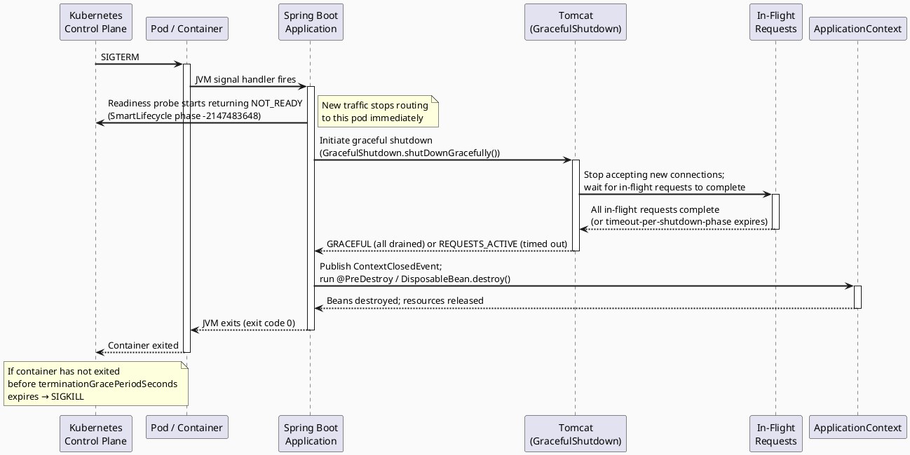

# 20.5 Graceful Degradation & Shutdown

---

## 1. Learning Objectives

By the end of this section, you will be able to:

1. **Distinguish** between fail-open and fail-closed strategies and justify which is appropriate given a specific business context.
2. **Design** fallback taxonomies (cached data, default value, partial response) and articulate the trade-offs each introduces.
3. **Configure** Spring Boot graceful shutdown and explain how the lifecycle phases interact with Kubernetes pod termination.
4. **Implement** JVM shutdown hooks and Spring `ContextClosedEvent` listeners that safely drain in-flight work before process exit.
5. **Evaluate** liveness, readiness, and startup probe configurations and explain how they compose with circuit breakers to protect downstream systems during rolling deployments.

---

## 2. Prerequisites

| Topic | Where to review |
|---|---|
| Circuit Breaker pattern and Resilience4j basics | Ch 20.1 — Circuit Breaker |
| Timeout propagation and deadline budgets | Ch 20.4 — Timeout Propagation |
| Spring ApplicationContext lifecycle, bean scopes | Ch 2.0 — Spring Bootstrap |

---

## 3. Critical Dialogue

**Exchange 1 — "Just catch the exception and return null"**

> **Student:** When the database is down I just wrap the call in a try-catch and return `null`. The caller handles it. Simple.
>
> **Expert:** You have pushed the decision — and the cognitive load — onto every single caller, forever. Returning `null` is not a fallback strategy; it is a ticking NullPointerException distributed across your codebase. A real fallback has a name, a documented contract, and an observability signal. Ask yourself: what does the caller actually need? Usually it is *some* answer, not *no* answer. Start there.

---

**Exchange 2 — "Graceful shutdown is for production, not worth the config in dev"**

> **Student:** Graceful shutdown is a one-liner in `application.properties`. I'll add it when we go to prod. During development it doesn't matter.
>
> **Expert:** Wrong on both counts. First, it is not a one-liner — you need `server.shutdown=graceful` *and* `spring.lifecycle.timeout-per-shutdown-phase` tuned to your SLA, *and* your Kubernetes `terminationGracePeriodSeconds` set to a value larger than the Spring timeout, *and* your readiness probe to start failing on `SIGTERM`. Miss any one of those and you will lose requests. Second, local development without graceful shutdown trains you to write code that assumes immortality. You will miss resource leak bugs that only surface under partial shutdown.

---

**Exchange 3 — "Kubernetes kills the pod, Spring handles the rest automatically"**

> **Student:** Kubernetes sends SIGTERM, Spring catches it, everything shuts down cleanly. I don't need to write any extra code.
>
> **Expert:** Spring handles the `ApplicationContext` lifecycle, not your work. If you have background threads, scheduled tasks, async handlers, or open Kafka consumers — Spring does not know about them unless you registered a `DisposableBean`, a `@PreDestroy`, or a `SmartLifecycle`. The default Tomcat graceful shutdown waits for HTTP requests to drain, but a message you are halfway through processing on a `@KafkaListener` can be orphaned. Draw out every I/O boundary in your service and ask: who owns the drain?

---

**Exchange 4 — "Resilience4j composition order doesn't matter as long as all three are on"**

> **Student:** I added `@Bulkhead`, `@Retry`, `@CircuitBreaker`, and `@TimeLimiter` to the same method. Order in the annotation list doesn't matter, right? They're just AOP interceptors.
>
> **Expert:** It matters enormously. The correct composition order, outermost to innermost, is: **Bulkhead → Retry → CircuitBreaker → TimeLimiter**. If Retry wraps TimeLimiter, a single call that times out gets retried — multiplying load on an already-struggling dependency. If CircuitBreaker is outside Retry, the CB counts every retry attempt as a separate failure, opening far too aggressively. Resilience4j applies decorators in the order you declare them; get this wrong and your resilience primitives fight each other.

---

## 4. Theory + Diagrams

### 4.1 Fallback Strategy Taxonomy

| Strategy | Description | When to use | Risk |
|---|---|---|---|
| **Cached / stale data** | Return last known good value from cache | Read-heavy data where slight staleness is tolerable (e.g., product catalog, balance) | Can serve dangerously stale data if TTL is wrong |
| **Default value** | Return a safe hardcoded or computed default | Non-critical features where absence of data is acceptable (e.g., "show 0 unread notifications") | May hide real failures; silently degrades user experience |
| **Partial response** | Return what succeeded; omit the failed part | Aggregation endpoints where some sub-responses are optional | Requires clear API contract; callers must handle partial payloads |
| **Fail-open** | Allow the operation to proceed even when the guard fails | Low-risk permissions, non-critical enrichment | Can propagate bad state; must have separate alerting |
| **Fail-closed** | Deny or 503 when the dependency is unavailable | Financial, security-critical, or write operations where bad data is worse than no data | Degrades user experience; must be paired with fast recovery |

**Business context is the deciding factor.** A loyalty-points read can fail-open with a stale cache. A payment debit must fail-closed. No technical argument overrides the business risk model.

### 4.2 GOL Balance Endpoint — What Should It Return When DB Is Unavailable?

The GOL `/accounts/{id}/balance` endpoint is a **read** on account state that users see in real time. Two options:

- **Fail-open (cached stale value):** Return the last known balance from an in-process or Redis cache with a visible `"stale": true` flag in the response body. The user sees a number that may be seconds to minutes old. Acceptable if the business agrees that a briefly stale balance display is less harmful than a hard error.
- **Fail-closed (HTTP 503):** Refuse the request entirely and surface an error to the UI. Forces the user to retry. Correct when regulatory requirements demand balance accuracy (e.g., anti-money-laundering checks tied to balance display).

**Recommended default for GOL:** Fail-open with a **short-TTL Redis cache** (30–60 s) and a `"dataFreshness"` field in the response. The UI renders a "balance as of HH:MM" notice. Log a `WARN` metric (`balance.cache.hit.stale`) so SREs can track how often this path fires. When DB recovery is confirmed, the stale path self-heals on next DB read.

### 4.3 Kubernetes Pod Termination Lifecycle



**Key timing constraint:**

```
terminationGracePeriodSeconds  (Kubernetes)
    > timeout-per-shutdown-phase × number-of-phases  (Spring)
        > longest expected in-flight request duration  (your SLA)
```

If you violate this ordering, Kubernetes sends SIGKILL before Spring finishes draining, and in-flight requests are terminated mid-flight.

### 4.4 Liveness, Readiness, and Startup Probes

| Probe | Spring Actuator path | Fails → | Interaction with circuit breaker |
|---|---|---|---|
| **Startup** | `/actuator/health/liveness` during startup | Pod restarts | Do not open CB during startup warmup — use startup probe delay |
| **Liveness** | `/actuator/health/liveness` | Pod killed and restarted | A permanently open CB should NOT trip liveness; a broken process should |
| **Readiness** | `/actuator/health/readiness` | Pod removed from Service endpoints (no new traffic) | An open CB **should** trip readiness if the dependency is critical and the pod cannot serve useful responses |

Registering a `CircuitBreakerHealthIndicator` as a readiness contributor is the correct pattern. When the CB opens on a critical dependency, readiness fails, Kubernetes stops sending traffic to that pod, and the CB gets time to recover — without restarting the JVM.

### 4.5 JVM Shutdown Hooks

`Runtime.getRuntime().addShutdownHook(Thread)` registers a thread that the JVM runs when:
- The last non-daemon thread exits
- `System.exit()` is called
- SIGTERM is received (on most JVM implementations)

Shutdown hooks run concurrently with each other and with `finalize()`. They are **not** guaranteed to run on SIGKILL. Spring's `SpringApplication` registers its own shutdown hook via `AbstractApplicationContext.registerShutdownHook()` — unless you call `setRegisterShutdownHook(false)`.

---

## 5. Source Archaeology

### 5.1 `org.springframework.boot.web.embedded.tomcat.GracefulShutdown`

```java
// spring-boot 3.x — TomcatWebServer delegates here
final class GracefulShutdown {

    private final Tomcat tomcat;

    GracefulShutdown(Tomcat tomcat) { ... }

    void shutDownGracefully(GracefulShutdownCallback callback) {
        // Pauses all connectors — no new connections accepted
        // Polls active request count until zero or timeout
        // Invokes callback with GracefulShutdownResult.GRACEFUL or REQUESTS_ACTIVE
    }
}
```

`GracefulShutdownResult` is an enum:
- `GRACEFUL` — all requests drained within the timeout
- `REQUESTS_ACTIVE` — timeout expired; some requests may still be running
- `IMMEDIATE` — graceful shutdown was not attempted (non-graceful config)

The timeout is sourced from `spring.lifecycle.timeout-per-shutdown-phase` (default: 30 seconds).

### 5.2 `org.springframework.context.event.ContextClosedEvent`

```java
public class ContextClosedEvent extends ApplicationContextEvent {
    public ContextClosedEvent(ApplicationContext source) {
        super(source);
    }
}
```

Published by `AbstractApplicationContext.close()`. Listen with:

```java
@EventListener
public void onContextClosed(ContextClosedEvent event) {
    // Called after Tomcat drains but before bean destruction
    // Safe to flush buffers, close producers, drain queues
}
```

### 5.3 `org.springframework.context.SmartLifecycle`

```java
public interface SmartLifecycle extends Lifecycle, Phased {
    default int getPhase() { return DEFAULT_PHASE; } // Integer.MAX_VALUE
    default boolean isAutoStartup() { return true; }
    default void stop(Runnable callback) {
        stop();
        callback.run();
    }
}
```

Spring's graceful HTTP shutdown hook implements `SmartLifecycle` at phase `Integer.MIN_VALUE` to ensure it runs **first** during shutdown (lowest phase = first to stop). Your own `SmartLifecycle` beans should use a higher phase number so they stop after HTTP draining completes.

---

## 6. Code Lab

### 6.1 Bad: No Graceful Shutdown — In-Flight Requests Cut

```java
// application.properties — BAD: nothing configured
# server.shutdown is not set (defaults to IMMEDIATE)
# spring.lifecycle.timeout-per-shutdown-phase is not set
```

```java
// GOL BalanceController — BAD: no fallback, no drain awareness
@RestController
@RequestMapping("/accounts")
public class BalanceController {

    private final AccountRepository accountRepository;

    @GetMapping("/{id}/balance")
    public BalanceResponse getBalance(@PathVariable Long id) {
        // If DB is down → DataAccessException propagates → 500
        // If pod shuts down mid-request → connection reset to client
        Account account = accountRepository.findById(id)
            .orElseThrow(() -> new AccountNotFoundException(id));
        return new BalanceResponse(account.getBalance());
    }
}
```

Problems:
1. SIGTERM immediately closes TCP connections — any in-flight HTTP request gets a connection reset.
2. No fallback: DB unavailability returns 500 with a stack trace.
3. No stale-cache path — system is either fully up or fully broken.

---

### 6.2 Good: Graceful Shutdown + Fallback Strategy

**application.yml**

```yaml
server:
  shutdown: graceful                          # enables GracefulShutdown

spring:
  lifecycle:
    timeout-per-shutdown-phase: 20s           # wait up to 20 s for HTTP drain

management:
  endpoint:
    health:
      probes:
        enabled: true                         # /actuator/health/liveness & readiness
  health:
    livenessstate:
      enabled: true
    readinessstate:
      enabled: true
```

**Kubernetes Deployment snippet**

```yaml
spec:
  terminationGracePeriodSeconds: 30           # MUST be > Spring timeout (20s) + buffer
  containers:
    - name: gol-balance-service
      readinessProbe:
        httpGet:
          path: /actuator/health/readiness
          port: 8080
        initialDelaySeconds: 10
        periodSeconds: 5
        failureThreshold: 3
      livenessProbe:
        httpGet:
          path: /actuator/health/liveness
          port: 8080
        initialDelaySeconds: 30
        periodSeconds: 10
        failureThreshold: 5
```

**BalanceCacheService.java — stale-cache fallback**

```java
@Service
@Slf4j
public class BalanceCacheService {

    private final Cache<Long, CachedBalance> localCache = Caffeine.newBuilder()
        .expireAfterWrite(Duration.ofSeconds(60))
        .maximumSize(10_000)
        .build();

    public record CachedBalance(BigDecimal amount, Instant cachedAt) {}

    public void put(Long accountId, BigDecimal balance) {
        localCache.put(accountId, new CachedBalance(balance, Instant.now()));
    }

    public Optional<CachedBalance> get(Long accountId) {
        return Optional.ofNullable(localCache.getIfPresent(accountId));
    }
}
```

**BalanceController.java — fail-open with stale cache**

```java
@RestController
@RequestMapping("/accounts")
@Slf4j
public class BalanceController {

    private final AccountRepository accountRepository;
    private final BalanceCacheService cacheService;
    private final MeterRegistry meterRegistry;

    public BalanceController(AccountRepository accountRepository,
                             BalanceCacheService cacheService,
                             MeterRegistry meterRegistry) {
        this.accountRepository = accountRepository;
        this.cacheService = cacheService;
        this.meterRegistry = meterRegistry;
    }

    @GetMapping("/{id}/balance")
    public ResponseEntity<BalanceResponse> getBalance(@PathVariable Long id) {
        try {
            Account account = accountRepository.findById(id)
                .orElseThrow(() -> new AccountNotFoundException(id));

            BigDecimal balance = account.getBalance();
            cacheService.put(id, balance);                          // refresh cache on success

            return ResponseEntity.ok(
                new BalanceResponse(balance, false, Instant.now())
            );

        } catch (DataAccessException ex) {
            // DB unavailable — attempt stale cache (fail-open)
            return cacheService.get(id)
                .map(cached -> {
                    meterRegistry.counter("balance.cache.hit.stale",
                        "accountId", id.toString()).increment();
                    log.warn("DB unavailable for account {}; serving stale balance from {}",
                        id, cached.cachedAt());
                    return ResponseEntity.ok(
                        new BalanceResponse(cached.amount(), true, cached.cachedAt())
                    );
                })
                .orElseGet(() -> {
                    // No cache entry at all — fail-closed with 503
                    meterRegistry.counter("balance.cache.miss.db_down",
                        "accountId", id.toString()).increment();
                    log.error("DB unavailable and no cached balance for account {}", id);
                    return ResponseEntity.status(HttpStatus.SERVICE_UNAVAILABLE)
                        .body(null);
                });
        }
    }
}
```

**BalanceResponse.java**

```java
public record BalanceResponse(
    BigDecimal balance,
    boolean stale,
    Instant dataFreshness
) {}
```

**GolShutdownLifecycle.java — custom SmartLifecycle for clean drain**

```java
@Component
@Slf4j
public class GolShutdownLifecycle implements SmartLifecycle {

    private final KafkaListenerEndpointRegistry kafkaRegistry;
    private volatile boolean running = false;

    public GolShutdownLifecycle(KafkaListenerEndpointRegistry kafkaRegistry) {
        this.kafkaRegistry = kafkaRegistry;
    }

    @Override
    public void start() {
        running = true;
        log.info("GolShutdownLifecycle started");
    }

    @Override
    public void stop(Runnable callback) {
        log.info("GolShutdownLifecycle stopping — pausing Kafka listeners");
        // Pause Kafka consumers so in-flight messages are not abandoned mid-processing
        kafkaRegistry.getListenerContainers().forEach(MessageListenerContainer::pause);
        running = false;
        callback.run();                     // signal Spring we are done
    }

    @Override
    public boolean isRunning() {
        return running;
    }

    @Override
    public int getPhase() {
        // Run BEFORE HTTP graceful shutdown (which is at Integer.MIN_VALUE)
        // We want to stop accepting Kafka work even before HTTP drains
        return Integer.MIN_VALUE + 1;
    }
}
```

**JVM shutdown hook (use only when Spring context is NOT managing the resource)**

```java
// Example: registering a shutdown hook for a resource Spring doesn't own
public class LegacyConnectionPoolManager {

    private final SomeConnectionPool pool;

    public LegacyConnectionPoolManager(SomeConnectionPool pool) {
        this.pool = pool;
        Runtime.getRuntime().addShutdownHook(new Thread(() -> {
            log.info("JVM shutdown hook: draining legacy connection pool");
            pool.drainAndClose(Duration.ofSeconds(5));
        }, "gol-legacy-pool-shutdown"));
    }
}
```

**Resilience4j correct composition order**

```java
// CORRECT: Bulkhead → Retry → CircuitBreaker → TimeLimiter (outermost to innermost)
@Bulkhead(name = "balance-db", type = Bulkhead.Type.SEMAPHORE)
@Retry(name = "balance-db")
@CircuitBreaker(name = "balance-db", fallbackMethod = "getBalanceFallback")
@TimeLimiter(name = "balance-db")
public CompletableFuture<BalanceResponse> getBalanceResilient(Long id) {
    return CompletableFuture.supplyAsync(() -> fetchFromDb(id));
}

private CompletableFuture<BalanceResponse> getBalanceFallback(Long id, Exception ex) {
    return cacheService.get(id)
        .map(cached -> CompletableFuture.completedFuture(
            new BalanceResponse(cached.amount(), true, cached.cachedAt())
        ))
        .orElseGet(() -> CompletableFuture.failedFuture(
            new ServiceUnavailableException("DB down and no cached balance")
        ));
}
```

---

## 7. Production Lens

### Incident: 5% Request Loss During Rolling Deployment

**Service:** GOL Account Service, 8-pod deployment  
**Date:** Fictional reconstruction based on common production patterns  
**Symptom:** During a Kubernetes rolling update, Datadog showed a spike of ~5% HTTP 502 errors over a 4-minute window. Each pod replacement accounted for approximately 0.6% request loss.

**Root cause chain:**

1. `server.shutdown` was not set — defaulted to `IMMEDIATE`.
2. `terminationGracePeriodSeconds: 30` was set in the Deployment spec, but Spring exited within milliseconds because it was not waiting for HTTP drain.
3. Kubernetes took up to 3 seconds to propagate the readiness probe failure and remove the pod from the Service endpoint list. During those 3 seconds, the load balancer continued routing new requests to the terminating pod.
4. Because the pod was already shutting down, those requests hit a closed socket — 502 from the load balancer.

**Fix applied:**

```yaml
# application.yml
server:
  shutdown: graceful
spring:
  lifecycle:
    timeout-per-shutdown-phase: 20s
```

```yaml
# Deployment spec
terminationGracePeriodSeconds: 35           # 20s Spring drain + 10s buffer + 5s for probe propagation
```

**Result after fix:** 502 rate during deploys dropped from ~5% to 0.02% (irreducible due to in-flight requests that naturally exceed the 20 s SLA).

**Numbers:**
- Before fix: ~120 failed requests per deploy across 8 pods
- After fix: ~5 failed requests per deploy (all were genuine >20 s slow queries, not shutdown-caused)
- Deploy frequency: 4× per day → ~460 prevented failures/day

---

## 8. Exercises

### Conceptual

**Exercise 1**

Your team proposes the following fallback for the GOL notification service: "If the notification DB is down, swallow the exception and return HTTP 200 silently." Evaluate this proposal. What category of fallback is this? When is it acceptable, and what must be true for it to be safe?

---

**Exercise 2**

A colleague sets `spring.lifecycle.timeout-per-shutdown-phase=60s` and `terminationGracePeriodSeconds: 30`. Explain precisely what will happen when this pod is terminated by Kubernetes. What should be changed and why?

---

**Exercise 3**

The team adds a `CircuitBreakerHealthIndicator` for the DB circuit breaker and registers it as a **liveness** contributor instead of **readiness**. Describe the failure mode this introduces during a DB outage. What is the correct probe to attach it to, and why?

---

### Coding

**Exercise 4**

Implement a `SmartLifecycle` bean called `ScheduledJobShutdownManager` that:
- Holds a reference to a `ScheduledExecutorService` with 4 threads
- On `stop()`, initiates an orderly shutdown: no new tasks accepted, existing tasks allowed up to 10 seconds to complete, then forced shutdown
- Logs how many tasks were interrupted if forced shutdown was required
- Returns the correct phase so it stops **after** HTTP draining (phase > `Integer.MIN_VALUE`)

---

**Exercise 5**

Implement a `@RestControllerAdvice` called `GracefulDegradationAdvice` that:
- Catches `DataAccessException` globally
- Checks a `CircuitBreaker` named `"primary-db"` from Resilience4j's `CircuitBreakerRegistry`
- If the CB is `OPEN` or `HALF_OPEN`, returns HTTP 503 with a JSON body `{"error": "service_degraded", "retryAfter": <seconds until next CB half-open attempt>}`
- If the CB is `CLOSED` (transient error), returns HTTP 500 with `{"error": "internal_error"}`
- Uses Java 21 pattern matching where appropriate

---

## Summary / Flashcard

**Q1: What is the minimum set of configurations needed for Spring Boot graceful shutdown to actually drain in-flight requests before exit?**

A1: Two properties plus a matching Kubernetes setting: `server.shutdown=graceful` (enables the drain), `spring.lifecycle.timeout-per-shutdown-phase` (sets the drain timeout), and Kubernetes `terminationGracePeriodSeconds` must be set to a value **greater** than the Spring timeout to prevent SIGKILL interrupting the drain.

---

**Q2: What is the correct Resilience4j composition order and why does it matter?**

A2: Bulkhead → Retry → CircuitBreaker → TimeLimiter (outermost to innermost). If Retry wraps TimeLimiter, timeouts get retried and multiply load. If CircuitBreaker is outside Retry, every retry attempt counts as a separate failure, causing premature CB opening.

---

**Q3: What is the difference between fail-open and fail-closed, and which should GOL's balance endpoint use?**

A3: Fail-open allows the operation to proceed (e.g., serve stale cached data) when the dependency is unavailable. Fail-closed rejects the request with an error. GOL's balance endpoint should use **fail-open with a short-TTL stale cache** when the risk of a slightly stale balance is lower than the risk of a hard error, but must fail-closed (503) if no cached value exists.

---

**Q4: Which Kubernetes probe should a CircuitBreakerHealthIndicator be registered with, and why?**

A4: **Readiness**. When a CB opens, the pod cannot serve useful responses for that dependency — it should be removed from the load balancer pool so traffic routes to healthy pods. Liveness would cause the pod to restart, which clears the CB state and wastes the warm JVM; worse, it can cause a restart storm if all pods open their CBs simultaneously.

---

**Q5: When does `Runtime.getRuntime().addShutdownHook()` NOT run?**

A5: It does not run on **SIGKILL** (kill -9), on abnormal JVM abort (`Runtime.halt()`), or on OS-level process kill that bypasses the JVM signal handler. It also does not run if the JVM crashes with an internal error. This is why Kubernetes must be configured to give the pod enough grace period to exit cleanly before resorting to SIGKILL.

---

---

## Exercise Solutions

<details>
<summary>Exercise 1 — Swallow exception and return 200</summary>

This is a **fail-open with a silent default** (effectively a null/empty default response). It is acceptable **only when all of the following are true:**

1. The notification is genuinely non-critical to the caller's business flow — the caller's operation succeeds regardless of whether the notification was sent.
2. The failure is **observable elsewhere**: a separate async audit trail, a dead-letter queue, or a metrics counter records every swallowed error so SREs can detect DB degradation.
3. The notification will be retried or compensated asynchronously — silently dropping it forever is not the same as deferring it.

**Staff-level phrasing:** "A silent 200 is a lie to the caller. It is only acceptable if the notification path is a pure side-effect with a guaranteed retry mechanism and observable failure tracking. Without those two properties, you are trading a visible error for an invisible data inconsistency — which is always worse."

</details>

<details>
<summary>Exercise 2 — Spring timeout exceeds Kubernetes grace period</summary>

When the pod receives SIGTERM:

1. Spring starts its graceful shutdown and begins waiting up to **60 seconds** for in-flight requests to drain.
2. After **30 seconds**, Kubernetes sends **SIGKILL** because `terminationGracePeriodSeconds` expired.
3. The JVM is forcibly killed mid-drain. Any requests still in flight at the 30-second mark receive a connection reset.

The Spring timeout must be **less than** `terminationGracePeriodSeconds` minus a safety buffer (at least 5 seconds for probe propagation):

```yaml
spring:
  lifecycle:
    timeout-per-shutdown-phase: 20s    # reduced to fit within K8s window
```

```yaml
terminationGracePeriodSeconds: 30      # 20s drain + 5s probe propagation + 5s buffer
```

**Staff-level phrasing:** "Kubernetes `terminationGracePeriodSeconds` is the hard deadline for the entire pod exit, not just the Spring drain. Spring's timeout must be strictly shorter, leaving room for probe propagation and bean destruction. Model this as a nested budget, not two independent timers."

</details>

<details>
<summary>Exercise 3 — CircuitBreaker as liveness vs readiness contributor</summary>

If the DB circuit breaker is a **liveness** contributor:

1. DB goes down → CB opens → liveness probe fails → Kubernetes kills and restarts the pod.
2. After restart, the new pod also tries the DB immediately → CB opens again (if DB still down) → liveness fails again → restart loop.
3. If all pods restart simultaneously, you lose all capacity. This is a **restart storm** triggered by an external dependency outage.

The circuit breaker should be registered as a **readiness** contributor:

1. DB goes down → CB opens → readiness fails → Kubernetes removes the pod from the Service endpoints.
2. No traffic is routed to this pod. The pod stays alive, warm, and ready to resume when the DB recovers.
3. When the CB transitions to `HALF_OPEN` and a probe succeeds, readiness recovers and traffic returns — **without a restart**.

**Staff-level phrasing:** "Liveness means 'is this process still sane.' Readiness means 'can this process handle traffic right now.' An open circuit breaker answers no to the second question, not the first. Conflating them converts a recoverable dependency outage into a self-inflicted availability incident."

</details>

<details>
<summary>Exercise 4 — ScheduledJobShutdownManager implementation</summary>

```java
import org.springframework.context.SmartLifecycle;
import org.springframework.stereotype.Component;
import lombok.extern.slf4j.Slf4j;

import java.util.List;
import java.util.concurrent.Executors;
import java.util.concurrent.ScheduledExecutorService;
import java.util.concurrent.TimeUnit;

@Component
@Slf4j
public class ScheduledJobShutdownManager implements SmartLifecycle {

    private final ScheduledExecutorService executor =
        Executors.newScheduledThreadPool(4, Thread.ofVirtual()
            .name("gol-scheduled-", 0)
            .factory());

    private volatile boolean running = false;

    @Override
    public void start() {
        running = true;
        log.info("ScheduledJobShutdownManager started with 4-thread pool");
    }

    @Override
    public void stop(Runnable callback) {
        log.info("ScheduledJobShutdownManager stopping — initiating orderly executor shutdown");
        executor.shutdown();                        // no new tasks accepted

        try {
            boolean terminated = executor.awaitTermination(10, TimeUnit.SECONDS);
            if (!terminated) {
                List<Runnable> interrupted = executor.shutdownNow(); // force after 10 s
                log.warn("Forced executor shutdown: {} task(s) were interrupted",
                    interrupted.size());
            } else {
                log.info("All scheduled tasks completed cleanly within 10 s");
            }
        } catch (InterruptedException ie) {
            Thread.currentThread().interrupt();
            List<Runnable> interrupted = executor.shutdownNow();
            log.warn("Shutdown interrupted; {} task(s) abandoned", interrupted.size());
        } finally {
            running = false;
            callback.run();
        }
    }

    @Override
    public boolean isRunning() {
        return running;
    }

    @Override
    public int getPhase() {
        // Integer.MIN_VALUE is HTTP graceful shutdown (first to stop).
        // We stop after HTTP draining so in-flight HTTP work can still enqueue jobs
        // but we stop before most other application beans are destroyed.
        return Integer.MIN_VALUE + 100;
    }

    public ScheduledExecutorService getExecutor() {
        return executor;
    }
}
```

**Why this works:** `SmartLifecycle.stop(Runnable)` receives a callback that **must** be called to signal Spring that this lifecycle phase is complete. Forgetting `callback.run()` will cause Spring to hang indefinitely at this shutdown phase. The `finally` block guarantees the callback fires even if `awaitTermination` throws.

**Common mistake:** Calling `executor.shutdown()` without `awaitTermination` — this returns immediately; the executor is still draining tasks in the background when Spring proceeds to destroy beans that the tasks depend on, causing `NullPointerException` or `IllegalStateException` in background threads.

</details>

<details>
<summary>Exercise 5 — GracefulDegradationAdvice implementation</summary>

```java
import io.github.resilience4j.circuitbreaker.CircuitBreaker;
import io.github.resilience4j.circuitbreaker.CircuitBreakerRegistry;
import org.springframework.dao.DataAccessException;
import org.springframework.http.HttpStatus;
import org.springframework.http.ResponseEntity;
import org.springframework.web.bind.annotation.ExceptionHandler;
import org.springframework.web.bind.annotation.RestControllerAdvice;

import java.time.Duration;
import java.time.Instant;
import java.util.Map;

@RestControllerAdvice
public class GracefulDegradationAdvice {

    private static final String CB_NAME = "primary-db";

    private final CircuitBreakerRegistry circuitBreakerRegistry;

    public GracefulDegradationAdvice(CircuitBreakerRegistry circuitBreakerRegistry) {
        this.circuitBreakerRegistry = circuitBreakerRegistry;
    }

    @ExceptionHandler(DataAccessException.class)
    public ResponseEntity<Map<String, Object>> handleDataAccessException(DataAccessException ex) {
        CircuitBreaker cb = circuitBreakerRegistry.circuitBreaker(CB_NAME);

        return switch (cb.getState()) {               // Java 21 switch expression
            case OPEN, HALF_OPEN -> {
                long retryAfterSeconds = computeRetryAfter(cb);
                yield ResponseEntity.status(HttpStatus.SERVICE_UNAVAILABLE)
                    .body(Map.of(
                        "error", "service_degraded",
                        "retryAfter", retryAfterSeconds
                    ));
            }
            case CLOSED, METRICS_ONLY, DISABLED, FORCED_OPEN -> ResponseEntity
                .status(HttpStatus.INTERNAL_SERVER_ERROR)
                .body(Map.of("error", "internal_error"));
        };
    }

    private long computeRetryAfter(CircuitBreaker cb) {
        // Resilience4j records the time the CB transitioned to OPEN.
        // waitDurationInOpenState is the configured half-open delay.
        Duration waitDuration = cb.getCircuitBreakerConfig().getWaitDurationInOpenState();
        Instant transitionTime = cb.getMetrics().getLastTransitionTime();  // available in R4J 2.x
        if (transitionTime != null) {
            long elapsed = Duration.between(transitionTime, Instant.now()).toSeconds();
            return Math.max(0L, waitDuration.toSeconds() - elapsed);
        }
        return waitDuration.toSeconds();
    }
}
```

**Why this works:** The `switch` expression on `cb.getState()` uses Java 21 pattern-matching syntax and exhaustively covers all `CircuitBreaker.State` values. `OPEN` and `HALF_OPEN` both indicate the CB is not allowing traffic to the dependency — the difference is HALF_OPEN is testing recovery. Both warrant a 503. `CLOSED` with a `DataAccessException` means the CB has not yet opened (transient error), so 500 is appropriate.

**Common mistake:** Checking `cb.getState() == CircuitBreaker.State.OPEN` with a simple equality check and falling through to 500 for `HALF_OPEN`. This means clients do not back off during the half-open probe window, overwhelming the single probe request that the CB allows through and preventing recovery. Always treat `HALF_OPEN` the same as `OPEN` from the client's perspective.

</details>
