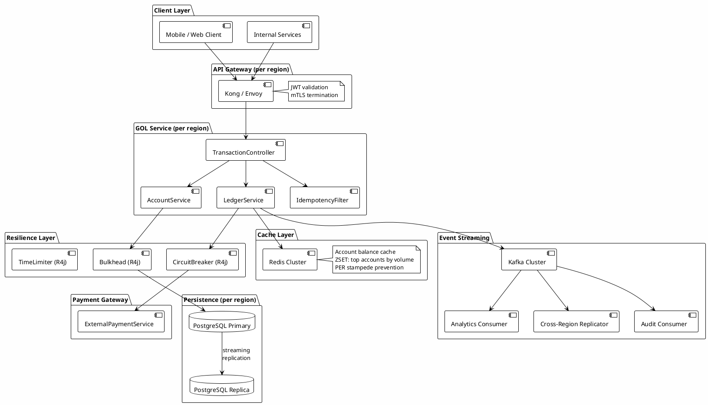

# Global Order Ledger (GOL) — System Architecture

The Global Order Ledger is the capstone project woven through this entire course. Every GOL Challenge adds one component to the system; by the end of Chapter 19 you have designed it end-to-end.

---

## What Is GOL?

GOL is a distributed financial ledger for a global payments platform. It records every debit, credit, and transfer across millions of accounts in real time. Think of it as the persistence layer beneath a bank's core banking system — orders come in, the ledger records them immutably, and account balances are always consistent.

It is fictional enough to be teachable, but realistic enough to require every pattern in this course.

---

## System Requirements

| Requirement | Target |
|---|---|
| Write throughput | 50,000 transactions/sec **per region** |
| Read latency (balance query) | p99 < 50 ms |
| Consistency model | ACID per account (no lost updates) |
| Availability | 99.99% (< 52 min downtime/year) |
| Durability | Zero data loss (synchronous replication) |
| Geographic scope | 3 active regions (EU, US-EAST, AP-SOUTH) |
| Compliance | Full audit log, immutable event history, PCI-DSS |
| Accounts | 200 million active accounts |

These requirements are non-trivial by design:
- 50k writes/sec exceeds a single PostgreSQL node (~5k writes/sec with fsync on commodity hardware)
- Global availability with ACID per account forces you to reason about consistency vs partition tolerance
- PCI-DSS compliance requires JWT + mTLS + HSM key management

---

## Component Diagram



---

## Data Model (Core Entities)

```java
// GOL v0 — sealed LedgerEvent hierarchy (Ch 1.2)
sealed interface LedgerEvent permits Debit, Credit, Transfer {
    String accountId();
    BigDecimal amount();
    Instant timestamp();
    String idempotencyKey();
}

record Debit(String accountId, BigDecimal amount, Instant timestamp,
             String idempotencyKey, String externalRef) implements LedgerEvent {}

record Credit(String accountId, BigDecimal amount, Instant timestamp,
              String idempotencyKey, String source) implements LedgerEvent {}

record Transfer(String fromAccountId, String toAccountId, BigDecimal amount,
                Instant timestamp, String idempotencyKey) implements LedgerEvent {
    public String accountId() { return fromAccountId; }
}

// PostgreSQL schema (simplified)
// accounts(id UUID PK, balance NUMERIC(19,4), version BIGINT)
// ledger_events(id UUID PK, account_id UUID FK, type VARCHAR,
//               amount NUMERIC(19,4), created_at TIMESTAMPTZ,
//               idempotency_key VARCHAR UNIQUE)
```

---

## GOL Version Table

Each GOL Challenge in the course adds exactly one component. The table below shows the full progression.

| Version | Chapter | Module | What This Version Adds |
|---|---|---|---|
| **v0** | Ch 1 | 1.2 Domain Modeling | Sealed `LedgerEvent` hierarchy (Debit, Credit, Transfer), `Order` and `Transaction` as records, pattern matching on `LedgerEvent` in switch expression |
| **v0.5** | Ch 1 | 1.7 CompletableFuture | Async account validation using virtual thread executor, `orTimeout(500ms)`, fallback on timeout |
| **v1** | Ch 2 | 2.0 Spring Bootstrap | Structure GOL as Spring Boot app: which beans, which profiles, `ApplicationContext` shape |
| **v1.5** | Ch 2 | 2.5 Spring Security | `SecurityFilterChain` for GOL: JWT validation on `/ledger/**` endpoints, audit log via AOP |
| **v2** | Ch 3 | 3.5 Transaction Isolation | Choose isolation level for concurrent balance updates; explain which anomaly each level prevents in ledger context |
| **v2.5** | Ch 3 | 3.6 ORM Physics | Fix N+1 in account balance query, apply `JOIN FETCH`, size HikariCP pool using Little's Law for 50k writes/sec |
| **v3** | Ch 16 | 16.1 Test Pyramid | Define full test suite: what is unit (domain logic), what needs integration (Hibernate + PostgreSQL via Testcontainers), what needs contract (payment gateway Pact) |
| **v4** | Ch 4 | 4.x System Design | Capacity plan: 50k writes/sec → how many PostgreSQL nodes, sharding strategy, when to add Kafka |
| **v5** | Ch 7 | 7.1 Messaging | Kafka event log for GOL: topic structure (one per region? per account prefix?), partition strategy for ordering guarantee, consumer group for audit vs analytics |
| **v6** | Ch 20 | 20.1 Circuit Breaker | Payment gateway is flaky — add circuit breaker to external call, test state transitions (CLOSED→OPEN→HALF-OPEN) |
| **v6.5** | Ch 8 | 8.1b Redis | Account balance cache with ZSET for top accounts by volume, stampede prevention with PER |
| **v7** | Ch 14 | 14.3 Event Sourcing | Refactor GOL ledger: the `ledger_events` table IS the event store, snapshotting strategy for account balance reconstruction |
| **v8** | Ch 17 | 17.3 Memory Profiling | GOL p99 degraded from 12ms to 2s overnight: heap dump → MAT → find the leak (leaked transaction contexts) |
| **v9** | Ch 19 | 19.1 System Design Interview | "Design the Global Order Ledger from scratch in 45 minutes" — the learner now knows the system from v0 to v8 |

---

## Cross-Cutting Concerns

| Concern | Technology | Introduced In |
|---|---|---|
| Authentication | JWT (EdDSA) | v1.5 (Ch 2.5) |
| Encryption in transit | mTLS (SPIFFE/SPIRE) | Ch 13.2 (standalone) |
| Secrets | HashiCorp Vault | Ch 13.3 (standalone) |
| Distributed tracing | OpenTelemetry | Ch 11.2 (standalone) |
| Schema evolution | Avro + Schema Registry | Ch 11.4 (standalone) |
| Deployment | Kubernetes | Ch 6.5 (standalone) |

---

## How to Use This Document

- **Start here** when beginning a GOL Challenge — read the version table to see what was built before yours
- **Each challenge is self-contained** — you only need to read previous GOL Challenges if you want full context
- **The capstone** is GOL v9 (Ch 19.1): design the entire system without looking at prior work
- **For module prerequisites**: see `LEARNING_PATH.md`
